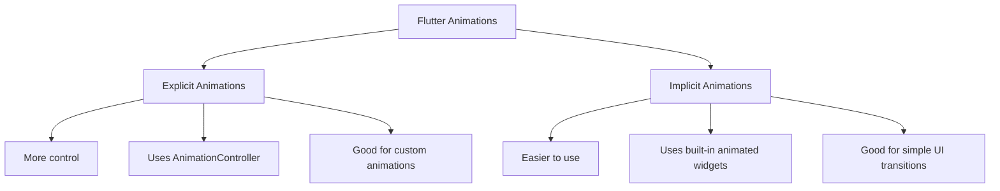
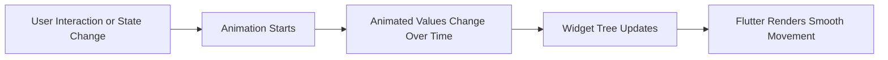

# Module Introduction: Flutter Animations

## Overview

This module introduces the **Animations** section of the Flutter & Dart course. It explains how animations can be used to improve the user experience of an existing Flutter app by making UI elements move, transition, and respond more smoothly.

The module sets the foundation for understanding the two major animation approaches in Flutter:

* **Explicit animations**
* **Implicit animations**

You will learn how these animation types differ, when to use each one, and how Flutter provides both low-level tools and ready-made animation widgets to help build polished user interfaces.

---

## Why Animations Matter

Animations are an important part of modern app development because they make an interface feel more natural, responsive, and professional.

Good animations can:

* Provide visual feedback to user actions
* Make screen changes feel smoother
* Guide the user's attention
* Improve the perceived quality of the app
* Make UI interactions feel more alive and intuitive

Even simple animations can significantly improve the overall experience of an application.

---

## Animation Types in Flutter

Flutter provides two main categories of animations:

---

## Explicit Animations

Explicit animations give you more control over how an animation behaves.

They are useful when you need to manually control:

* When the animation starts
* When it stops
* How long it runs
* Whether it repeats
* How the animated value changes over time

In this module, you will learn how to build custom animations from the ground up using tools such as:

* `AnimationController`
* `Animation`
* `Tween`
* `AnimatedBuilder`

Explicit animations are more powerful, but they usually require more code.

---

## Implicit Animations

Implicit animations are easier to use because Flutter handles most of the animation logic for you.

Instead of manually controlling an animation, you simply change a widget property, and Flutter automatically animates the transition between the old value and the new value.

Examples of built-in implicit animation widgets include:

* `AnimatedContainer`
* `AnimatedOpacity`
* `AnimatedPositioned`
* `AnimatedSwitcher`
* `AnimatedCrossFade`

Implicit animations are ideal for simple transitions and quick UI improvements.

---

## Explicit vs Implicit Animations

| Animation Type     | Best For                                       | Control Level | Complexity |
| ------------------ | ---------------------------------------------- | ------------: | ---------: |
| Explicit Animation | Custom, advanced, highly controlled animations |          High |     Higher |
| Implicit Animation | Simple transitions and property changes        |  Medium / Low |      Lower |

---

## Mental Model

Animations in Flutter are built on top of the widget tree. When an animation runs, Flutter repeatedly updates values over time and rebuilds the affected parts of the UI.

A simple mental model:

---

## Key Points

* Flutter supports both **explicit** and **implicit** animations.
* Animations help improve user experience by adding smooth visual feedback.
* Explicit animations provide more control but require more setup.
* Implicit animations are easier to use and rely on built-in animated widgets.
* This module will show how to create custom animations as well as how to use Flutter's ready-made animation widgets.
* Knowing when to use explicit or implicit animations is an important Flutter development skill.

---

## Tips

* Keep this module overview in mind as a roadmap while progressing through the animation lectures.
* Use implicit animations when you only need simple transitions.
* Use explicit animations when you need precise control.
* Start with built-in animation widgets before creating custom animations.
* Revisit this introduction if the later technical lectures feel confusing.
* Remember that animations are not only visual decoration; they can improve usability and clarity.

---

## Notes

In this course section, you will continue working on the app built in the previous sections. Instead of creating a completely new app, the focus will be on enhancing the existing app with animations.

You will learn how to make widgets move and transition smoothly. The module begins with a high-level introduction, then gradually moves into the technical details of creating animations in Flutter.

The course will cover both custom animations and built-in animation widgets, giving you a practical understanding of how to choose the right animation approach for different situations.

---

## Summary

This module introduces Flutter animations and explains why they are important for building polished, professional applications. It focuses on the two core animation paradigms in Flutter: **explicit animations** and **implicit animations**.

You will learn how to build a custom animation from scratch and how to use Flutter's built-in animation widgets to add animations more easily. By the end of this module, you should understand how animations work in Flutter and when to use each animation approach.
