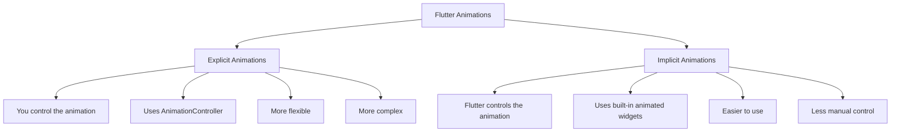
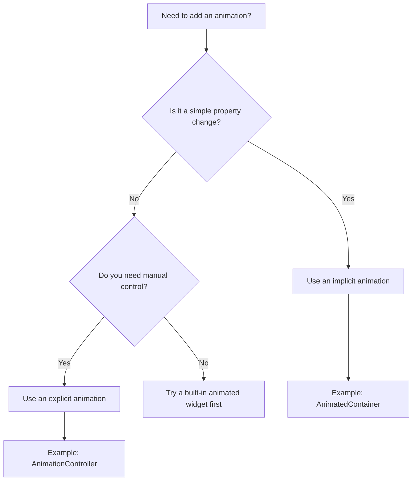

# Setup and Understanding Explicit vs Implicit Animations

## Overview

This lecture prepares the project setup for the Flutter animations module and introduces the key difference between **explicit animations** and **implicit animations**.

The module continues from the app built in the previous course sections. Instead of starting from scratch, the existing project will be enhanced with animations.

Before writing animation code, it is important to understand the two main animation approaches in Flutter:

* **Explicit animations**: You manually build and control the animation.
* **Implicit animations**: Flutter manages most of the animation work for you.

Understanding this distinction will make the upcoming animation examples easier to follow.

---

## Project Setup

For this module, the course continues using the existing Flutter project from previous sections.

The lecture provides:

* A latest snapshot of the `lib` folder
* A `pubspec.yaml` file
* Required package dependencies

You should create a new Flutter project and replace or update the project files with the provided starter files.

The project should include the following packages:

```yaml
dependencies:
  google_fonts: latest_version
  transparent_image: latest_version
  flutter_riverpod: latest_version
```

> The exact package versions may differ over time, so it is recommended to use the latest compatible versions.

---

## Animation Categories in Flutter

Flutter provides two main categories of animations:



---

## Explicit Animations

Explicit animations give you detailed control over the entire animation process.

With explicit animations, you decide:

* How the animation starts
* How long it runs
* When it stops
* Whether it repeats
* Whether it reverses
* How the animated value changes over time

Explicit animations usually require an `AnimationController`.

Example tools used for explicit animations include:

* `AnimationController`
* `Animation`
* `Tween`
* `AnimatedBuilder`

Because you control the animation manually, explicit animations are more powerful but also more complex.

---

## Implicit Animations

Implicit animations are easier to use because Flutter handles the animation logic internally.

Instead of manually controlling an animation, you simply change a value, and Flutter automatically animates from the old value to the new value.

For example, you might change:

* A widget's size
* A widget's color
* A widget's position
* A widget's opacity
* A widget's alignment

Flutter then smoothly animates the transition.

Common implicit animation widgets include:

* `AnimatedContainer`
* `AnimatedOpacity`
* `AnimatedPositioned`
* `AnimatedAlign`
* `AnimatedSwitcher`

Implicit animation widgets are often prefixed with `Animated`.

---

## Explicit vs Implicit Animations

| Feature          | Explicit Animation                | Implicit Animation                         |
| ---------------- | --------------------------------- | ------------------------------------------ |
| Control          | High                              | Lower                                      |
| Complexity       | Higher                            | Lower                                      |
| Main Tool        | `AnimationController`             | Built-in `Animated...` widgets             |
| Best For         | Custom or advanced animations     | Simple UI transitions                      |
| Flutter's Role   | You control most behavior         | Flutter handles most behavior              |
| Example Use Case | Looping, reversing, custom timing | Changing size, color, opacity, or position |

---

## When to Use Each Type

A useful rule of thumb:



---

## Practical Rule

Start with **implicit animations** whenever possible.

Use **explicit animations** only when you need more control, such as:

* Starting or stopping manually
* Repeating an animation
* Reversing an animation
* Coordinating multiple animations
* Creating a custom animation from scratch
* Controlling timing programmatically

---

## Technical Note

Explicit animations often require the `State` class to mix in `SingleTickerProviderStateMixin`.

Example:

```dart
class _MyWidgetState extends State<MyWidget>
    with SingleTickerProviderStateMixin {
  late AnimationController _controller;

  @override
  void initState() {
    super.initState();

    _controller = AnimationController(
      vsync: this,
      duration: const Duration(seconds: 1),
    );
  }

  @override
  void dispose() {
    _controller.dispose();
    super.dispose();
  }
}
```

The `SingleTickerProviderStateMixin` provides the `vsync` value needed by the `AnimationController`.

---

## Key Points

* This module continues from the existing Flutter app built in previous sections.
* The starter code includes the `lib` folder and `pubspec.yaml`.
* Required packages include `google_fonts`, `transparent_image`, and `flutter_riverpod`.
* Flutter supports both explicit and implicit animations.
* Explicit animations give more control but require more code.
* Implicit animations are easier because Flutter manages the animation internally.
* Built-in implicit animation widgets often start with `Animated`.
* The course begins by adding an explicit animation.

---

## Tips

* Start with implicit animations when the animation is simple.
* Use explicit animations when you need precise control.
* Remember that explicit animations usually require an `AnimationController`.
* Dispose of animation controllers when they are no longer needed.
* Look for built-in Flutter animation widgets before creating a custom animation manually.
* Understanding this distinction early will make the rest of the module much easier.

---

## Notes

This lecture is foundational for the rest of the animations module. It introduces the vocabulary and mental model needed to understand later lectures.

The key idea is that explicit animations give you full control, while implicit animations reduce complexity by letting Flutter handle the animation process automatically.

In the upcoming lectures, the course will begin with an explicit animation so you can understand how animations work from the ground up. Later, it will also show how built-in implicit animation widgets can simplify common animation tasks.

---

## Summary

This lecture sets up the Flutter project for the animations module and explains the difference between explicit and implicit animations.

**Explicit animations** give you detailed manual control through tools like `AnimationController`, but they require more setup and complexity.

**Implicit animations** are easier to use because Flutter automatically animates changes between values using built-in animated widgets.

Choosing between explicit and implicit animations depends on how much control your UI logic requires.
