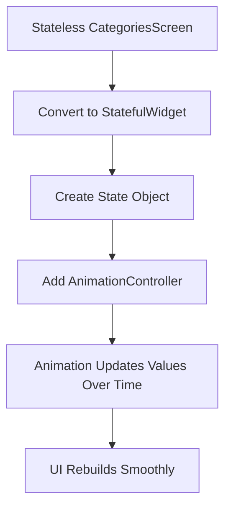
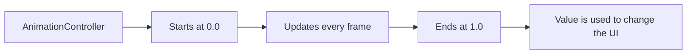
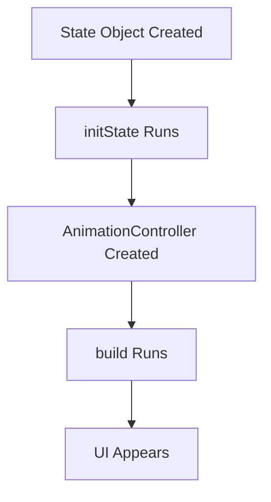
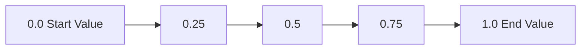
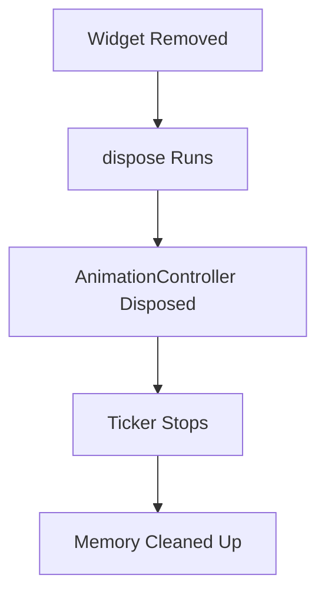

# Explicit Animations: Adding an Animation Controller

## Overview

This lecture introduces the first step in building an **explicit animation** in Flutter: adding an `AnimationController`.

The goal is to animate the `CategoriesScreen` so that the category grid items slide in from the bottom whenever the screen is loaded. To do this, the screen must be converted from a `StatelessWidget` into a `StatefulWidget`, because explicit animations need a `State` object to manage animation state and update the UI over time.

An `AnimationController` is then created inside `initState`, connected to Flutter's frame system using `vsync`, configured with a duration, and properly cleaned up inside `dispose`.

---

## Why Convert to a StatefulWidget?

Explicit animations need a `StatefulWidget` because the animation changes values continuously while it is running.

During an animation, Flutter updates the animation value frame by frame and rebuilds the affected UI so the movement appears smooth.



A `StatelessWidget` cannot manage this ongoing animation lifecycle, so the animation logic must live inside the widget's `State` class.

---

## What Is an AnimationController?

`AnimationController` is the core object used to manage an explicit animation.

It controls:

* The animation's current value
* The animation duration
* The animation direction
* When the animation starts
* When the animation stops
* Whether the animation repeats
* The animation lifecycle

By default, an `AnimationController` animates between `0.0` and `1.0`.



The controller itself does not directly move widgets. Instead, it produces changing values over time. You then use those values to affect something visible, such as position, opacity, padding, margin, scale, or rotation.

---

## Adding the AnimationController

The controller should be declared as a property in the `State` class.

Because it cannot be initialized immediately when the class is created, it is marked with the `late` keyword.

```dart
late AnimationController _animationController;
```

The `late` keyword tells Dart:

> This variable does not have a value immediately, but it will be assigned before it is used.

The controller is then initialized inside `initState`.

---

## Example Code

```dart
import 'package:flutter/material.dart';

class CategoriesScreen extends StatefulWidget {
  const CategoriesScreen({super.key});

  @override
  State<CategoriesScreen> createState() {
    return _CategoriesScreenState();
  }
}

class _CategoriesScreenState extends State<CategoriesScreen>
    with SingleTickerProviderStateMixin {
  late AnimationController _animationController;

  @override
  void initState() {
    super.initState();

    _animationController = AnimationController(
      vsync: this,
      duration: const Duration(milliseconds: 300),
      lowerBound: 0,
      upperBound: 1,
    );
  }

  @override
  void dispose() {
    _animationController.dispose();
    super.dispose();
  }

  @override
  Widget build(BuildContext context) {
    return const Scaffold(
      body: Center(
        child: Text('Categories Screen'),
      ),
    );
  }
}
```

---

## Understanding `initState`

`initState` is the correct place to create the `AnimationController`.

This is because:

* It runs once when the `State` object is created.
* It runs before the first `build` method execution.
* It is ideal for setting up objects that should exist for the lifetime of the widget.



The controller should not be created directly in the `build` method because `build` can run many times. Creating the controller in `build` would recreate it repeatedly and cause incorrect behavior.

---

## Understanding `vsync`

The `vsync` parameter connects the animation to Flutter's frame system.

It ensures that the animation updates only when the screen is ready to draw a new frame. This helps Flutter avoid unnecessary work and keeps animations efficient.

```dart
vsync: this
```

To use `this` as the `vsync` value, the `State` class must mix in `SingleTickerProviderStateMixin`.

```dart
class _CategoriesScreenState extends State<CategoriesScreen>
    with SingleTickerProviderStateMixin {
  // ...
}
```

---

## What Is `SingleTickerProviderStateMixin`?

`SingleTickerProviderStateMixin` is a Flutter mixin that provides a ticker for one animation controller.

A ticker sends signals at every frame so the animation controller knows when to update.

Use:

```dart
with SingleTickerProviderStateMixin
```

when the widget has one animation controller.

Use:

```dart
with TickerProviderStateMixin
```

when the widget needs multiple animation controllers.

---

## Animation Duration

The `duration` property defines how long the animation takes to move from its starting value to its ending value.

```dart
duration: const Duration(milliseconds: 300),
```

In this lecture, the animation duration is set to **300 milliseconds**.

A shorter duration makes the animation feel faster.
A longer duration makes the animation feel slower and smoother.

---

## Lower Bound and Upper Bound

The controller can animate between a lower value and an upper value.

```dart
lowerBound: 0,
upperBound: 1,
```

These are the default values, so they do not have to be written explicitly. However, adding them can help make the animation range easier to understand.

The controller value will move like this:



You can later use these values to create visual changes.

For example:

* `0.0` could mean the widget starts lower on the screen.
* `1.0` could mean the widget reaches its final position.
* Values between `0.0` and `1.0` represent the movement progress.

---

## Disposing the Controller

Whenever you create an `AnimationController`, you must dispose of it when the widget is removed from the widget tree.

```dart
@override
void dispose() {
  _animationController.dispose();
  super.dispose();
}
```

This prevents memory leaks and stops the controller from continuing to tick after the widget is no longer visible.



Forgetting to dispose an animation controller can cause performance problems, memory leaks, and Flutter warnings.

---

## Controlling Playback

Once the controller exists, you can use it to control the animation.

Common methods include:

```dart
_animationController.forward();
```

Starts the animation from the current value toward the upper bound.

```dart
_animationController.reverse();
```

Plays the animation backward toward the lower bound.

```dart
_animationController.repeat();
```

Repeats the animation continuously.

```dart
_animationController.stop();
```

Stops the animation.

---

## Key Points

* Explicit animations require a `StatefulWidget`.
* The animation logic lives inside the widget's `State` class.
* `AnimationController` is the main object used to control explicit animations.
* The controller should be created inside `initState`.
* The controller should be disposed inside `dispose`.
* `SingleTickerProviderStateMixin` provides the ticker needed for `vsync`.
* `duration` controls how long the animation takes.
* By default, the controller animates between `0.0` and `1.0`.
* The controller value must later be connected to a visual UI change.

---

## Tips

* Use `late` when the controller will be initialized inside `initState`.
* Do not create an `AnimationController` inside the `build` method.
* Always dispose of animation controllers.
* Use `SingleTickerProviderStateMixin` for one controller.
* Use `TickerProviderStateMixin` if you need multiple controllers.
* Think of the controller as producing values over time, not as directly animating widgets.
* The visual animation happens when those values are applied to widget properties.

---

## Notes

This lecture focuses only on setting up the animation controller. At this stage, the controller exists, but it does not yet change anything on the screen.

The next step is to use the controller's changing values to affect the UI. For example, the controller value can be used to move the category grid items upward so they slide into place when the screen loads.

The important foundation is now in place: the screen is stateful, the controller is initialized, the ticker is connected through `vsync`, the duration is configured, and cleanup is handled correctly.

---

## Summary

This lecture shows how to add an `AnimationController` to a Flutter screen as the foundation for an explicit animation.

The `CategoriesScreen` is converted into a `StatefulWidget` because explicit animations need a `State` object. Inside the state class, an `AnimationController` is declared with `late`, initialized in `initState`, connected to Flutter's frame system using `vsync`, and cleaned up in `dispose`.

An `AnimationController` does not directly animate widgets. Instead, it produces changing values over time, usually from `0.0` to `1.0`. These values can then be used to create visible effects such as sliding, fading, scaling, or rotating widgets.
