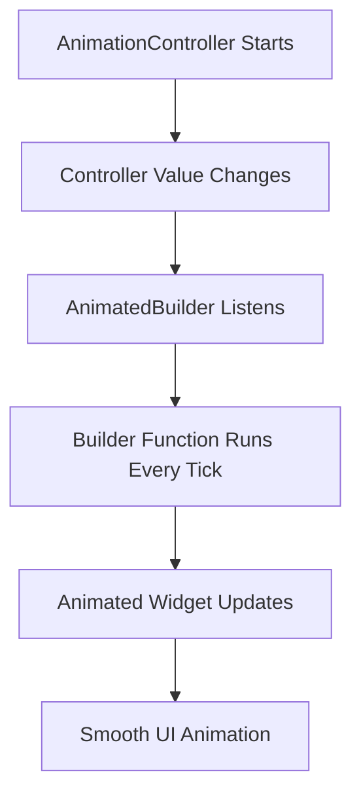
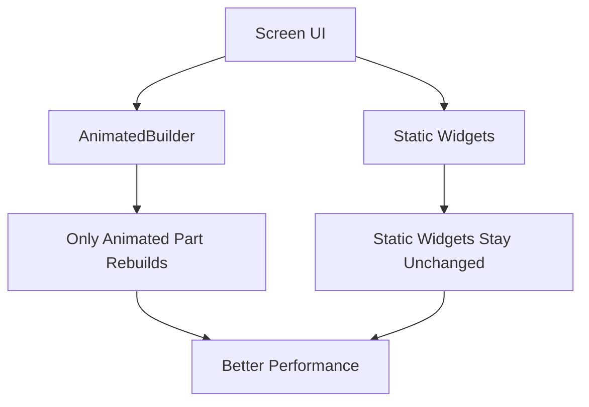
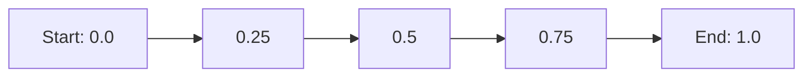
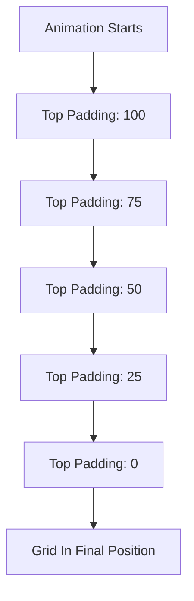
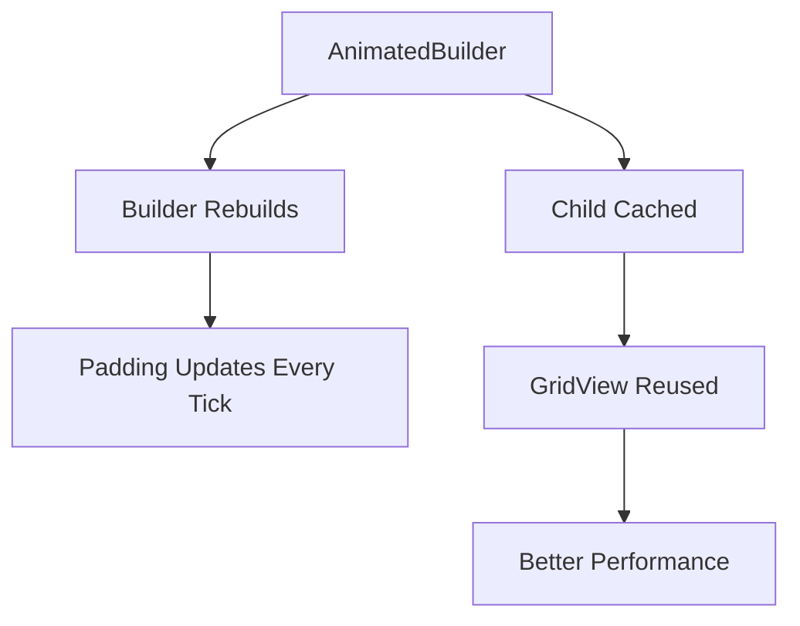
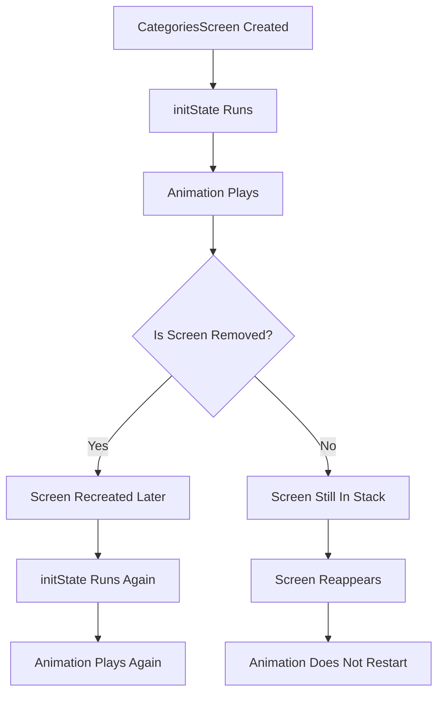
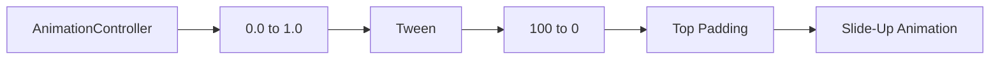

# Explicit Animations: Playing the Animation with AnimatedBuilder

## Overview

This lecture shows how to connect an `AnimationController` to the UI by using `AnimatedBuilder`.

In the previous lecture, an `AnimationController` was created and configured, but it did not visually change anything yet. This lecture explains how to use the controller's changing value to rebuild only the animated part of the widget tree.

The goal is to make the category grid items slide in from the bottom when the `CategoriesScreen` is loaded.

---

## Why AnimatedBuilder Is Needed

An `AnimationController` works like a ticking timer. While the animation is running, it updates its value many times per second.

However, the controller does not automatically rebuild the entire widget tree. Instead, you use `AnimatedBuilder` to listen to the animation and rebuild only the part of the UI that depends on the animation value.



This is more efficient than calling `setState()` manually on every animation tick.

---

## AnimatedBuilder Basic Structure

`AnimatedBuilder` needs two main arguments:

* `animation`: the animation or controller it should listen to
* `builder`: the function that rebuilds the animated widget

Example structure:

```dart
AnimatedBuilder(
  animation: _animationController,
  builder: (context, child) {
    return SomeAnimatedWidget();
  },
)
```

The `builder` function runs every time the animation value changes.

---

## Why Not Rebuild Everything?

If the full `build()` method were re-executed 60 times per second, Flutter might rebuild many widgets that do not actually need to change.

That can be wasteful.

`AnimatedBuilder` solves this by limiting rebuilds to the animated section only.



This helps keep animations smooth and efficient.

---

## Using AnimatedBuilder with the Categories Grid

In this lecture, the grid view is wrapped with an `AnimatedBuilder`.

The controller is passed to the `animation` parameter:

```dart
AnimatedBuilder(
  animation: _animationController,
  builder: (context, child) {
    return Padding(
      padding: EdgeInsets.only(
        top: 100 - _animationController.value * 100,
      ),
      child: child,
    );
  },
  child: GridView(
    // category items
  ),
)
```

Here, the `Padding` widget is animated, while the grid itself is passed as the `child`.

---

## Understanding the Animation Value

By default, an `AnimationController` animates from `0.0` to `1.0`.



This raw value is then used to calculate the top padding.

At the start:

```dart
100 - 0.0 * 100 = 100
```

So the grid starts with `100` pixels of top padding.

At the end:

```dart
100 - 1.0 * 100 = 0
```

So the grid ends with `0` pixels of top padding.

This creates a slide-up effect.

---

## Slide-Up Animation Logic

The animation formula is:

```dart
top: 100 - _animationController.value * 100
```

This means:

| Controller Value | Top Padding | Visual Result               |
| ---------------: | ----------: | --------------------------- |
|            `0.0` |       `100` | Grid starts lower           |
|           `0.25` |        `75` | Grid moves upward           |
|            `0.5` |        `50` | Grid is halfway up          |
|           `0.75` |        `25` | Grid is almost in place     |
|            `1.0` |         `0` | Grid reaches final position |



---

## Starting the Animation

Creating an `AnimationController` is not enough. The animation does not play automatically.

You must start it manually.

In this lecture, the animation is started inside `initState`:

```dart
@override
void initState() {
  super.initState();

  _animationController = AnimationController(
    vsync: this,
    duration: const Duration(milliseconds: 300),
    lowerBound: 0,
    upperBound: 1,
  );

  _animationController.forward();
}
```

The `forward()` method starts the animation and plays it from the current value toward the upper bound.

---

## Common AnimationController Methods

| Method      | Meaning                                     |
| ----------- | ------------------------------------------- |
| `forward()` | Plays the animation forward                 |
| `reverse()` | Plays the animation backward                |
| `repeat()`  | Repeats the animation continuously          |
| `stop()`    | Stops the animation                         |
| `reset()`   | Resets the animation value to the beginning |

For this screen, `forward()` is used because the grid should slide in once when the screen is created.

---

## Complete Example

```dart
import 'package:flutter/material.dart';

class CategoriesScreen extends StatefulWidget {
  const CategoriesScreen({super.key});

  @override
  State<CategoriesScreen> createState() {
    return _CategoriesScreenState();
  }
}

class _CategoriesScreenState extends State<CategoriesScreen>
    with SingleTickerProviderStateMixin {
  late AnimationController _animationController;

  @override
  void initState() {
    super.initState();

    _animationController = AnimationController(
      vsync: this,
      duration: const Duration(milliseconds: 300),
      lowerBound: 0,
      upperBound: 1,
    );

    _animationController.forward();
  }

  @override
  void dispose() {
    _animationController.dispose();
    super.dispose();
  }

  @override
  Widget build(BuildContext context) {
    return AnimatedBuilder(
      animation: _animationController,
      builder: (context, child) {
        return Padding(
          padding: EdgeInsets.only(
            top: 100 - _animationController.value * 100,
          ),
          child: child,
        );
      },
      child: GridView(
        padding: const EdgeInsets.all(24),
        gridDelegate: const SliverGridDelegateWithFixedCrossAxisCount(
          crossAxisCount: 2,
          childAspectRatio: 3 / 2,
          crossAxisSpacing: 20,
          mainAxisSpacing: 20,
        ),
        children: const [
          // Category items go here
        ],
      ),
    );
  }
}
```

---

## The Role of the `child` Parameter

The `child` parameter is an important performance optimization.

Any widget passed to `child` is built once and reused during the animation.

```dart
AnimatedBuilder(
  animation: _animationController,
  builder: (context, child) {
    return Padding(
      padding: EdgeInsets.only(
        top: 100 - _animationController.value * 100,
      ),
      child: child,
    );
  },
  child: GridView(
    // This does not rebuild every animation tick
  ),
)
```

In this example:

* The `Padding` widget rebuilds every tick.
* The `GridView` is reused as the child.
* The category items do not need to be rebuilt 60 times per second.



---

## Why the Animation Only Plays Sometimes

The animation is started inside `initState`.

That means the animation only starts when the widget is first created.

If the `CategoriesScreen` is removed and then added again, `initState` runs again and the animation plays.

However, if another screen is pushed on top of it and then popped, the `CategoriesScreen` may still exist in the navigation stack. In that case, it is not recreated, so `initState` does not run again.



This explains why the animation may play when returning from one screen but not another.

---

## Using a Tween

A `Tween` maps the controller's default `0.0` to `1.0` range into a more meaningful range.

Instead of manually writing:

```dart
100 - _animationController.value * 100
```

You can create an animation that directly produces the padding value:

```dart
late Animation<double> _slideAnimation;

@override
void initState() {
  super.initState();

  _animationController = AnimationController(
    vsync: this,
    duration: const Duration(milliseconds: 300),
  );

  _slideAnimation = Tween<double>(
    begin: 100,
    end: 0,
  ).animate(_animationController);

  _animationController.forward();
}
```

Then use:

```dart
AnimatedBuilder(
  animation: _slideAnimation,
  builder: (context, child) {
    return Padding(
      padding: EdgeInsets.only(
        top: _slideAnimation.value,
      ),
      child: child,
    );
  },
  child: GridView(
    // category items
  ),
)
```

This makes the animation logic easier to read.

---

## Controller Value vs Tween Value

| Approach              | Value Range | Example                      |
| --------------------- | ----------: | ---------------------------- |
| Raw controller value  | `0.0 → 1.0` | `_animationController.value` |
| Tween animation value |   `100 → 0` | `_slideAnimation.value`      |

The controller controls time and progress.

The tween converts that progress into useful UI values.



---

## Key Points

* `AnimatedBuilder` listens to an animation and rebuilds its `builder` function whenever the animation ticks.
* The `AnimationController` can be passed directly to `AnimatedBuilder` because it is listenable.
* The controller value changes from `0.0` to `1.0` by default.
* You can use the controller value to calculate animated UI properties.
* Calling `forward()` starts the animation.
* The `child` parameter helps avoid rebuilding widgets that do not change.
* A `Tween` converts the controller's raw progress value into a meaningful range.
* Animations started in `initState` only run when the widget is created.

---

## Tips

* Use `AnimatedBuilder` instead of manually calling `setState()` for animation updates.
* Keep the animated part of the widget tree as small as possible.
* Use the `child` parameter for static content inside the animation.
* Use a `Tween` when the raw `0.0` to `1.0` controller value is not meaningful enough.
* Start simple with direct controller values, then refactor to `Tween` when the logic becomes harder to read.
* Remember that `initState` does not run every time a screen becomes visible again.

---

## Notes

This lecture connects the previously created `AnimationController` to the actual UI.

The controller works as the animation's timing source, but `AnimatedBuilder` is responsible for rebuilding the animated widget. In this case, the changing controller value is used to update the top padding of the grid, creating a slide-up animation.

The lecture also introduces an important performance pattern: putting non-changing content into the `child` parameter of `AnimatedBuilder`. This keeps the animated rebuilds focused only on the widgets that actually need to change.

---

## Summary

This lecture demonstrates how to play an explicit animation by combining `AnimationController` with `AnimatedBuilder`.

The `AnimationController` produces changing values over time, while `AnimatedBuilder` listens to those changes and rebuilds the animated part of the UI. By using the controller value to update the top padding, the category grid can slide upward into place when the screen loads.

The lecture also shows how the `child` parameter improves performance by preventing static widgets from rebuilding on every animation tick, and how a `Tween` can map the controller's default `0.0` to `1.0` range into more meaningful UI values.
