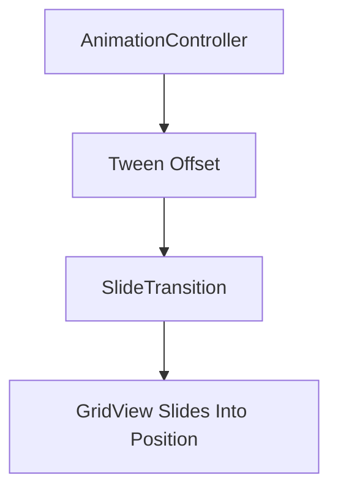
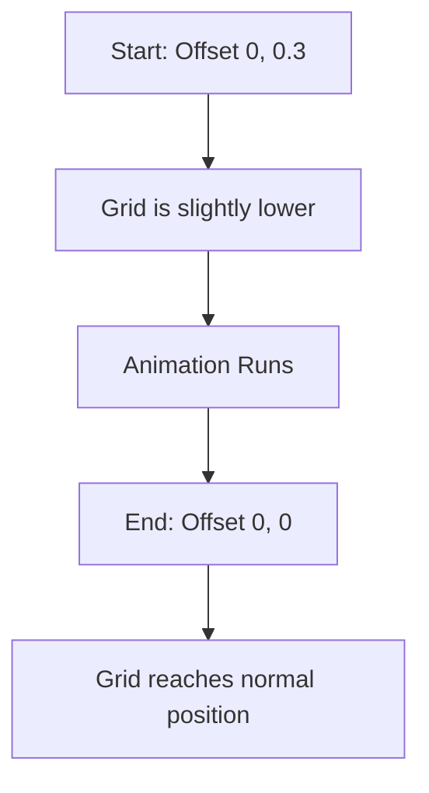
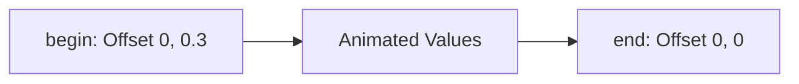
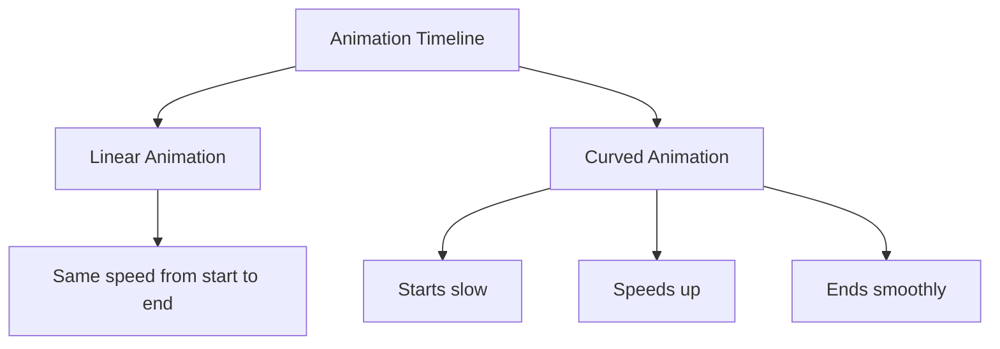
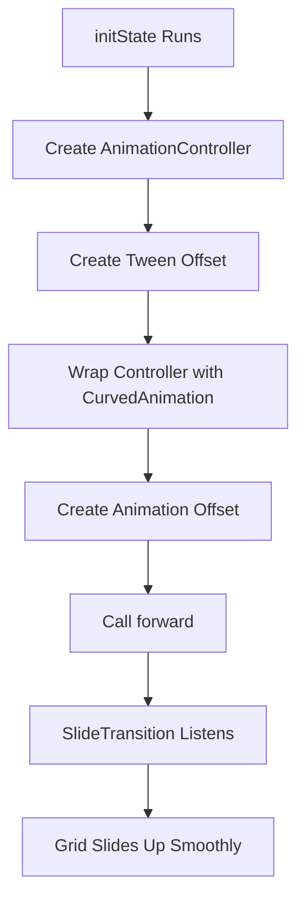
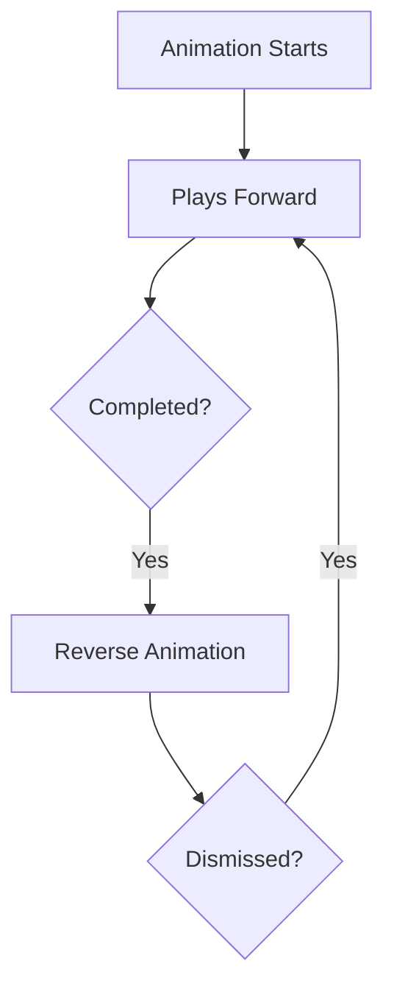

# Finetuning Explicit Animations

## Overview

This lecture explains how to improve a basic explicit animation and make it feel more polished.

Previously, the category grid was animated by changing the top padding manually inside an `AnimatedBuilder`. That approach works, but Flutter also provides specialized transition widgets that are more suitable for common animation effects.

In this lecture, the padding-based animation is replaced with a `SlideTransition`. The animation is also improved by using a `Tween<Offset>` and a `CurvedAnimation`, which gives the movement a more natural feeling.

---

## Why Improve the Animation?

The first version of the animation used manual padding logic:

```dart
top: 100 - _animationController.value * 100
```

This works, but it has some limitations:

* The animation logic is manually calculated.
* The code is less expressive.
* It does not use Flutter's built-in transition widgets.
* It is harder to fine-tune the animation behavior.

A better approach is to use Flutter's dedicated transition widgets, such as:

* `SlideTransition`
* `FadeTransition`
* `ScaleTransition`
* `SizeTransition`
* `AlignTransition`

These widgets are designed specifically for animation effects and are often more optimized and easier to read.

---

## From Padding to SlideTransition

Instead of animating the `Padding` widget manually, this lecture uses `SlideTransition`.

A `SlideTransition` moves a widget from one offset position to another.



The `GridView` remains the child of the transition, so the grid content itself does not need to be rebuilt on every animation tick.

---

## What Is Offset?

`Offset` is a Flutter class used to describe a position shift on the X and Y axes.

```dart
const Offset(x, y)
```

The first value controls horizontal movement:

* Negative X moves left.
* Positive X moves right.
* `0` means no horizontal offset.

The second value controls vertical movement:

* Negative Y moves up.
* Positive Y moves down.
* `0` means no vertical offset.

For example:

```dart
const Offset(0, 0.3)
```

This means:

* No horizontal movement
* Start 30% lower than the widget's normal position

```dart
const Offset(0, 0)
```

This means:

* Final normal position
* No offset on either axis

---

## Slide Animation Direction

The category grid should slide upward into its final position.

That means the animation starts with the grid slightly below its normal position and ends at its normal position.



---

## Using Tween with Offset

A `Tween` describes the transition between two values.

In this case, the animation moves between two `Offset` values:

```dart
Tween<Offset>(
  begin: const Offset(0, 0.3),
  end: const Offset(0, 0),
)
```

The `begin` value is where the animation starts.

The `end` value is where the animation finishes.



The animation controller still works with progress values from `0.0` to `1.0`, but the `Tween` maps that progress into `Offset` values.

---

## Using `drive()`

The `drive()` method can be used to connect the `AnimationController` to a `Tween`.

```dart
position: _animationController.drive(
  Tween<Offset>(
    begin: const Offset(0, 0.3),
    end: const Offset(0, 0),
  ),
),
```

This means:

* The controller provides the animation progress.
* The tween converts that progress into offset values.
* `SlideTransition` uses those offset values to move the widget.

---

## Example with SlideTransition

```dart
AnimatedBuilder(
  animation: _animationController,
  builder: (context, child) {
    return SlideTransition(
      position: _animationController.drive(
        Tween<Offset>(
          begin: const Offset(0, 0.3),
          end: const Offset(0, 0),
        ),
      ),
      child: child,
    );
  },
  child: GridView(
    padding: const EdgeInsets.all(24),
    gridDelegate: const SliverGridDelegateWithFixedCrossAxisCount(
      crossAxisCount: 2,
      childAspectRatio: 3 / 2,
      crossAxisSpacing: 20,
      mainAxisSpacing: 20,
    ),
    children: [
      // Category items
    ],
  ),
)
```

This version is cleaner than manually calculating padding values.

---

## Using `animate()` Instead of `drive()`

Another way to create the animation is to call `animate()` on the `Tween`.

```dart
Tween<Offset>(
  begin: const Offset(0, 0.3),
  end: const Offset(0, 0),
).animate(_animationController)
```

This produces an `Animation<Offset>`, which is exactly what `SlideTransition` expects for its `position` property.

---

## Adding CurvedAnimation

A basic animation moves linearly by default. This means the movement speed is constant from start to finish.

However, natural movement usually does not feel perfectly linear. It often starts slowly, speeds up, and slows down again near the end.

To make the animation feel more natural, use `CurvedAnimation`.

```dart
CurvedAnimation(
  parent: _animationController,
  curve: Curves.easeInOut,
)
```

The `parent` is the animation controller.

The `curve` controls how the animation progresses over time.

---

## Linear vs Curved Animation



A curve does not change the animation's start or end values.
It only changes how the animation moves between those values.

---

## Common Flutter Curves

| Curve               | Effect                                  |
| ------------------- | --------------------------------------- |
| `Curves.linear`     | Constant speed                          |
| `Curves.easeIn`     | Starts slowly, then speeds up           |
| `Curves.easeOut`    | Starts quickly, then slows down         |
| `Curves.easeInOut`  | Starts slow, speeds up, then slows down |
| `Curves.bounceOut`  | Adds a bouncing effect                  |
| `Curves.elasticOut` | Adds an elastic movement effect         |

For subtle UI animations, `Curves.easeInOut` is often a good default choice.

---

## Complete Refined Example

```dart
import 'package:flutter/material.dart';

class CategoriesScreen extends StatefulWidget {
  const CategoriesScreen({super.key});

  @override
  State<CategoriesScreen> createState() {
    return _CategoriesScreenState();
  }
}

class _CategoriesScreenState extends State<CategoriesScreen>
    with SingleTickerProviderStateMixin {
  late AnimationController _animationController;
  late Animation<Offset> _slideAnimation;

  @override
  void initState() {
    super.initState();

    _animationController = AnimationController(
      vsync: this,
      duration: const Duration(milliseconds: 300),
    );

    _slideAnimation = Tween<Offset>(
      begin: const Offset(0, 0.3),
      end: const Offset(0, 0),
    ).animate(
      CurvedAnimation(
        parent: _animationController,
        curve: Curves.easeInOut,
      ),
    );

    _animationController.forward();
  }

  @override
  void dispose() {
    _animationController.dispose();
    super.dispose();
  }

  @override
  Widget build(BuildContext context) {
    return SlideTransition(
      position: _slideAnimation,
      child: GridView(
        padding: const EdgeInsets.all(24),
        gridDelegate: const SliverGridDelegateWithFixedCrossAxisCount(
          crossAxisCount: 2,
          childAspectRatio: 3 / 2,
          crossAxisSpacing: 20,
          mainAxisSpacing: 20,
        ),
        children: [
          // Category items
        ],
      ),
    );
  }
}
```

---

## Animation Flow



---

## Forward, Reverse, and Repeat

The controller can also be used to control the direction and playback behavior of the animation.

### Play Forward

```dart
_animationController.forward();
```

Plays the animation from the beginning toward the end.

### Play in Reverse

```dart
_animationController.reverse();
```

Plays the animation backward from the current value toward the beginning.

### Repeat Continuously

```dart
_animationController.repeat();
```

Repeats the animation again and again.

### Repeat Back and Forth

```dart
_animationController.repeat(reverse: true);
```

Creates a back-and-forth animation, useful for pulsing or breathing effects.

---

## Listening to Animation Status

You can listen to animation lifecycle changes with `addStatusListener`.

```dart
_animationController.addStatusListener((status) {
  if (status == AnimationStatus.completed) {
    _animationController.reverse();
  } else if (status == AnimationStatus.dismissed) {
    _animationController.forward();
  }
});
```

This pattern can create an automatic back-and-forth animation.



---

## AnimationStatus Values

| Status                      | Meaning                                |
| --------------------------- | -------------------------------------- |
| `AnimationStatus.forward`   | Animation is currently moving forward  |
| `AnimationStatus.reverse`   | Animation is currently moving backward |
| `AnimationStatus.completed` | Animation reached the end              |
| `AnimationStatus.dismissed` | Animation returned to the beginning    |

Status listeners are useful when you need to react to important animation moments.

---

## Transition Widgets in Flutter

Flutter includes multiple built-in transition widgets for explicit animations.

| Widget               | Purpose                                   |
| -------------------- | ----------------------------------------- |
| `SlideTransition`    | Moves a widget from one offset to another |
| `FadeTransition`     | Animates opacity                          |
| `ScaleTransition`    | Scales a widget up or down                |
| `SizeTransition`     | Animates size                             |
| `RotationTransition` | Rotates a widget                          |
| `AlignTransition`    | Animates alignment                        |

These widgets are useful because they are specialized, readable, and often more optimized than manually changing layout values.

---

## Key Points

* A basic explicit animation can be improved with Flutter's transition widgets.
* `SlideTransition` is better suited for movement animations than manually changing padding.
* `Offset` describes how far a widget is shifted from its normal position.
* `Tween<Offset>` maps the controller's `0.0 → 1.0` progress into offset values.
* `drive()` and `animate()` can both be used to connect a controller to a tween.
* `CurvedAnimation` changes the feel of the animation by applying easing.
* Curves do not change the start or end values; they change the speed pattern.
* `forward()`, `reverse()`, and `repeat()` control playback.
* `addStatusListener()` lets you react to animation lifecycle changes.

---

## Tips

* Use transition widgets when Flutter already provides one for your animation goal.
* Use `SlideTransition` for movement instead of manually animating padding.
* Use `CurvedAnimation` to make animations feel less robotic.
* Try different curves to find the right feel for your UI.
* Use `Curves.easeInOut` as a safe default for smooth interface animations.
* Keep non-changing child widgets outside the rebuilt animation logic whenever possible.
* Use status listeners carefully and always dispose the controller.

---

## Notes

This lecture refines the explicit animation by replacing manual padding calculations with `SlideTransition`.

The key improvement is that the animation now describes the intended effect more directly: the widget should slide from one offset to another. This makes the code easier to understand and more aligned with Flutter's animation system.

The lecture also introduces `CurvedAnimation`, which improves the animation's feel by controlling how the movement is distributed over time. Instead of moving at a constant speed, the animation can start and end more smoothly.

---

## Summary

This lecture shows how to fine-tune explicit animations in Flutter.

Instead of manually changing padding values, the animation is improved by using `SlideTransition`, `Tween<Offset>`, and `CurvedAnimation`. The `Tween` maps the controller's progress to meaningful offset values, while the curve makes the movement feel more natural.

These tools make explicit animations cleaner, more expressive, and more professional. Although explicit animations require more setup than implicit animations, they provide fine-grained control over timing, movement, direction, and playback behavior.
