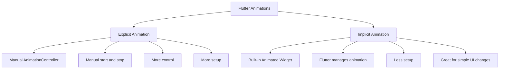
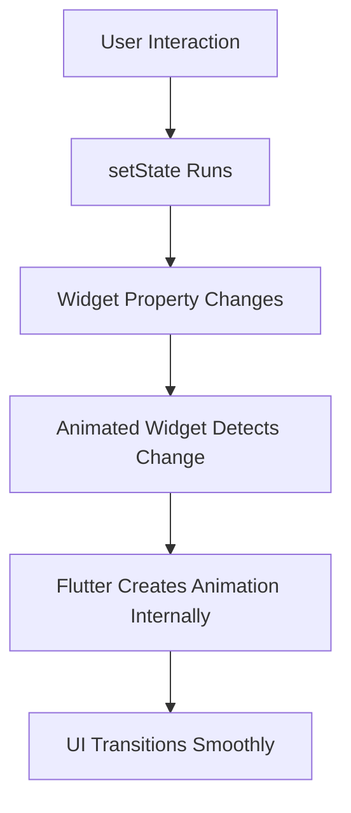
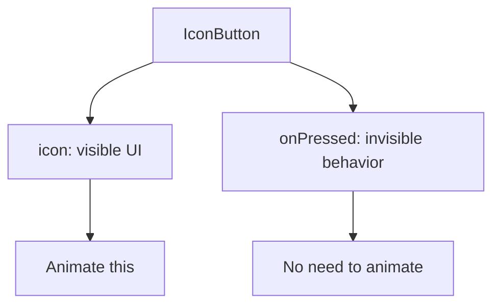
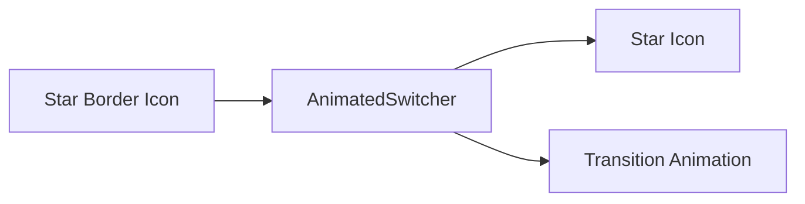
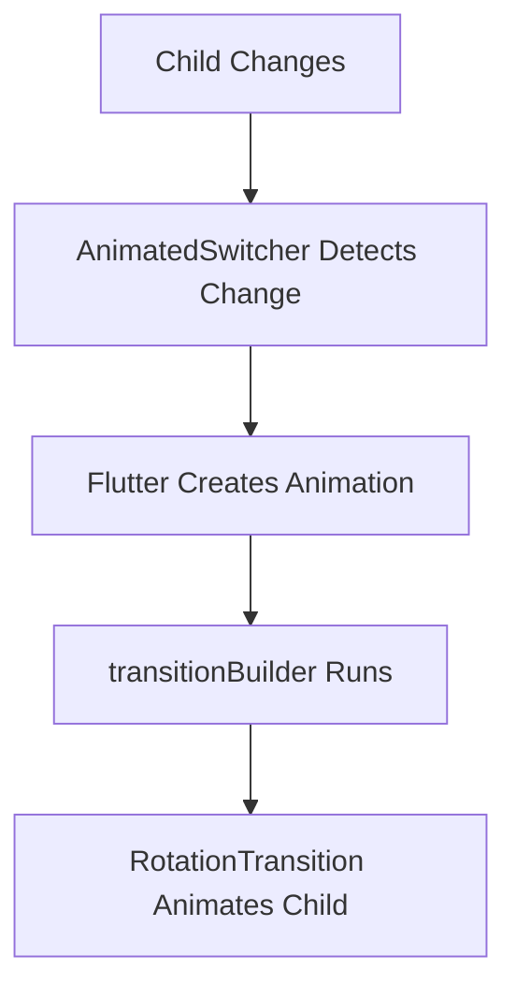
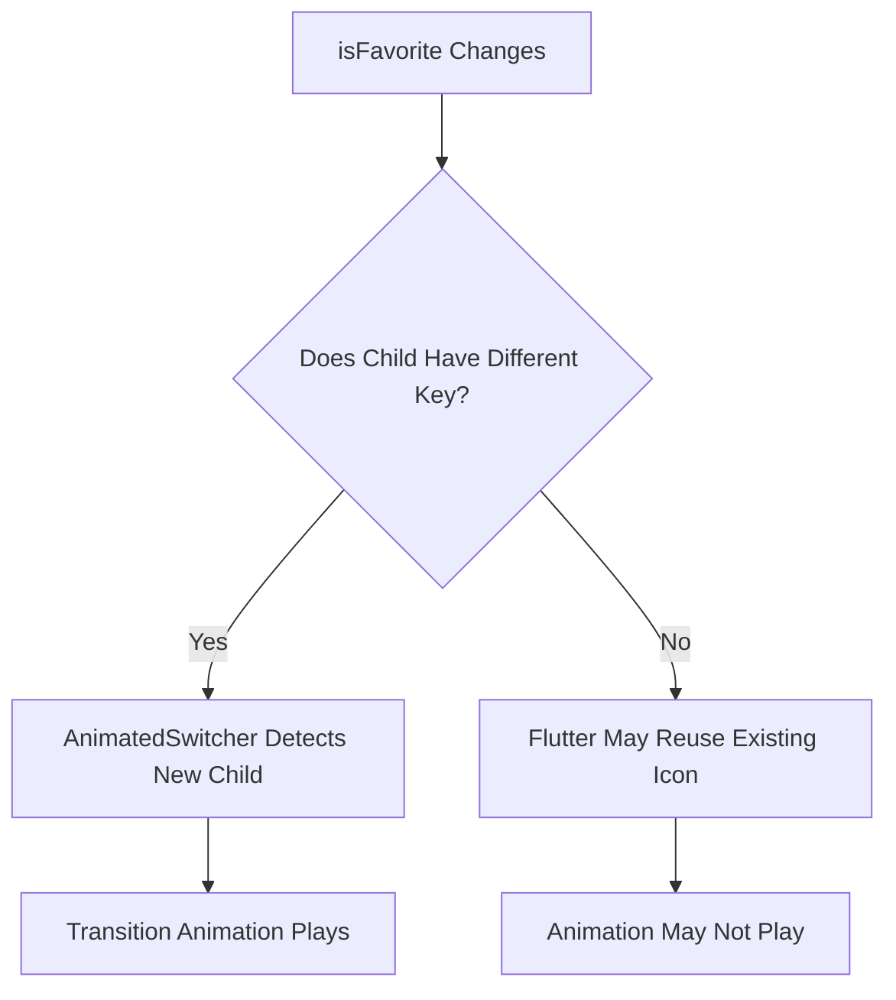
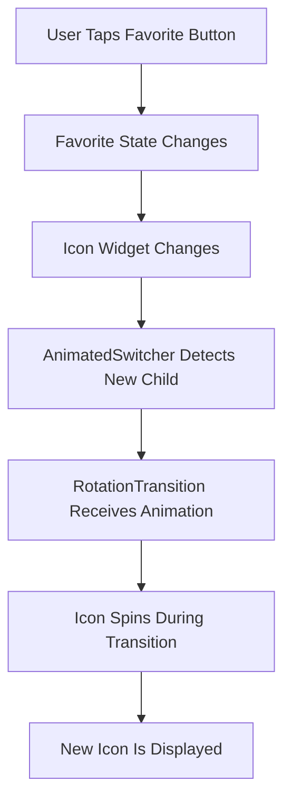
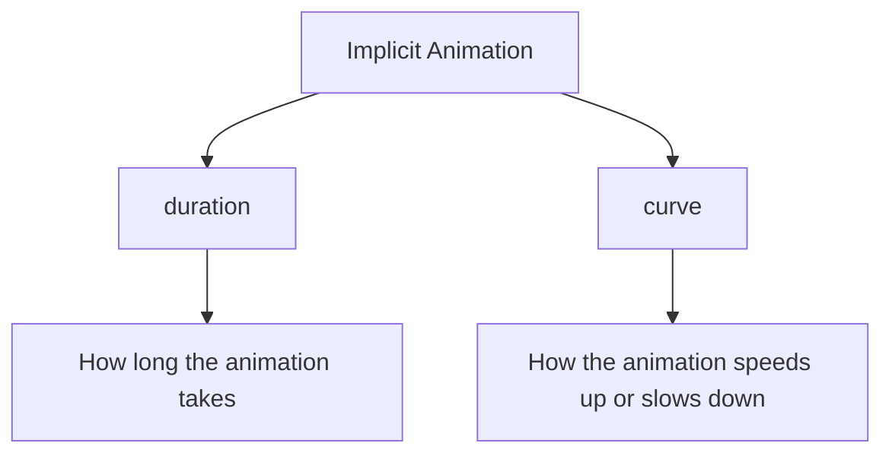
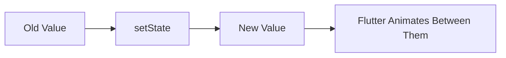

# Getting Started with Implicit Animations

## Overview

This lecture introduces **implicit animations** in Flutter.

After learning how explicit animations work with `AnimationController`, this lecture shows a simpler way to animate UI changes by using Flutter's built-in animated widgets.

Implicit animations are useful when you want Flutter to handle most of the animation work for you. Instead of manually creating a controller, tween, and animation lifecycle, you only define the widget's old and new states. Flutter then automatically animates the transition between those states.

In this lecture, an implicit animation is added to the favorite icon button on the `MealDetailsScreen`.

---

## Explicit vs Implicit Animation Reminder

Explicit animations require you to manually create and control the animation.

Implicit animations are controlled internally by Flutter.



---

## What Are Implicit Animations?

Implicit animations are animations created with Flutter's built-in animated widgets.

These widgets automatically animate when their input values change.

For example, when you call `setState()` and change a value, Flutter can smoothly animate from the old value to the new value.



You do not need to manually create:

* `AnimationController`
* `Tween`
* `AnimatedBuilder`
* `CurvedAnimation`

Flutter handles these details internally.

---

## Common Implicit Animation Widgets

Flutter provides many built-in widgets for implicit animations.

| Widget               | Purpose                                                     |
| -------------------- | ----------------------------------------------------------- |
| `AnimatedContainer`  | Animates size, color, padding, margin, decoration, and more |
| `AnimatedOpacity`    | Animates opacity changes                                    |
| `AnimatedAlign`      | Animates alignment changes                                  |
| `AnimatedPositioned` | Animates position inside a `Stack`                          |
| `AnimatedSwitcher`   | Animates when switching from one child widget to another    |
| `AnimatedCrossFade`  | Animates between two widgets with a cross-fade effect       |
| `AnimatedPadding`    | Animates padding changes                                    |
| `AnimatedRotation`   | Animates rotation changes                                   |
| `AnimatedScale`      | Animates scale changes                                      |

Many implicit animation widgets start with the word `Animated`.

---

## Why Use Implicit Animations?

Implicit animations are useful because they require very little code.

They are ideal when:

* You only need to animate between two states.
* You do not need manual playback control.
* The animation is triggered by a simple state change.
* You want a clean and concise solution.
* Flutter already provides a built-in widget for the effect you need.

For many UI interactions, implicit animations are the better first choice.

---

## Example Use Case: Favorite Icon Animation

In the Meals App, the `MealDetailsScreen` has an icon button in the app bar.

This button is used to mark a meal as a favorite or remove it from favorites.

The icon changes between:

```dart id="1re9s7"
Icons.star
```

and:

```dart id="u42u6u"
Icons.star_border
```

Instead of changing the icon instantly, this lecture adds a small animation so the icon spins when it changes.

---

## Why Animate Only the Icon?

The goal is to animate the visible icon, not the entire button.

The `IconButton` contains:

* A visible icon
* An event listener through `onPressed`

Only the icon needs animation because the event listener is not visible.



Therefore, the animation should be applied to the `icon` property of the `IconButton`.

---

## Introducing AnimatedSwitcher

`AnimatedSwitcher` is an implicit animation widget that animates the transition from one child widget to another.

It is useful when you want to animate between two different widgets.

In this lecture, it is used to animate between two icons:

* Filled star icon
* Outlined star icon



---

## Basic AnimatedSwitcher Structure

```dart id="xb734s"
AnimatedSwitcher(
  duration: const Duration(milliseconds: 300),
  child: Icon(
    isFavorite ? Icons.star : Icons.star_border,
  ),
)
```

The `duration` defines how long the transition takes.

However, this alone may not create the desired animation because `AnimatedSwitcher` also needs to know how the transition should look.

---

## Adding a Transition Builder

`AnimatedSwitcher` has a `transitionBuilder` parameter.

This parameter defines how the old child changes into the new child.

```dart id="nw6byx"
transitionBuilder: (child, animation) {
  return RotationTransition(
    turns: animation,
    child: child,
  );
},
```

The `transitionBuilder` receives:

| Parameter   | Meaning                                                |
| ----------- | ------------------------------------------------------ |
| `child`     | The widget being animated                              |
| `animation` | The animation created internally by `AnimatedSwitcher` |

You do not create this animation yourself. Flutter provides it automatically.

---

## Why This Is Implicit

With `AnimatedSwitcher`, Flutter automatically handles:

* Detecting when the child changes
* Creating the animation
* Starting the animation
* Managing animation timing
* Rebuilding the animated transition

You only provide:

* The child widget
* The duration
* The transition style



This is why it is called an implicit animation.

---

## Complete Example: Rotating Favorite Icon

```dart id="a7vwtk"
IconButton(
  onPressed: () {
    setState(() {
      isFavorite = !isFavorite;
    });
  },
  icon: AnimatedSwitcher(
    duration: const Duration(milliseconds: 300),
    transitionBuilder: (child, animation) {
      return RotationTransition(
        turns: animation,
        child: child,
      );
    },
    child: Icon(
      isFavorite ? Icons.star : Icons.star_border,
      key: ValueKey(isFavorite),
    ),
  ),
)
```

---

## Why the Key Matters

When using `AnimatedSwitcher`, Flutter must recognize that the child has changed.

If both children are the same widget type, such as `Icon`, Flutter may update the existing widget instead of treating it as a new child.

To make the switch clear, add a `Key`.

```dart id="eg6szo"
key: ValueKey(isFavorite),
```

This tells Flutter:

> When `isFavorite` changes, this is a different child widget.

Without a key, the icon may change without playing the switch animation.



---

## Understanding the `child` Parameters

There are several `child` values involved, which can feel confusing at first.

```dart id="k1e0b9"
AnimatedSwitcher(
  child: Icon(...),
  transitionBuilder: (child, animation) {
    return RotationTransition(
      turns: animation,
      child: child,
    );
  },
)
```

They work like this:

| Child                         | Meaning                                         |
| ----------------------------- | ----------------------------------------------- |
| `AnimatedSwitcher.child`      | The widget that should be switched and animated |
| `transitionBuilder`'s `child` | The child currently being animated              |
| `RotationTransition.child`    | The widget that receives the rotation effect    |

In this example, they all refer to the icon being animated.

---

## RotationTransition

`RotationTransition` is a transition widget that rotates its child.

It requires a `turns` value.

```dart id="1rqztx"
RotationTransition(
  turns: animation,
  child: child,
)
```

The `turns` parameter expects an animation, not a plain number.

The animation is provided automatically by `AnimatedSwitcher`.

---

## Animation Flow in This Example



---

## AnimatedContainer Example

Another common implicit animation widget is `AnimatedContainer`.

It can animate several properties at once, such as:

* Width
* Height
* Color
* Padding
* Margin
* Border radius
* Alignment
* Decoration

Example:

```dart id="cq53qn"
class AnimatedBoxExample extends StatefulWidget {
  const AnimatedBoxExample({super.key});

  @override
  State<AnimatedBoxExample> createState() {
    return _AnimatedBoxExampleState();
  }
}

class _AnimatedBoxExampleState extends State<AnimatedBoxExample> {
  bool _isExpanded = false;

  @override
  Widget build(BuildContext context) {
    return GestureDetector(
      onTap: () {
        setState(() {
          _isExpanded = !_isExpanded;
        });
      },
      child: AnimatedContainer(
        duration: const Duration(milliseconds: 400),
        curve: Curves.easeInOut,
        width: _isExpanded ? 200 : 80,
        height: _isExpanded ? 200 : 80,
        decoration: BoxDecoration(
          color: _isExpanded ? Colors.blue : Colors.red,
          borderRadius: BorderRadius.circular(
            _isExpanded ? 100 : 8,
          ),
        ),
      ),
    );
  }
}
```

When `_isExpanded` changes, Flutter automatically animates the container from the old values to the new values.

---

## Duration and Curve

Most implicit animation widgets require a `duration`.

```dart id="28keok"
duration: const Duration(milliseconds: 300),
```

The duration controls how long the animation takes.

Many implicit animation widgets also support a `curve`.

```dart id="4qvuby"
curve: Curves.easeInOut,
```

The curve controls how the animation feels.



---

## Implicit Animation Mental Model

The key idea behind implicit animations is simple:



You describe the start and end states.

Flutter handles the transition.

---

## Implicit vs Explicit Animation Code

| Feature         | Explicit Animation              | Implicit Animation              |
| --------------- | ------------------------------- | ------------------------------- |
| Controller      | You create it manually          | Flutter creates it internally   |
| Tween           | You often define it manually    | Flutter handles interpolation   |
| Start animation | You call `forward()` or similar | Flutter starts automatically    |
| Lifecycle       | You dispose controller manually | Widget manages lifecycle        |
| Complexity      | Higher                          | Lower                           |
| Control         | More control                    | Less control                    |
| Best for        | Custom animation behavior       | Simple state-driven transitions |

---

## When to Use Implicit Animations

Use implicit animations when:

* A widget changes between two states.
* The animation is simple.
* You do not need manual start, stop, reverse, or repeat control.
* The animation should happen automatically after `setState`.
* A built-in `Animated*` widget already matches your use case.

Examples:

* Expanding a card
* Fading a widget in or out
* Moving a widget slightly
* Rotating an icon
* Changing a button's size or color
* Switching between two icons

---

## When Not to Use Implicit Animations

Implicit animations may not be enough when:

* You need to repeat an animation continuously.
* You need to manually pause or resume animation.
* You need to coordinate multiple animation timelines.
* You need complex custom animation behavior.
* You need direct access to an `AnimationController`.

In those cases, explicit animations are usually the better choice.

---

## Key Points

* Implicit animations are built with Flutter's prebuilt animated widgets.
* They are easier than explicit animations because Flutter manages the animation internally.
* `AnimatedSwitcher` animates the transition from one child widget to another.
* The `transitionBuilder` defines how the transition should look.
* `RotationTransition` can be used inside `AnimatedSwitcher` to spin the icon.
* A `ValueKey` helps `AnimatedSwitcher` detect that the child changed.
* Implicit animations usually only need a changed value and a `duration`.
* No manual `AnimationController`, `Tween`, or `dispose` method is required.

---

## Tips

* Start with implicit animations before creating explicit animations manually.
* Use `AnimatedSwitcher` when replacing one widget with another.
* Use `AnimatedContainer` when animating multiple visual properties of a container.
* Add a `Key` when `AnimatedSwitcher` does not animate as expected.
* Animate only the widget that visually changes.
* Use `duration` to control speed.
* Use `curve` to make the animation feel more natural.

---

## Notes

This lecture introduces implicit animations through a practical example: animating the favorite icon on the meal details screen.

Instead of building an animation manually with `AnimationController`, the animation is handled by `AnimatedSwitcher`. The widget automatically detects when its child changes and plays the transition defined in `transitionBuilder`.

This approach is much simpler than explicit animation and is often the preferred solution for small UI transitions.

---

## Summary

This lecture introduces implicit animations in Flutter.

Implicit animation widgets, such as `AnimatedSwitcher`, `AnimatedContainer`, `AnimatedOpacity`, and `AnimatedAlign`, automatically animate between old and new values when state changes.

In the Meals App, `AnimatedSwitcher` is used to animate the favorite icon when it changes between a filled star and an outlined star. By using a `RotationTransition` inside the `transitionBuilder`, the icon rotates during the switch.

Implicit animations are ideal for simple, state-driven UI changes because they require less code and no manual `AnimationController`.
