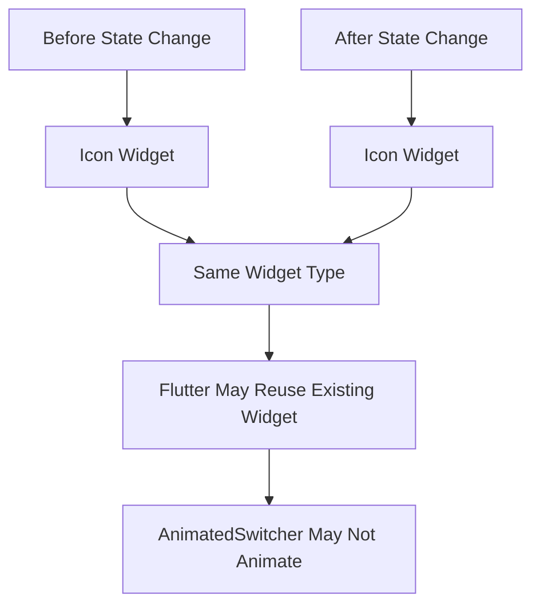
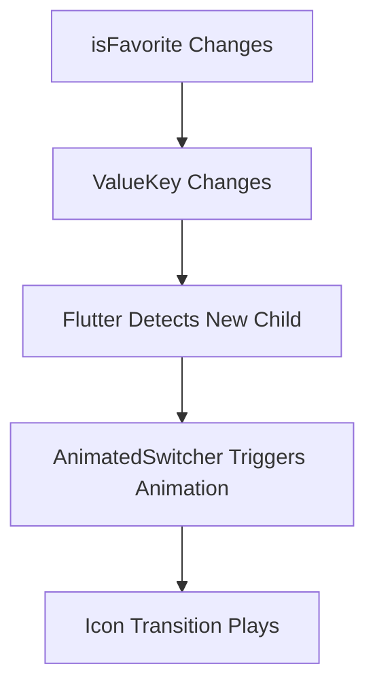
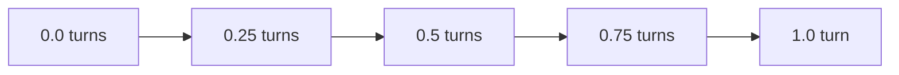
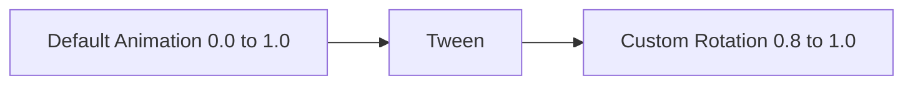
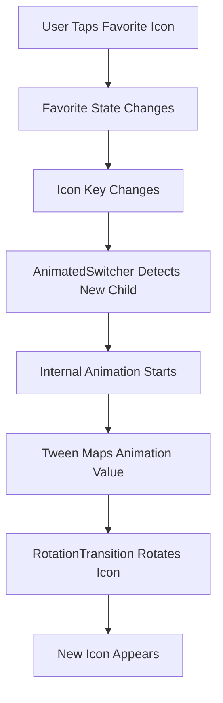
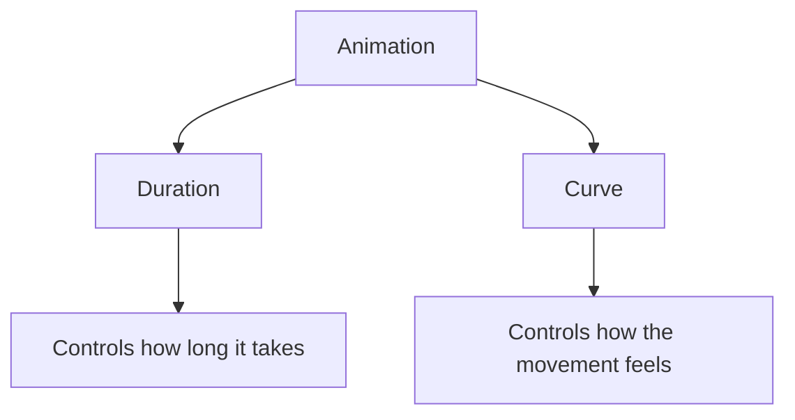
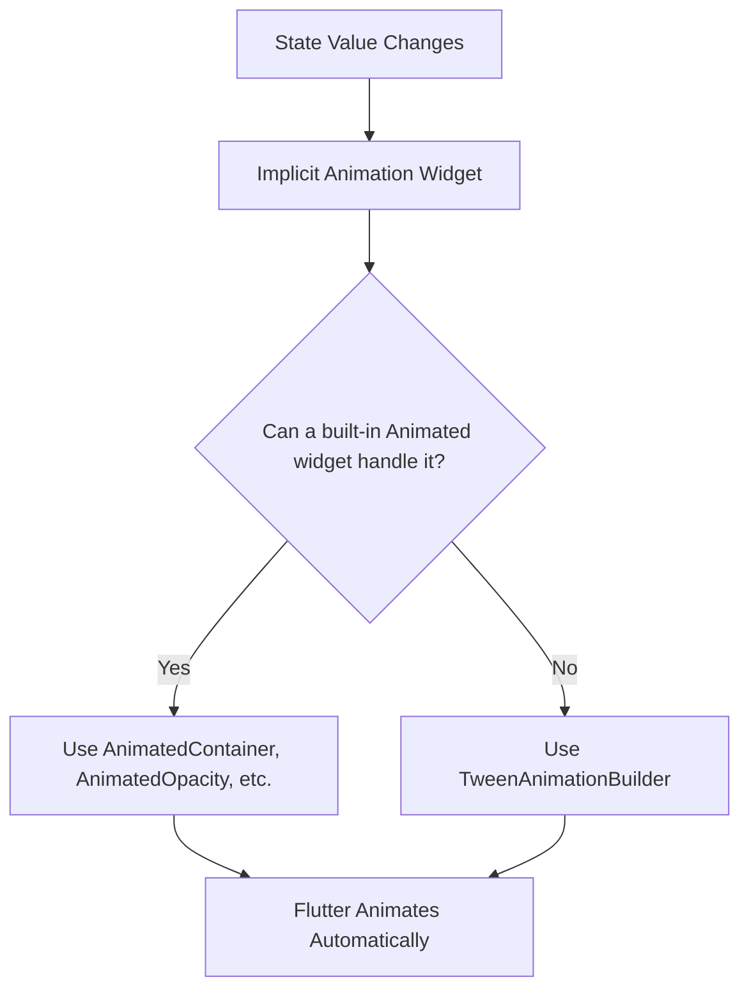

# Configuring Implicit Animations

## Overview

This lecture continues the topic of **implicit animations** in Flutter.

In the previous lecture, `AnimatedSwitcher` was added to the favorite icon on the `MealDetailsScreen`. The goal was to rotate the icon whenever the favorite status changes.

However, the animation did not work immediately because Flutter could not detect that the child widget had changed. This lecture explains how to fix that issue with a `Key`, and then shows how to fine-tune the animation by using a `Tween`.

The main idea is that implicit animations are easier than explicit animations, but they still require correct widget identity and configuration.

---

## Why the Animation Did Not Work at First

The favorite icon changes between two different icon values:

```dart
Icons.star
```

and:

```dart
Icons.star_border
```

However, both are still displayed inside an `Icon` widget.

From Flutter's perspective, the widget type did not change:



Even though the internal icon data changed, Flutter may still see it as the same widget type. Because of that, `AnimatedSwitcher` might not know that it should play a transition.

---

## Fixing the Problem with a Key

To help Flutter detect the change, add a `Key` to the `Icon`.

A `ValueKey` is useful here because the favorite state changes between `true` and `false`.

```dart
key: ValueKey(isFavorite),
```

This tells Flutter:

> Even though this is still an `Icon` widget, it should be treated as a different widget when `isFavorite` changes.



---

## AnimatedSwitcher with Key

```dart
IconButton(
  onPressed: () {
    setState(() {
      isFavorite = !isFavorite;
    });
  },
  icon: AnimatedSwitcher(
    duration: const Duration(milliseconds: 300),
    transitionBuilder: (child, animation) {
      return RotationTransition(
        turns: animation,
        child: child,
      );
    },
    child: Icon(
      isFavorite ? Icons.star : Icons.star_border,
      key: ValueKey(isFavorite),
    ),
  ),
)
```

With the key added, `AnimatedSwitcher` can now detect when the child changes and play the rotation animation.

---

## Understanding the Role of Keys

Keys are useful when Flutter needs to distinguish between widgets of the same type.

Without a key:

| State        | Widget Type | Flutter Detection |
| ------------ | ----------- | ----------------- |
| Not favorite | `Icon`      | Same type         |
| Favorite     | `Icon`      | Same type         |

With a key:

| State        | Widget Type | Key               | Flutter Detection |
| ------------ | ----------- | ----------------- | ----------------- |
| Not favorite | `Icon`      | `ValueKey(false)` | Different child   |
| Favorite     | `Icon`      | `ValueKey(true)`  | Different child   |

The key gives Flutter an extra identity signal.

---

## Why the Rotation Was Too Strong

After adding the key, the animation works, but the rotation may feel too dramatic.

This happens because the default animation value goes from `0.0` to `1.0`.

For `RotationTransition`, one full value means one full turn.



So if the animation goes from `0.0` to `1.0`, the icon performs a full rotation.

That might be too intense for a small favorite icon.

---

## Fine-Tuning with Tween

To reduce the rotation, use a `Tween`.

A `Tween` maps the default animation range to a custom range.

Instead of rotating from `0.0` to `1.0`, the icon can rotate from `0.8` to `1.0`.

```dart
Tween<double>(
  begin: 0.8,
  end: 1.0,
)
```

This creates a much smaller rotation effect.



---

## AnimatedSwitcher with Tween

```dart
IconButton(
  onPressed: () {
    setState(() {
      isFavorite = !isFavorite;
    });
  },
  icon: AnimatedSwitcher(
    duration: const Duration(milliseconds: 300),
    transitionBuilder: (child, animation) {
      return RotationTransition(
        turns: Tween<double>(
          begin: 0.8,
          end: 1.0,
        ).animate(animation),
        child: child,
      );
    },
    child: Icon(
      isFavorite ? Icons.star : Icons.star_border,
      key: ValueKey(isFavorite),
    ),
  ),
)
```

Here, `AnimatedSwitcher` still creates the animation internally.

The `Tween` simply changes the range of values used by the `RotationTransition`.

---

## Why Use `Tween<double>`?

The `Tween` should work with `double` values because `RotationTransition.turns` expects an `Animation<double>`.

This is why the tween is written as:

```dart
Tween<double>(
  begin: 0.8,
  end: 1.0,
)
```

Using `1.0` instead of `1` also helps Dart understand that the value is a `double`, not an `int`.

---

## Before and After Tween

| Version       | Rotation Range | Visual Result   |
| ------------- | -------------: | --------------- |
| Without Tween |    `0.0 → 1.0` | Full spin       |
| With Tween    |    `0.8 → 1.0` | Subtle rotation |

The `Tween` makes the animation feel more controlled and less distracting.

---

## Animation Flow



---

## Configuring Duration

The `duration` controls how long the implicit animation takes.

```dart
duration: const Duration(milliseconds: 300),
```

A shorter duration feels faster and sharper.

A longer duration feels slower and smoother.

Examples:

```dart
duration: const Duration(milliseconds: 150),
```

Fast and snappy.

```dart
duration: const Duration(milliseconds: 500),
```

Slower and more noticeable.

---

## Adding a Curve

Many implicit animation widgets support a `curve` parameter.

A curve changes how the animation progresses over time.

```dart
curve: Curves.easeInOut,
```

For example:

| Curve               | Effect                                  |
| ------------------- | --------------------------------------- |
| `Curves.linear`     | Same speed throughout                   |
| `Curves.easeIn`     | Starts slowly, then speeds up           |
| `Curves.easeOut`    | Starts quickly, then slows down         |
| `Curves.easeInOut`  | Starts slow, speeds up, then slows down |
| `Curves.elasticOut` | Adds an elastic effect                  |
| `Curves.bounceOut`  | Adds a bounce effect                    |

Curves do not change the start or end values. They only change the feel of the movement.



---

## AnimatedSwitcher vs Other Animated Widgets

`AnimatedSwitcher` is flexible because it lets you define your own transition through `transitionBuilder`.

Other implicit animation widgets are more specialized.

| Widget              | What It Animates                 |
| ------------------- | -------------------------------- |
| `AnimatedSwitcher`  | Transition between child widgets |
| `AnimatedCrossFade` | Fade between two children        |
| `AnimatedContainer` | Container properties             |
| `AnimatedOpacity`   | Opacity                          |
| `AnimatedAlign`     | Alignment                        |
| `AnimatedPadding`   | Padding                          |
| `AnimatedRotation`  | Rotation                         |
| `AnimatedScale`     | Scale                            |

`AnimatedSwitcher` gives more control over the transition style, while other `Animated*` widgets focus on one specific type of animation.

---

## Combining Multiple Implicit Animations

You can combine multiple implicit animation widgets when needed.

For example, you can animate opacity and size together:

```dart
AnimatedOpacity(
  opacity: _isVisible ? 1.0 : 0.0,
  duration: const Duration(milliseconds: 300),
  child: AnimatedContainer(
    duration: const Duration(milliseconds: 300),
    curve: Curves.easeInOut,
    width: _isExpanded ? 150 : 75,
    height: 75,
    color: Colors.teal,
  ),
)
```

This works because each implicit animation widget manages its own internal animation.

---

## TweenAnimationBuilder

`TweenAnimationBuilder` is another useful implicit animation widget.

It lets you animate values with a custom `Tween`, even when there is no dedicated `Animated*` widget for the property you want to animate.

Example:

```dart
TweenAnimationBuilder<double>(
  tween: Tween<double>(
    begin: 0,
    end: _targetRotation,
  ),
  duration: const Duration(milliseconds: 500),
  curve: Curves.elasticOut,
  builder: (context, value, child) {
    return Transform.rotate(
      angle: value,
      child: child,
    );
  },
  child: const Icon(
    Icons.star,
    size: 60,
    color: Colors.amber,
  ),
)
```

`TweenAnimationBuilder` automatically rebuilds when the tween's end value changes.

---

## When to Use TweenAnimationBuilder

Use `TweenAnimationBuilder` when:

* You want an implicit animation.
* You need to animate a custom value.
* There is no built-in `Animated*` widget for your exact use case.
* You do not want to manage an `AnimationController`.

It works well with different tween types, such as:

* `Tween<double>`
* `ColorTween`
* `AlignmentTween`
* `IntTween`
* Custom tweens

---

## Mental Model



---

## Key Points

* `AnimatedSwitcher` needs to detect a new child before it can animate.
* When switching between widgets of the same type, use a `Key`.
* `ValueKey(isFavorite)` helps Flutter detect favorite icon changes.
* `RotationTransition` with the default animation can create a full spin.
* A `Tween<double>` can reduce or customize the rotation range.
* `duration` controls how long the animation takes.
* `curve` controls how the animation feels.
* `TweenAnimationBuilder` allows custom implicit animations without an `AnimationController`.
* Multiple implicit animation widgets can be combined safely.

---

## Tips

* Add a key when `AnimatedSwitcher` does not animate as expected.
* Use `ValueKey` when widget identity depends on a changing value.
* Use a `Tween` when the default animation range is too strong or not suitable.
* Use `1.0` instead of `1` when a `double` value is expected.
* Keep icon animations subtle so they feel polished instead of distracting.
* Try different curves to find the best motion style.
* Use Flutter documentation to explore more built-in animated widgets.

---

## Notes

This lecture shows that implicit animations can still be configured and fine-tuned, even though Flutter manages most of the animation internally.

The most important fix is adding a `ValueKey` to the icon. Without it, Flutter may not realize that the child of `AnimatedSwitcher` has changed.

After the animation starts working, the next improvement is using a `Tween<double>` to reduce the rotation effect. This makes the favorite icon animation feel smoother and less exaggerated.

---

## Summary

This lecture explains how to configure and fine-tune implicit animations in Flutter.

The favorite icon animation did not work at first because Flutter saw both states as the same `Icon` widget. Adding a `ValueKey(isFavorite)` allowed `AnimatedSwitcher` to detect the change and trigger the transition.

Then, the rotation animation was refined with a `Tween<double>` so the icon rotates only slightly instead of performing a full spin.

Implicit animations remain much simpler than explicit animations, but tools like keys, tweens, durations, and curves give you enough control to create polished UI transitions.
