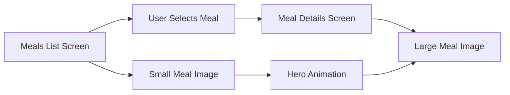
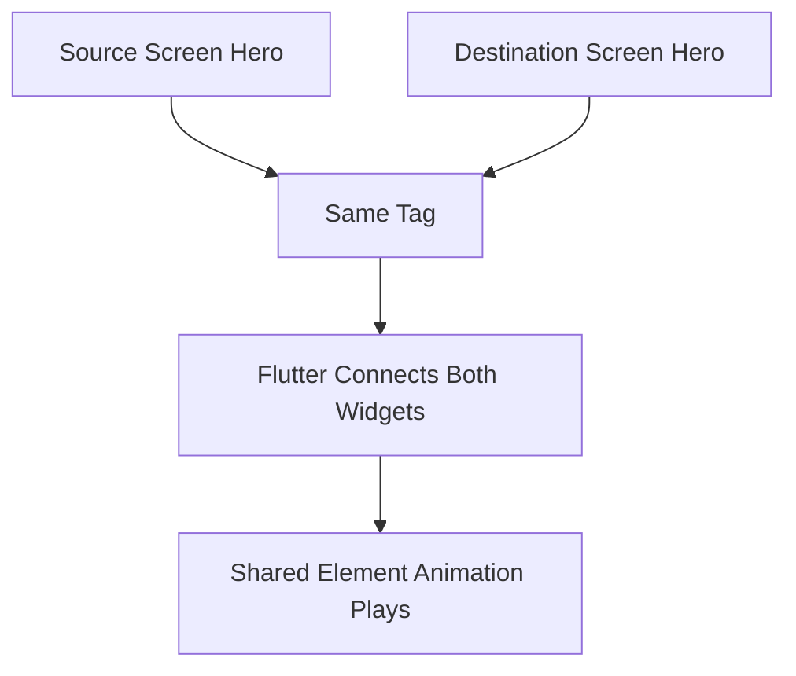
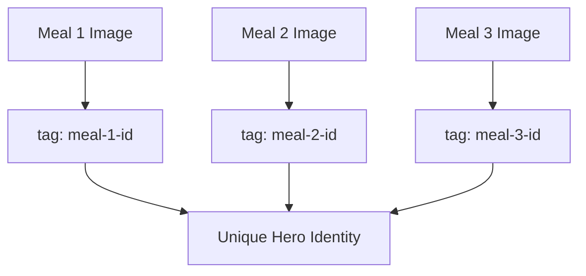
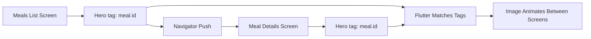
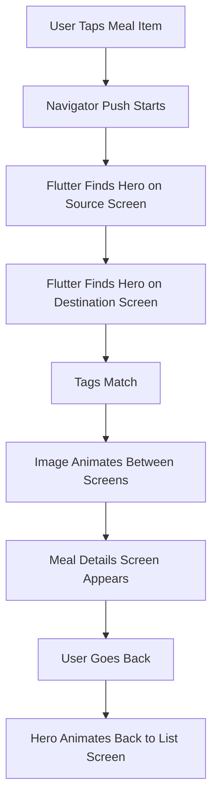
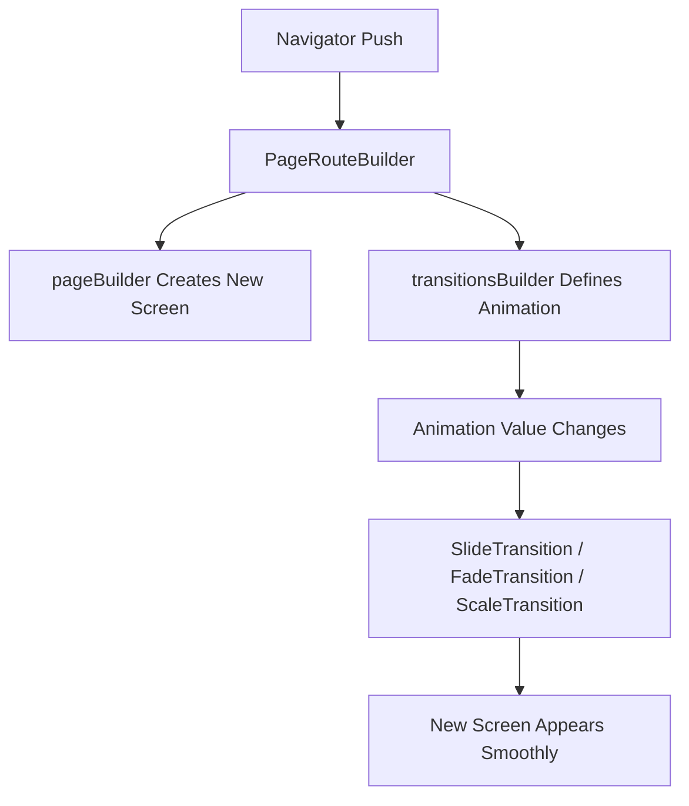
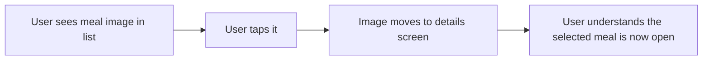

# Adding Multi-Screen Transitions

## Overview

This lecture introduces animations that happen **across multiple screens** in Flutter.

Instead of only animating widgets inside a single screen, Flutter also allows you to animate widgets during navigation from one route to another. This creates a smoother and more professional user experience.

In this lecture, the main focus is using the built-in `Hero` widget to animate a meal image from the meals list screen to the meal details screen.

The goal is simple:

> When the user taps a meal, the meal image should visually move from the list screen into the detail screen.

This type of animation is often called a **shared-element transition**.

---

## What Is a Multi-Screen Transition?

A multi-screen transition is an animation that happens when moving from one screen to another.

For example:



Instead of instantly replacing one screen with another, Flutter can animate a shared widget between both screens.

---

## The Use Case in This Lecture

The app has two related screens:

| Screen              | Purpose                                             |
| ------------------- | --------------------------------------------------- |
| `MealsScreen`       | Displays a list of meals                            |
| `MealDetailsScreen` | Displays detailed information about a selected meal |

Both screens show the same meal image.

The lecture adds a `Hero` animation so the image appears to fly from the list item into the details screen.

---

## What Is the Hero Widget?

`Hero` is a Flutter widget used to animate a shared element between two routes.

It works by matching two widgets with the same `tag`.

One `Hero` is placed on the source screen.

Another `Hero` is placed on the destination screen.

When navigation happens, Flutter automatically animates the widget between the two positions.



---

## Why Hero Is Useful

`Hero` animations look impressive, but they require very little code.

They are commonly used for:

* Product images
* Meal images
* Profile pictures
* Cards
* Thumbnails
* Avatars
* Icons

A `Hero` animation helps users understand that the item they tapped is connected to the new screen.

---

## Step 1: Wrap the Image on the Source Screen

In the meals list, each meal item displays an image.

In this app, the image is rendered with `FadeInImage`.

To animate it across screens, wrap it with `Hero`.

```dart id="source-hero"
Hero(
  tag: meal.id,
  child: FadeInImage(
    placeholder: MemoryImage(kTransparentImage),
    image: NetworkImage(meal.imageUrl),
    fit: BoxFit.cover,
  ),
)
```

The `child` is the widget that should be animated.

The `tag` uniquely identifies this hero element.

---

## Step 2: Use a Unique Tag

The `tag` must be unique for each hero animation.

Since the meals list contains multiple meal images, each image needs a different tag.

```dart id="hero-tag"
tag: meal.id
```

This works well because every meal has a unique ID.



If multiple `Hero` widgets on the same screen use the same tag, Flutter can throw an error or behave incorrectly.

---

## Step 3: Wrap the Image on the Destination Screen

Next, go to the `MealDetailsScreen`.

Find the meal image there and wrap it with another `Hero`.

```dart id="destination-hero"
Hero(
  tag: meal.id,
  child: Image.network(
    meal.imageUrl,
    height: 300,
    width: double.infinity,
    fit: BoxFit.cover,
  ),
)
```

The important part is that both `Hero` widgets use the same tag:

```dart id="matching-tag"
tag: meal.id
```

Flutter uses this matching tag to connect the image on the list screen with the image on the details screen.

---

## Source and Destination Connection



---

## Complete Example: Source Screen

```dart id="meal-item-example"
class MealItem extends StatelessWidget {
  const MealItem({
    super.key,
    required this.meal,
    required this.onSelectMeal,
  });

  final Meal meal;
  final void Function(Meal meal) onSelectMeal;

  @override
  Widget build(BuildContext context) {
    return InkWell(
      onTap: () {
        onSelectMeal(meal);
      },
      child: Card(
        clipBehavior: Clip.hardEdge,
        elevation: 2,
        child: Stack(
          children: [
            Hero(
              tag: meal.id,
              child: FadeInImage(
                placeholder: MemoryImage(kTransparentImage),
                image: NetworkImage(meal.imageUrl),
                fit: BoxFit.cover,
                height: 200,
                width: double.infinity,
              ),
            ),
            // Other meal item UI...
          ],
        ),
      ),
    );
  }
}
```

---

## Complete Example: Destination Screen

```dart id="meal-details-example"
class MealDetailsScreen extends StatelessWidget {
  const MealDetailsScreen({
    super.key,
    required this.meal,
  });

  final Meal meal;

  @override
  Widget build(BuildContext context) {
    return Scaffold(
      appBar: AppBar(
        title: Text(meal.title),
      ),
      body: SingleChildScrollView(
        child: Column(
          children: [
            Hero(
              tag: meal.id,
              child: Image.network(
                meal.imageUrl,
                height: 300,
                width: double.infinity,
                fit: BoxFit.cover,
              ),
            ),
            // Other meal details UI...
          ],
        ),
      ),
    );
  }
}
```

---

## Important Hero Rules

| Rule                   | Explanation                                                       |
| ---------------------- | ----------------------------------------------------------------- |
| Use matching tags      | The source and destination `Hero` must have the same tag          |
| Use unique tags        | Each hero tag should be unique on a screen                        |
| Wrap related widgets   | The widgets should represent the same visual content              |
| Hero works with routes | The animation happens during `Navigator.push` and `Navigator.pop` |
| No controller needed   | Flutter manages the hero animation automatically                  |

---

## Hero Animation Flow



---

## Using PageRouteBuilder for Custom Route Transitions

Besides `Hero`, Flutter also allows you to customize the entire screen transition using `PageRouteBuilder`.

`PageRouteBuilder` lets you replace the default platform transition with your own animation.

For example, you can make the new screen slide in from the right:

```dart id="page-route-builder"
Navigator.of(context).push(
  PageRouteBuilder(
    transitionDuration: const Duration(milliseconds: 400),
    pageBuilder: (context, animation, secondaryAnimation) {
      return const DetailScreen();
    },
    transitionsBuilder: (context, animation, secondaryAnimation, child) {
      final slideAnimation = Tween<Offset>(
        begin: const Offset(1.0, 0.0),
        end: Offset.zero,
      ).animate(
        CurvedAnimation(
          parent: animation,
          curve: Curves.easeInOut,
        ),
      );

      return SlideTransition(
        position: slideAnimation,
        child: child,
      );
    },
  ),
);
```

---

## PageRouteBuilder Flow



---

## Hero vs PageRouteBuilder

| Feature                   | Hero                                    | PageRouteBuilder                             |
| ------------------------- | --------------------------------------- | -------------------------------------------- |
| Main purpose              | Animate a shared widget between screens | Animate the whole route transition           |
| Setup complexity          | Low                                     | Medium                                       |
| Requires matching widgets | Yes                                     | No                                           |
| Uses tags                 | Yes                                     | No                                           |
| Common use case           | Image flying from list to detail screen | Custom fade, slide, or scale route animation |
| Manual controller needed  | No                                      | No, route provides animation                 |

You can also use both together:

* `PageRouteBuilder` animates the screen transition.
* `Hero` animates a shared image or widget between screens.

---

## Common Route Transition Effects

| Effect          | Widget                    |
| --------------- | ------------------------- |
| Fade screen in  | `FadeTransition`          |
| Slide screen in | `SlideTransition`         |
| Scale screen up | `ScaleTransition`         |
| Rotate screen   | `RotationTransition`      |
| Combine effects | Nest multiple transitions |

Example fade transition:

```dart id="fade-route"
return FadeTransition(
  opacity: animation,
  child: child,
);
```

Example scale transition:

```dart id="scale-route"
return ScaleTransition(
  scale: animation,
  child: child,
);
```

---

## Why This Improves User Experience

Multi-screen animations help users understand navigation.

When a meal image moves from the list screen into the detail screen, the user can visually connect both screens.



This makes navigation feel smoother, clearer, and more polished.

---

## Key Points

* Flutter can animate widgets across multiple screens.
* `Hero` creates shared-element transitions.
* A `Hero` needs a `tag` and a `child`.
* The same `tag` must be used on both the source and destination screens.
* `meal.id` is a good hero tag because it is unique for each meal.
* The source and destination widgets do not have to be exactly the same widget type.
* They should represent the same visual content.
* `Hero` animations work automatically with `Navigator.push` and `Navigator.pop`.
* `PageRouteBuilder` can customize the entire route transition.
* `Hero` and custom route transitions can be combined.

---

## Tips

* Use `Hero` for images or visual elements that appear on both screens.
* Always make hero tags unique.
* Use stable IDs, such as `meal.id`, as hero tags.
* Do not use the same tag for multiple visible heroes on one screen.
* Use `PageRouteBuilder` when the whole screen transition should be customized.
* Use `Hero` when only one shared element should animate between screens.
* Keep hero animations meaningful, not just decorative.

---

## Notes

This lecture concludes the animations section by showing an animation that spans multiple screens.

The main example uses the `Hero` widget to animate a meal image between the meals list screen and the meal details screen. The setup is simple: wrap the image on both screens with `Hero` and give both heroes the same unique tag.

Flutter then automatically handles the transition when navigating forward and backward.

This creates a professional shared-element animation with very little code.

---

## Summary

This lecture explains how to add multi-screen transitions in Flutter.

The main technique is using the `Hero` widget to animate a shared element, such as a meal image, between two routes. By wrapping the image on both the source and destination screens with `Hero` and using the same `tag`, Flutter automatically creates a smooth transition during navigation.

The lecture also introduces `PageRouteBuilder`, which can be used when you want to customize the entire screen transition with effects such as sliding, fading, or scaling.

Together, `Hero` and custom route transitions help create fluid, polished navigation experiences in Flutter apps.
