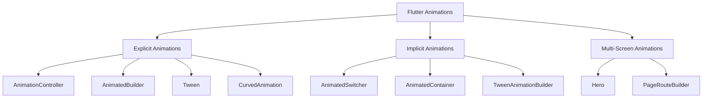
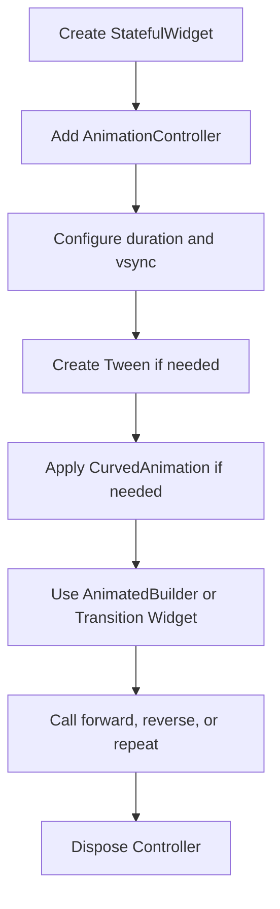
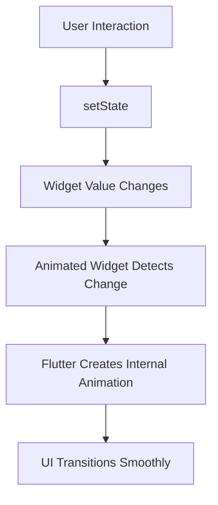
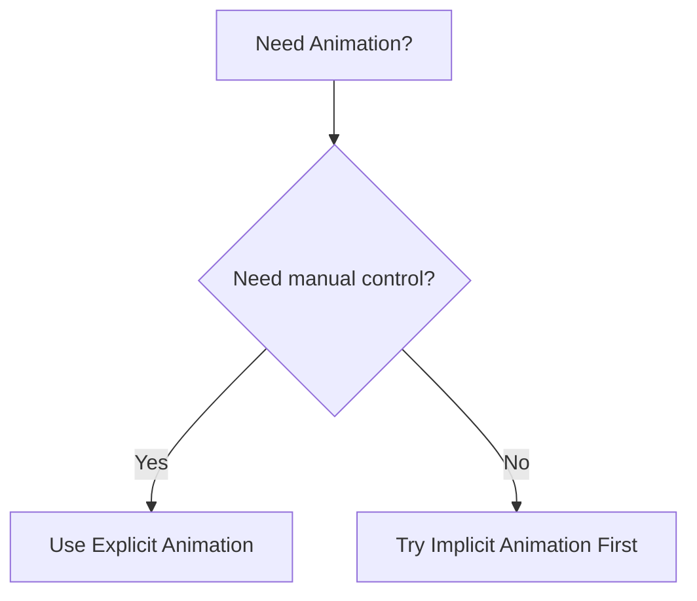
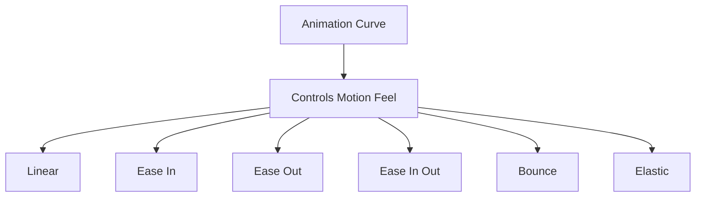
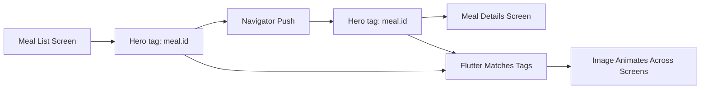
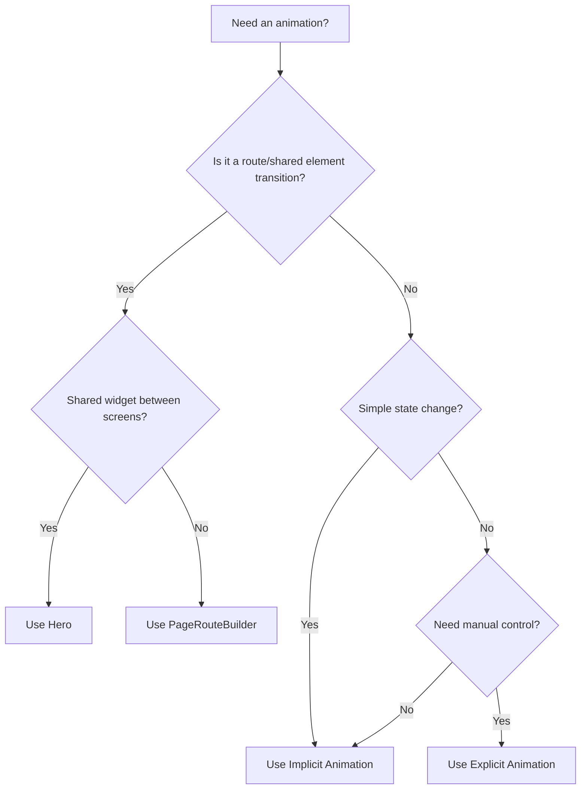

# Module Summary: Flutter Animations

## Overview

This lecture summarizes the full **Flutter Animations** module.

Throughout this module, you learned how to add motion and transitions to Flutter apps using both **explicit animations** and **implicit animations**. You also learned how to animate widgets inside a single screen and across multiple screens.

The module covered the full animation workflow, from manually controlling animations with `AnimationController` to using simple built-in widgets like `AnimatedSwitcher` and `Hero`.

By the end of this module, you should understand when to use each animation approach and how to build smoother, more polished Flutter user interfaces.

---

## Big Picture

Flutter animations can be divided into two main categories:



Each category has a different purpose.

* **Explicit animations** give you full control.
* **Implicit animations** reduce boilerplate and are easier to use.
* **Multi-screen animations** make navigation feel smoother and more connected.

---

## Explicit Animations

Explicit animations are animations that you build and control manually.

They usually involve:

* `AnimationController`
* `AnimatedBuilder`
* `Tween`
* `CurvedAnimation`
* Transition widgets such as `SlideTransition`

Explicit animations are powerful because they let you decide exactly how the animation behaves.

You can control:

* When the animation starts
* When it stops
* Whether it reverses
* Whether it repeats
* How long it takes
* Which values it animates between
* How the movement feels over time

---

## Explicit Animation Flow



This gives you fine-grained control, but it also requires more setup.

---

## Important Explicit Animation Tools

| Tool                             | Purpose                                             |
| -------------------------------- | --------------------------------------------------- |
| `AnimationController`            | Controls animation timing and playback              |
| `SingleTickerProviderStateMixin` | Provides `vsync` for one animation controller       |
| `TickerProviderStateMixin`       | Provides `vsync` for multiple animation controllers |
| `AnimatedBuilder`                | Rebuilds only the animated part of the UI           |
| `Tween`                          | Maps animation progress to useful values            |
| `CurvedAnimation`                | Applies easing to make movement feel natural        |
| `SlideTransition`                | Animates widget movement                            |
| `FadeTransition`                 | Animates opacity                                    |
| `ScaleTransition`                | Animates scale                                      |
| `RotationTransition`             | Animates rotation                                   |

---

## Example Explicit Animation Pattern

```dart id="explicit-animation-pattern"
class _CategoriesScreenState extends State<CategoriesScreen>
    with SingleTickerProviderStateMixin {
  late AnimationController _animationController;
  late Animation<Offset> _slideAnimation;

  @override
  void initState() {
    super.initState();

    _animationController = AnimationController(
      vsync: this,
      duration: const Duration(milliseconds: 300),
    );

    _slideAnimation = Tween<Offset>(
      begin: const Offset(0, 0.3),
      end: Offset.zero,
    ).animate(
      CurvedAnimation(
        parent: _animationController,
        curve: Curves.easeInOut,
      ),
    );

    _animationController.forward();
  }

  @override
  void dispose() {
    _animationController.dispose();
    super.dispose();
  }

  @override
  Widget build(BuildContext context) {
    return SlideTransition(
      position: _slideAnimation,
      child: GridView(
        children: [
          // Category items
        ],
      ),
    );
  }
}
```

---

## Implicit Animations

Implicit animations are animations that Flutter manages for you.

Instead of manually creating an `AnimationController`, you use prebuilt `Animated*` widgets. These widgets automatically animate when their properties or children change.

Implicit animations are ideal for simple state-driven transitions.

For example:

* Changing size
* Changing color
* Changing opacity
* Moving a widget
* Switching between icons
* Expanding or shrinking a container

---

## Implicit Animation Flow



The main benefit is simplicity.

You only define the old state, the new state, and the animation duration.

---

## Important Implicit Animation Widgets

| Widget                  | Purpose                                         |
| ----------------------- | ----------------------------------------------- |
| `AnimatedSwitcher`      | Animates when switching between child widgets   |
| `AnimatedContainer`     | Animates container properties                   |
| `AnimatedOpacity`       | Animates opacity                                |
| `AnimatedAlign`         | Animates alignment                              |
| `AnimatedPadding`       | Animates padding                                |
| `AnimatedRotation`      | Animates rotation                               |
| `AnimatedScale`         | Animates scale                                  |
| `AnimatedCrossFade`     | Cross-fades between two widgets                 |
| `TweenAnimationBuilder` | Creates custom implicit animations with a tween |

---

## Example Implicit Animation Pattern

```dart id="implicit-animation-pattern"
IconButton(
  onPressed: () {
    setState(() {
      isFavorite = !isFavorite;
    });
  },
  icon: AnimatedSwitcher(
    duration: const Duration(milliseconds: 300),
    transitionBuilder: (child, animation) {
      return RotationTransition(
        turns: Tween<double>(
          begin: 0.8,
          end: 1.0,
        ).animate(animation),
        child: child,
      );
    },
    child: Icon(
      isFavorite ? Icons.star : Icons.star_border,
      key: ValueKey(isFavorite),
    ),
  ),
)
```

This code uses `AnimatedSwitcher` to rotate the favorite icon when it changes.

The key is important because both states use an `Icon` widget. The `ValueKey` helps Flutter detect that the child has changed.

---

## Explicit vs Implicit Animations

| Feature               | Explicit Animation                                | Implicit Animation                                               |
| --------------------- | ------------------------------------------------- | ---------------------------------------------------------------- |
| Control level         | High                                              | Medium / Low                                                     |
| Complexity            | Higher                                            | Lower                                                            |
| Boilerplate           | More code                                         | Less code                                                        |
| Controller needed     | Yes                                               | No                                                               |
| Manual start needed   | Yes                                               | No                                                               |
| Manual dispose needed | Yes                                               | No                                                               |
| Best for              | Custom, controlled animations                     | Simple state-based transitions                                   |
| Example tools         | `AnimationController`, `AnimatedBuilder`, `Tween` | `AnimatedSwitcher`, `AnimatedContainer`, `TweenAnimationBuilder` |

---

## When to Use Explicit Animations

Use explicit animations when you need advanced control.

Good use cases include:

* Looping animations
* Reversing animations
* Pausing or stopping manually
* Listening to animation status
* Coordinating multiple animations
* Creating custom animation sequences
* Running an animation independently of a simple state change



---

## When to Use Implicit Animations

Use implicit animations when the animation is based on a simple UI state change.

Good use cases include:

* A favorite icon changing
* A card expanding
* A button changing color
* A widget fading in or out
* A container changing size
* A widget moving to a new alignment

A good rule:

> Start with implicit animations first. Use explicit animations only when implicit animations are not enough.

---

## Curves and Animation Feel

Both explicit and implicit animations can use curves.

A curve controls how the animation progresses over time.



Common curves include:

| Curve                  | Feel                                    |
| ---------------------- | --------------------------------------- |
| `Curves.linear`        | Constant speed                          |
| `Curves.easeIn`        | Starts slowly, then speeds up           |
| `Curves.easeOut`       | Starts quickly, then slows down         |
| `Curves.easeInOut`     | Starts slow, speeds up, then slows down |
| `Curves.fastOutSlowIn` | Material-style smooth motion            |
| `Curves.bounceOut`     | Bouncy effect                           |
| `Curves.elasticOut`    | Elastic effect                          |

Curves make animations feel more natural and less mechanical.

---

## Tween Recap

A `Tween` describes how to move between two values.

In explicit animations, a `Tween` often maps controller progress from `0.0 → 1.0` into something more useful.

Example:

```dart id="tween-summary"
Tween<Offset>(
  begin: const Offset(0, 0.3),
  end: Offset.zero,
)
```

This maps animation progress into a slide movement.

In implicit animations, a `Tween` can also be used to fine-tune values, such as reducing a rotation effect.

Example:

```dart id="implicit-tween-summary"
Tween<double>(
  begin: 0.8,
  end: 1.0,
).animate(animation)
```

---

## Hero Animations

The module also introduced `Hero`, which is used for shared-element transitions across screens.

A `Hero` animation connects two widgets on different routes using the same tag.



This was used to animate a meal image from the meal list screen to the meal details screen.

---

## Hero Example

```dart id="hero-summary-code-source"
Hero(
  tag: meal.id,
  child: FadeInImage(
    placeholder: MemoryImage(kTransparentImage),
    image: NetworkImage(meal.imageUrl),
    fit: BoxFit.cover,
  ),
)
```

On the destination screen:

```dart id="hero-summary-code-destination"
Hero(
  tag: meal.id,
  child: Image.network(
    meal.imageUrl,
    height: 300,
    width: double.infinity,
    fit: BoxFit.cover,
  ),
)
```

The tag must match on both screens.

---

## PageRouteBuilder Recap

`PageRouteBuilder` can be used to customize the entire route transition.

It gives access to an animation object that can drive effects such as:

* Slide transitions
* Fade transitions
* Scale transitions
* Combined transitions

Example:

```dart id="page-route-summary"
Navigator.of(context).push(
  PageRouteBuilder(
    pageBuilder: (context, animation, secondaryAnimation) {
      return const DetailScreen();
    },
    transitionsBuilder: (context, animation, secondaryAnimation, child) {
      return FadeTransition(
        opacity: animation,
        child: child,
      );
    },
  ),
);
```

Use `PageRouteBuilder` when you want to replace the default navigation transition.

---

## Animation Decision Guide



---

## Best Practices

* Prefer implicit animations for simple UI transitions.
* Use explicit animations when you need manual control.
* Always dispose of `AnimationController`.
* Use `AnimatedBuilder.child` to avoid rebuilding static widgets.
* Use `Tween` to map raw animation values into meaningful UI values.
* Use `CurvedAnimation` or `curve` to make motion feel natural.
* Add keys when `AnimatedSwitcher` does not detect widget changes.
* Keep animation durations short and purposeful.
* Avoid animating large widget trees unnecessarily.
* Use `Hero` for meaningful shared visual elements between screens.

---

## Performance Tips

Animations should feel smooth and responsive.

To keep animations performant:

* Rebuild only the animated part of the UI.
* Use the `child` parameter in `AnimatedBuilder`.
* Avoid expensive layout work during every frame.
* Prefer transition widgets like `SlideTransition` or `FadeTransition` where possible.
* Use Flutter DevTools to inspect performance if animations feel janky.
* Dispose unused animation controllers.

For most UI transitions, durations between **200ms and 500ms** usually feel natural.

---

## Key Points

* Flutter supports both explicit and implicit animations.
* Explicit animations provide more control but require more setup.
* Implicit animations are simpler and work well for most common UI transitions.
* `AnimationController` controls explicit animation timing and playback.
* `AnimatedBuilder` rebuilds only the animated part of the UI.
* `Tween` maps animation progress to useful values.
* `CurvedAnimation` and `Curves` improve animation feel.
* `AnimatedSwitcher` is useful for switching between widgets.
* `Hero` creates shared-element transitions across screens.
* `PageRouteBuilder` customizes whole-screen route transitions.
* Always clean up animation controllers with `dispose`.

---

## Tips

* Start with implicit animations by default.
* Use explicit animations only when you need more control.
* Use `Hero` when the same visual element appears on two screens.
* Use `PageRouteBuilder` when the entire screen transition should be customized.
* Keep animations meaningful and connected to user actions.
* Avoid overly dramatic animations for small UI elements.
* Revisit the module examples when deciding which approach to use in real projects.
* Explore Flutter's official animation documentation to discover more built-in animated widgets.

---

## Notes

This module built a complete foundation for Flutter animations.

It started with explicit animations, where you manually created an `AnimationController`, connected it to the UI with `AnimatedBuilder`, transformed values with `Tween`, and improved the feel with `CurvedAnimation`.

Then, the module introduced implicit animations, where Flutter handles the animation internally through widgets like `AnimatedSwitcher`. This showed that many common UI animations can be created with much less code.

Finally, the module covered multi-screen animations with `Hero`, making it possible to animate a widget from one screen to another with only a small amount of setup.

Together, these tools allow you to create polished, professional Flutter apps.

---

## Summary

This module introduced the core animation techniques in Flutter.

You learned how to create explicit animations with `AnimationController`, `AnimatedBuilder`, `Tween`, and `CurvedAnimation`. These tools give you full control over timing, playback, value mapping, and animation behavior.

You also learned how to create implicit animations with Flutter's built-in `Animated*` widgets, such as `AnimatedSwitcher`, `AnimatedContainer`, and `TweenAnimationBuilder`. These widgets are easier to use and are ideal for simple state-driven UI transitions.

Finally, you learned how to animate widgets across screens with `Hero` and how to customize route transitions with `PageRouteBuilder`.

The main takeaway is simple:

> Use implicit animations when you can, explicit animations when you need more control, and Hero animations when you want to visually connect two screens.

With these techniques, you now have the foundation needed to build smooth, expressive, and production-quality animations in Flutter apps.
