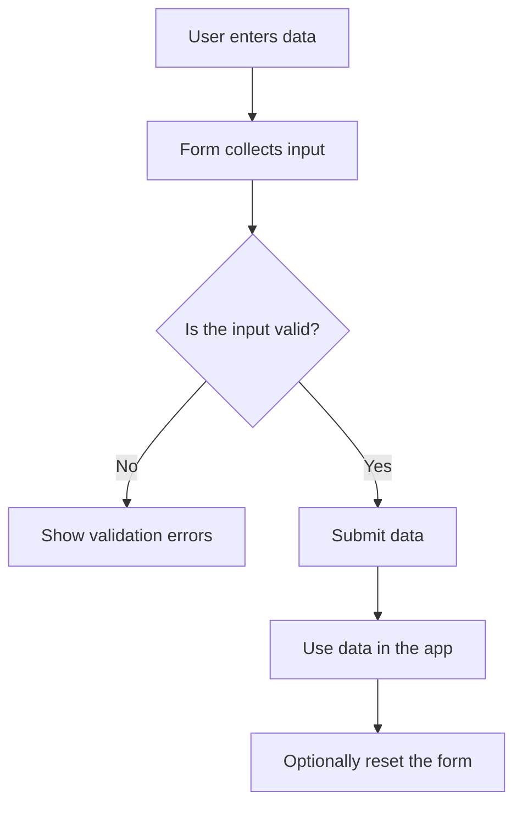
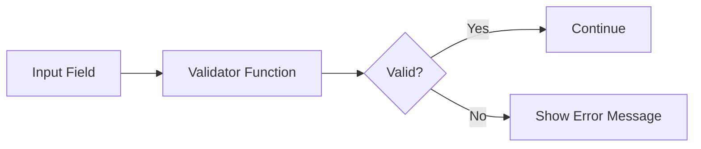
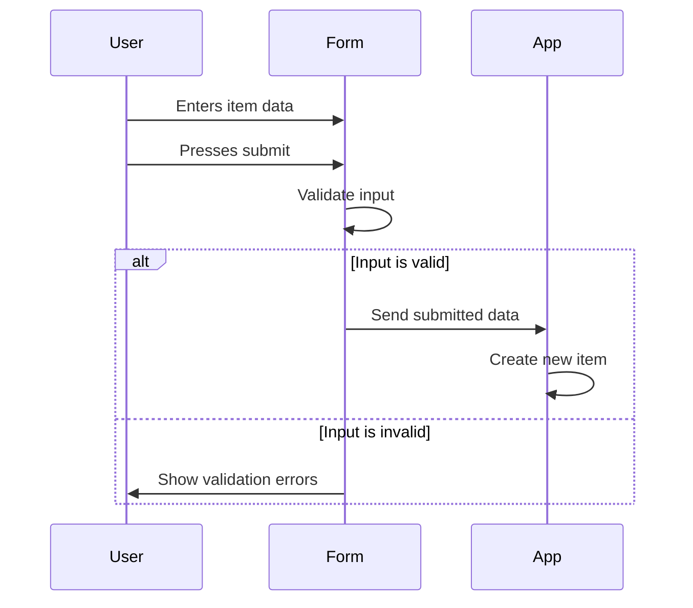
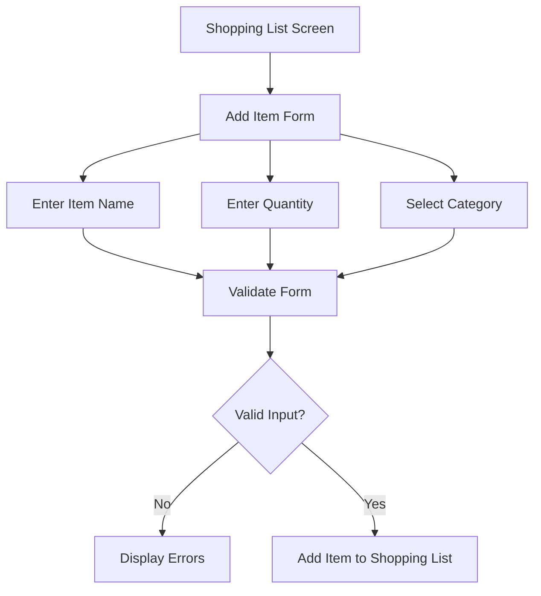

# Module Introduction: Forms & User Input in Flutter

## Overview

Up to this point in the course, you have already learned many important concepts for building Flutter user interfaces. You have also learned how to make those interfaces interactive, handle user actions, and collect input from users.

For example, in previous sections, you learned how to let users enter data and then use that data to create something meaningful, such as an expense item.

In this module, we will take a closer look at **handling user input** by learning how to build and use **forms** in Flutter apps.

Forms are a common and important part of real-world applications. They allow users to enter structured data, such as names, quantities, emails, passwords, or item details. More importantly, forms also help developers validate that data before it is submitted.

By the end of this module, you will have built another practical Flutter app and gained a stronger set of tools for handling user input properly.

---

## What You Will Learn

In this module, you will learn how to:

* Build forms in Flutter
* Use form-related widgets such as `Form` and `TextFormField`
* Validate user input
* Show validation error messages on the screen
* Retrieve data entered by the user
* Submit form data
* Reset form fields when needed
* Manage form state with `GlobalKey`
* Apply these concepts in a practical Shopping List App

---

## Why Forms Matter

Forms are useful because they provide a structured way to collect and process user input.

Without forms, you can still use basic input widgets, but handling validation, submission, and resetting can become messy as the app grows.

Forms help you keep input-related logic more organized.



---

## Key Concepts

### 1. User Input

User input is any data entered or selected by the user.

Examples include:

* Typing text into a field
* Choosing an item from a dropdown
* Selecting a number
* Submitting a form
* Resetting entered values

In this module, user input will be handled in a more structured way using forms.

---

### 2. Forms

A form is a group of input fields that work together.

In Flutter, the `Form` widget is used to group form fields and manage their state.

A form can help with:

* Validating multiple fields together
* Saving input values
* Resetting fields
* Submitting data only when all fields are valid

---

### 3. Form Fields

Form fields are the individual input elements inside a form.

A common Flutter form field is:

```dart
TextFormField
```

Unlike a basic `TextField`, `TextFormField` is designed to work directly with the `Form` widget.

It supports features such as:

* Validation
* Saving values
* Displaying error messages
* Integration with form state

---

### 4. Validation

Validation means checking whether the user input is acceptable.

For example:

* A name field should not be empty
* A quantity should be greater than zero
* An email should have a valid format
* A dropdown value should be selected

Validation helps prevent incorrect, incomplete, or unusable data from entering the app.



---

### 5. Submitting a Form

Submitting a form means taking the entered data and using it.

For example, in a Shopping List App, submitting the form may create a new grocery item.

The general process is:

1. User enters data
2. User presses the submit button
3. The app validates the form
4. If valid, the app saves or processes the data
5. The new data is shown in the app



---

### 6. Resetting a Form

Resetting a form means clearing the entered values and returning the form to its initial state.

This can be useful when:

* The user cancels the input
* The form was submitted successfully
* The app needs to clear invalid or outdated data

---

## Shopping List App

This module uses a **Shopping List App** as the main practical project.

The app will help demonstrate how forms are used in a realistic scenario.

The user will be able to enter grocery item data, such as:

* Item name
* Quantity
* Category

Then the app can validate the input and add the item to a shopping list.



---

## Important Flutter Widgets

| Widget / Concept          | Purpose                                            |
| ------------------------- | -------------------------------------------------- |
| `Form`                    | Groups multiple form fields and manages form state |
| `TextFormField`           | Collects text input and supports validation        |
| `DropdownButtonFormField` | Allows users to select from predefined options     |
| `GlobalKey<FormState>`    | Gives access to the form state programmatically    |
| `validator`               | Checks whether input is valid                      |
| `onSaved`                 | Saves the entered value                            |
| `reset()`                 | Resets the form fields                             |
| `validate()`              | Runs validation for all form fields                |

---

## Basic Form Flow

A typical Flutter form follows this structure:

```dart
final _formKey = GlobalKey<FormState>();

Form(
  key: _formKey,
  child: Column(
    children: [
      TextFormField(
        validator: (value) {
          if (value == null || value.isEmpty) {
            return 'Please enter a value.';
          }
          return null;
        },
      ),
      ElevatedButton(
        onPressed: () {
          if (_formKey.currentState!.validate()) {
            _formKey.currentState!.save();
          }
        },
        child: const Text('Submit'),
      ),
    ],
  ),
);
```

---

## Key Points

* Forms provide a structured way to handle user input.
* Flutter offers dedicated form widgets like `Form` and `TextFormField`.
* Validation is important for preventing invalid user input.
* Forms can display error messages directly on the screen.
* A form can be submitted after all fields are valid.
* Forms can also be reset when needed.
* `GlobalKey<FormState>` allows you to access and control the form programmatically.
* The Shopping List App will be used as a practical example throughout this module.

---

## Tips

* Start by understanding the purpose of the `Form` widget.
* Use `TextFormField` instead of `TextField` when you need validation.
* Keep validation logic simple and readable.
* Always validate input before saving or submitting it.
* Use clear error messages so users understand what they need to fix.
* Think of forms as a bridge between the user interface and the app’s data logic.

---

## Summary

This module introduces forms and structured user input handling in Flutter.

You will learn how to collect data from users, validate that data, show helpful error messages, submit forms, and reset them when needed.

By building a practical Shopping List App, you will see how these concepts work together in a real Flutter project. These skills are essential for almost any app that requires users to enter or submit information.
