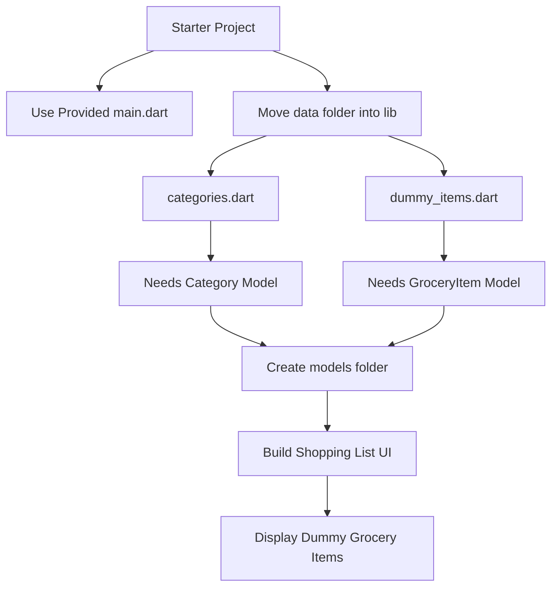
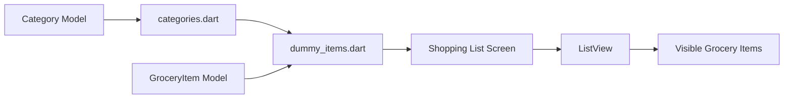
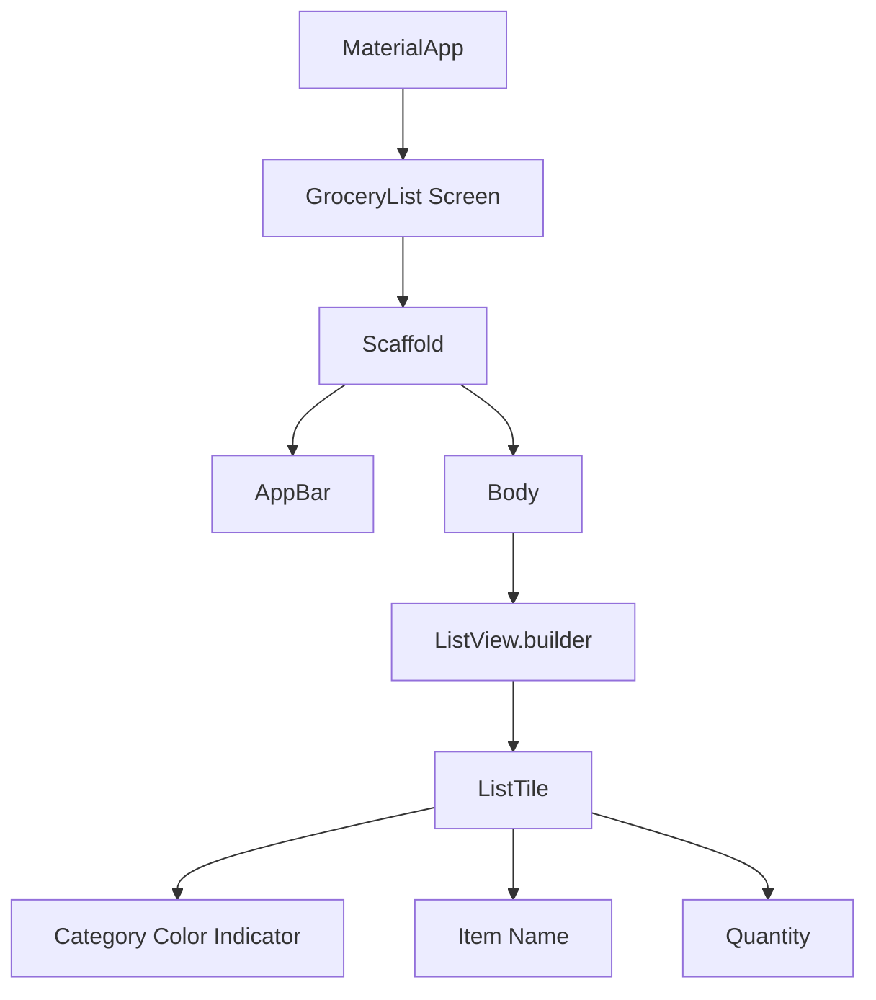
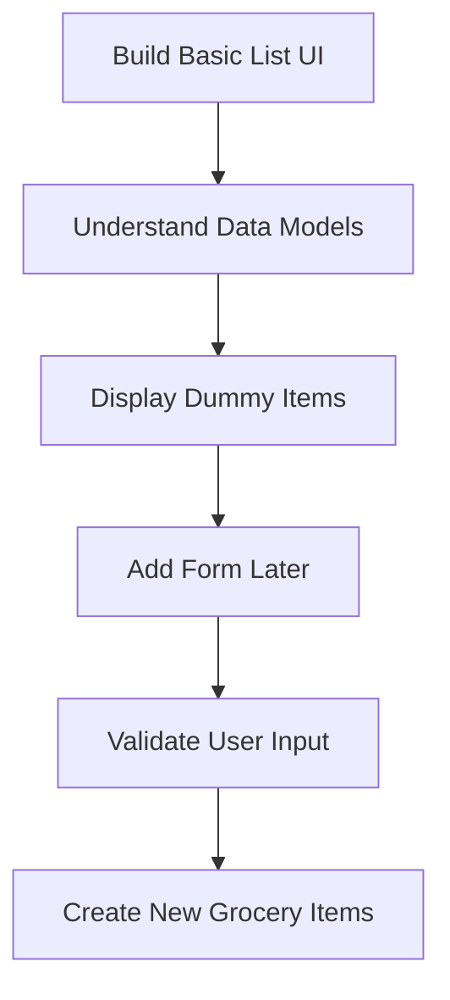

# Setup and A Challenge For You

## Overview

Before diving deeper into forms and user input handling in Flutter, this lecture gives you a practical challenge.

The goal is to build the initial version of a **Shopping List App**. At this stage, the app will not allow users to add new grocery items yet. That feature will be added later when forms are introduced.

For now, your task is to build the basic user interface that displays a list of dummy grocery items.

This challenge is designed to help you review and practice important Flutter fundamentals before learning new form-related concepts.

---

## Goal of This Challenge

You need to build a simple Shopping List App that:

* Uses the provided starter `main.dart` file
* Uses the provided `data/` folder
* Displays dummy grocery items on the screen
* Uses proper data models
* Organizes the project into folders such as `models/`, `screens/`, and possibly `widgets/`
* Comes as close as possible to the target UI shown in the course

At this point, the app only needs to show existing grocery items. Adding new items will be handled later.

---

## Big Picture



---

## Provided Files

Attached to this lecture, you should find:

| File / Folder      | Purpose                                                |
| ------------------ | ------------------------------------------------------ |
| `main.dart`        | Starter Flutter app with a basic theme                 |
| `data/` folder     | Contains predefined categories and dummy grocery items |
| `categories.dart`  | Stores available grocery categories                    |
| `dummy_items.dart` | Stores sample grocery items to display first           |

You should use the provided `main.dart` file instead of your existing one.

The `data/` folder should be unzipped and moved into your `lib/` folder.

Expected structure:

```txt
lib/
├── main.dart
├── data/
│   ├── categories.dart
│   └── dummy_items.dart
├── models/
│   ├── category.dart
│   └── grocery_item.dart
├── screens/
│   └── grocery_list.dart
└── widgets/
    └── ...
```

The exact widget files may vary depending on how you decide to structure your UI.

---

## Important Setup Notes

The provided data files already import model files that do not exist yet.

For example, they may expect files such as:

```dart
import 'package:shopping_list/models/category.dart';
import 'package:shopping_list/models/grocery_item.dart';
```

Therefore, you need to create those model files yourself.

You may also notice that the categories are stored using an `enum` as keys. That means you should create an enum that contains the expected category values.

---

## Required Models

### 1. Category Model

The `Category` model represents a grocery category.

A category may contain:

* A title
* A color

Example structure:

```dart
import 'package:flutter/material.dart';

class Category {
  const Category(this.title, this.color);

  final String title;
  final Color color;
}
```

---

### 2. Category Enum

The app uses an enum to identify categories.

Example:

```dart
enum Categories {
  vegetables,
  fruit,
  meat,
  dairy,
  carbs,
  sweets,
  spices,
  convenience,
  hygiene,
  other,
}
```

This enum allows categories to be used as stable keys in a map.

Example idea:

```dart
const categories = {
  Categories.vegetables: Category('Vegetables', Colors.green),
  Categories.fruit: Category('Fruit', Colors.red),
};
```

---

### 3. Grocery Item Model

The `GroceryItem` model represents one item in the shopping list.

A grocery item may contain:

* An id
* A name
* A quantity
* A category

Example structure:

```dart
import 'package:shopping_list/models/category.dart';

class GroceryItem {
  const GroceryItem({
    required this.id,
    required this.name,
    required this.quantity,
    required this.category,
  });

  final String id;
  final String name;
  final int quantity;
  final Category category;
}
```

---

## Data Flow

The dummy data is created from the models, and the UI displays that data.



---

## UI Challenge

Your main task is to build the shopping list interface.

The app should show dummy grocery items in a list.

Each list item should likely display:

* A small colored indicator for the category
* The grocery item name
* The quantity

Example visual layout:

```txt
+--------------------------------+
| Shopping List                  |
+--------------------------------+
| ■ Milk                    1    |
| ■ Bananas                 5    |
| ■ Beef                    1    |
| ■ Rice                    2    |
+--------------------------------+
```

The colored square or indicator should reflect the category color.

---

## Suggested UI Structure

A possible UI structure could look like this:



---

## Example Screen Structure

```dart
import 'package:flutter/material.dart';
import 'package:shopping_list/data/dummy_items.dart';

class GroceryList extends StatelessWidget {
  const GroceryList({super.key});

  @override
  Widget build(BuildContext context) {
    return Scaffold(
      appBar: AppBar(
        title: const Text('Your Groceries'),
      ),
      body: ListView.builder(
        itemCount: groceryItems.length,
        itemBuilder: (ctx, index) {
          final item = groceryItems[index];

          return ListTile(
            leading: Container(
              width: 24,
              height: 24,
              color: item.category.color,
            ),
            title: Text(item.name),
            trailing: Text(
              item.quantity.toString(),
            ),
          );
        },
      ),
    );
  }
}
```

This is only one possible solution. Your own implementation may look different.

---

## Challenge Steps

### Step 1: Replace `main.dart`

Use the `main.dart` file attached to the lecture.

This file already contains a basic Flutter app setup and theme.

---

### Step 2: Move the Data Folder

Unzip the provided `data/` folder and move it into `lib/`.

Your project should include:

```txt
lib/data/categories.dart
lib/data/dummy_items.dart
```

---

### Step 3: Create the Models Folder

Inside `lib/`, create a `models/` folder.

Then add:

```txt
lib/models/category.dart
lib/models/grocery_item.dart
```

---

### Step 4: Create the Category Model

Create a `Category` class that matches the needs of `categories.dart`.

It should likely store a title and a color.

---

### Step 5: Create the Category Enum

Create an enum for the category keys used in the provided data.

For example:

```dart
enum Categories {
  vegetables,
  fruit,
  meat,
  dairy,
  carbs,
  sweets,
  spices,
  convenience,
  hygiene,
  other,
}
```

Make sure the enum values match the ones used in the provided data file.

---

### Step 6: Create the Grocery Item Model

Create a `GroceryItem` class that matches the dummy items.

It should store information such as:

* `id`
* `name`
* `quantity`
* `category`

---

### Step 7: Build the UI

Create a screen that displays the dummy grocery items in a list.

Recommended widget:

```dart
ListView.builder
```

This is useful because the number of grocery items may grow later.

---

### Step 8: Check for Errors

Make sure:

* All imports are correct
* Model file names match the provided imports
* Enum values match the provided category keys
* The app runs without red errors
* Dummy items appear on the screen

---

## Recommended Folder Structure

```txt
lib/
├── main.dart
├── data/
│   ├── categories.dart
│   └── dummy_items.dart
├── models/
│   ├── category.dart
│   └── grocery_item.dart
├── screens/
│   └── groceries.dart
└── widgets/
    └── grocery_item_tile.dart
```

A separate widget file is optional, but it can make the UI cleaner.

---

## Optional Widget Extraction

You can extract each grocery item row into its own widget.

Example:

```dart
class GroceryItemTile extends StatelessWidget {
  const GroceryItemTile({
    super.key,
    required this.name,
    required this.quantity,
    required this.color,
  });

  final String name;
  final int quantity;
  final Color color;

  @override
  Widget build(BuildContext context) {
    return ListTile(
      leading: Container(
        width: 24,
        height: 24,
        color: color,
      ),
      title: Text(name),
      trailing: Text(quantity.toString()),
    );
  }
}
```

This makes the screen easier to read and maintain.

---

## What This Challenge Practices

This challenge reviews several important Flutter and Dart concepts:

| Concept          | How It Is Practiced                                     |
| ---------------- | ------------------------------------------------------- |
| Dart classes     | Creating `Category` and `GroceryItem` models            |
| Enums            | Defining category keys                                  |
| Imports          | Connecting data files with model files                  |
| Folder structure | Organizing code into models, data, screens, and widgets |
| List rendering   | Displaying grocery items with `ListView.builder`        |
| Widgets          | Building reusable UI components                         |
| App structure    | Creating a clean foundation for future features         |

---

## Why This Challenge Matters

This challenge prepares the app for the next major topic: forms.

Before users can add new grocery items, the app needs:

* A data model
* Existing sample data
* A list UI
* A clear screen structure
* A stable project setup

Once this foundation is ready, adding a form will be much easier.



---

## Tips

* Try the challenge before watching the solution.
* Do not worry if your UI is not pixel-perfect.
* Focus first on making the data models work.
* Then display the dummy data.
* After that, improve the UI step by step.
* Read error messages carefully because they often point to missing imports, wrong file names, or mismatched enum values.
* Use this challenge as a checkpoint before learning forms.

---

## Common Mistakes

### 1. Wrong File Names

The provided data files may import exact file names.

For example:

```txt
category.dart
grocery_item.dart
```

If your files have different names, the imports may fail.

---

### 2. Missing Enum Values

If the provided data uses an enum value that does not exist in your enum, Dart will show an error.

Make sure your enum matches the data file.

---

### 3. Wrong Model Constructor

If the dummy data creates a `GroceryItem` using named parameters, your model must support those named parameters.

Example:

```dart
const GroceryItem(
  id: 'a',
  name: 'Milk',
  quantity: 1,
  category: someCategory,
);
```

Your constructor must match this structure.

---

### 4. Forgetting to Import Material

If your `Category` model uses `Color`, you need:

```dart
import 'package:flutter/material.dart';
```

---

### 5. Using a Basic `ListView` Incorrectly

For a dynamic list, `ListView.builder` is usually better because it builds items efficiently.

---

## Summary

This lecture sets up the foundation for the Shopping List App.

Before learning forms, you are challenged to build a basic version of the app that displays dummy grocery items. To complete the challenge, you need to set up the project structure, create the required data models, define category enum values, and build a list-based UI.

This challenge helps reinforce Flutter fundamentals such as models, widgets, imports, enums, and list rendering. Once this foundation is complete, the next step will be adding user input through forms.
