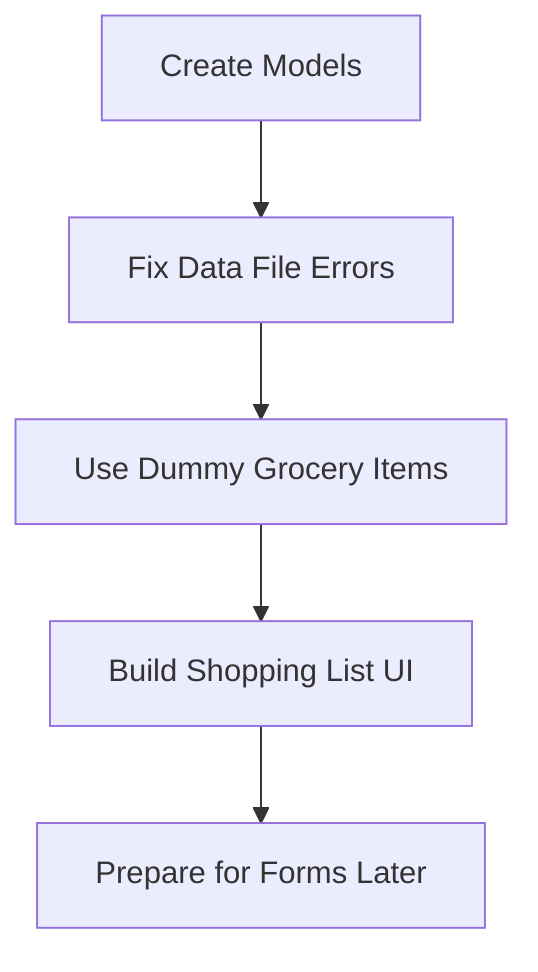
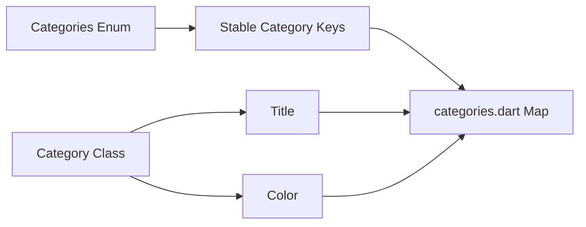
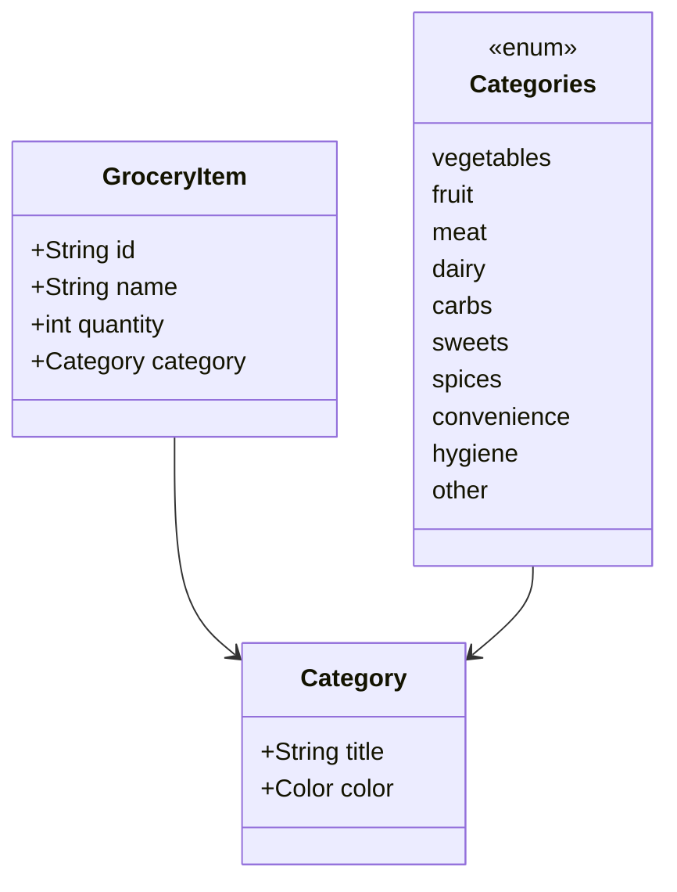

# Challenge Solution 1: Building and Using Models

## Overview

In this lecture, we solve the first part of the Shopping List App challenge by creating the required data models.

Before building the user interface, we need to make sure that the provided data files work correctly. The `categories.dart` and `dummy_items.dart` files depend on model files that do not exist yet, so we must create them first.

The main goal of this lecture is to define:

* A category enum
* A `Category` model class
* A `GroceryItem` model class

Once these models are created, the dummy data can be used without errors, and the app will be ready for building the shopping list UI.

---

## Why Start With Models?

Models define the structure of the data used in the app.

Before we can display grocery items on the screen, Flutter needs to know what a grocery item is and what information each item contains.



Starting with models makes the rest of the app easier to build because the data structure becomes clear and predictable.

---

## Project Structure

Inside the `lib/` folder, create a new folder called `models`.

The structure should look like this:

```txt id="7op42z"
lib/
├── data/
│   ├── categories.dart
│   └── dummy_items.dart
├── models/
│   ├── category.dart
│   └── grocery_item.dart
├── main.dart
```

The two model files are:

| File                | Purpose                                             |
| ------------------- | --------------------------------------------------- |
| `category.dart`     | Defines grocery categories and the `Category` model |
| `grocery_item.dart` | Defines the `GroceryItem` model                     |

---

## Step 1: Create the Category Enum

The provided `categories.dart` file uses an enum as a key for different grocery categories.

An enum is useful when you have a fixed set of possible values.

In this app, the categories are fixed:

```dart id="gfhyx0"
enum Categories {
  vegetables,
  fruit,
  meat,
  dairy,
  carbs,
  sweets,
  spices,
  convenience,
  hygiene,
  other,
}
```

These values represent the available grocery categories in the app.

---

## Step 2: Create the Category Model

Next, we create a `Category` class.

Each category should have:

* A `title`
* A `color`

Because `Color` comes from Flutter, we must import `material.dart`.

```dart id="xygvr9"
// lib/models/category.dart

import 'package:flutter/material.dart';

enum Categories {
  vegetables,
  fruit,
  meat,
  dairy,
  carbs,
  sweets,
  spices,
  convenience,
  hygiene,
  other,
}

class Category {
  const Category(this.title, this.color);

  final String title;
  final Color color;
}
```

---

## Why Use a Separate Category Class?

The enum gives us fixed category keys.

The `Category` class stores the actual information connected to each category.



For example, `Categories.vegetables` can point to a `Category` object with the title `"Vegetables"` and a green color.

---

## Example Category Data

The provided `categories.dart` file may look conceptually like this:

```dart id="8mx4kx"
import 'package:flutter/material.dart';
import 'package:shopping_list/models/category.dart';

const categories = {
  Categories.vegetables: Category(
    'Vegetables',
    Colors.green,
  ),
  Categories.fruit: Category(
    'Fruit',
    Colors.orange,
  ),
  Categories.meat: Category(
    'Meat',
    Colors.red,
  ),
};
```

The exact file may contain more categories, but the idea is the same.

---

## Step 3: Create the GroceryItem Model

After creating the category model, we can create the grocery item model.

A grocery item needs:

| Property   | Type       | Purpose                        |
| ---------- | ---------- | ------------------------------ |
| `id`       | `String`   | Unique identifier for the item |
| `name`     | `String`   | Name of the grocery item       |
| `quantity` | `int`      | Number of items                |
| `category` | `Category` | Category assigned to the item  |

---

## GroceryItem Model Code

```dart id="nkf4qh"
// lib/models/grocery_item.dart

import 'package:shopping_list/models/category.dart';

class GroceryItem {
  const GroceryItem({
    required this.id,
    required this.name,
    required this.quantity,
    required this.category,
  });

  final String id;
  final String name;
  final int quantity;
  final Category category;
}
```

---

## Why Use `final`?

The properties are marked as `final` because a grocery item should not be changed directly after it is created.

This makes the model immutable.

Immutable models are easier to reason about because their values stay predictable.

```dart id="y0mmho"
final String id;
final String name;
final int quantity;
final Category category;
```

---

## Why Use `required`?

Named parameters in Dart are optional by default.

Since every grocery item must have an `id`, `name`, `quantity`, and `category`, we use `required`.

```dart id="suvgyw"
const GroceryItem({
  required this.id,
  required this.name,
  required this.quantity,
  required this.category,
});
```

Without `required`, it would be possible to create an incomplete grocery item, which could cause problems later.

---

## Why Is Quantity an `int`?

The `quantity` property is an `int` because this app only uses whole-number quantities.

For example:

```txt id="g0et2n"
1 apple
2 bottles of milk
5 bananas
```

The app does not need values like:

```txt id="nlgk9x"
1.5 apples
2.75 bottles of milk
```

So `int` is more appropriate than `double`.

---

## Data Model Relationship

The final relationship between the models looks like this:



---

## How Dummy Items Use These Models

The `dummy_items.dart` file creates grocery items from the `GroceryItem` class.

Example:

```dart id="qpw4gi"
import 'package:shopping_list/data/categories.dart';
import 'package:shopping_list/models/category.dart';
import 'package:shopping_list/models/grocery_item.dart';

final groceryItems = [
  GroceryItem(
    id: 'a',
    name: 'Milk',
    quantity: 1,
    category: categories[Categories.dairy]!,
  ),
  GroceryItem(
    id: 'b',
    name: 'Bananas',
    quantity: 5,
    category: categories[Categories.fruit]!,
  ),
];
```

Notice that `categories[Categories.dairy]!` is used to get the category object from the categories map.

The `!` tells Dart that the value will not be null.

---

## Important Note About `const`

In the dummy items file, you may need to remove `const` from the grocery items list if category values are accessed dynamically from a map.

For example, this may cause an error:

```dart id="lrkply"
const groceryItems = [
  GroceryItem(
    id: 'a',
    name: 'Milk',
    quantity: 1,
    category: categories[Categories.dairy]!,
  ),
];
```

This is because map access like this is not always treated as a compile-time constant.

Use `final` instead:

```dart id="qjzgyn"
final groceryItems = [
  GroceryItem(
    id: 'a',
    name: 'Milk',
    quantity: 1,
    category: categories[Categories.dairy]!,
  ),
];
```

---

## Common Errors and Fixes

### 1. Missing `Color` Type

If Dart does not recognize `Color`, add this import:

```dart id="j4jaty"
import 'package:flutter/material.dart';
```

---

### 2. Wrong Enum Name

If the data file expects `Categories`, make sure your enum is also named `Categories`.

```dart id="0p33kd"
enum Categories {
  vegetables,
  fruit,
  meat,
  dairy,
  carbs,
  sweets,
  spices,
  convenience,
  hygiene,
  other,
}
```

---

### 3. Missing Enum Value

If `categories.dart` uses `Categories.carbs`, your enum must include `carbs`.

Every enum value used in the data file must exist in your enum.

---

### 4. Wrong Constructor Style

The `Category` class uses positional parameters:

```dart id="2p3v9d"
const Category(this.title, this.color);
```

So it should be created like this:

```dart id="fbmp3l"
Category('Vegetables', Colors.green)
```

Not like this:

```dart id="ce5uwo"
Category(
  title: 'Vegetables',
  color: Colors.green,
)
```

unless you change the constructor to use named parameters.

---

### 5. Missing Import in `grocery_item.dart`

Because `GroceryItem` uses the `Category` type, you must import `category.dart`.

```dart id="7cjdbj"
import 'package:shopping_list/models/category.dart';
```

---

## Complete Model Files

### `category.dart`

```dart id="r7a5kp"
import 'package:flutter/material.dart';

enum Categories {
  vegetables,
  fruit,
  meat,
  dairy,
  carbs,
  sweets,
  spices,
  convenience,
  hygiene,
  other,
}

class Category {
  const Category(this.title, this.color);

  final String title;
  final Color color;
}
```

---

### `grocery_item.dart`

```dart id="lze99c"
import 'package:shopping_list/models/category.dart';

class GroceryItem {
  const GroceryItem({
    required this.id,
    required this.name,
    required this.quantity,
    required this.category,
  });

  final String id;
  final String name;
  final int quantity;
  final Category category;
}
```

---

## What We Achieved

By the end of this lecture, we have:

* Created a `models/` folder
* Created `category.dart`
* Defined the `Categories` enum
* Created the `Category` model class
* Created `grocery_item.dart`
* Defined the `GroceryItem` model class
* Fixed the data files so they can use the models correctly
* Prepared the project for building the shopping list UI

---

## Key Points

* Models define the shape of the app’s data.
* The `Categories` enum represents a fixed set of grocery categories.
* The `Category` class stores category details such as title and color.
* The `GroceryItem` class stores item data such as id, name, quantity, and category.
* `final` fields help keep model objects immutable.
* `required` makes sure necessary values are provided when creating objects.
* The project is now ready for building the user interface.

---

## Summary

This lecture solves the first part of the challenge by creating the data models required for the Shopping List App.

We created a `Categories` enum, a `Category` class, and a `GroceryItem` class. These models allow the provided category and dummy item data files to work correctly.

With the models finished, the app now has a clean data foundation. The next step is to build the user interface that displays the grocery items on the screen.
