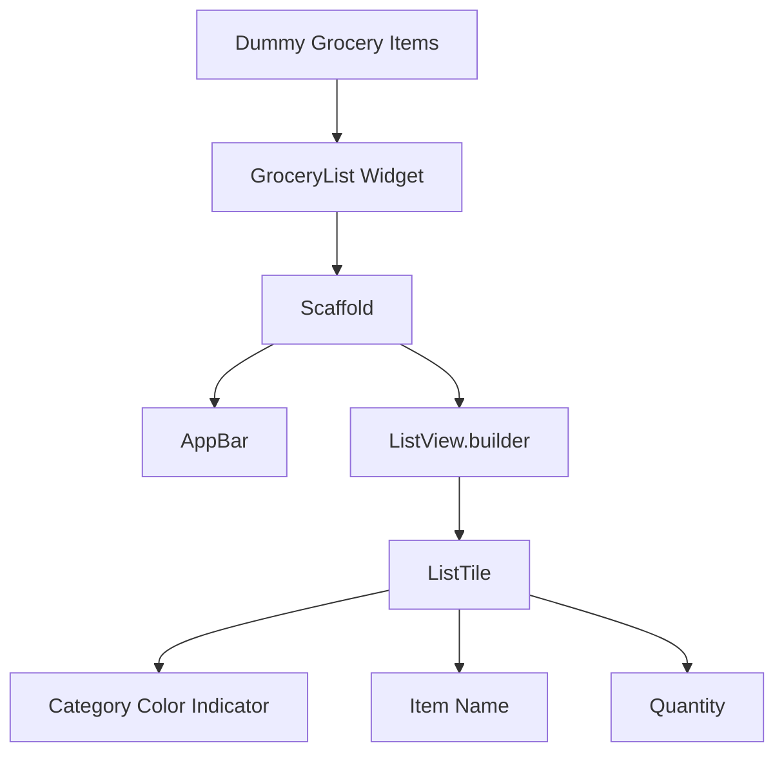
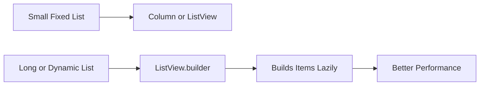
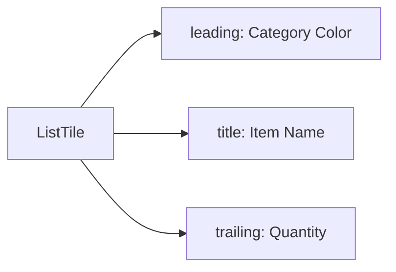
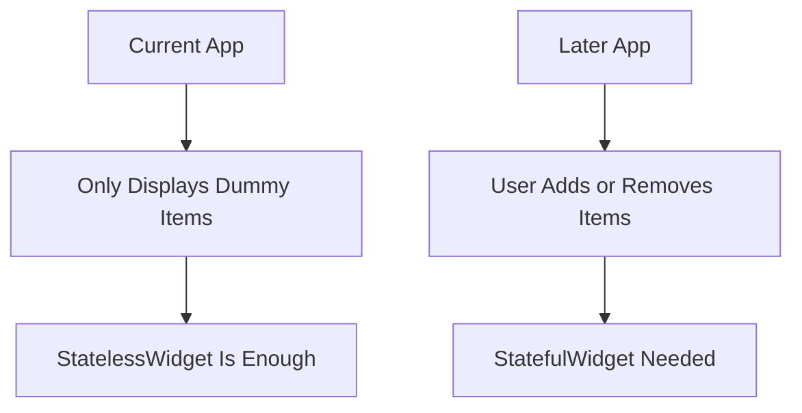

# Challenge Solution 2: Building the List UI

## Overview

In this lecture, we solve the second part of the Shopping List App challenge by building the main list user interface.

After creating the required models in the previous lecture, the app now has a proper data structure. The next step is to display the dummy grocery items on the screen.

The goal of this lecture is to build a basic shopping list screen that shows each grocery item with:

* Its name
* Its quantity
* A small color indicator based on its category

At this stage, the app still does not allow users to add new items yet. That feature will be implemented later using Flutter forms.

---

## What We Are Building

The app should display a list of grocery items.

Each item should appear as a row in the list.

Example layout:

```txt
+--------------------------------+
| Your Groceries                 |
+--------------------------------+
| ■ Milk                    1    |
| ■ Bananas                 5    |
| ■ Beef                    1    |
+--------------------------------+
```

The colored square represents the category color of the grocery item.

---

## Big Picture



---

## Project Structure

To keep the project organized, we create a new `widgets/` folder inside `lib/`.

Example structure:

```txt
lib/
├── data/
│   ├── categories.dart
│   └── dummy_items.dart
├── models/
│   ├── category.dart
│   └── grocery_item.dart
├── widgets/
│   └── grocery_list.dart
└── main.dart
```

The `models/` folder contains data structures.

The `widgets/` folder contains UI components.

---

## Step 1: Create the Grocery List Widget

Create a new file:

```txt
lib/widgets/grocery_list.dart
```

Inside this file, create a `GroceryList` widget.

For now, this can be a `StatelessWidget` because we are only displaying dummy data. The list is not changing yet.

```dart
import 'package:flutter/material.dart';

class GroceryList extends StatelessWidget {
  const GroceryList({super.key});

  @override
  Widget build(BuildContext context) {
    return const Placeholder();
  }
}
```

Later, when users can add or remove items, this widget may be changed into a `StatefulWidget`.

---

## Step 2: Add a Scaffold

The `Scaffold` provides the basic visual structure for the screen.

It gives us:

* A background
* An app bar
* A body area

```dart
return Scaffold(
  appBar: AppBar(
    title: const Text('Your Groceries'),
  ),
  body: // list goes here
);
```

Without a `Scaffold`, the app would not have the standard Material Design screen layout.

---

## Step 3: Import the Dummy Items

To display the dummy grocery items, import the `dummy_items.dart` file.

```dart
import 'package:shopping_list/data/dummy_items.dart';
```

This gives access to the `groceryItems` list.

---

## Step 4: Use `ListView.builder`

Since the shopping list can become long later, we use `ListView.builder`.

`ListView.builder` is efficient because it only builds the items that are visible or about to become visible on the screen.

```dart
ListView.builder(
  itemCount: groceryItems.length,
  itemBuilder: (ctx, index) {
    final item = groceryItems[index];

    return // widget for each row
  },
)
```

---

## Why Use `ListView.builder`?

A normal `Column` or a basic `ListView` can work for small lists, but they are not ideal for long or dynamic lists.



`ListView.builder` is the better choice here because later the user will be able to add more grocery items.

---

## Step 5: Build Each List Row With `ListTile`

Flutter provides the `ListTile` widget for common list row layouts.

A `ListTile` can include:

* `leading`: something shown at the beginning
* `title`: main content
* `trailing`: something shown at the end

For this app:

| `ListTile` Part | Content                 |
| --------------- | ----------------------- |
| `leading`       | Colored category square |
| `title`         | Grocery item name       |
| `trailing`      | Quantity                |

---

## List Row Structure



---

## Step 6: Add the Category Color Indicator

Each `GroceryItem` has a category.

Each category has a color.

We can display that color using a small `Container`.

```dart
leading: Container(
  width: 24,
  height: 24,
  color: item.category.color,
),
```

This creates a small square block that visually represents the item category.

---

## Step 7: Display Name and Quantity

The item name is displayed with a `Text` widget.

```dart
title: Text(item.name),
```

The quantity is an `int`, but `Text` requires a `String`.

So we convert it using `.toString()`.

```dart
trailing: Text(
  item.quantity.toString(),
),
```

---

## Complete `grocery_list.dart`

```dart
import 'package:flutter/material.dart';
import 'package:shopping_list/data/dummy_items.dart';

class GroceryList extends StatelessWidget {
  const GroceryList({super.key});

  @override
  Widget build(BuildContext context) {
    return Scaffold(
      appBar: AppBar(
        title: const Text('Your Groceries'),
      ),
      body: ListView.builder(
        itemCount: groceryItems.length,
        itemBuilder: (ctx, index) {
          final item = groceryItems[index];

          return ListTile(
            leading: Container(
              width: 24,
              height: 24,
              color: item.category.color,
            ),
            title: Text(item.name),
            trailing: Text(
              item.quantity.toString(),
            ),
          );
        },
      ),
    );
  }
}
```

---

## Step 8: Use `GroceryList` in `main.dart`

After creating the widget, use it as the `home` widget in `main.dart`.

```dart
import 'package:flutter/material.dart';
import 'package:shopping_list/widgets/grocery_list.dart';

void main() {
  runApp(const App());
}

class App extends StatelessWidget {
  const App({super.key});

  @override
  Widget build(BuildContext context) {
    return MaterialApp(
      home: const GroceryList(),
    );
  }
}
```

The exact `main.dart` may look slightly different depending on the starter file provided by the course, especially if it already contains a theme.

---

## Optional: Empty State Handling

In the current lecture version, the app displays dummy grocery items directly.

However, in a real app, the list may sometimes be empty. In that case, you can show a placeholder message.

Example:

```dart
Widget content = const Center(
  child: Text('No items added yet.'),
);

if (groceryItems.isNotEmpty) {
  content = ListView.builder(
    itemCount: groceryItems.length,
    itemBuilder: (ctx, index) {
      final item = groceryItems[index];

      return ListTile(
        leading: Container(
          width: 24,
          height: 24,
          color: item.category.color,
        ),
        title: Text(item.name),
        trailing: Text(item.quantity.toString()),
      );
    },
  );
}
```

Then use it in the `Scaffold`:

```dart
return Scaffold(
  appBar: AppBar(
    title: const Text('Your Groceries'),
  ),
  body: content,
);
```

This pattern is useful when your UI needs to handle multiple states.

---

## Optional: Preparing for Adding New Items

Later, the app will allow users to add new grocery items.

At that point, the app bar may include an add button:

```dart
appBar: AppBar(
  title: const Text('Your Groceries'),
  actions: [
    IconButton(
      onPressed: () {},
      icon: const Icon(Icons.add),
    ),
  ],
),
```

For now, the button does not need to do anything yet. It will become useful when the form screen is added.

---

## StatelessWidget vs StatefulWidget

In this lecture, `GroceryList` can be a `StatelessWidget` because the data does not change yet.



Once we start adding new items dynamically, the list will need state.

At that point, the widget can be converted into a `StatefulWidget`.

---

## What We Achieved

By the end of this lecture, we have:

* Created a `widgets/` folder
* Created a `grocery_list.dart` file
* Built a `GroceryList` widget
* Added a `Scaffold`
* Added an `AppBar`
* Displayed dummy grocery items with `ListView.builder`
* Used `ListTile` for each row
* Displayed the item name, quantity, and category color
* Connected the screen to `main.dart`

---

## Key Points

* `ListView.builder` is ideal for long or dynamic lists.
* `itemCount` tells Flutter how many items should be built.
* `itemBuilder` builds each visible list row.
* `ListTile` provides a convenient layout for list items.
* `leading`, `title`, and `trailing` are useful for common row structures.
* `Container` can be used to display a colored category indicator.
* `Text` requires strings, so numbers must be converted with `.toString()`.
* The list UI is now ready for the next step: adding new items with forms.

---

## Common Mistakes

### 1. Forgetting `itemCount`

Without `itemCount`, Flutter may not know how many list items to build.

```dart
itemCount: groceryItems.length,
```

---

### 2. Passing a String Directly to `title`

`title` expects a widget, not a string.

Incorrect:

```dart
title: item.name,
```

Correct:

```dart
title: Text(item.name),
```

---

### 3. Forgetting `.toString()` for Quantity

`Text` cannot display an `int` directly.

Incorrect:

```dart
trailing: Text(item.quantity),
```

Correct:

```dart
trailing: Text(item.quantity.toString()),
```

---

### 4. Missing Import for Dummy Items

Make sure the dummy data is imported.

```dart
import 'package:shopping_list/data/dummy_items.dart';
```

---

### 5. Not Using the Widget in `main.dart`

Creating `GroceryList` is not enough. It must be connected to the app.

```dart
home: const GroceryList(),
```

---

## Summary

This lecture completes the basic Shopping List App UI.

We created a `GroceryList` widget, added a `Scaffold` and `AppBar`, and rendered the dummy grocery items using `ListView.builder`.

Each item is displayed with a `ListTile`, showing the item name, quantity, and category color. This gives the app a clean foundation before adding the next major feature: user input through Flutter forms.
