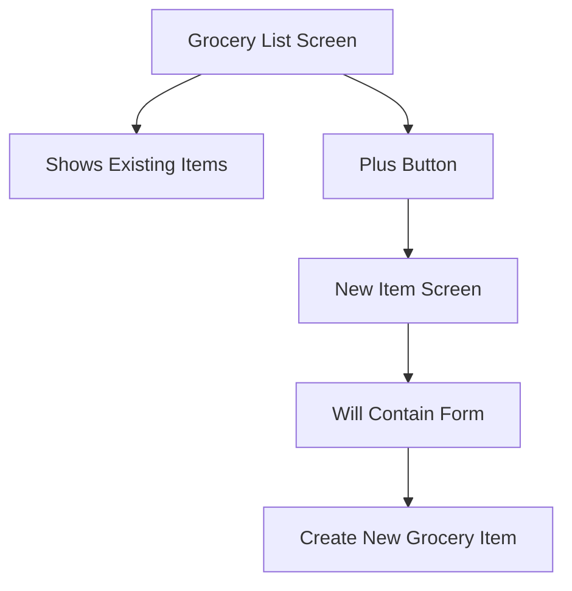
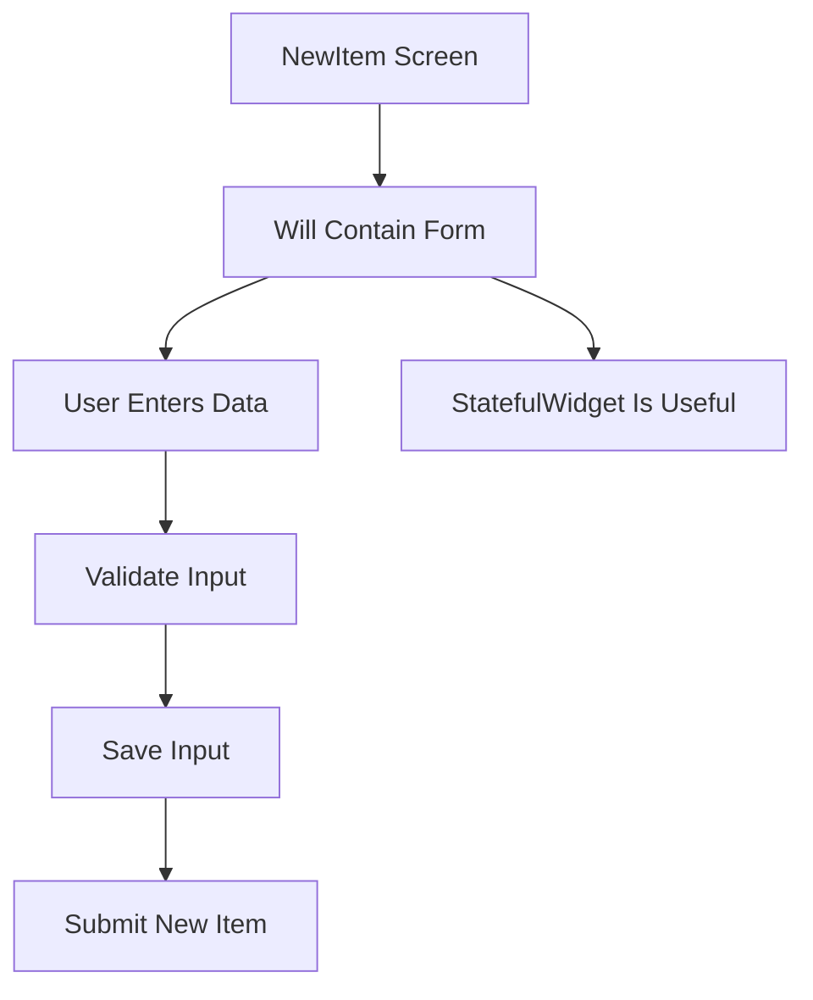
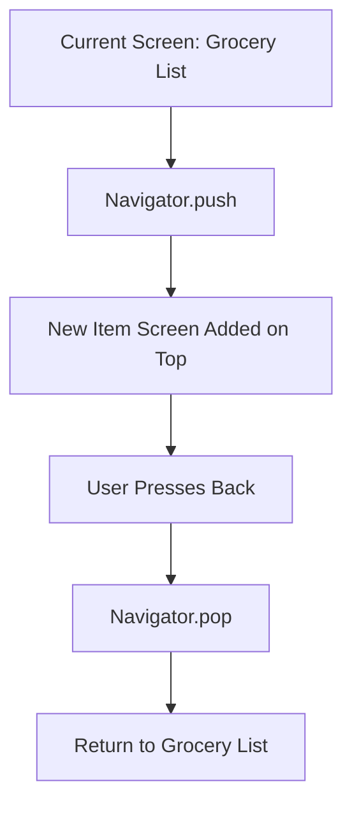
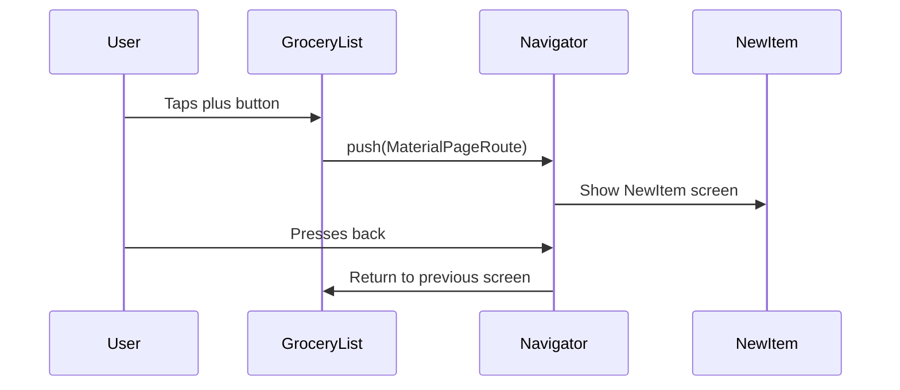
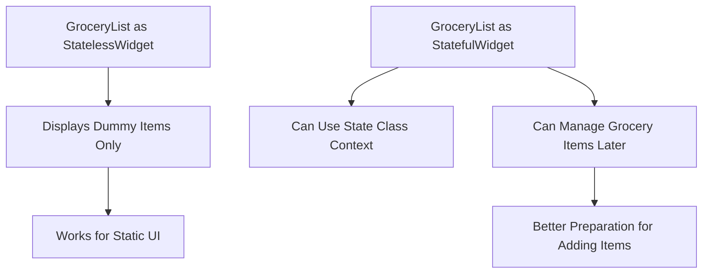

# Adding a New Item Screen

## Overview

In this lecture, we start adding the user input feature to the Shopping List App.

Before building the actual form, we first create a separate screen where the form will be placed. This new screen will be responsible for adding a new grocery item.

The main goal of this lecture is to:

* Create a new `NewItem` widget
* Use it as a separate screen
* Add an app bar title
* Add placeholder content for the future form
* Add a plus button to the grocery list screen
* Navigate from the grocery list screen to the new item screen

At this stage, the new screen does not contain the real form yet. It only prepares the structure needed for the next lecture.

---

## Why Create a Separate Screen?

The main grocery list screen is responsible for showing existing grocery items.

The new item screen will be responsible for collecting user input.

Separating these responsibilities keeps the app cleaner and easier to maintain.



---

## Project Structure

In this lecture, we add a new file for the new item screen.

Example structure:

```txt id="5p9xtu"
lib/
├── data/
│   ├── categories.dart
│   └── dummy_items.dart
├── models/
│   ├── category.dart
│   └── grocery_item.dart
├── widgets/
│   ├── grocery_list.dart
│   └── new_item.dart
└── main.dart
```

In this course section, the instructor places both widgets inside the `widgets/` folder.

In a larger app, you could also use a `screens/` folder:

```txt id="8xvkhh"
lib/
├── screens/
│   ├── grocery_list.dart
│   └── new_item.dart
```

Both approaches are valid. The important point is to keep the code organized.

---

## Step 1: Create `new_item.dart`

Create a new file:

```txt id="6yhw7o"
lib/widgets/new_item.dart
```

This file will contain the screen where users will later enter a new grocery item.

---

## Step 2: Create the `NewItem` Widget

The `NewItem` widget is created as a `StatefulWidget`.

Even though it does not manage much state yet, it will later contain a form, and forms often need state-related logic.

```dart id="ga58eb"
import 'package:flutter/material.dart';

class NewItem extends StatefulWidget {
  const NewItem({super.key});

  @override
  State<NewItem> createState() {
    return _NewItemState();
  }
}

class _NewItemState extends State<NewItem> {
  @override
  Widget build(BuildContext context) {
    return const Placeholder();
  }
}
```

---

## Why Use `StatefulWidget`?

The new item screen will eventually handle user input.

That means it may need to manage:

* Entered text
* Selected category
* Form validation
* Form submission
* Resetting input fields

Because of that, starting with a `StatefulWidget` makes sense.



---

## Step 3: Add a Scaffold

Since `NewItem` is a full screen, it should return a `Scaffold`.

The `Scaffold` gives the screen a standard Material Design structure.

```dart id="keda9m"
return Scaffold(
  appBar: AppBar(
    title: const Text('Add a new item'),
  ),
  body: const Text('The form'),
);
```

---

## Step 4: Add Padding Around the Body

The body will later contain form fields.

To prevent those fields from touching the edges of the screen, wrap the content with `Padding`.

```dart id="6r9mxu"
body: const Padding(
  padding: EdgeInsets.all(12),
  child: Text('The form'),
),
```

The value `12` adds spacing on all sides.

---

## Complete `new_item.dart`

```dart id="1w4f75"
import 'package:flutter/material.dart';

class NewItem extends StatefulWidget {
  const NewItem({super.key});

  @override
  State<NewItem> createState() {
    return _NewItemState();
  }
}

class _NewItemState extends State<NewItem> {
  @override
  Widget build(BuildContext context) {
    return Scaffold(
      appBar: AppBar(
        title: const Text('Add a new item'),
      ),
      body: const Padding(
        padding: EdgeInsets.all(12),
        child: Text('The form'),
      ),
    );
  }
}
```

At this point, the text `"The form"` is only a placeholder. It will be replaced with the actual form in the next lecture.

---

## Step 5: Add an Add Button to the Grocery List Screen

Now we need a way to open the `NewItem` screen.

The best place for this action is the `AppBar`.

We add an `IconButton` to the `actions` property.

```dart id="pffp28"
appBar: AppBar(
  title: const Text('Your Groceries'),
  actions: [
    IconButton(
      onPressed: _addItem,
      icon: const Icon(Icons.add),
    ),
  ],
),
```

The `Icons.add` icon displays a plus button.

---

## Step 6: Create the `_addItem` Method

The `_addItem` method will handle navigation to the new screen.

```dart id="oq2l77"
void _addItem() {
  Navigator.of(context).push(
    MaterialPageRoute(
      builder: (ctx) => const NewItem(),
    ),
  );
}
```

This uses Flutter’s `Navigator`.

---

## How Navigation Works

Flutter navigation uses a stack-based model.

When you call `push`, a new screen is placed on top of the current screen.

When you call `pop`, the top screen is removed, and the previous screen becomes visible again.



---

## Navigator Stack Diagram



---

## Important: Import `NewItem`

To use `NewItem` inside `grocery_list.dart`, import the file.

```dart id="frgow3"
import 'package:shopping_list/widgets/new_item.dart';
```

The exact path depends on your folder structure.

---

## Step 7: Convert `GroceryList` to `StatefulWidget`

In the previous lecture, `GroceryList` may have been a `StatelessWidget`.

However, the `_addItem` method uses `context`.

Inside a `State` class, `context` is available directly, which makes navigation easier.

Also, later this widget will manage a list of grocery items, so it will need state anyway.



---

## Updated `grocery_list.dart`

```dart id="9rl8n8"
import 'package:flutter/material.dart';

import 'package:shopping_list/data/dummy_items.dart';
import 'package:shopping_list/widgets/new_item.dart';

class GroceryList extends StatefulWidget {
  const GroceryList({super.key});

  @override
  State<GroceryList> createState() {
    return _GroceryListState();
  }
}

class _GroceryListState extends State<GroceryList> {
  void _addItem() {
    Navigator.of(context).push(
      MaterialPageRoute(
        builder: (ctx) => const NewItem(),
      ),
    );
  }

  @override
  Widget build(BuildContext context) {
    return Scaffold(
      appBar: AppBar(
        title: const Text('Your Groceries'),
        actions: [
          IconButton(
            onPressed: _addItem,
            icon: const Icon(Icons.add),
          ),
        ],
      ),
      body: ListView.builder(
        itemCount: groceryItems.length,
        itemBuilder: (ctx, index) {
          final item = groceryItems[index];

          return ListTile(
            leading: Container(
              width: 24,
              height: 24,
              color: item.category.color,
            ),
            title: Text(item.name),
            trailing: Text(
              item.quantity.toString(),
            ),
          );
        },
      ),
    );
  }
}
```

---

## Route Creation With `MaterialPageRoute`

`MaterialPageRoute` creates a route that follows Material Design navigation behavior.

```dart id="2x54b5"
MaterialPageRoute(
  builder: (ctx) => const NewItem(),
)
```

The `builder` function returns the screen that should be shown.

In this case, it returns:

```dart id="mwn55q"
const NewItem()
```

---

## Why Use a Separate `_addItem` Method?

You could write the navigation code directly inside `onPressed`.

Example:

```dart id="ehbs0b"
onPressed: () {
  Navigator.of(context).push(
    MaterialPageRoute(
      builder: (ctx) => const NewItem(),
    ),
  );
}
```

However, using a separate method keeps the `build` method cleaner.

```dart id="dyi7sl"
onPressed: _addItem,
```

This makes the widget easier to read and maintain.

---

## What Happens When the Button Is Pressed?

```mermaid id="q3j4ig"
flowchart TD
    A[User taps plus button] --> B[_addItem runs]
    B --> C[Navigator.of(context)]
    C --> D[push new route]
    D --> E[MaterialPageRoute]
    E --> F[Build NewItem screen]
    F --> G[Show Add a new item page]
```

---

## What We Achieved

By the end of this lecture, we have:

* Created a `NewItem` widget
* Made `NewItem` a `StatefulWidget`
* Added a `Scaffold` to the new screen
* Added an `AppBar` with the title `"Add a new item"`
* Added placeholder body content
* Added a plus button to the grocery list screen
* Created the `_addItem` method
* Used `Navigator.push` to open the new screen
* Prepared the app for adding the actual form

---

## Key Points

* The new item form should live on a separate screen.
* `NewItem` is created as a `StatefulWidget` because it will later manage form-related state.
* A screen usually returns a `Scaffold`.
* The `AppBar` can contain action buttons through the `actions` property.
* `IconButton` is useful for adding tappable icons.
* `Navigator.of(context).push()` opens a new screen.
* `MaterialPageRoute` defines the screen that should be pushed.
* Flutter navigation works like a stack: push adds a screen, pop removes it.
* `GroceryList` is converted to `StatefulWidget` because it will manage item state later.

---

## Common Mistakes

### 1. Forgetting to Import `NewItem`

If Dart cannot find `NewItem`, make sure you imported it.

```dart id="m4h9cz"
import 'package:shopping_list/widgets/new_item.dart';
```

---

### 2. Calling `_addItem()` Instead of Passing `_addItem`

Incorrect:

```dart id="ug88y0"
onPressed: _addItem(),
```

Correct:

```dart id="71lv69"
onPressed: _addItem,
```

The first version calls the function immediately. The second version gives Flutter the function to call later when the button is pressed.

---

### 3. Forgetting `MaterialPageRoute`

`Navigator.push` needs a route.

Correct:

```dart id="rk1mxp"
Navigator.of(context).push(
  MaterialPageRoute(
    builder: (ctx) => const NewItem(),
  ),
);
```

---

### 4. Using `context` Where It Is Not Available

Inside a `StatelessWidget`, `context` is available inside the `build` method.

Inside a `State` class, `context` is available more broadly, including in custom methods like `_addItem`.

That is one reason converting `GroceryList` into a `StatefulWidget` is useful here.

---

## Summary

This lecture prepares the app for user input by adding a separate screen for creating new grocery items.

We created the `NewItem` widget as a `StatefulWidget`, gave it a `Scaffold`, added an app bar, and placed temporary placeholder text where the form will later go.

Then we updated the grocery list screen by adding a plus button to the app bar and using `Navigator.push` with `MaterialPageRoute` to open the new item screen.

The app now has the navigation structure needed for the next step: building the actual Flutter form.
