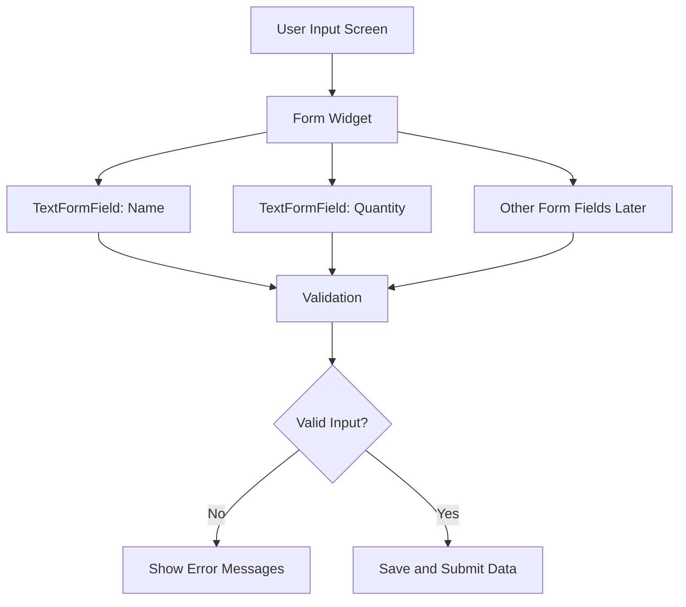
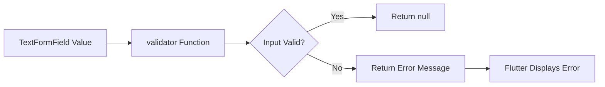
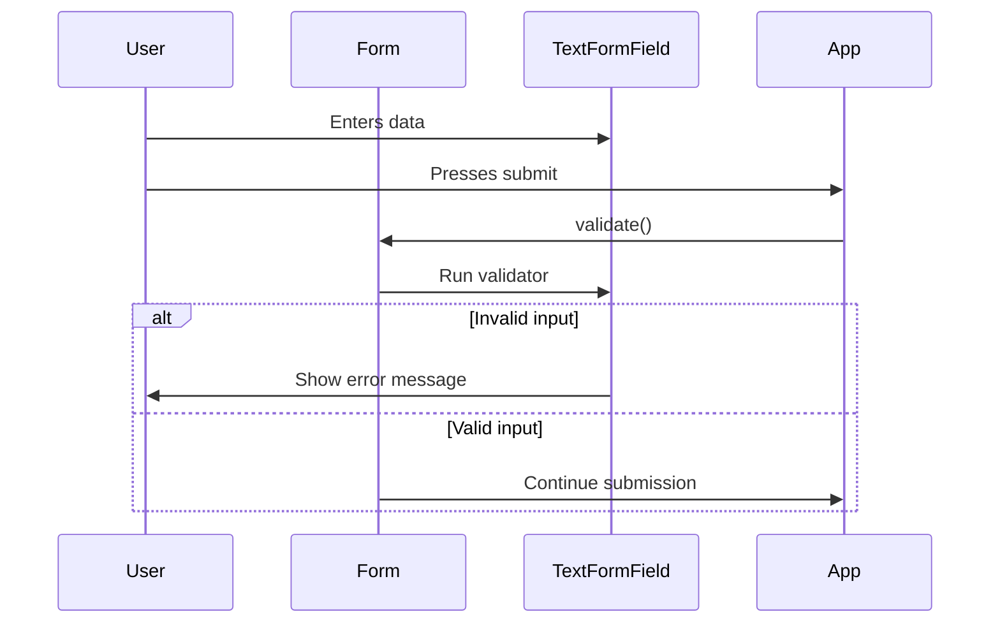
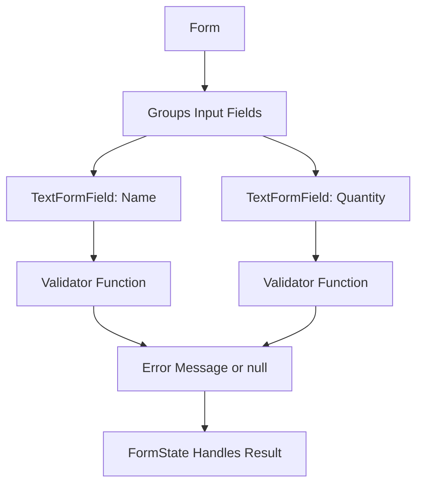

# The Form and TextFormField Widgets

## Overview

In this lecture, we begin building the actual input form for the Shopping List App.

Previously, we created a separate `NewItem` screen and placed a temporary placeholder text inside it. Now, we replace that placeholder with a real Flutter `Form`.

A form is a structured group of input fields. In Flutter, the built-in `Form` widget helps manage those fields together and provides extra features such as validation, saving input values, and displaying error messages.

Even though Flutter apps can collect user input with regular widgets like `TextField`, using `Form` and `TextFormField` makes input handling cleaner and more powerful, especially when multiple fields are involved.

---

## Why Use a Form?

You can build input fields without using a form, but a form gives you useful features for real-world apps.

A `Form` can help you:

* Group multiple input fields together
* Validate all fields at once
* Show validation errors on the screen
* Save entered values
* Reset fields when needed
* Keep input logic more organized



---

## Form vs Normal Input Fields

Before this lecture, you may have used `TextField` to collect user input.

Inside a `Form`, however, you should usually use `TextFormField`.

| Widget          | Purpose                                              |
| --------------- | ---------------------------------------------------- |
| `TextField`     | Basic text input widget                              |
| `TextFormField` | Text input widget designed to work with `Form`       |
| `Form`          | Groups form fields and manages validation/save logic |

`TextFormField` is similar to `TextField`, but it includes extra form-related features such as `validator` and `onSaved`.

---

## Step 1: Replace the Placeholder Text

In `new_item.dart`, replace the temporary text:

```dart id="a88xq2"
child: Text('The form'),
```

with a `Form` widget.

```dart id="jnv4sj"
body: Padding(
  padding: const EdgeInsets.all(12),
  child: Form(
    child: Column(
      children: [
        // Form fields will go here.
      ],
    ),
  ),
),
```

The `Form` itself is not visible. It works as a container that manages its child form fields.

---

## Step 2: Add a Column Inside the Form

A form usually contains multiple fields, so we use a `Column` to place them vertically.

```dart id="d8uuft"
Form(
  child: Column(
    children: [
      // Input fields
    ],
  ),
)
```

The `child` parameter is required because the `Form` needs to know which widgets belong to it.

---

## Step 3: Add a TextFormField

To collect the name of a grocery item, add a `TextFormField`.

```dart id="tkant2"
TextFormField(
  maxLength: 50,
  decoration: const InputDecoration(
    label: Text('Name'),
  ),
),
```

This creates an input field where the user can type the item name.

---

## TextFormField Configuration

A `TextFormField` can be customized with many familiar properties.

| Property       | Purpose                                             |
| -------------- | --------------------------------------------------- |
| `maxLength`    | Limits the number of characters                     |
| `decoration`   | Controls labels, hints, borders, and visual styling |
| `keyboardType` | Controls which keyboard appears                     |
| `initialValue` | Sets the starting value of the field                |
| `validator`    | Defines validation logic                            |
| `onSaved`      | Saves the entered value later                       |

---

## Example: Name Input Field

```dart id="n2m8xs"
TextFormField(
  maxLength: 50,
  decoration: const InputDecoration(
    label: Text('Name'),
  ),
)
```

This field allows the user to enter a grocery item name.

The `maxLength: 50` setting prevents names from becoming too long.

---

## Step 4: Understanding the `validator` Property

One of the most important features of `TextFormField` is the `validator` property.

The `validator` takes a function.

That function receives the current field value and returns:

* A `String` if the input is invalid
* `null` if the input is valid



---

## Basic Validator Example

```dart id="f63z1i"
validator: (value) {
  if (value == null || value.isEmpty) {
    return 'Please enter a name.';
  }

  return null;
},
```

If the user leaves the field empty, the validator returns an error message.

If the input is valid, it returns `null`.

---

## Better Name Validation

For the shopping list app, the item name should not be empty and should not be too short.

```dart id="z5wzgb"
TextFormField(
  maxLength: 50,
  decoration: const InputDecoration(
    label: Text('Name'),
  ),
  validator: (value) {
    if (value == null ||
        value.isEmpty ||
        value.trim().length < 2 ||
        value.trim().length > 50) {
      return 'Must be between 2 and 50 characters.';
    }

    return null;
  },
)
```

The `trim()` method removes unnecessary spaces before checking the length.

---

## Step 5: Add a Quantity Field

A grocery item also needs a quantity.

For quantity input, we can add another `TextFormField`.

```dart id="gto91i"
TextFormField(
  decoration: const InputDecoration(
    label: Text('Quantity'),
  ),
  keyboardType: TextInputType.number,
  initialValue: '1',
)
```

---

## Why Use `keyboardType`?

The quantity should be a number, so we use:

```dart id="k7x5f8"
keyboardType: TextInputType.number,
```

This tells Flutter to show a number-focused keyboard on mobile devices.

It does not automatically validate the input, but it improves the user experience.

---

## Why Use `initialValue`?

The quantity field can start with a default value of `1`.

```dart id="tb4q75"
initialValue: '1',
```

This is useful because most grocery items will likely have at least one item.

---

## Quantity Validation

The quantity should be:

* Not empty
* A valid number
* Greater than zero

```dart id="2qehq4"
validator: (value) {
  if (value == null ||
      value.isEmpty ||
      int.tryParse(value) == null ||
      int.tryParse(value)! <= 0) {
    return 'Must be a valid, positive number.';
  }

  return null;
},
```

`int.tryParse(value)` tries to convert the entered string into an integer.

If conversion fails, it returns `null`.

---

## Complete Form Example

```dart id="eq2nlw"
Form(
  child: Column(
    children: [
      TextFormField(
        maxLength: 50,
        decoration: const InputDecoration(
          label: Text('Name'),
        ),
        validator: (value) {
          if (value == null ||
              value.isEmpty ||
              value.trim().length < 2 ||
              value.trim().length > 50) {
            return 'Must be between 2 and 50 characters.';
          }

          return null;
        },
      ),
      TextFormField(
        decoration: const InputDecoration(
          label: Text('Quantity'),
        ),
        keyboardType: TextInputType.number,
        initialValue: '1',
        validator: (value) {
          if (value == null ||
              value.isEmpty ||
              int.tryParse(value) == null ||
              int.tryParse(value)! <= 0) {
            return 'Must be a valid, positive number.';
          }

          return null;
        },
      ),
    ],
  ),
)
```

---

## Complete `NewItem` Screen Example

```dart id="qghsfl"
import 'package:flutter/material.dart';

class NewItem extends StatefulWidget {
  const NewItem({super.key});

  @override
  State<NewItem> createState() {
    return _NewItemState();
  }
}

class _NewItemState extends State<NewItem> {
  @override
  Widget build(BuildContext context) {
    return Scaffold(
      appBar: AppBar(
        title: const Text('Add a new item'),
      ),
      body: Padding(
        padding: const EdgeInsets.all(12),
        child: Form(
          child: Column(
            children: [
              TextFormField(
                maxLength: 50,
                decoration: const InputDecoration(
                  label: Text('Name'),
                ),
                validator: (value) {
                  if (value == null ||
                      value.isEmpty ||
                      value.trim().length < 2 ||
                      value.trim().length > 50) {
                    return 'Must be between 2 and 50 characters.';
                  }

                  return null;
                },
              ),
              TextFormField(
                decoration: const InputDecoration(
                  label: Text('Quantity'),
                ),
                keyboardType: TextInputType.number,
                initialValue: '1',
                validator: (value) {
                  if (value == null ||
                      value.isEmpty ||
                      int.tryParse(value) == null ||
                      int.tryParse(value)! <= 0) {
                    return 'Must be a valid, positive number.';
                  }

                  return null;
                },
              ),
            ],
          ),
        ),
      ),
    );
  }
}
```

---

## Important Note: Validation Is Not Triggered Yet

Adding a `validator` function does not automatically validate the form immediately.

The validator runs when the form is told to validate.

Later, we will use a `GlobalKey<FormState>` to access the form state and trigger validation manually.

Conceptually, the flow will look like this:



---

## How Form and TextFormField Work Together



The `Form` manages the fields.

Each `TextFormField` defines its own validation rules.

Together, they provide structured input handling.

---

## What We Achieved

By the end of this lecture, we have:

* Replaced the placeholder text with a `Form`
* Added a `Column` inside the form
* Added a `TextFormField` for the item name
* Added a `TextFormField` for the quantity
* Used `maxLength` to limit the name field
* Used `InputDecoration` to label fields
* Used `keyboardType` for numeric input
* Introduced the `validator` property
* Prepared the screen for real form validation and submission

---

## Key Points

* `Form` is used to group multiple form fields.
* `TextFormField` should be used instead of `TextField` inside a `Form`.
* `TextFormField` supports form-specific features like validation.
* The `validator` function returns an error message if input is invalid.
* The `validator` function returns `null` if input is valid.
* `maxLength` limits text input length.
* `InputDecoration` controls labels and field appearance.
* `TextInputType.number` shows a number keyboard on mobile devices.
* The form is not fully functional yet because validation still needs to be triggered manually.

---

## Common Mistakes

### 1. Using `TextField` Instead of `TextFormField`

A regular `TextField` can collect input, but it does not integrate with `Form` in the same way.

Prefer this inside a form:

```dart id="i5s5zb"
TextFormField()
```

---

### 2. Forgetting the `child` Parameter on `Form`

The `Form` widget requires a child.

Incorrect:

```dart id="g1ahkp"
Form()
```

Correct:

```dart id="o2rxbr"
Form(
  child: Column(
    children: [],
  ),
)
```

---

### 3. Returning an Error Message for Valid Input

The validator must return `null` when the input is valid.

Incorrect:

```dart id="drvu76"
validator: (value) {
  return 'Looks good!';
}
```

Correct:

```dart id="71l527"
validator: (value) {
  return null;
}
```

---

### 4. Forgetting That Text Input Is a String

Even numeric fields produce text values.

That means the quantity must be parsed:

```dart id="np08lm"
int.tryParse(value)
```

---

### 5. Expecting Validation to Run Automatically

The validator function does not run just because it exists.

The form must be validated later using form state, usually through:

```dart id="hafh9a"
_formKey.currentState!.validate()
```

This will be introduced in the next steps.

---

## Summary

This lecture introduces Flutter’s `Form` and `TextFormField` widgets.

The `Form` widget groups input fields and enables form-level features such as validation and saving. `TextFormField` is the form-aware version of `TextField`, making it the preferred choice inside a `Form`.

We added a basic form to the `NewItem` screen with fields for the grocery item name and quantity. We also introduced validators, which will later allow the app to check user input and display helpful error messages.

The next step is to trigger validation and handle form submission.
