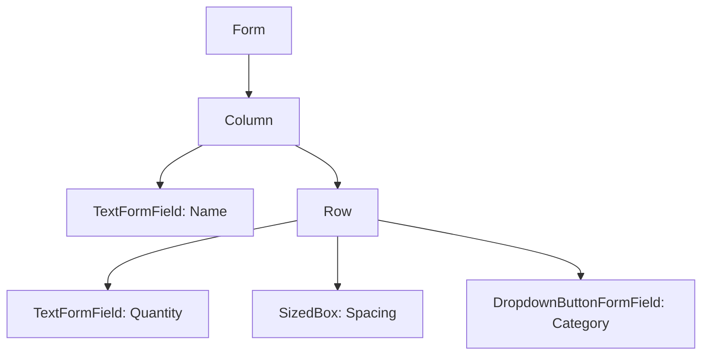
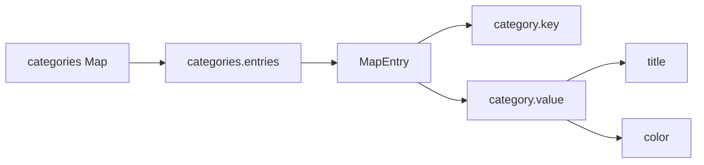
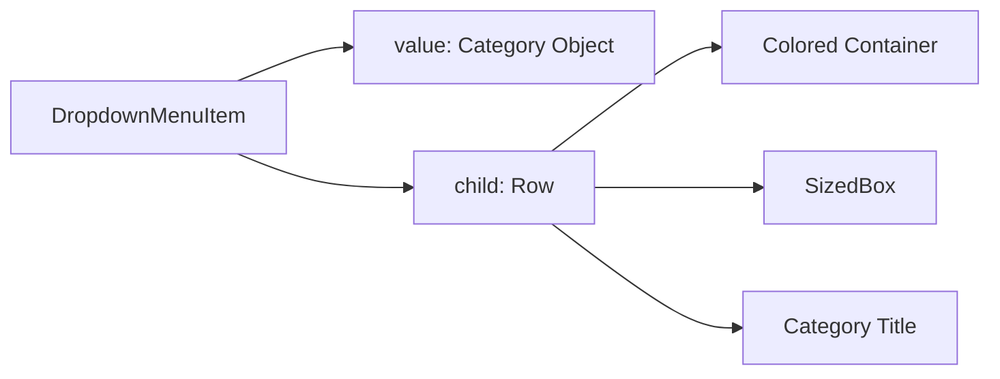
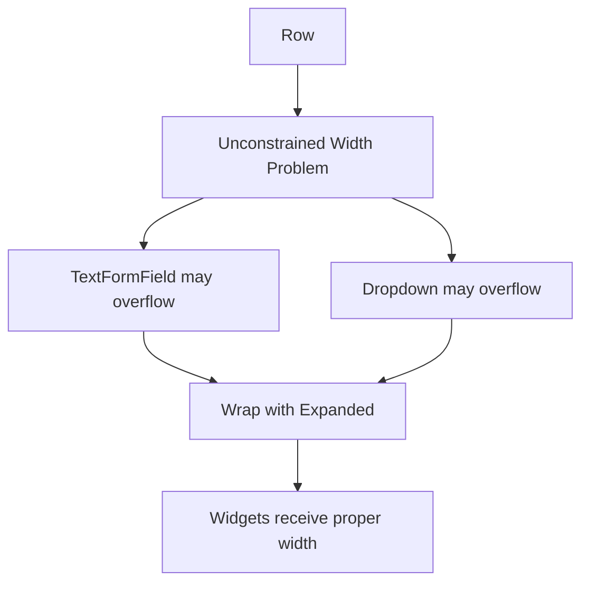
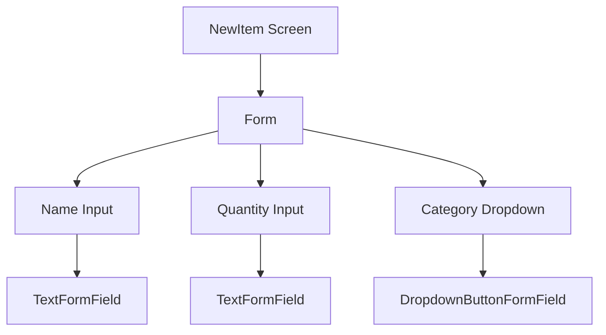
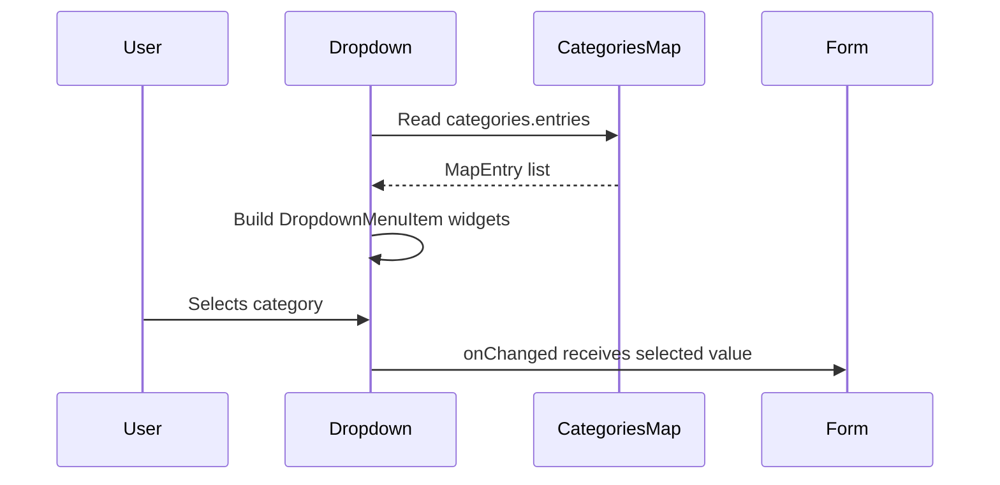

# A Form-aware Dropdown Button

## Overview

In this lecture, we continue building the form on the `NewItem` screen.

Previously, we added a `Form` widget and a `TextFormField` for entering the grocery item name. Now, we add two more inputs:

* A quantity input field
* A category dropdown selector

Because these widgets are inside a `Form`, we use the form-aware version of the dropdown widget: `DropdownButtonFormField`.

`DropdownButtonFormField` works similarly to a normal `DropdownButton`, but it also integrates with Flutter’s form system. This means it can later participate in validation, saving, and resetting together with the other form fields.

---

## What We Are Building

The form will contain:

```txt
Name input field

Quantity input field        Category dropdown
```

The quantity field and the category dropdown are placed next to each other in a horizontal `Row`.



---

## Why Use `DropdownButtonFormField`?

Flutter has a normal `DropdownButton`, but when working inside a `Form`, it is better to use `DropdownButtonFormField`.

| Widget                    | Use Case                                  |
| ------------------------- | ----------------------------------------- |
| `DropdownButton`          | Normal dropdown outside a form            |
| `DropdownButtonFormField` | Dropdown designed to work inside a `Form` |

`DropdownButtonFormField` supports form-related features such as:

* `validator`
* `onSaved`
* form reset behavior
* integration with `FormState`

This keeps all form inputs under the same form system.

---

## Step 1: Add a Row Below the Name Field

Inside the `Column`, after the name `TextFormField`, add a `Row`.

The row will contain the quantity field and the category dropdown.

```dart
Row(
  children: [
    // Quantity input
    // Spacing
    // Category dropdown
  ],
)
```

A `Row` is used because these two inputs should appear horizontally next to each other.

---

## Step 2: Add the Quantity `TextFormField`

The quantity field is another `TextFormField`.

```dart
TextFormField(
  decoration: const InputDecoration(
    label: Text('Quantity'),
  ),
  initialValue: '1',
)
```

The `initialValue` is set to `'1'`.

This is important: even though the quantity represents a number, text input values are handled as strings.

So this is correct:

```dart
initialValue: '1'
```

This would be incorrect:

```dart
initialValue: 1
```

---

## Step 3: Add Spacing Between the Inputs

To add horizontal spacing between the quantity field and the dropdown, use `SizedBox`.

```dart
const SizedBox(width: 8),
```

This creates an empty space of 8 pixels between the two widgets.

---

## Step 4: Add `DropdownButtonFormField`

Next, add the form-aware dropdown.

```dart
DropdownButtonFormField(
  items: [],
  onChanged: (value) {},
)
```

Like a normal dropdown, it needs:

* `items`: the list of selectable options
* `onChanged`: a function that runs when the selected value changes

---

## Step 5: Import the Categories Data

The category dropdown should display the available grocery categories.

Those categories come from the `categories.dart` file.

```dart
import 'package:shopping_list/data/categories.dart';
```

This gives access to the `categories` map.

---

## Understanding the Categories Map

The `categories` variable is a map.

Conceptually, it looks like this:

```dart
const categories = {
  Categories.vegetables: Category('Vegetables', Colors.green),
  Categories.fruit: Category('Fruit', Colors.orange),
  Categories.meat: Category('Meat', Colors.red),
};
```

A map stores key-value pairs.

In this app:

| Map Part | Example                                |
| -------- | -------------------------------------- |
| Key      | `Categories.vegetables`                |
| Value    | `Category('Vegetables', Colors.green)` |

The dropdown should display the map values because those values contain the category title and color.

---

## Step 6: Loop Through Map Entries

You cannot directly loop through a map like a list.

Instead, use `.entries`.

```dart
for (final category in categories.entries)
```

Each `category` is a map entry with:

* `category.key`
* `category.value`

In this lecture, we use `category.value`, because it gives us the actual `Category` object.



---

## Step 7: Create Dropdown Menu Items

Each dropdown option is created with `DropdownMenuItem`.

```dart
DropdownMenuItem(
  value: category.value,
  child: Text(category.value.title),
)
```

The `value` is what the dropdown returns when the user selects that item.

Here, the selected value will be the full `Category` object.

---

## Step 8: Display Color and Title in Each Dropdown Item

To make the dropdown more visual, each item can show:

* A small colored square
* The category title

```dart
DropdownMenuItem(
  value: category.value,
  child: Row(
    children: [
      Container(
        width: 16,
        height: 16,
        color: category.value.color,
      ),
      const SizedBox(width: 6),
      Text(category.value.title),
    ],
  ),
)
```

This creates a richer dropdown UI.

---

## Dropdown Item Structure



---

## Step 9: Fix Row Layout With `Expanded`

A common issue occurs when using input fields inside a `Row`.

Both `TextFormField` and `DropdownButtonFormField` need horizontal constraints. A `Row` does not automatically give them fixed widths.

If you place them directly inside a row, you may get a rendering error.

To fix this, wrap each flexible input widget with `Expanded`.

```dart
Expanded(
  child: TextFormField(
    decoration: const InputDecoration(
      label: Text('Quantity'),
    ),
    initialValue: '1',
  ),
),
```

And also wrap the dropdown:

```dart
Expanded(
  child: DropdownButtonFormField(
    items: [],
    onChanged: (value) {},
  ),
),
```

---

## Why `Expanded` Is Needed

A `Row` lays out its children horizontally.

Some widgets, such as text fields and dropdown fields, need clear width constraints. `Expanded` tells them to take available horizontal space.



---

## Step 10: Align the Inputs

To align the quantity field and dropdown neatly, set the row’s `crossAxisAlignment`.

```dart
crossAxisAlignment: CrossAxisAlignment.end,
```

This aligns the widgets toward the bottom of the row.

```dart
Row(
  crossAxisAlignment: CrossAxisAlignment.end,
  children: [
    // fields
  ],
)
```

---

## Complete Row Example

```dart
Row(
  crossAxisAlignment: CrossAxisAlignment.end,
  children: [
    Expanded(
      child: TextFormField(
        decoration: const InputDecoration(
          label: Text('Quantity'),
        ),
        initialValue: '1',
      ),
    ),
    const SizedBox(width: 8),
    Expanded(
      child: DropdownButtonFormField(
        items: [
          for (final category in categories.entries)
            DropdownMenuItem(
              value: category.value,
              child: Row(
                children: [
                  Container(
                    width: 16,
                    height: 16,
                    color: category.value.color,
                  ),
                  const SizedBox(width: 6),
                  Text(category.value.title),
                ],
              ),
            ),
        ],
        onChanged: (value) {},
      ),
    ),
  ],
)
```

---

## Complete `NewItem` Form Example

```dart
import 'package:flutter/material.dart';

import 'package:shopping_list/data/categories.dart';

class NewItem extends StatefulWidget {
  const NewItem({super.key});

  @override
  State<NewItem> createState() {
    return _NewItemState();
  }
}

class _NewItemState extends State<NewItem> {
  @override
  Widget build(BuildContext context) {
    return Scaffold(
      appBar: AppBar(
        title: const Text('Add a new item'),
      ),
      body: Padding(
        padding: const EdgeInsets.all(12),
        child: Form(
          child: Column(
            children: [
              TextFormField(
                maxLength: 50,
                decoration: const InputDecoration(
                  label: Text('Name'),
                ),
              ),
              Row(
                crossAxisAlignment: CrossAxisAlignment.end,
                children: [
                  Expanded(
                    child: TextFormField(
                      decoration: const InputDecoration(
                        label: Text('Quantity'),
                      ),
                      initialValue: '1',
                    ),
                  ),
                  const SizedBox(width: 8),
                  Expanded(
                    child: DropdownButtonFormField(
                      items: [
                        for (final category in categories.entries)
                          DropdownMenuItem(
                            value: category.value,
                            child: Row(
                              children: [
                                Container(
                                  width: 16,
                                  height: 16,
                                  color: category.value.color,
                                ),
                                const SizedBox(width: 6),
                                Text(category.value.title),
                              ],
                            ),
                          ),
                      ],
                      onChanged: (value) {},
                    ),
                  ),
                ],
              ),
            ],
          ),
        ),
      ),
    );
  }
}
```

---

## Optional: Store the Selected Category

In the lecture, the dropdown is added first with an empty `onChanged` function.

Later, you may want to store the selected category in state.

Example:

```dart
var _selectedCategory = categories[Categories.vegetables]!;
```

Then use it as the dropdown value:

```dart
DropdownButtonFormField(
  value: _selectedCategory,
  items: [
    for (final category in categories.entries)
      DropdownMenuItem(
        value: category.value,
        child: Row(
          children: [
            Container(
              width: 16,
              height: 16,
              color: category.value.color,
            ),
            const SizedBox(width: 6),
            Text(category.value.title),
          ],
        ),
      ),
  ],
  onChanged: (value) {
    setState(() {
      _selectedCategory = value!;
    });
  },
)
```

This ensures that a category is selected and updated when the user picks a different option.

---

## Form Input Structure So Far

The form now has three main pieces of input:

| Input     | Widget                    |
| --------- | ------------------------- |
| Item name | `TextFormField`           |
| Quantity  | `TextFormField`           |
| Category  | `DropdownButtonFormField` |



---

## How the Dropdown Works



---

## What We Achieved

By the end of this lecture, we have:

* Added a `Row` inside the form
* Added a quantity `TextFormField`
* Added an initial quantity value of `'1'`
* Added a `DropdownButtonFormField`
* Built dropdown items from the `categories` map
* Used `.entries` to loop through map key-value pairs
* Displayed category colors and titles in the dropdown
* Used `Expanded` to fix row layout constraints
* Used `SizedBox` to add spacing between widgets
* Aligned the row with `CrossAxisAlignment.end`

---

## Key Points

* `DropdownButtonFormField` is the form-aware version of `DropdownButton`.
* It should be used when the dropdown is part of a `Form`.
* The `categories` data is a map, so `.entries` is used to loop through it.
* Each map entry has a `key` and a `value`.
* The dropdown item value can be the full category object.
* `DropdownMenuItem` is still used inside `DropdownButtonFormField`.
* `Expanded` is needed when placing form fields inside a `Row`.
* `initialValue` for `TextFormField` must be a string.
* Text input always produces strings, even for numeric input.

---

## Common Mistakes

### 1. Using `DropdownButton` Instead of `DropdownButtonFormField`

Inside a form, prefer:

```dart
DropdownButtonFormField()
```

instead of:

```dart
DropdownButton()
```

---

### 2. Looping Through a Map Incorrectly

Incorrect:

```dart
for (final category in categories)
```

Correct:

```dart
for (final category in categories.entries)
```

---

### 3. Forgetting `Expanded` Inside a Row

Text fields and dropdowns inside a row need width constraints.

Correct:

```dart
Expanded(
  child: TextFormField(),
)
```

---

### 4. Passing a Number to `initialValue`

Incorrect:

```dart
initialValue: 1
```

Correct:

```dart
initialValue: '1'
```

---

### 5. Forgetting That `DropdownMenuItem` Needs a Value

The `value` tells Flutter what should be passed to `onChanged`.

```dart
DropdownMenuItem(
  value: category.value,
  child: Text(category.value.title),
)
```

---

## Summary

This lecture adds a category selector to the `NewItem` form using `DropdownButtonFormField`.

We placed the quantity field and dropdown next to each other in a `Row`, fixed layout issues with `Expanded`, and built dropdown options dynamically from the `categories` map.

The form now contains the main inputs needed to create a grocery item: name, quantity, and category. The next step is to add buttons for submitting or resetting the form, and then connect the form to validation and saving logic.
