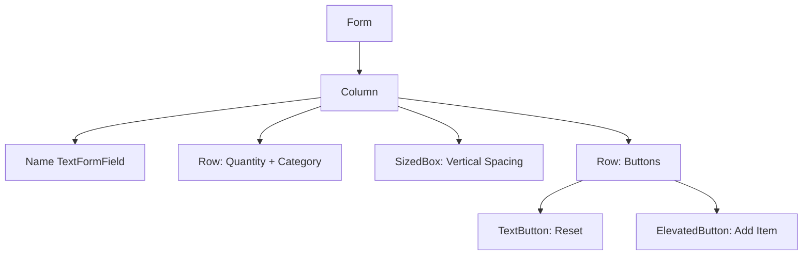
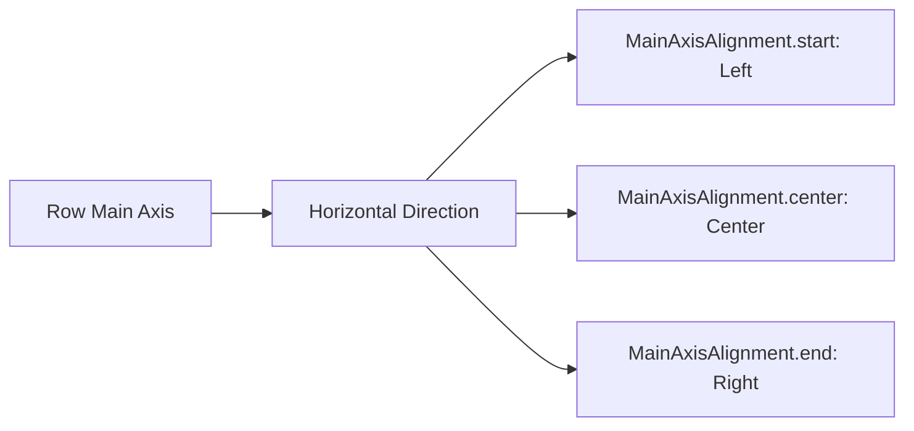
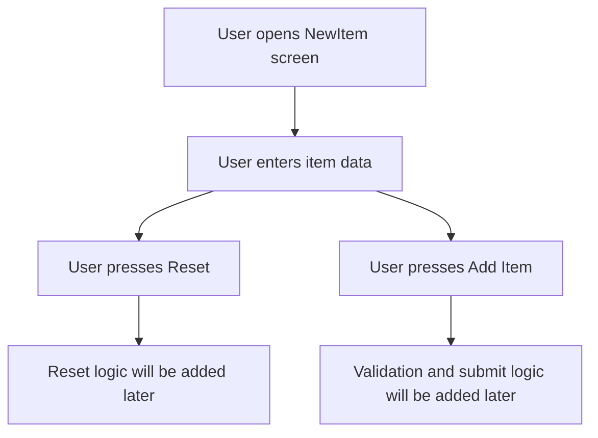
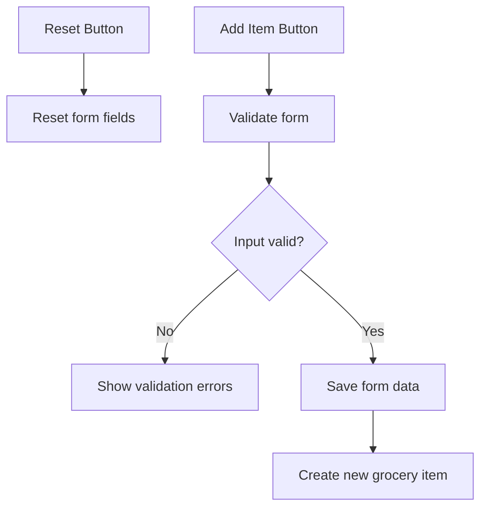

# Adding Buttons to a Form

## Overview

In this lecture, we finish the basic UI of the `NewItem` form screen by adding action buttons.

So far, the form contains input fields for:

* The grocery item name
* The item quantity
* The item category

Now we add two buttons at the bottom of the form:

* A **Reset** button
* An **Add Item** button

At this stage, the buttons do not perform their final logic yet. They are added to complete the form layout first. In the next steps, these buttons will be connected to form validation, resetting, and submission logic.

---

## What We Are Adding

The final form structure will look like this:

```txt
Name input field

Quantity input field        Category dropdown

                         Reset    Add Item
```

The buttons are placed at the bottom of the form and aligned to the right.



---

## Why Forms Need Buttons

A form usually needs actions that allow the user to control what happens to the entered data.

Common form actions include:

| Button          | Purpose                                |
| --------------- | -------------------------------------- |
| Reset           | Clears or resets the entered form data |
| Cancel          | Closes the form without saving         |
| Save / Add Item | Validates and submits the form         |

In this lecture, we add a **Reset** button and an **Add Item** button.

---

## Step 1: Add a New Row Below the Inputs

Inside the `Column`, after the row that contains the quantity field and category dropdown, add another `Row`.

This new row will contain the buttons.

```dart
Row(
  children: [
    // Reset button
    // Add Item button
  ],
)
```

---

## Step 2: Add a TextButton for Reset

The reset action is a secondary action, so a `TextButton` is a good choice.

```dart
TextButton(
  onPressed: () {},
  child: const Text('Reset'),
),
```

For now, the `onPressed` function is empty.

Later, this button will be connected to the form reset logic.

---

## Step 3: Add an ElevatedButton for Submit

The submit action is the main action of the form, so we use an `ElevatedButton`.

```dart
ElevatedButton(
  onPressed: () {},
  child: const Text('Add Item'),
),
```

For now, this button also has an empty `onPressed` function.

Later, it will validate the form, extract the entered data, and add a new grocery item.

---

## Button Types

Flutter provides several button widgets.

For this form, we use:

| Button Widget    | Best Used For                       |
| ---------------- | ----------------------------------- |
| `TextButton`     | Secondary or less important actions |
| `ElevatedButton` | Primary or important actions        |

In this case:

```txt
Reset      -> TextButton
Add Item   -> ElevatedButton
```

This creates a clear visual difference between the two actions.

---

## Step 4: Align the Buttons to the Right

By default, a `Row` places its children at the start of the horizontal axis.

To push the buttons to the right side, set `mainAxisAlignment` to `MainAxisAlignment.end`.

```dart
Row(
  mainAxisAlignment: MainAxisAlignment.end,
  children: [
    TextButton(
      onPressed: () {},
      child: const Text('Reset'),
    ),
    ElevatedButton(
      onPressed: () {},
      child: const Text('Add Item'),
    ),
  ],
)
```

---

## Understanding `MainAxisAlignment.end`

For a `Row`, the main axis is horizontal.

So `MainAxisAlignment.end` moves the row’s children to the right side.



---

## Step 5: Add Vertical Spacing

The button row should not be too close to the input row above it.

Add a `SizedBox` before the button row.

```dart
const SizedBox(height: 12),
```

This creates vertical spacing between the inputs and the buttons.

---

## Complete Button Section

```dart
const SizedBox(height: 12),
Row(
  mainAxisAlignment: MainAxisAlignment.end,
  children: [
    TextButton(
      onPressed: () {},
      child: const Text('Reset'),
    ),
    ElevatedButton(
      onPressed: () {},
      child: const Text('Add Item'),
    ),
  ],
),
```

---

## Complete Form Example

```dart
import 'package:flutter/material.dart';

import 'package:shopping_list/data/categories.dart';

class NewItem extends StatefulWidget {
  const NewItem({super.key});

  @override
  State<NewItem> createState() {
    return _NewItemState();
  }
}

class _NewItemState extends State<NewItem> {
  @override
  Widget build(BuildContext context) {
    return Scaffold(
      appBar: AppBar(
        title: const Text('Add a new item'),
      ),
      body: Padding(
        padding: const EdgeInsets.all(12),
        child: Form(
          child: Column(
            children: [
              TextFormField(
                maxLength: 50,
                decoration: const InputDecoration(
                  label: Text('Name'),
                ),
              ),
              Row(
                crossAxisAlignment: CrossAxisAlignment.end,
                children: [
                  Expanded(
                    child: TextFormField(
                      decoration: const InputDecoration(
                        label: Text('Quantity'),
                      ),
                      initialValue: '1',
                    ),
                  ),
                  const SizedBox(width: 8),
                  Expanded(
                    child: DropdownButtonFormField(
                      items: [
                        for (final category in categories.entries)
                          DropdownMenuItem(
                            value: category.value,
                            child: Row(
                              children: [
                                Container(
                                  width: 16,
                                  height: 16,
                                  color: category.value.color,
                                ),
                                const SizedBox(width: 6),
                                Text(category.value.title),
                              ],
                            ),
                          ),
                      ],
                      onChanged: (value) {},
                    ),
                  ),
                ],
              ),
              const SizedBox(height: 12),
              Row(
                mainAxisAlignment: MainAxisAlignment.end,
                children: [
                  TextButton(
                    onPressed: () {},
                    child: const Text('Reset'),
                  ),
                  ElevatedButton(
                    onPressed: () {},
                    child: const Text('Add Item'),
                  ),
                ],
              ),
            ],
          ),
        ),
      ),
    );
  }
}
```

---

## Current Form Flow

At this point, the form UI is complete, but the buttons do not yet perform the final logic.



---

## Future Button Behavior

Later, the buttons will be connected to real form actions.



---

## What We Achieved

By the end of this lecture, we have:

* Added a button row below the form inputs
* Added a `TextButton` for resetting the form
* Added an `ElevatedButton` for adding the item
* Used `MainAxisAlignment.end` to align the buttons to the right
* Added vertical spacing with `SizedBox`
* Completed the basic form UI layout

---

## Key Points

* Forms usually need action buttons.
* `TextButton` is useful for secondary actions.
* `ElevatedButton` is useful for primary actions.
* A `Row` can place multiple buttons next to each other.
* `MainAxisAlignment.end` pushes row children to the right.
* `SizedBox` can add spacing between form sections.
* At this stage, the buttons are only part of the UI.
* The next step is to connect the buttons to validation, resetting, and submission logic.

---

## Common Mistakes

### 1. Forgetting `onPressed`

Buttons need an `onPressed` function to be enabled.

Incorrect:

```dart
TextButton(
  child: const Text('Reset'),
)
```

Correct:

```dart
TextButton(
  onPressed: () {},
  child: const Text('Reset'),
)
```

---

### 2. Using the Same Button Style for Every Action

The main action should usually stand out more.

Better:

```txt
Reset      -> TextButton
Add Item   -> ElevatedButton
```

---

### 3. Forgetting Spacing

Without spacing, the buttons may look too close to the input fields.

Use:

```dart
const SizedBox(height: 12),
```

---

### 4. Forgetting Button Alignment

Without `mainAxisAlignment`, the buttons may stay on the left.

Use:

```dart
mainAxisAlignment: MainAxisAlignment.end,
```

---

## Summary

This lecture completes the basic visual layout of the `NewItem` form screen.

We added a `TextButton` for resetting the form and an `ElevatedButton` for adding a new item. The buttons are placed in a `Row`, aligned to the right, and separated from the input fields with vertical spacing.

The form now looks complete from a UI perspective. The next step is to make the buttons functional by adding form validation and submission logic.
