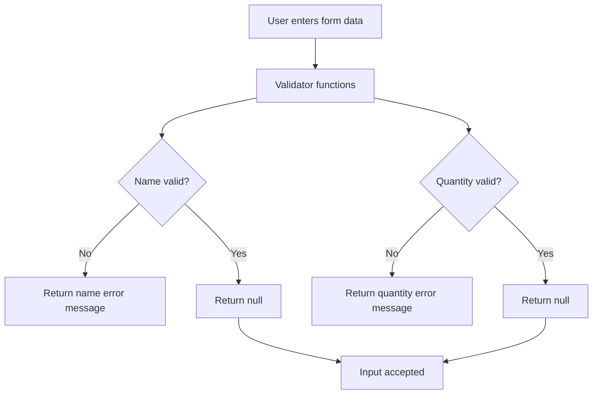
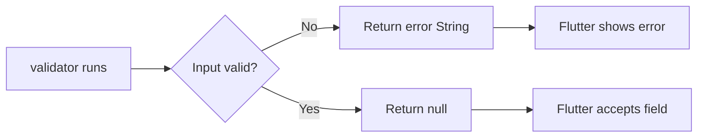
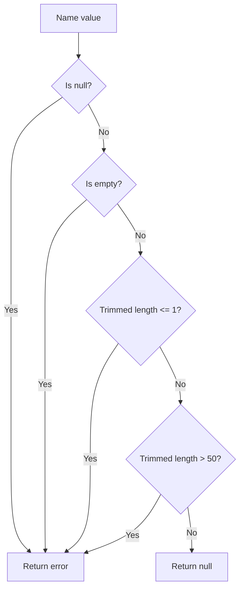
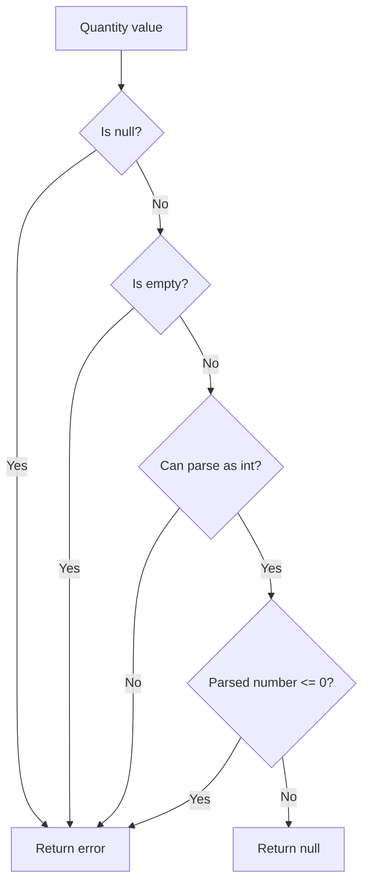
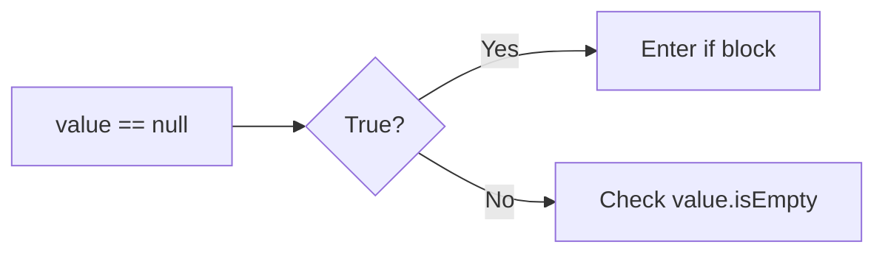
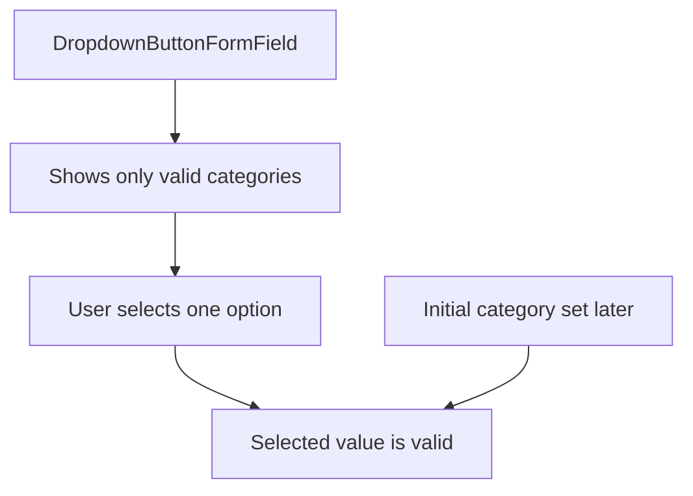
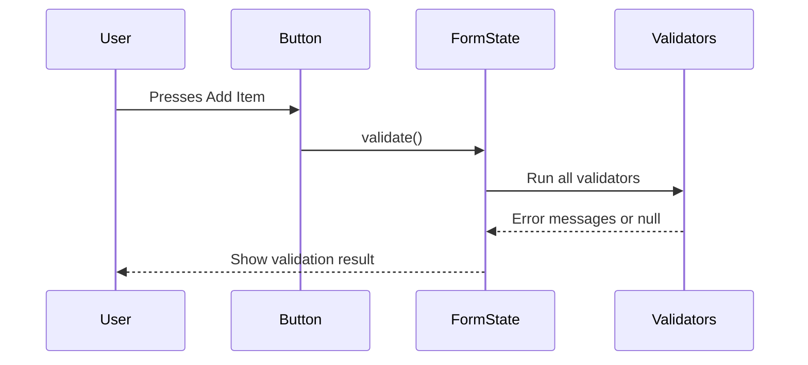

# Adding Validation Logic

## Overview

In this lecture, we add validation logic to the form fields in the `NewItem` screen.

Previously, we created the form UI with inputs for:

* Item name
* Quantity
* Category

Now we need to make sure the user enters valid data before the item can be submitted.

Flutter forms support validation through the `validator` property. A validator is a function that checks the current input value and returns either:

* An error message if the input is invalid
* `null` if the input is valid

At this point, we only define the validation rules. The validation will not run automatically yet. In the next step, we will trigger validation when the user presses the **Add Item** button.

---

## What Validation Does

Validation checks whether the user input is acceptable.

For example:

| Field    | Validation Rule                     |
| -------- | ----------------------------------- |
| Name     | Must not be empty                   |
| Name     | Must be between 2 and 50 characters |
| Quantity | Must not be empty                   |
| Quantity | Must be a valid number              |
| Quantity | Must be greater than 0              |
| Category | Should have a valid selected value  |



---

## The Validator Function

A validator receives the current value of a form field.

The value type is usually:

```dart id="validator-type"
String?
```

That means the value can either be a `String` or `null`.

The validator must return:

```dart id="validator-return-type"
String?
```

This means it can return either:

* A `String` error message
* `null`

```dart id="validator-basic-shape"
validator: (value) {
  if (/* input is invalid */) {
    return 'Error message';
  }

  return null;
},
```

---

## Validator Return Rules

| Return Value | Meaning                                   |
| ------------ | ----------------------------------------- |
| `String`     | Input is invalid, show this error message |
| `null`       | Input is valid                            |



---

## Step 1: Validate the Name Field

The name field should not accept invalid item names.

A valid name should:

* Not be `null`
* Not be empty
* Not be only whitespace
* Have at least 2 characters
* Have no more than 50 characters

---

## Name Field Validator

```dart id="name-validator"
TextFormField(
  maxLength: 50,
  decoration: const InputDecoration(
    label: Text('Name'),
  ),
  validator: (value) {
    if (value == null ||
        value.isEmpty ||
        value.trim().length <= 1 ||
        value.trim().length > 50) {
      return 'Must be between 2 and 50 characters.';
    }

    return null;
  },
)
```

---

## Why Check for `null`?

The validator receives a nullable value.

That means this value could be `null`:

```dart id="nullable-value"
validator: (value) {
  // value is String?
}
```

So before using string properties or methods, we should check whether it is `null`.

```dart id="null-check"
if (value == null) {
  return 'Please enter a value.';
}
```

---

## Why Use `trim()`?

The `trim()` method removes extra whitespace at the beginning and end of a string.

Example:

```txt id="trim-example"
"   a   "  ->  "a"
"       "  ->  ""
```

This prevents users from entering only spaces and passing validation.

```dart id="trim-validation"
value.trim().length <= 1
```

---

## Name Validation Logic



---

## Step 2: Validate the Quantity Field

The quantity field should only accept valid positive whole numbers.

A valid quantity should:

* Not be `null`
* Not be empty
* Be convertible to an integer
* Be greater than 0

---

## Quantity Field Validator

```dart id="quantity-validator"
TextFormField(
  decoration: const InputDecoration(
    label: Text('Quantity'),
  ),
  initialValue: '1',
  keyboardType: TextInputType.number,
  validator: (value) {
    if (value == null ||
        value.isEmpty ||
        int.tryParse(value) == null ||
        int.tryParse(value)! <= 0) {
      return 'Must be a valid, positive number.';
    }

    return null;
  },
)
```

---

## Why Use `int.tryParse()`?

User input from a text field is always a string.

Even when the user enters a number, the value is still text.

Example:

```txt id="text-input-number"
"1"
"25"
"abc"
```

To treat the input as a number, we need to parse it.

```dart id="tryparse-example"
int.tryParse(value)
```

`int.tryParse()` is safer than `int.parse()` because it does not throw an error if parsing fails.

| Input   | Result |
| ------- | ------ |
| `"5"`   | `5`    |
| `"0"`   | `0`    |
| `"-3"`  | `-3`   |
| `"abc"` | `null` |
| `"1.5"` | `null` |

---

## Quantity Validation Logic



---

## Understanding the `!` Operator

In this condition:

```dart id="bang-operator"
int.tryParse(value)! <= 0
```

The `!` tells Dart:

```txt id="bang-explanation"
I know this value is not null here.
```

This is used because the previous condition already checked:

```dart id="previous-tryparse-check"
int.tryParse(value) == null
```

If parsing had failed, Dart would already have entered the error block because of the previous condition.

So by the time the last condition runs, the parsed value should not be null.

---

## Why the `or` Operator Works Here

The validator uses the logical OR operator:

```dart id="or-operator"
||
```

This means only one condition needs to be true for the entire `if` statement to run.

Example:

```dart id="or-example"
if (value == null || value.isEmpty) {
  return 'Invalid input';
}
```

If `value == null` is true, Dart does not continue checking `value.isEmpty`.

This is important because calling `.isEmpty` on `null` would cause an error.



This behavior is called short-circuit evaluation.

---

## Step 3: Category Validation

The category dropdown could also have a validator.

However, in this app, category validation is not necessary if we always provide a valid initial selected category.

Why?

Because:

* The dropdown only shows valid categories
* The user can only choose from valid options
* An initial value will be selected later
* Therefore, the selected category should always be valid



---

## Important: Validation Does Not Run Automatically Yet

Adding validators does not immediately show error messages.

For example, if the user enters an invalid value and presses **Add Item**, nothing happens yet unless we explicitly trigger form validation.

The validator functions only run when Flutter is told to validate the form.

Later, this will be done with:

```dart id="validate-call"
_formKey.currentState!.validate()
```

Conceptually, the flow will be:



---

## Complete Form Fields With Validation

```dart id="complete-form-validation"
Form(
  child: Column(
    children: [
      TextFormField(
        maxLength: 50,
        decoration: const InputDecoration(
          label: Text('Name'),
        ),
        validator: (value) {
          if (value == null ||
              value.isEmpty ||
              value.trim().length <= 1 ||
              value.trim().length > 50) {
            return 'Must be between 2 and 50 characters.';
          }

          return null;
        },
      ),
      Row(
        crossAxisAlignment: CrossAxisAlignment.end,
        children: [
          Expanded(
            child: TextFormField(
              decoration: const InputDecoration(
                label: Text('Quantity'),
              ),
              initialValue: '1',
              keyboardType: TextInputType.number,
              validator: (value) {
                if (value == null ||
                    value.isEmpty ||
                    int.tryParse(value) == null ||
                    int.tryParse(value)! <= 0) {
                  return 'Must be a valid, positive number.';
                }

                return null;
              },
            ),
          ),
          const SizedBox(width: 8),
          Expanded(
            child: DropdownButtonFormField(
              items: [
                for (final category in categories.entries)
                  DropdownMenuItem(
                    value: category.value,
                    child: Row(
                      children: [
                        Container(
                          width: 16,
                          height: 16,
                          color: category.value.color,
                        ),
                        const SizedBox(width: 6),
                        Text(category.value.title),
                      ],
                    ),
                  ),
              ],
              onChanged: (value) {},
            ),
          ),
        ],
      ),
    ],
  ),
)
```

---

## What We Achieved

By the end of this lecture, we have:

* Added validation logic to the name field
* Checked for null and empty name input
* Checked name length after trimming whitespace
* Added validation logic to the quantity field
* Checked for null and empty quantity input
* Used `int.tryParse()` to safely parse numeric input
* Checked that the quantity is greater than zero
* Learned that validators return an error string or `null`
* Learned that validation must still be triggered manually later

---

## Key Points

* `validator` is used to define validation logic for a form field.
* The validator receives the current field value.
* The value is nullable, so it should be checked for `null`.
* Returning a string means validation failed.
* Returning `null` means validation succeeded.
* `trim()` helps avoid accepting whitespace-only input.
* `int.tryParse()` safely checks whether text can be converted into an integer.
* Validators do not run automatically just because they exist.
* Form validation will be triggered later through the form state.

---

## Common Mistakes

### 1. Forgetting to Return `null` for Valid Input

Incorrect:

```dart id="missing-null-return"
validator: (value) {
  if (value == null || value.isEmpty) {
    return 'Please enter a name.';
  }
},
```

Correct:

```dart id="correct-null-return"
validator: (value) {
  if (value == null || value.isEmpty) {
    return 'Please enter a name.';
  }

  return null;
},
```

---

### 2. Using `int.parse()` Instead of `int.tryParse()`

`int.parse()` can throw an exception if the input is invalid.

Risky:

```dart id="risky-int-parse"
int.parse(value)
```

Safer:

```dart id="safe-int-parse"
int.tryParse(value)
```

---

### 3. Not Checking for `null`

The validator value is nullable.

Incorrect:

```dart id="no-null-check"
if (value.isEmpty) {
  return 'Invalid input';
}
```

Correct:

```dart id="with-null-check"
if (value == null || value.isEmpty) {
  return 'Invalid input';
}
```

---

### 4. Accepting Whitespace as Valid Input

Without `trim()`, this might pass some checks:

```txt id="spaces-only"
"     "
```

Use:

```dart id="use-trim"
value.trim().isEmpty
```

or length checks after trimming.

---

### 5. Expecting Error Messages to Show Immediately

Validators only define the rules.

They do not run until the form is validated.

```dart id="validation-trigger-preview"
_formKey.currentState!.validate()
```

---

## Summary

This lecture adds validation rules to the `NewItem` form.

The name field now checks whether the input is missing, too short, or too long. The quantity field checks whether the input is missing, not a valid integer, or less than or equal to zero.

The important rule is that validators return an error message when input is invalid and `null` when input is valid.

The form now knows how to validate user input, but the validation is not triggered yet. The next step is to connect the **Add Item** button to the form state so these validators actually run.
