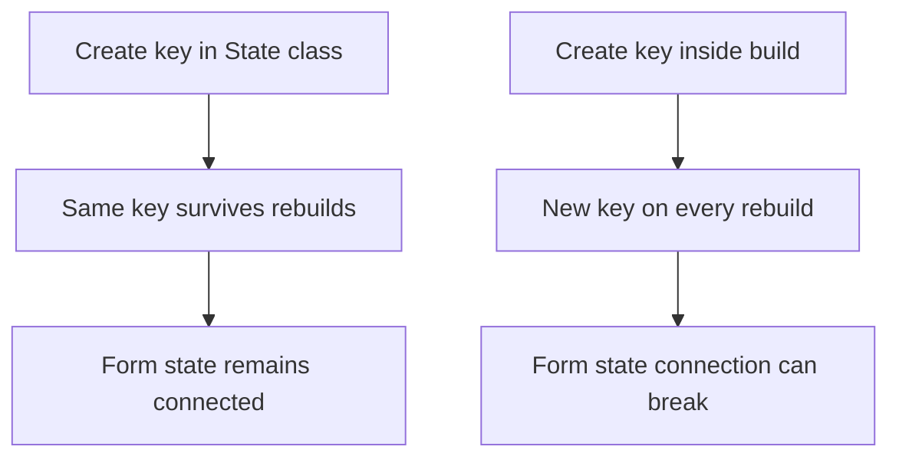
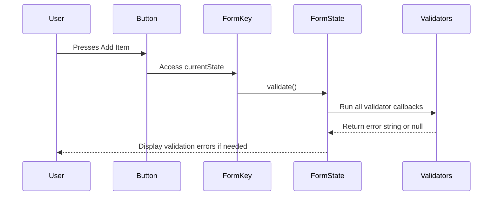
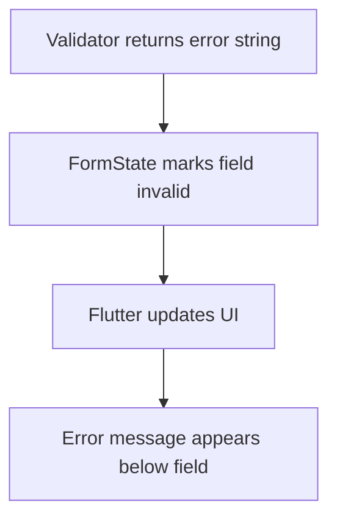

# Getting Form Access via a Global Key

## Overview

In this lecture, we connect the form UI to real form behavior by using a `GlobalKey<FormState>`.

Previously, we added validation logic to the `TextFormField` widgets. However, those validators do not run automatically. Flutter needs to be told when to validate the form.

To do that, we need access to the `FormState` object behind the `Form` widget.

A `GlobalKey<FormState>` gives us that access.

With this key, we can:

* Trigger validation
* Check whether all form fields are valid
* Reset the form fields
* Later, save the entered input values

---

## Why We Need a Global Key

A `Form` manages the state of all form fields inside it.

However, the **Add Item** button is just another widget in the UI. To make the button trigger validation, it needs a way to communicate with the `Form`.

That connection is created with a `GlobalKey`.

```mermaid id="form-key-overview"
flowchart TD
    A[Add Item Button] --> B[_saveItem Method]
    B --> C[GlobalKey<FormState>]
    C --> D[FormState]
    D --> E[validate()]
    E --> F[Run all validators]
    F --> G[Show errors or accept input]
```

---

## What Is `GlobalKey<FormState>`?

A `GlobalKey<FormState>` is a special Flutter key that can be attached to a `Form`.

It gives programmatic access to the form’s internal state.

```dart id="global-key-basic"
final _formKey = GlobalKey<FormState>();
```

The generic type `<FormState>` tells Dart that this key is connected to a form state object.

This gives better type checking and better autocomplete support.

---

## Where to Create the Global Key

The key should be created as a field inside the `State` class.

Do this:

```dart id="form-key-state-field"
class _NewItemState extends State<NewItem> {
  final _formKey = GlobalKey<FormState>();

  @override
  Widget build(BuildContext context) {
    // ...
  }
}
```

Do not create it inside the `build()` method.

Why?

Because `build()` can run many times. If the key is created inside `build()`, a new key would be created on every rebuild, which would break the connection to the existing form state.



---

## Step 1: Create the Form Key

Inside `_NewItemState`, create the key:

```dart id="create-form-key"
final _formKey = GlobalKey<FormState>();
```

This key will later be attached to the `Form`.

---

## Step 2: Attach the Key to the Form

The `Form` widget has a `key` parameter.

Attach `_formKey` to it:

```dart id="attach-key"
Form(
  key: _formKey,
  child: Column(
    children: [
      // form fields
    ],
  ),
)
```

Now `_formKey` is connected to this exact form.

---

## Step 3: Create the `_saveItem` Method

The **Add Item** button should trigger form validation.

To keep the code clean, create a separate method:

```dart id="save-item-method-basic"
void _saveItem() {
  _formKey.currentState!.validate();
}
```

Then connect this method to the **Add Item** button:

```dart id="connect-save-button"
ElevatedButton(
  onPressed: _saveItem,
  child: const Text('Add Item'),
),
```

Important: pass the function reference, not the result of calling the function.

Correct:

```dart id="correct-function-reference"
onPressed: _saveItem
```

Incorrect:

```dart id="incorrect-function-call"
onPressed: _saveItem()
```

---

## Understanding `currentState`

The form key gives access to the form state through:

```dart id="current-state"
_formKey.currentState
```

This is the `FormState` object connected to the `Form`.

Through this object, we can call useful methods such as:

| Method       | Purpose                                        |
| ------------ | ---------------------------------------------- |
| `validate()` | Runs all validators inside the form            |
| `save()`     | Runs all `onSaved` callbacks                   |
| `reset()`    | Resets all form fields to their initial values |

---

## Understanding the `!` Operator

In this code:

```dart id="null-assertion"
_formKey.currentState!.validate();
```

The `!` tells Dart that `currentState` will not be null.

This is safe here because `_saveItem` can only be triggered after the form has already been built and the key has been attached.

---

## Step 4: Trigger Validation

Calling `validate()` runs all validators in the form.

```dart id="validate-call"
_formKey.currentState!.validate();
```

This means Flutter will call the `validator` function of every form field inside the form.



---

## Step 5: Use the Validation Result

The `validate()` method returns a `bool`.

| Return Value | Meaning                       |
| ------------ | ----------------------------- |
| `true`       | All fields are valid          |
| `false`      | At least one field is invalid |

A better `_saveItem` method looks like this:

```dart id="save-item-validation-result"
void _saveItem() {
  final isValid = _formKey.currentState!.validate();

  if (!isValid) {
    return;
  }

  // Continue with saving later.
}
```

This allows us to stop the submission process if validation fails.

---

## Validation Flow

```mermaid id="validation-result-flow"
flowchart TD
    A[User presses Add Item] --> B[_saveItem runs]
    B --> C[_formKey.currentState!.validate()]
    C --> D{All fields valid?}
    D -- No --> E[Show error messages]
    E --> F[Stop function with return]
    D -- Yes --> G[Continue to saving data later]
```

---

## Step 6: Improve Quantity Keyboard Type

The quantity field should use a numeric keyboard.

Add:

```dart id="keyboard-type-number"
keyboardType: TextInputType.number,
```

Example:

```dart id="quantity-field-keyboard"
TextFormField(
  decoration: const InputDecoration(
    label: Text('Quantity'),
  ),
  initialValue: '1',
  keyboardType: TextInputType.number,
  validator: (value) {
    if (value == null ||
        value.isEmpty ||
        int.tryParse(value) == null ||
        int.tryParse(value)! <= 0) {
      return 'Must be a valid, positive number.';
    }

    return null;
  },
)
```

This does not replace validation, but it improves the user experience on mobile devices.

---

## Step 7: Reset the Form

The same form key can also be used to reset the form.

The `FormState` object provides a `reset()` method.

```dart id="reset-call"
_formKey.currentState!.reset();
```

Connect this to the **Reset** button:

```dart id="reset-button"
TextButton(
  onPressed: () {
    _formKey.currentState!.reset();
  },
  child: const Text('Reset'),
),
```

This resets all form fields to their initial values.

For example:

* The name field becomes empty again
* The quantity field returns to `'1'`
* Other form fields return to their initial state

---

## Reset Flow

```mermaid id="reset-flow"
flowchart TD
    A[User enters values] --> B[User presses Reset]
    B --> C[_formKey.currentState!.reset()]
    C --> D[Form fields return to initial values]
```

---

## Complete `NewItem` Example

```dart id="complete-new-item-global-key"
import 'package:flutter/material.dart';

import 'package:shopping_list/data/categories.dart';

class NewItem extends StatefulWidget {
  const NewItem({super.key});

  @override
  State<NewItem> createState() {
    return _NewItemState();
  }
}

class _NewItemState extends State<NewItem> {
  final _formKey = GlobalKey<FormState>();

  void _saveItem() {
    final isValid = _formKey.currentState!.validate();

    if (!isValid) {
      return;
    }

    // Saving logic will be added later.
  }

  @override
  Widget build(BuildContext context) {
    return Scaffold(
      appBar: AppBar(
        title: const Text('Add a new item'),
      ),
      body: Padding(
        padding: const EdgeInsets.all(12),
        child: Form(
          key: _formKey,
          child: Column(
            children: [
              TextFormField(
                maxLength: 50,
                decoration: const InputDecoration(
                  label: Text('Name'),
                ),
                validator: (value) {
                  if (value == null ||
                      value.isEmpty ||
                      value.trim().length <= 1 ||
                      value.trim().length > 50) {
                    return 'Must be between 2 and 50 characters.';
                  }

                  return null;
                },
              ),
              Row(
                crossAxisAlignment: CrossAxisAlignment.end,
                children: [
                  Expanded(
                    child: TextFormField(
                      decoration: const InputDecoration(
                        label: Text('Quantity'),
                      ),
                      initialValue: '1',
                      keyboardType: TextInputType.number,
                      validator: (value) {
                        if (value == null ||
                            value.isEmpty ||
                            int.tryParse(value) == null ||
                            int.tryParse(value)! <= 0) {
                          return 'Must be a valid, positive number.';
                        }

                        return null;
                      },
                    ),
                  ),
                  const SizedBox(width: 8),
                  Expanded(
                    child: DropdownButtonFormField(
                      items: [
                        for (final category in categories.entries)
                          DropdownMenuItem(
                            value: category.value,
                            child: Row(
                              children: [
                                Container(
                                  width: 16,
                                  height: 16,
                                  color: category.value.color,
                                ),
                                const SizedBox(width: 6),
                                Text(category.value.title),
                              ],
                            ),
                          ),
                      ],
                      onChanged: (value) {},
                    ),
                  ),
                ],
              ),
              const SizedBox(height: 12),
              Row(
                mainAxisAlignment: MainAxisAlignment.end,
                children: [
                  TextButton(
                    onPressed: () {
                      _formKey.currentState!.reset();
                    },
                    child: const Text('Reset'),
                  ),
                  ElevatedButton(
                    onPressed: _saveItem,
                    child: const Text('Add Item'),
                  ),
                ],
              ),
            ],
          ),
        ),
      ),
    );
  }
}
```

---

## What Happens When Validation Fails?

If validation fails, Flutter automatically displays the returned error message below the relevant field.

For example, if the name field is empty, the validator returns:

```dart id="name-error-message"
return 'Must be between 2 and 50 characters.';
```

Flutter then displays this message under the name field.



---

## What Happens When Validation Passes?

If all validators return `null`, `validate()` returns `true`.

```dart id="validation-pass"
final isValid = _formKey.currentState!.validate();
```

Then the app can continue with saving or submitting the data.

```dart id="valid-continue"
if (!isValid) {
  return;
}

// Continue here only if the form is valid.
```

---

## GlobalKey vs Other Keys

You have used keys before to help Flutter identify widgets, especially in lists.

A `GlobalKey` is more powerful.

| Key Type               | Common Use                           |
| ---------------------- | ------------------------------------ |
| `ValueKey`             | Preserve widget identity in lists    |
| `ObjectKey`            | Preserve identity based on an object |
| `UniqueKey`            | Force unique widget identity         |
| `GlobalKey<FormState>` | Access a specific form’s state       |

In normal Flutter development, `GlobalKey` is used carefully and not everywhere.

Forms are one of the most common and appropriate use cases for `GlobalKey`.

---

## What We Achieved

By the end of this lecture, we have:

* Created a `GlobalKey<FormState>`
* Attached the key to the `Form`
* Created a `_saveItem` method
* Connected the **Add Item** button to `_saveItem`
* Used `validate()` to run all validators
* Used the boolean result of `validate()`
* Added `TextInputType.number` to the quantity field
* Connected the **Reset** button to `reset()`
* Made the form validation messages appear on screen

---

## Key Points

* Validators do not run automatically.
* A `GlobalKey<FormState>` gives access to the form’s internal state.
* The key should be created as a field inside the `State` class.
* The key should be attached to the `Form` using the `key` parameter.
* `_formKey.currentState!.validate()` triggers all validators.
* `validate()` returns `true` only if all fields are valid.
* `_formKey.currentState!.reset()` resets all form fields.
* The `!` operator is used because we know the key is attached when the button is pressed.
* Creating a new key inside `build()` should be avoided.

---

## Common Mistakes

### 1. Creating the Key Inside `build()`

Incorrect:

```dart id="key-inside-build"
@override
Widget build(BuildContext context) {
  final formKey = GlobalKey<FormState>();

  return Form(
    key: formKey,
    child: ...
  );
}
```

Correct:

```dart id="key-inside-state"
class _NewItemState extends State<NewItem> {
  final _formKey = GlobalKey<FormState>();

  @override
  Widget build(BuildContext context) {
    return Form(
      key: _formKey,
      child: ...
    );
  }
}
```

---

### 2. Forgetting to Attach the Key to the Form

The key must be connected to the form.

```dart id="attach-key-correct"
Form(
  key: _formKey,
  child: Column(
    children: [],
  ),
)
```

---

### 3. Calling `_saveItem()` Immediately

Incorrect:

```dart id="saveitem-called-immediately"
ElevatedButton(
  onPressed: _saveItem(),
  child: const Text('Add Item'),
)
```

Correct:

```dart id="saveitem-reference"
ElevatedButton(
  onPressed: _saveItem,
  child: const Text('Add Item'),
)
```

---

### 4. Ignoring the Result of `validate()`

Better:

```dart id="validate-result-good"
final isValid = _formKey.currentState!.validate();

if (!isValid) {
  return;
}
```

This prevents invalid data from being processed.

---

### 5. Forgetting That Reset Uses Form State

The reset button should use the form key:

```dart id="reset-form-state"
_formKey.currentState!.reset();
```

---

## Summary

This lecture connects the form UI to real form logic by using a `GlobalKey<FormState>`.

The global key gives access to the `FormState` object behind the `Form`. Through that state object, we can call `validate()` to run all field validators and `reset()` to reset the form fields.

The **Add Item** button now triggers validation, and Flutter automatically displays validation errors when the input is invalid. The **Reset** button now clears the form back to its initial values.

The next step is to save the entered data after validation succeeds.
