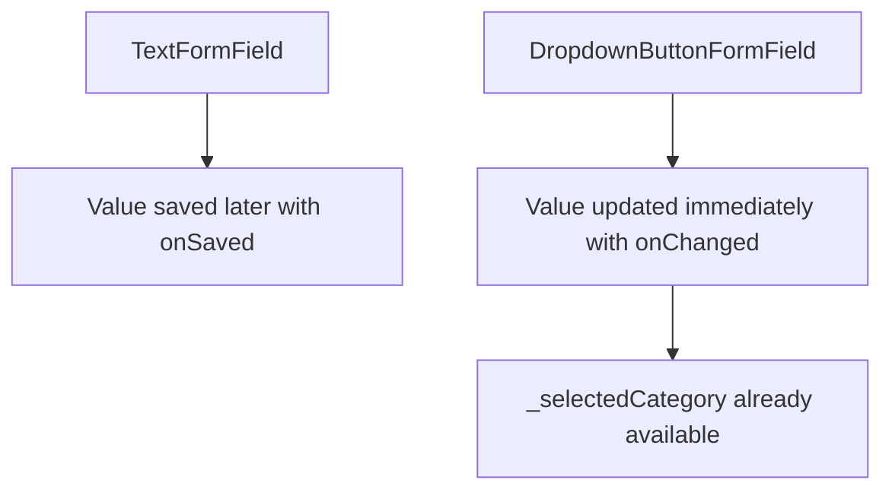
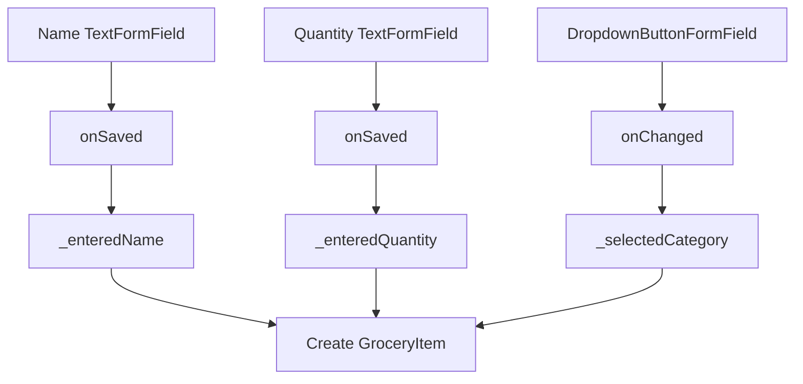
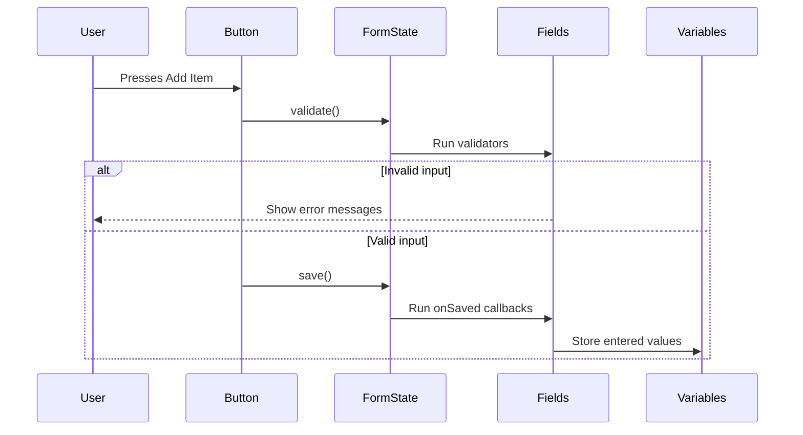

# Extracting Entered Values

## Overview

In this lecture, we learn how to extract the values entered by the user after the form has been successfully validated.

Previously, we added:

* Form fields
* Validation logic
* A `GlobalKey<FormState>`
* `validate()` to trigger validation
* `reset()` to reset the form

Now we add the next important step: **saving the form**.

In Flutter forms, saving does not automatically store the data somewhere. Instead, calling `save()` triggers the `onSaved` callback on each form field. Inside those callbacks, we can manually store the entered values in variables.

These stored values can later be used to create a new `GroceryItem`.

---

## Form Submission Flow

The form submission process should happen in this order:

```mermaid id="form-submit-flow"
flowchart TD
    A[User presses Add Item] --> B[Run validate()]
    B --> C{Is form valid?}
    C -- No --> D[Show validation errors]
    C -- Yes --> E[Run save()]
    E --> F[Trigger onSaved callbacks]
    F --> G[Store entered values]
    G --> H[Use values to create GroceryItem later]
```

The important rule is:

> Only call `save()` after `validate()` returns `true`.

---

## Why We Need `onSaved`

A `TextFormField` stores what the user typed internally, but our app still needs to extract that value and use it.

The `onSaved` callback allows us to do that.

```dart id="onsaved-basic"
onSaved: (value) {
  // Store the value somewhere
},
```

This function is called when we execute:

```dart id="save-call"
_formKey.currentState!.save();
```

---

## Step 1: Create Variables for Entered Values

Inside the `_NewItemState` class, create variables to temporarily store the form values.

```dart id="entered-values"
var _enteredName = '';
var _enteredQuantity = 1;
var _selectedCategory = categories[Categories.vegetables]!;
```

These variables represent the current form data.

| Variable            | Purpose                      |
| ------------------- | ---------------------------- |
| `_enteredName`      | Stores the grocery item name |
| `_enteredQuantity`  | Stores the item quantity     |
| `_selectedCategory` | Stores the selected category |

---

## Step 2: Save Only After Validation

Update the `_saveItem` method so that it first validates the form.

If validation fails, stop the function.

If validation succeeds, call `save()`.

```dart id="save-item-method"
void _saveItem() {
  final isValid = _formKey.currentState!.validate();

  if (!isValid) {
    return;
  }

  _formKey.currentState!.save();

  print(_enteredName);
  print(_enteredQuantity);
  print(_selectedCategory);
}
```

---

## Why `save()` Must Come After `validate()`

The validators make sure that the values are safe to use.

For example:

* The name is not empty
* The quantity is a valid number
* The quantity is greater than zero

Only after those checks pass should we save and process the data.

```mermaid id="validate-before-save"
flowchart LR
    A[Raw User Input] --> B[validate()]
    B --> C{Valid?}
    C -- No --> D[Do not save]
    C -- Yes --> E[save()]
    E --> F[Use safe values]
```

---

## Step 3: Save the Name Field

Add `onSaved` to the name `TextFormField`.

```dart id="name-onsaved"
TextFormField(
  maxLength: 50,
  decoration: const InputDecoration(
    label: Text('Name'),
  ),
  validator: (value) {
    if (value == null ||
        value.isEmpty ||
        value.trim().length <= 1 ||
        value.trim().length > 50) {
      return 'Must be between 2 and 50 characters.';
    }

    return null;
  },
  onSaved: (value) {
    _enteredName = value!;
  },
)
```

The `value!` is safe here because validation already checked that the value is not `null`.

---

## Why No `setState()` Is Needed Here

Inside `onSaved`, we store the value in a variable.

```dart id="no-setstate-needed"
onSaved: (value) {
  _enteredName = value!;
},
```

We do **not** need `setState()` because this change does not immediately update the visible UI.

The value is only stored so it can be used later in `_saveItem`.

---

## Step 4: Save the Quantity Field

The quantity field also needs `onSaved`.

However, the value from a text field is always a `String`, even if the user entered a number.

So we must convert it to an `int`.

```dart id="quantity-onsaved"
TextFormField(
  decoration: const InputDecoration(
    label: Text('Quantity'),
  ),
  initialValue: _enteredQuantity.toString(),
  keyboardType: TextInputType.number,
  validator: (value) {
    if (value == null ||
        value.isEmpty ||
        int.tryParse(value) == null ||
        int.tryParse(value)! <= 0) {
      return 'Must be a valid, positive number.';
    }

    return null;
  },
  onSaved: (value) {
    _enteredQuantity = int.parse(value!);
  },
)
```

---

## Why Use `int.parse()` in `onSaved`?

In the validator, we already checked the value with:

```dart id="tryparse-check"
int.tryParse(value) == null
```

That means by the time `onSaved` runs, the value has already been proven to be a valid integer.

So this is safe:

```dart id="int-parse-safe"
_enteredQuantity = int.parse(value!);
```

Use `int.tryParse()` for validation.

Use `int.parse()` after validation has already succeeded.

---

## `tryParse()` vs `parse()`

| Method                | Behavior                            |
| --------------------- | ----------------------------------- |
| `int.tryParse(value)` | Returns `null` if conversion fails  |
| `int.parse(value)`    | Throws an error if conversion fails |

In validators, `tryParse()` is safer.

In `onSaved`, `parse()` is acceptable because the input has already passed validation.

---

## Step 5: Manage the Selected Category

The category dropdown works slightly differently.

Instead of using `onSaved`, we store the selected category whenever the user changes the dropdown selection.

Create this variable:

```dart id="selected-category"
var _selectedCategory = categories[Categories.vegetables]!;
```

This sets the default selected category to vegetables.

The `!` tells Dart that this value will not be `null`.

---

## Step 6: Set the Dropdown Value

The dropdown should display the currently selected category.

Set its `value` to `_selectedCategory`.

```dart id="dropdown-value"
DropdownButtonFormField(
  value: _selectedCategory,
  items: [
    for (final category in categories.entries)
      DropdownMenuItem(
        value: category.value,
        child: Row(
          children: [
            Container(
              width: 16,
              height: 16,
              color: category.value.color,
            ),
            const SizedBox(width: 6),
            Text(category.value.title),
          ],
        ),
      ),
  ],
  onChanged: (value) {
    setState(() {
      _selectedCategory = value!;
    });
  },
)
```

---

## Why `setState()` Is Needed for the Dropdown

Unlike the `onSaved` values, `_selectedCategory` directly affects what is displayed in the dropdown.

When the user selects a new category, the UI must update.

That is why we use:

```dart id="dropdown-setstate"
setState(() {
  _selectedCategory = value!;
});
```

```mermaid id="dropdown-state-flow"
flowchart TD
    A[User selects category] --> B[onChanged runs]
    B --> C[Update _selectedCategory]
    C --> D[setState()]
    D --> E[Rebuild widget]
    E --> F[Dropdown shows new selected value]
```

---

## Why the Dropdown Does Not Need `onSaved`

The dropdown value is already stored whenever it changes.

That means when `_saveItem` runs, `_selectedCategory` already contains the latest selected value.

So an `onSaved` callback is optional here.



---

## Complete `_NewItemState` Example

```dart id="complete-new-item-state"
class _NewItemState extends State<NewItem> {
  final _formKey = GlobalKey<FormState>();

  var _enteredName = '';
  var _enteredQuantity = 1;
  var _selectedCategory = categories[Categories.vegetables]!;

  void _saveItem() {
    final isValid = _formKey.currentState!.validate();

    if (!isValid) {
      return;
    }

    _formKey.currentState!.save();

    print(_enteredName);
    print(_enteredQuantity);
    print(_selectedCategory);
  }

  @override
  Widget build(BuildContext context) {
    return Scaffold(
      appBar: AppBar(
        title: const Text('Add a new item'),
      ),
      body: Padding(
        padding: const EdgeInsets.all(12),
        child: Form(
          key: _formKey,
          child: Column(
            children: [
              TextFormField(
                maxLength: 50,
                decoration: const InputDecoration(
                  label: Text('Name'),
                ),
                validator: (value) {
                  if (value == null ||
                      value.isEmpty ||
                      value.trim().length <= 1 ||
                      value.trim().length > 50) {
                    return 'Must be between 2 and 50 characters.';
                  }

                  return null;
                },
                onSaved: (value) {
                  _enteredName = value!;
                },
              ),
              Row(
                crossAxisAlignment: CrossAxisAlignment.end,
                children: [
                  Expanded(
                    child: TextFormField(
                      decoration: const InputDecoration(
                        label: Text('Quantity'),
                      ),
                      initialValue: _enteredQuantity.toString(),
                      keyboardType: TextInputType.number,
                      validator: (value) {
                        if (value == null ||
                            value.isEmpty ||
                            int.tryParse(value) == null ||
                            int.tryParse(value)! <= 0) {
                          return 'Must be a valid, positive number.';
                        }

                        return null;
                      },
                      onSaved: (value) {
                        _enteredQuantity = int.parse(value!);
                      },
                    ),
                  ),
                  const SizedBox(width: 8),
                  Expanded(
                    child: DropdownButtonFormField(
                      value: _selectedCategory,
                      items: [
                        for (final category in categories.entries)
                          DropdownMenuItem(
                            value: category.value,
                            child: Row(
                              children: [
                                Container(
                                  width: 16,
                                  height: 16,
                                  color: category.value.color,
                                ),
                                const SizedBox(width: 6),
                                Text(category.value.title),
                              ],
                            ),
                          ),
                      ],
                      onChanged: (value) {
                        setState(() {
                          _selectedCategory = value!;
                        });
                      },
                    ),
                  ),
                ],
              ),
              const SizedBox(height: 12),
              Row(
                mainAxisAlignment: MainAxisAlignment.end,
                children: [
                  TextButton(
                    onPressed: () {
                      _formKey.currentState!.reset();
                    },
                    child: const Text('Reset'),
                  ),
                  ElevatedButton(
                    onPressed: _saveItem,
                    child: const Text('Add Item'),
                  ),
                ],
              ),
            ],
          ),
        ),
      ),
    );
  }
}
```

---

## Step 7: Creating a GroceryItem Later

After the values are saved, they can be combined into a `GroceryItem`.

Example:

```dart id="create-grocery-item"
final newItem = GroceryItem(
  id: DateTime.now().toString(),
  name: _enteredName,
  quantity: _enteredQuantity,
  category: _selectedCategory,
);
```

This will be used later when we pass the new item back to the grocery list screen.

---

## Extracted Data Flow



---

## What Happens When Add Item Is Pressed?



---

## Why This Approach Is Useful

Using `onSaved` keeps the form clean and centralized.

Instead of manually reading each field one by one, we let the `FormState` trigger all `onSaved` callbacks at once.

This gives us a consistent form workflow:

```txt id="form-workflow"
validate -> save -> use values
```

---

## What We Achieved

By the end of this lecture, we have:

* Added variables for storing entered form values
* Used `onSaved` on the name field
* Used `onSaved` on the quantity field
* Converted the quantity string into an integer
* Used `save()` to trigger all `onSaved` callbacks
* Stored the selected dropdown value with `onChanged`
* Used `setState()` to update the selected category visually
* Printed the extracted values to confirm that saving works

---

## Key Points

* `save()` triggers all `onSaved` callbacks inside the form.
* `onSaved` receives the current field value.
* Text field values are always strings.
* Numeric text input must be parsed before being used as a number.
* `save()` should only be called after validation succeeds.
* `value!` is safe inside `onSaved` when validation already checked for `null`.
* Dropdown selection can be stored directly through `onChanged`.
* `setState()` is needed when changing values that affect the visible UI.
* The extracted values can later be used to create a new `GroceryItem`.

---

## Common Mistakes

### 1. Calling `save()` Before Validation

Incorrect:

```dart id="save-before-validate"
void _saveItem() {
  _formKey.currentState!.save();
  _formKey.currentState!.validate();
}
```

Correct:

```dart id="validate-before-save-correct"
void _saveItem() {
  final isValid = _formKey.currentState!.validate();

  if (!isValid) {
    return;
  }

  _formKey.currentState!.save();
}
```

---

### 2. Forgetting `onSaved`

Calling `save()` does nothing useful unless fields define `onSaved`.

```dart id="onsaved-needed"
onSaved: (value) {
  _enteredName = value!;
},
```

---

### 3. Forgetting That Text Fields Return Strings

Even this value is a string:

```txt id="quantity-as-string"
"5"
```

So it must be converted:

```dart id="parse-quantity"
_enteredQuantity = int.parse(value!);
```

---

### 4. Using `setState()` Unnecessarily

This is not needed for simple form value saving:

```dart id="unnecessary-setstate"
onSaved: (value) {
  setState(() {
    _enteredName = value!;
  });
},
```

Use direct assignment instead:

```dart id="direct-assignment-onsaved"
onSaved: (value) {
  _enteredName = value!;
},
```

---

### 5. Forgetting to Set the Dropdown Value

The dropdown should know which value is currently selected.

```dart id="dropdown-value-needed"
value: _selectedCategory,
```

---

## Summary

This lecture shows how to extract user-entered values from a Flutter form.

We used `onSaved` callbacks on the text form fields and triggered them by calling `_formKey.currentState!.save()` after successful validation.

The entered name and quantity are stored in class-level variables, while the selected category is managed through the dropdown’s `onChanged` callback.

At this point, the app can validate and extract all the data needed to create a new grocery item. The next step is to pass that item back to the shopping list screen and display it in the list.
