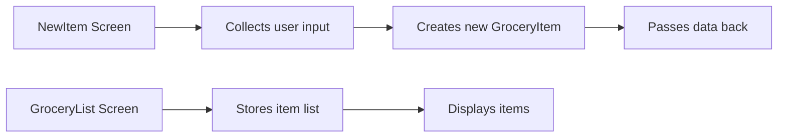
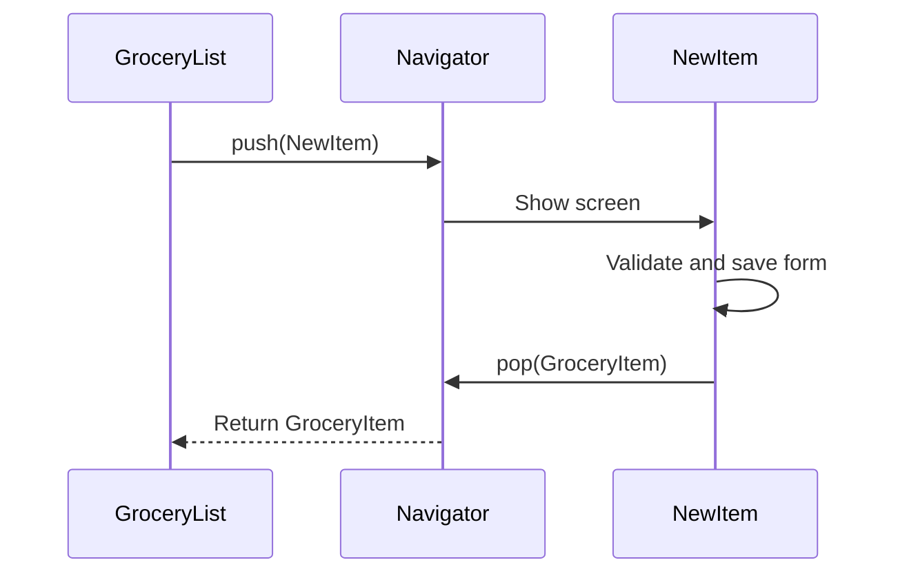
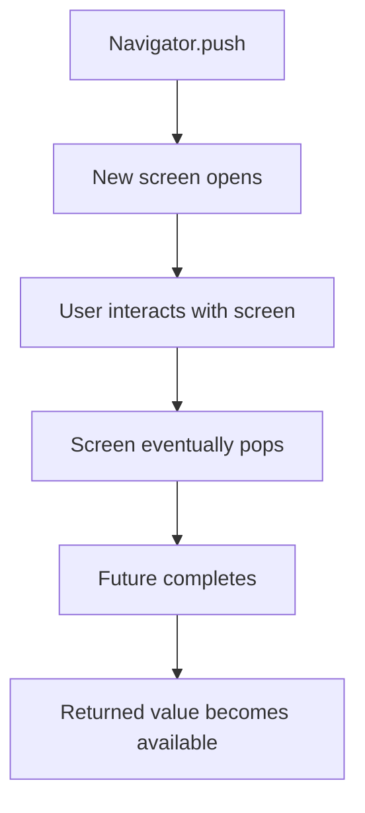
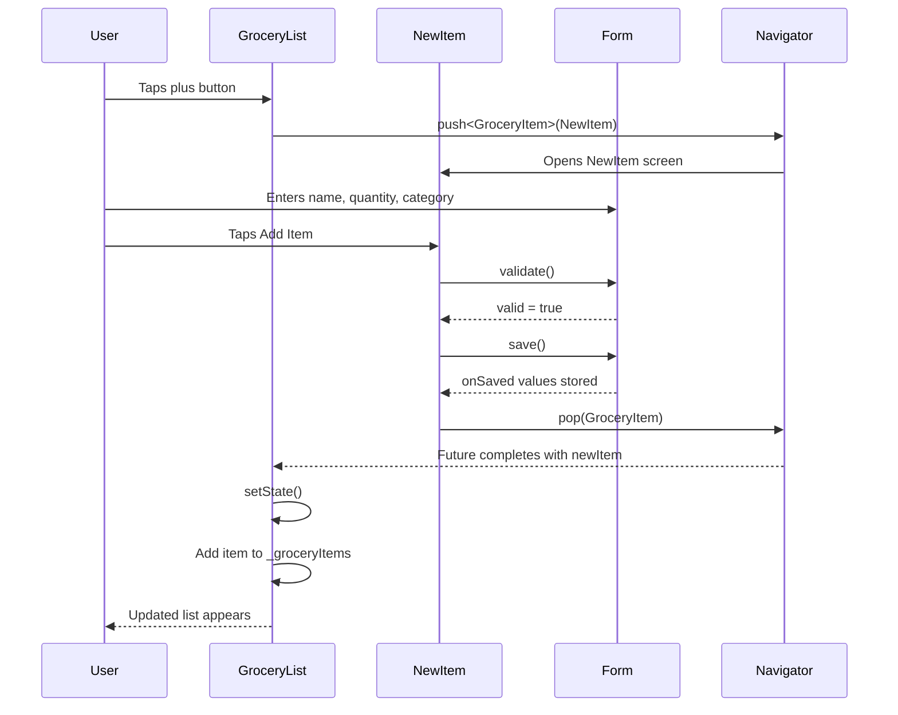
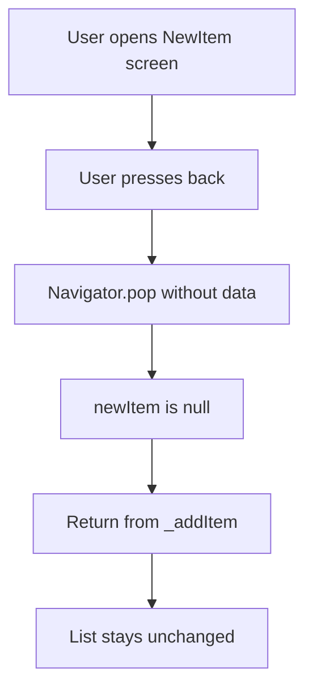
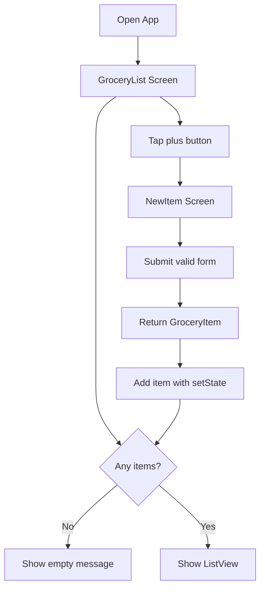

# Passing Data Between Screens

## Overview

In this lecture, we connect the `NewItem` screen with the `GroceryList` screen.

Previously, the form could validate and extract user input. However, the entered data was still only available inside the `NewItem` screen.

Now we need to send that data back to the previous screen so the new grocery item can be added to the visible list.

Flutter makes this possible through the `Navigator`.

When navigating from one screen to another, the pushed screen can return data when it is popped. This allows the `NewItem` screen to send a newly created `GroceryItem` back to the `GroceryList` screen.

---

## Goal

The goal is to make this flow work:

```txt
GroceryList screen
    ↓ user taps plus button
NewItem screen
    ↓ user fills form and taps Add Item
Create GroceryItem
    ↓ Navigator.pop(newItem)
GroceryList receives item
    ↓ setState()
List updates on screen
```

```mermaid id="passing-data-flow"
flowchart TD
    A[GroceryList Screen] --> B[User taps plus button]
    B --> C[Navigator.push]
    C --> D[NewItem Screen]
    D --> E[User submits valid form]
    E --> F[Create GroceryItem]
    F --> G[Navigator.pop(newItem)]
    G --> H[GroceryList receives returned item]
    H --> I[Add item to local list]
    I --> J[setState rebuilds UI]
```

---

## Why Passing Data Back Is Needed

The grocery items are displayed on the `GroceryList` screen.

But the new item data is entered on the `NewItem` screen.

Therefore, after the user submits the form, the `NewItem` screen must send the created item back to the screen that opened it.



---

## Step 1: Stop Using Dummy Items Directly

Previously, the list screen displayed items from `dummy_items.dart`.

Now the list should be managed locally inside the `GroceryList` widget.

Create a list inside `_GroceryListState`:

```dart id="local-list"
final List<GroceryItem> _groceryItems = [];
```

This list starts empty.

Later, every submitted item will be added to this list.

---

## Step 2: Import the GroceryItem Model

Because `_groceryItems` stores `GroceryItem` objects, import the model.

```dart id="import-grocery-item"
import 'package:shopping_list/models/grocery_item.dart';
```

You can remove the old dummy items import if it is no longer used.

```dart id="remove-dummy-import"
// Remove this if no longer needed:
// import 'package:shopping_list/data/dummy_items.dart';
```

---

## Step 3: Create a GroceryItem in the NewItem Screen

Inside `_saveItem`, after validation and saving succeed, create a new `GroceryItem`.

```dart id="create-new-item"
final newItem = GroceryItem(
  id: DateTime.now().toString(),
  name: _enteredName,
  quantity: _enteredQuantity,
  category: _selectedCategory,
);
```

The values come from the form:

| Property   | Source                                     |
| ---------- | ------------------------------------------ |
| `id`       | Generated with `DateTime.now().toString()` |
| `name`     | `_enteredName`                             |
| `quantity` | `_enteredQuantity`                         |
| `category` | `_selectedCategory`                        |

---

## Note About the ID

For this simple app, the ID can be generated like this:

```dart id="datetime-id"
DateTime.now().toString()
```

This is good enough for a small local demo app.

In a production app, you would usually use a stronger ID strategy, such as:

* A backend-generated ID
* A database document ID
* A UUID package

---

## Step 4: Return the New Item With `Navigator.pop`

`Navigator.pop()` normally closes the current screen and returns to the previous screen.

But it can also pass data back.

```dart id="pop-with-data"
Navigator.of(context).pop(newItem);
```

In this app, the returned data is the new `GroceryItem`.

---

## Complete `_saveItem` Example

```dart id="save-item-with-pop"
void _saveItem() {
  final isValid = _formKey.currentState!.validate();

  if (!isValid) {
    return;
  }

  _formKey.currentState!.save();

  Navigator.of(context).pop(
    GroceryItem(
      id: DateTime.now().toString(),
      name: _enteredName,
      quantity: _enteredQuantity,
      category: _selectedCategory,
    ),
  );
}
```

---

## Navigator Return Flow



---

## Step 5: Await the Returned Item in GroceryList

`Navigator.push()` returns a `Future`.

That future completes when the pushed screen is popped.

So we can use `async` and `await` to wait for the result.

```dart id="await-push"
void _addItem() async {
  final newItem = await Navigator.of(context).push<GroceryItem>(
    MaterialPageRoute(
      builder: (ctx) => const NewItem(),
    ),
  );
}
```

The `<GroceryItem>` annotation tells Dart what type of data this route may return.

---

## Why `push()` Returns a Future

The app cannot know immediately what item the user will add.

The user might:

* Enter a valid item
* Press the back button
* Cancel the screen
* Submit later

Therefore, `Navigator.push()` returns a `Future` that completes later.



---

## Step 6: Handle Nullable Return Values

The returned value can be `null`.

This happens if the user leaves the screen without submitting the form.

For example:

* Pressing the device back button
* Pressing the app bar back button
* Calling `Navigator.pop(context)` without data

So always check for `null`.

```dart id="null-check-new-item"
if (newItem == null) {
  return;
}
```

This prevents the app from trying to add a missing item.

---

## Step 7: Add the New Item to the List

If `newItem` is not null, add it to `_groceryItems`.

Because the UI should update, wrap the change in `setState()`.

```dart id="add-item-setstate"
setState(() {
  _groceryItems.add(newItem);
});
```

This updates the state and rebuilds the list UI.

---

## Complete `_addItem` Method

```dart id="complete-add-item"
void _addItem() async {
  final newItem = await Navigator.of(context).push<GroceryItem>(
    MaterialPageRoute(
      builder: (ctx) => const NewItem(),
    ),
  );

  if (newItem == null) {
    return;
  }

  setState(() {
    _groceryItems.add(newItem);
  });
}
```

---

## Step 8: Use the Local List in the UI

Update the `ListView.builder` to use `_groceryItems`.

```dart id="local-listview"
ListView.builder(
  itemCount: _groceryItems.length,
  itemBuilder: (ctx, index) {
    final item = _groceryItems[index];

    return ListTile(
      leading: Container(
        width: 24,
        height: 24,
        color: item.category.color,
      ),
      title: Text(item.name),
      trailing: Text(item.quantity.toString()),
    );
  },
)
```

Instead of reading from dummy data, the UI now reads from local state.

---

## Updated GroceryList Screen Example

```dart id="updated-grocery-list"
import 'package:flutter/material.dart';

import 'package:shopping_list/models/grocery_item.dart';
import 'package:shopping_list/widgets/new_item.dart';

class GroceryList extends StatefulWidget {
  const GroceryList({super.key});

  @override
  State<GroceryList> createState() {
    return _GroceryListState();
  }
}

class _GroceryListState extends State<GroceryList> {
  final List<GroceryItem> _groceryItems = [];

  void _addItem() async {
    final newItem = await Navigator.of(context).push<GroceryItem>(
      MaterialPageRoute(
        builder: (ctx) => const NewItem(),
      ),
    );

    if (newItem == null) {
      return;
    }

    setState(() {
      _groceryItems.add(newItem);
    });
  }

  @override
  Widget build(BuildContext context) {
    Widget content = const Center(
      child: Text('You got no items yet.'),
    );

    if (_groceryItems.isNotEmpty) {
      content = ListView.builder(
        itemCount: _groceryItems.length,
        itemBuilder: (ctx, index) {
          final item = _groceryItems[index];

          return ListTile(
            leading: Container(
              width: 24,
              height: 24,
              color: item.category.color,
            ),
            title: Text(item.name),
            trailing: Text(item.quantity.toString()),
          );
        },
      );
    }

    return Scaffold(
      appBar: AppBar(
        title: const Text('Your Groceries'),
        actions: [
          IconButton(
            onPressed: _addItem,
            icon: const Icon(Icons.add),
          ),
        ],
      ),
      body: content,
    );
  }
}
```

---

## Empty State Handling

Since `_groceryItems` starts as an empty list, the screen should show fallback text before any item is added.

```dart id="empty-state"
Widget content = const Center(
  child: Text('You got no items yet.'),
);
```

Then replace it with the list only if items exist.

```dart id="content-switch"
if (_groceryItems.isNotEmpty) {
  content = ListView.builder(
    itemCount: _groceryItems.length,
    itemBuilder: (ctx, index) {
      final item = _groceryItems[index];

      return ListTile(
        title: Text(item.name),
        trailing: Text(item.quantity.toString()),
      );
    },
  );
}
```

---

## Full Data Passing Sequence



---

## What Happens If the User Cancels?

If the user goes back without submitting, no item is returned.

In that case:

```dart id="cancel-null"
final newItem = await Navigator.of(context).push<GroceryItem>(...);
```

`newItem` will be `null`.

That is why this check is important:

```dart id="cancel-return"
if (newItem == null) {
  return;
}
```



---

## Why `setState()` Is Needed

Adding an item changes the list data.

But Flutter will not automatically rebuild the UI unless it is told that state changed.

So we call:

```dart id="setstate-needed"
setState(() {
  _groceryItems.add(newItem);
});
```

This tells Flutter to run `build()` again and display the updated list.

---

## Updated App Flow



---

## What We Achieved

By the end of this lecture, we have:

* Stopped relying on dummy grocery items
* Created a local `_groceryItems` list in the `GroceryList` state
* Created a `GroceryItem` from the submitted form values
* Used `Navigator.pop(newItem)` to return data from `NewItem`
* Used `await Navigator.push<GroceryItem>()` to receive the returned data
* Checked whether the returned item is `null`
* Added the returned item to the local list
* Used `setState()` to rebuild the list UI
* Added a simple empty-state message

---

## Key Points

* `Navigator.pop(context, data)` can return data to the previous screen.
* `Navigator.push()` returns a `Future`.
* The future completes when the pushed screen is popped.
* `await` can be used to receive the returned value.
* The returned value may be `null`.
* Always check for `null` before using returned data.
* Use `setState()` when adding the new item to the list.
* The list screen should own and manage the list of grocery items.
* The form screen should collect data and return a completed item.

---

## Common Mistakes

### 1. Forgetting to Return the New Item

Incorrect:

```dart id="pop-without-data"
Navigator.of(context).pop();
```

Correct:

```dart id="pop-with-item"
Navigator.of(context).pop(newItem);
```

---

### 2. Forgetting to Await `Navigator.push`

Incorrect:

```dart id="push-without-await"
final newItem = Navigator.of(context).push<GroceryItem>(
  MaterialPageRoute(
    builder: (ctx) => const NewItem(),
  ),
);
```

Correct:

```dart id="push-with-await"
final newItem = await Navigator.of(context).push<GroceryItem>(
  MaterialPageRoute(
    builder: (ctx) => const NewItem(),
  ),
);
```

---

### 3. Forgetting `async`

If you use `await`, the method must be marked as `async`.

```dart id="async-method"
void _addItem() async {
  final newItem = await Navigator.of(context).push<GroceryItem>(
    MaterialPageRoute(
      builder: (ctx) => const NewItem(),
    ),
  );
}
```

---

### 4. Not Checking for `null`

The user might leave the screen without submitting.

Correct:

```dart id="null-check-correct"
if (newItem == null) {
  return;
}
```

---

### 5. Adding the Item Without `setState`

Incorrect:

```dart id="without-setstate"
_groceryItems.add(newItem);
```

Correct:

```dart id="with-setstate"
setState(() {
  _groceryItems.add(newItem);
});
```

Without `setState()`, the internal list changes, but the UI may not update.

---

## Summary

This lecture shows how to pass data back from one screen to another in Flutter.

The `NewItem` screen creates a new `GroceryItem` after the form is successfully validated and saved. It then returns that item by calling `Navigator.pop(newItem)`.

The `GroceryList` screen waits for the result of `Navigator.push()` using `await`. If a new item is returned, it adds the item to its local `_groceryItems` list inside `setState()`, causing the UI to update.

The app now supports adding new grocery items through a form and displaying them in the list.
