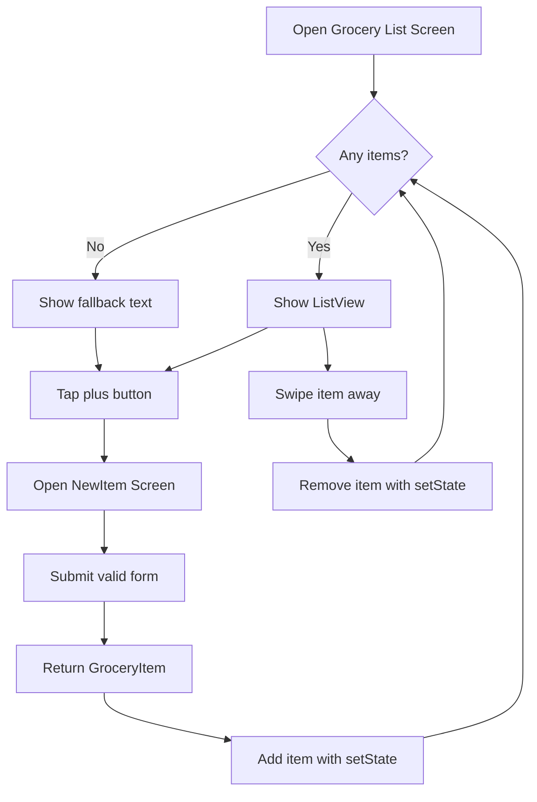
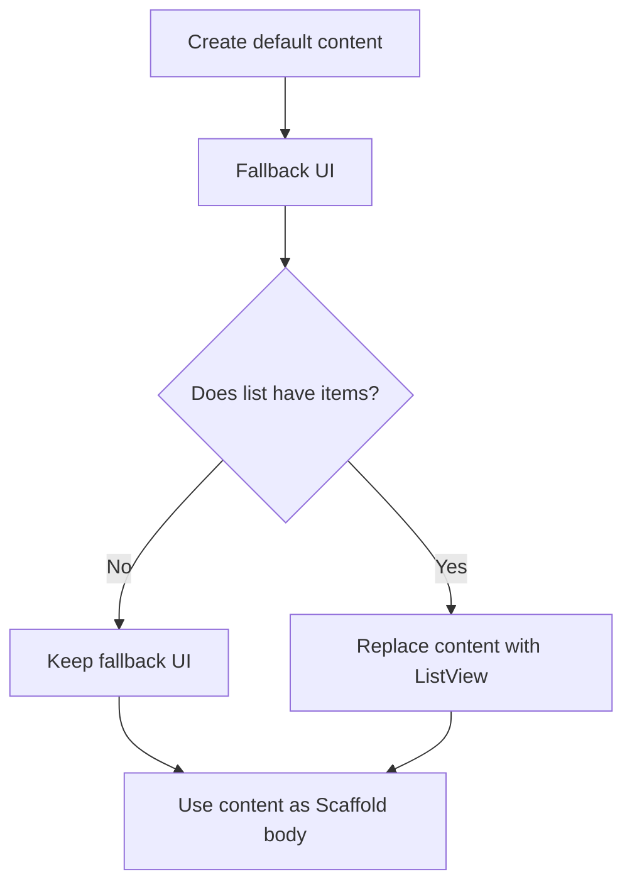
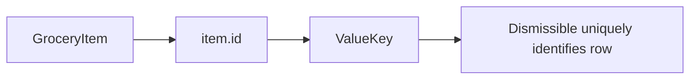
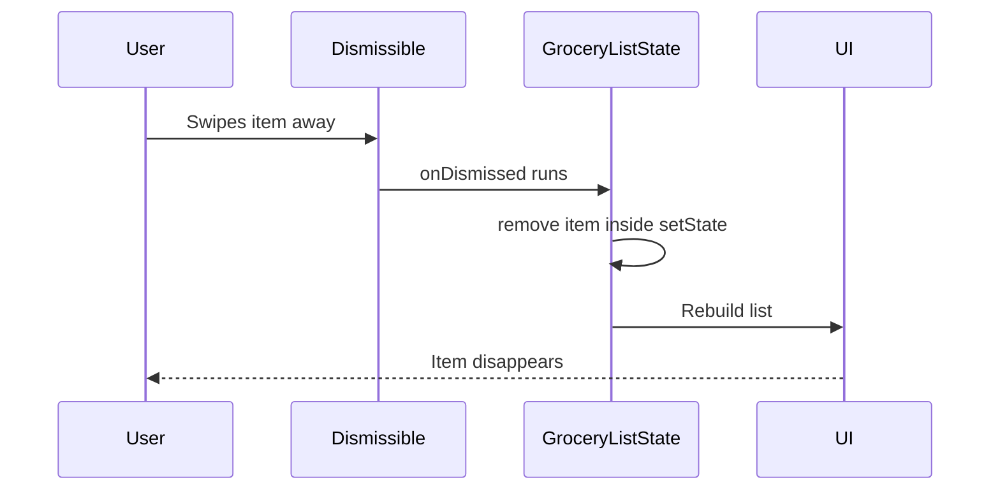
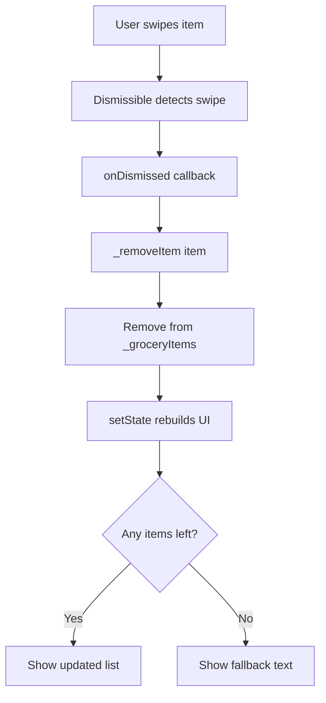

# Final Challenge Solution

## Overview

In this lecture, we complete the final challenge for the Shopping List App.

At this point, the app can already:

* Navigate from the grocery list screen to the new item screen
* Validate form input
* Extract entered form values
* Create a new `GroceryItem`
* Pass the new item back to the list screen
* Add the returned item to the list with `setState()`

Now we add the final refinements:

* Show fallback content when the list is empty
* Display the list only when items exist
* Allow users to remove items by swiping them away
* Update the UI after an item is removed

By the end of this lecture, the Shopping List App is fully functional with local state.

---

## Final App Behavior

The finished app should behave like this:

```txt
1. User opens the app.
2. If there are no grocery items, a fallback message is shown.
3. User taps the plus button.
4. User enters item data in the form.
5. Form validates the input.
6. New item is returned to the list screen.
7. List updates and displays the item.
8. User can swipe an item away to delete it.
9. If all items are deleted, the fallback message appears again.
```



---

## Step 1: Add Fallback Content

Because the `_groceryItems` list starts empty, the app should not show a blank screen.

Instead, we create a local `content` variable inside the `build()` method.

By default, it contains fallback text:

```dart
Widget content = const Center(
  child: Text('No items added yet.'),
);
```

This is what users will see when the list is empty.

---

## Step 2: Replace Fallback With List Content

If `_groceryItems` is not empty, we replace `content` with a `ListView.builder`.

```dart
if (_groceryItems.isNotEmpty) {
  content = ListView.builder(
    itemCount: _groceryItems.length,
    itemBuilder: (ctx, index) {
      final item = _groceryItems[index];

      return ListTile(
        leading: Container(
          width: 24,
          height: 24,
          color: item.category.color,
        ),
        title: Text(item.name),
        trailing: Text(item.quantity.toString()),
      );
    },
  );
}
```

Then we use `content` as the `body` of the `Scaffold`.

```dart
body: content,
```

---

## Conditional Rendering Pattern

This pattern is common in Flutter.



This makes it easy to show different UI depending on the current state.

---

## Step 3: Make List Items Dismissible

To allow users to remove items by swiping them away, wrap each `ListTile` with a `Dismissible` widget.

```dart
return Dismissible(
  key: ValueKey(item.id),
  child: ListTile(
    leading: Container(
      width: 24,
      height: 24,
      color: item.category.color,
    ),
    title: Text(item.name),
    trailing: Text(item.quantity.toString()),
  ),
);
```

`Dismissible` is a built-in Flutter widget that supports swipe-to-delete behavior.

---

## Why `Dismissible` Needs a Key

A `Dismissible` widget requires a unique key.

Flutter uses this key to identify which item is being dismissed.

In this app, each `GroceryItem` already has a unique `id`, so we can use:

```dart
key: ValueKey(item.id),
```



---

## Step 4: Add a Remove Method

Create a method that removes a selected item from `_groceryItems`.

```dart
void _removeItem(GroceryItem item) {
  setState(() {
    _groceryItems.remove(item);
  });
}
```

The removal must happen inside `setState()` because the UI needs to rebuild after the list changes.

---

## Step 5: Use `onDismissed`

`Dismissible` provides an `onDismissed` callback.

This callback runs after the user swipes the item away.

```dart
onDismissed: (direction) {
  _removeItem(item);
},
```

The `direction` tells you which direction the user swiped, but in this app we do not need to use it.

---

## Dismissible Flow



---

## Complete `GroceryList` Screen

```dart
import 'package:flutter/material.dart';

import 'package:shopping_list/models/grocery_item.dart';
import 'package:shopping_list/widgets/new_item.dart';

class GroceryList extends StatefulWidget {
  const GroceryList({super.key});

  @override
  State<GroceryList> createState() {
    return _GroceryListState();
  }
}

class _GroceryListState extends State<GroceryList> {
  final List<GroceryItem> _groceryItems = [];

  void _addItem() async {
    final newItem = await Navigator.of(context).push<GroceryItem>(
      MaterialPageRoute(
        builder: (ctx) => const NewItem(),
      ),
    );

    if (newItem == null) {
      return;
    }

    setState(() {
      _groceryItems.add(newItem);
    });
  }

  void _removeItem(GroceryItem item) {
    setState(() {
      _groceryItems.remove(item);
    });
  }

  @override
  Widget build(BuildContext context) {
    Widget content = const Center(
      child: Text('No items added yet.'),
    );

    if (_groceryItems.isNotEmpty) {
      content = ListView.builder(
        itemCount: _groceryItems.length,
        itemBuilder: (ctx, index) {
          final item = _groceryItems[index];

          return Dismissible(
            key: ValueKey(item.id),
            onDismissed: (direction) {
              _removeItem(item);
            },
            child: ListTile(
              leading: Container(
                width: 24,
                height: 24,
                color: item.category.color,
              ),
              title: Text(item.name),
              trailing: Text(item.quantity.toString()),
            ),
          );
        },
      );
    }

    return Scaffold(
      appBar: AppBar(
        title: const Text('Your Groceries'),
        actions: [
          IconButton(
            onPressed: _addItem,
            icon: const Icon(Icons.add),
          ),
        ],
      ),
      body: content,
    );
  }
}
```

---

## How the Final List Screen Works

The `GroceryList` screen now manages three main responsibilities:

| Responsibility | Implementation                       |
| -------------- | ------------------------------------ |
| Add new item   | `_addItem()` with `Navigator.push()` |
| Display items  | `ListView.builder`                   |
| Remove item    | `Dismissible` + `_removeItem()`      |
| Empty state    | `content` fallback widget            |

---

## Step 6: Complete Data Flow Review

The app now has a complete local data flow.

```mermaid
flowchart TD
    A[NewItem Form] --> B[validate()]
    B --> C{Valid?}
    C -- No --> D[Show validation errors]
    C -- Yes --> E[save()]
    E --> F[Create GroceryItem]
    F --> G[Navigator.pop item]
    G --> H[GroceryList receives item]
    H --> I[Add item to _groceryItems]
    I --> J[Rebuild UI with setState]
```

---

## Step 7: Removing Items Review

When an item is removed:



---

## Final Feature Checklist

By the end of this challenge solution, the app supports:

* Displaying an empty-state message
* Opening the new item form screen
* Validating name and quantity input
* Selecting a category
* Saving entered form values
* Creating a `GroceryItem`
* Passing data back between screens
* Adding the new item to the list
* Displaying list items with category colors
* Removing items by swiping
* Returning to the empty-state message when the list becomes empty

---

## Key Points

* A local `content` variable is useful for conditional UI rendering.
* The fallback text is shown when `_groceryItems` is empty.
* `ListView.builder` is shown when `_groceryItems` contains items.
* `Dismissible` enables swipe-to-delete behavior.
* Each `Dismissible` must have a unique key.
* `ValueKey(item.id)` is a good key because each item has a unique ID.
* `onDismissed` runs after an item is swiped away.
* Removing an item must happen inside `setState()`.
* The UI automatically switches back to fallback text when the list becomes empty.

---

## Common Mistakes

### 1. Forgetting to Use `content` as the Body

If you create the `content` variable but do not use it, the UI will not change.

Correct:

```dart
body: content,
```

---

### 2. Forgetting the `Dismissible` Key

`Dismissible` requires a key.

Incorrect:

```dart
Dismissible(
  child: ListTile(...),
)
```

Correct:

```dart
Dismissible(
  key: ValueKey(item.id),
  child: ListTile(...),
)
```

---

### 3. Removing Items Without `setState()`

Incorrect:

```dart
_groceryItems.remove(item);
```

Correct:

```dart
setState(() {
  _groceryItems.remove(item);
});
```

---

### 4. Using a Non-Unique Key

Avoid using a value that may repeat, such as the item name.

Risky:

```dart
key: ValueKey(item.name),
```

Better:

```dart
key: ValueKey(item.id),
```

---

### 5. Forgetting the Null Check After Navigation

If the user cancels the form screen, no item is returned.

Correct:

```dart
if (newItem == null) {
  return;
}
```

---

## What This Final Solution Demonstrates

This final solution brings together several important Flutter concepts:

| Concept               | Where It Appears                                   |
| --------------------- | -------------------------------------------------- |
| Models                | `GroceryItem`, `Category`                          |
| State management      | `_groceryItems`, `setState()`                      |
| Navigation            | `Navigator.push()` and `Navigator.pop()`           |
| Returning data        | `Navigator.pop(newItem)`                           |
| Forms                 | `Form`, `TextFormField`, `DropdownButtonFormField` |
| Validation            | `validator` callbacks                              |
| Saving values         | `onSaved` and `FormState.save()`                   |
| Conditional rendering | `content` variable                                 |
| Dynamic lists         | `ListView.builder`                                 |
| Swipe-to-delete       | `Dismissible`                                      |

---

## Important Limitation

At this stage, the app stores grocery items only in local state.

That means:

* Items are kept while the app is running
* Items are lost when the app restarts
* There is no database or backend yet

This is expected for this stage of the course. Persistence can be added later with local storage, a database, or a backend service.

---

## Summary

This lecture completes the Shopping List App challenge.

We added fallback content for the empty list state and made grocery items removable with the `Dismissible` widget. The app now supports adding items through a validated form, passing those items back to the list screen, displaying them in a dynamic list, and deleting them with a swipe gesture.

This final version connects models, forms, validation, navigation, state management, conditional rendering, and dynamic list updates into one complete Flutter workflow.
