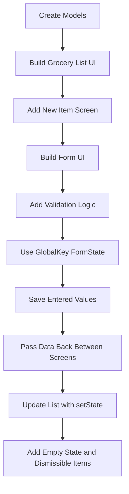
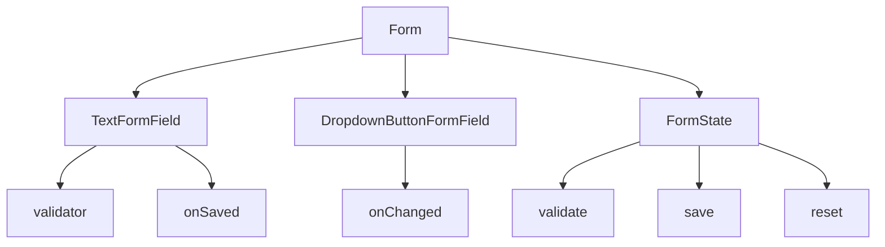
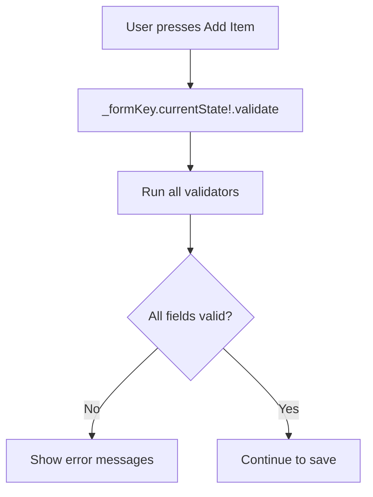
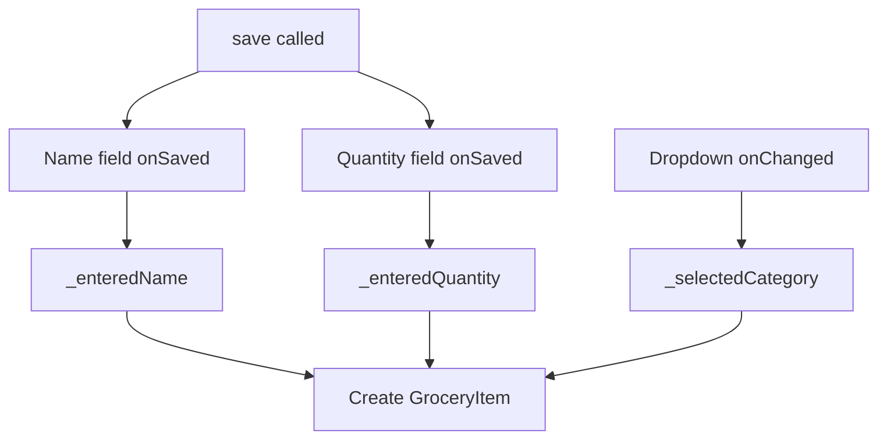
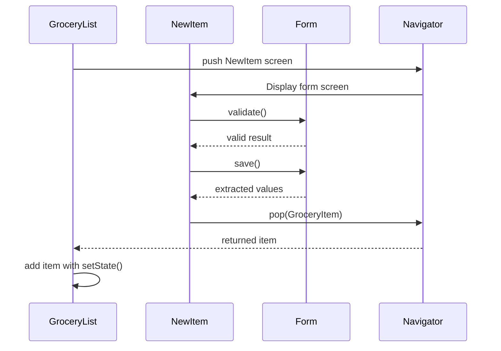
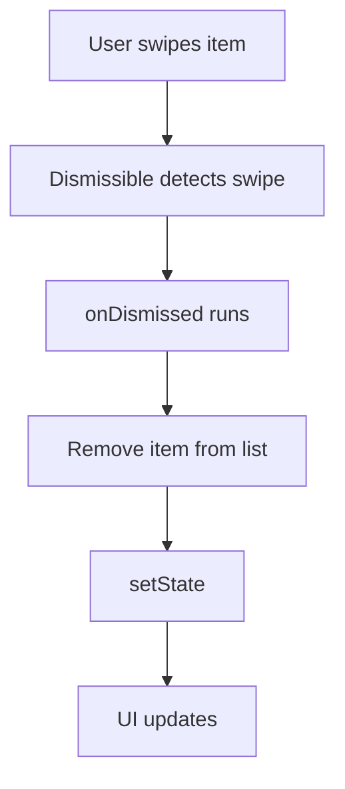
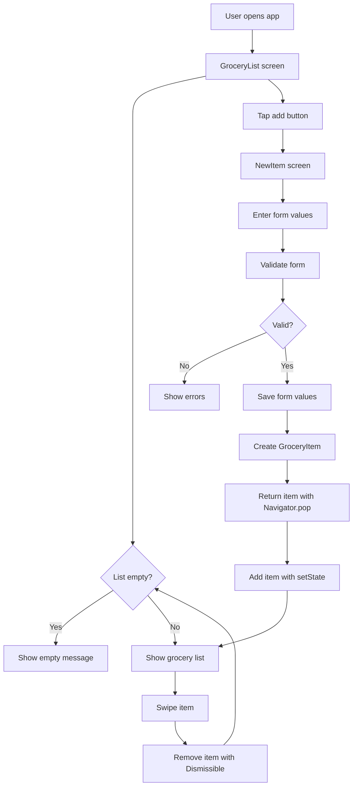

# Module Summary: Forms and User Input

## Overview

In this module, we built a complete **Shopping List App** and learned how to handle user input in a structured way using Flutter forms.

Before this module, you had already worked with user interfaces, interactivity, navigation, lists, and basic user input. This module expanded on those concepts by introducing Flutter’s `Form` widget and form-aware input widgets such as `TextFormField` and `DropdownButtonFormField`.

The main focus was learning how to collect, validate, save, and pass user-entered data between screens.

By the end of the module, the app allowed users to:

* View a shopping list
* Open a separate screen for adding new grocery items
* Enter item data through a form
* Validate the entered data
* Save the input values
* Pass the new item back to the list screen
* Display newly added items
* Remove items by swiping them away

---

## What We Built

The module centered around a practical **Shopping List App**.

The app started as a simple list UI with dummy data and gradually became a functional app that accepts user input.



---

## Main Concepts Covered

This module combined several important Flutter concepts:

| Concept                   | Purpose                                |
| ------------------------- | -------------------------------------- |
| Dart models               | Represent structured app data          |
| Enums                     | Define fixed category values           |
| `ListView.builder`        | Render dynamic lists efficiently       |
| `Form`                    | Group and manage form fields           |
| `TextFormField`           | Collect text input inside a form       |
| `DropdownButtonFormField` | Add dropdown selection to a form       |
| `validator`               | Validate user input                    |
| `GlobalKey<FormState>`    | Access form state programmatically     |
| `save()`                  | Trigger all `onSaved` callbacks        |
| `Navigator.push()`        | Open another screen                    |
| `Navigator.pop(data)`     | Return data to the previous screen     |
| `setState()`              | Update the UI after state changes      |
| `Dismissible`             | Remove list items with a swipe gesture |

---

## App Architecture

The app was organized around models, data, and widgets/screens.

```txt id="project-structure-summary"
lib/
├── data/
│   ├── categories.dart
│   └── dummy_items.dart
├── models/
│   ├── category.dart
│   └── grocery_item.dart
├── widgets/
│   ├── grocery_list.dart
│   └── new_item.dart
└── main.dart
```

The exact folder names may vary, but the main idea is to separate:

* Data models
* Static data
* UI widgets
* Screens

---

## Models Recap

The app used models to describe the shape of the data.

### `Category`

The `Category` model stores category information such as:

* Title
* Color

```dart id="category-model-summary"
class Category {
  const Category(this.title, this.color);

  final String title;
  final Color color;
}
```

### `GroceryItem`

The `GroceryItem` model stores grocery item data:

```dart id="grocery-item-model-summary"
class GroceryItem {
  const GroceryItem({
    required this.id,
    required this.name,
    required this.quantity,
    required this.category,
  });

  final String id;
  final String name;
  final int quantity;
  final Category category;
}
```

These models made the app easier to understand and maintain.

---

## Form Widgets Recap

The core widgets introduced in this module were:



---

## `Form`

The `Form` widget groups form fields together.

It does not display anything visible by itself, but it manages the state of the form fields inside it.

```dart id="form-basic-summary"
Form(
  key: _formKey,
  child: Column(
    children: [
      // form fields
    ],
  ),
)
```

---

## `TextFormField`

`TextFormField` is the form-aware version of `TextField`.

It supports:

* Input decoration
* Validation
* Saving
* Initial values
* Keyboard configuration

```dart id="textformfield-summary"
TextFormField(
  decoration: const InputDecoration(
    label: Text('Name'),
  ),
  validator: (value) {
    if (value == null || value.trim().isEmpty) {
      return 'Please enter a name.';
    }

    return null;
  },
  onSaved: (value) {
    _enteredName = value!;
  },
)
```

---

## `DropdownButtonFormField`

`DropdownButtonFormField` is the form-aware version of `DropdownButton`.

It allows dropdown input to be part of the same form structure.

```dart id="dropdown-summary"
DropdownButtonFormField(
  value: _selectedCategory,
  items: [
    for (final category in categories.entries)
      DropdownMenuItem(
        value: category.value,
        child: Text(category.value.title),
      ),
  ],
  onChanged: (value) {
    setState(() {
      _selectedCategory = value!;
    });
  },
)
```

---

## Validation Recap

Validation was handled through the `validator` callback.

A validator must return:

| Return Value | Meaning                           |
| ------------ | --------------------------------- |
| `String`     | Input is invalid, show this error |
| `null`       | Input is valid                    |

```dart id="validator-summary"
validator: (value) {
  if (value == null || value.trim().length < 2) {
    return 'Must be at least 2 characters long.';
  }

  return null;
},
```

The form validation flow looks like this:



---

## GlobalKey Recap

To trigger form methods from a button, we used a `GlobalKey<FormState>`.

```dart id="globalkey-summary"
final _formKey = GlobalKey<FormState>();
```

This key was attached to the form:

```dart id="globalkey-attached-summary"
Form(
  key: _formKey,
  child: Column(
    children: [],
  ),
)
```

Then it allowed us to call:

```dart id="formstate-methods-summary"
_formKey.currentState!.validate();
_formKey.currentState!.save();
_formKey.currentState!.reset();
```

---

## Saving Entered Values

After validation succeeded, we called:

```dart id="save-summary"
_formKey.currentState!.save();
```

This triggered all `onSaved` callbacks inside the form.



The important workflow was:

```txt id="form-workflow-summary"
validate -> save -> create item -> return item
```

---

## Passing Data Between Screens

The app used `Navigator` to pass data back from the `NewItem` screen to the `GroceryList` screen.

### From `NewItem`

```dart id="navigator-pop-summary"
Navigator.of(context).pop(
  GroceryItem(
    id: DateTime.now().toString(),
    name: _enteredName,
    quantity: _enteredQuantity,
    category: _selectedCategory,
  ),
);
```

### In `GroceryList`

```dart id="navigator-push-summary"
final newItem = await Navigator.of(context).push<GroceryItem>(
  MaterialPageRoute(
    builder: (ctx) => const NewItem(),
  ),
);

if (newItem == null) {
  return;
}

setState(() {
  _groceryItems.add(newItem);
});
```

---

## Navigation Data Flow



---

## List UI Recap

The grocery list was rendered with `ListView.builder`.

```dart id="listview-summary"
ListView.builder(
  itemCount: _groceryItems.length,
  itemBuilder: (ctx, index) {
    final item = _groceryItems[index];

    return ListTile(
      leading: Container(
        width: 24,
        height: 24,
        color: item.category.color,
      ),
      title: Text(item.name),
      trailing: Text(item.quantity.toString()),
    );
  },
)
```

This is the preferred approach for dynamic lists because Flutter only builds the visible items.

---

## Empty State Recap

When the list was empty, we displayed fallback content.

```dart id="empty-state-summary"
Widget content = const Center(
  child: Text('No items added yet.'),
);

if (_groceryItems.isNotEmpty) {
  content = ListView.builder(
    itemCount: _groceryItems.length,
    itemBuilder: (ctx, index) {
      // list item
    },
  );
}
```

This made the app feel more complete and user-friendly.

---

## Removing Items With `Dismissible`

The final challenge added swipe-to-delete behavior using `Dismissible`.

```dart id="dismissible-summary"
Dismissible(
  key: ValueKey(item.id),
  onDismissed: (direction) {
    _removeItem(item);
  },
  child: ListTile(
    title: Text(item.name),
    trailing: Text(item.quantity.toString()),
  ),
)
```

Each `Dismissible` needs a unique key, and `ValueKey(item.id)` was a good choice.



---

## Full Module Workflow



---

## Important Lessons

### 1. Use Forms for Structured Input

For simple one-field input, a `TextField` may be enough.

For multiple related inputs, validation, saving, and resetting, `Form` is usually a better choice.

---

### 2. Use Form-Aware Widgets Inside Forms

Prefer these widgets inside a `Form`:

| Basic Widget     | Form-Aware Version        |
| ---------------- | ------------------------- |
| `TextField`      | `TextFormField`           |
| `DropdownButton` | `DropdownButtonFormField` |

The form-aware versions can participate in validation and saving.

---

### 3. Validate Before Saving

Always validate first:

```dart id="validate-before-save-summary"
final isValid = _formKey.currentState!.validate();

if (!isValid) {
  return;
}

_formKey.currentState!.save();
```

This prevents invalid data from being processed.

---

### 4. Use `setState()` When UI Data Changes

When adding or removing items from the list, call `setState()`.

```dart id="setstate-summary"
setState(() {
  _groceryItems.add(newItem);
});
```

or:

```dart id="remove-setstate-summary"
setState(() {
  _groceryItems.remove(item);
});
```

Without `setState()`, the internal data may change, but the UI may not update.

---

### 5. Handle `null` When Returning From Screens

A pushed screen might return no data if the user cancels or presses back.

Always check for `null`.

```dart id="null-check-summary"
if (newItem == null) {
  return;
}
```

---

## Common Mistakes to Avoid

### 1. Creating the Form Key Inside `build()`

Do not do this:

```dart id="bad-key-location-summary"
@override
Widget build(BuildContext context) {
  final formKey = GlobalKey<FormState>();
}
```

Create it once inside the `State` class instead.

---

### 2. Forgetting to Return `null` From Validators

Validators must return `null` when input is valid.

```dart id="validator-null-summary"
return null;
```

---

### 3. Saving Without `onSaved`

Calling `save()` only triggers callbacks. If no field has `onSaved`, no value will be extracted.

---

### 4. Forgetting That Text Input Is Always a String

Even number fields return strings.

Convert when needed:

```dart id="parse-summary"
_enteredQuantity = int.parse(value!);
```

---

### 5. Updating Lists Without `setState()`

Always wrap list mutations in `setState()` when the UI depends on that list.

---

## What You Should Be Able to Do Now

After completing this module, you should be able to:

* Build a form screen in Flutter
* Use `TextFormField` for form input
* Use `DropdownButtonFormField` for selectable form input
* Add validators to form fields
* Trigger validation with `GlobalKey<FormState>`
* Save entered values with `onSaved`
* Reset a form with `reset()`
* Pass data back from one screen to another
* Update a dynamic list with `setState()`
* Render empty and non-empty UI states
* Use `Dismissible` for swipe-to-delete behavior

---

## Practice Ideas

To strengthen your understanding, try building another small app with the same pattern.

Possible practice apps:

* A task list app
* A contact form app
* A habit tracker
* A simple note-taking app
* A budget category app
* A book reading list app

Each app can follow the same core flow:

```txt id="practice-flow"
List screen -> Add screen -> Form validation -> Return data -> Update list
```

---

## What Comes Next

This module focused on local state and form handling.

The app currently stores items only while the app is running. If the app restarts, the list is lost.

In future modules, this kind of app can be improved by adding:

* Local persistence
* Backend storage
* HTTP requests
* Database integration
* Loading states
* Error handling
* Authentication
* More advanced state management

---

## Key Points

* `Form` and form-aware widgets make user input easier to manage.
* `TextFormField` is preferred over `TextField` inside a form.
* `DropdownButtonFormField` integrates dropdown input into the form lifecycle.
* `validator` functions define validation rules.
* `GlobalKey<FormState>` gives access to `validate()`, `save()`, and `reset()`.
* `onSaved` extracts entered values after validation succeeds.
* `Navigator.pop(data)` can return data to the previous screen.
* `Navigator.push()` returns a `Future` that can be awaited.
* `setState()` updates the UI after list changes.
* `Dismissible` adds swipe-to-delete behavior.
* Dart models keep app data structured and predictable.

---

## Summary

This module taught the core Flutter patterns for handling forms and user input.

By building a complete Shopping List App, we practiced how to create models, build a dynamic list UI, add a form screen, validate input, save entered values, pass data between screens, update local state, and remove list items.

These concepts are essential for almost every real-world Flutter app that collects data from users. Forms, validation, navigation, and structured models will appear again and again as your apps become more advanced.
