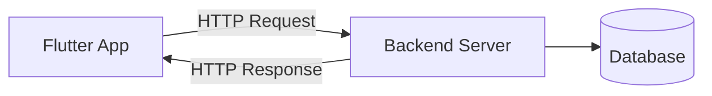
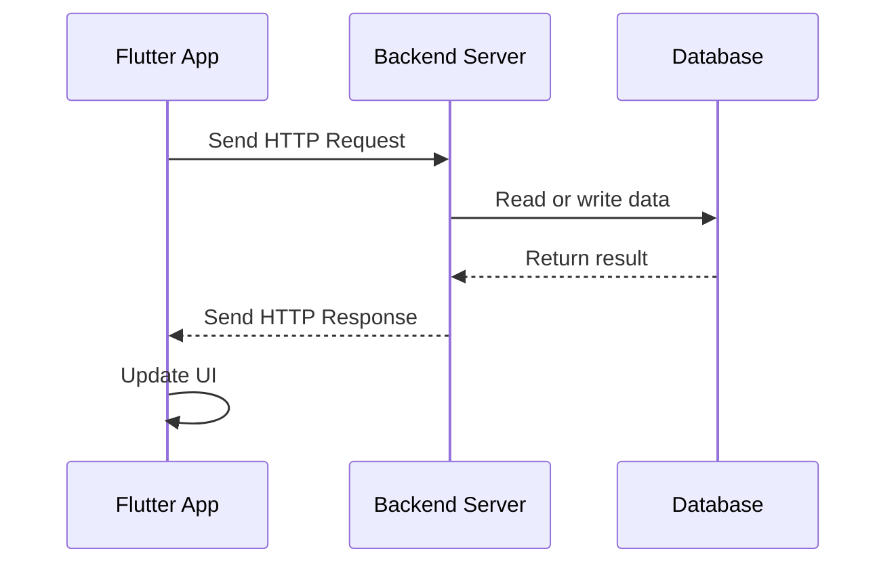

# Module Introduction: Connecting Flutter Apps to Backends

## Overview

Now that we have learned a lot about building Flutter apps and working with user input, we are going to explore how Flutter apps can connect to backends.

In this module, you will learn what a backend is, why some Flutter apps need one, and how your app can communicate with a backend over the internet.

You will also learn how to send HTTP requests from a Flutter app to a backend so that your app can fetch, create, update, or delete data remotely.

---

## What Is a Backend?

A **backend** is the server-side part of an application. It is responsible for storing data, processing requests, managing authentication, and providing information to the frontend app.

In a Flutter application, the Flutter app is usually the **frontend**, while the backend is a remote service or server that the app communicates with.



---

## Why Do Flutter Apps Need a Backend?

Not every Flutter app needs a backend. However, many real-world apps use one when they need to store, share, or synchronize data.

A backend is useful when your app needs to:

* Store data permanently
* Share data between multiple users
* Load data from the internet
* Save user-generated content
* Authenticate users
* Sync data across devices
* Communicate with external services or APIs

For example, a shopping list app may use a backend to store items online so that users can access their list from multiple devices.

---

## HTTP Communication

Flutter apps commonly communicate with backends using **HTTP requests**.

HTTP is a protocol that allows a client, such as a Flutter app, to send requests to a server and receive responses.

Common HTTP methods include:

| Method          | Purpose                      |
| --------------- | ---------------------------- |
| `GET`           | Fetch data from the backend  |
| `POST`          | Send new data to the backend |
| `PUT` / `PATCH` | Update existing data         |
| `DELETE`        | Remove data from the backend |

---

## Basic Request Flow

When a Flutter app communicates with a backend, the process usually looks like this:



---

## What You Will Learn in This Module

By the end of this module, you will understand how to:

* Connect a Flutter app to a backend
* Send HTTP requests from Flutter
* Receive and process HTTP responses
* Fetch data from a remote server
* Send new data to a backend
* Delete data from a backend
* Handle loading states
* Handle errors when requests fail
* Work with Firebase as a simple backend for practice

---

## Using Firebase as a Dummy Backend

In this module, Firebase will be used as a simple backend service.

Firebase allows us to practice backend communication without having to build our own custom server from scratch.

This makes it easier to focus on the Flutter side of networking, including HTTP requests, async code, loading indicators, and error handling.

---

## Key Concepts

### Backend

The server-side part of an application that stores and manages data.

### Frontend

The user-facing part of an application. In this case, the Flutter app is the frontend.

### HTTP Request

A message sent from the Flutter app to the backend asking for data or requesting an action.

### HTTP Response

The message returned by the backend after processing the request.

### API

An interface that allows the Flutter app to communicate with the backend.

### Async / Await

Dart syntax used to handle operations that take time, such as sending HTTP requests.

---

## Example Concept

A Flutter app may send a `GET` request to load shopping list items:

```dart
final response = await http.get(
  Uri.parse('https://example.com/items.json'),
);
```

The backend then returns data, and the Flutter app updates the UI based on the response.

---

## Important Notes

Working with backends requires understanding asynchronous programming in Dart.

HTTP requests do not complete instantly. The app must wait for a response from the server, which means you need to use `Future`, `async`, and `await`.

You also need to think about user experience. While data is loading, the app should show a loading indicator. If something goes wrong, the app should show an error message.

---

## Tips

* Review Dart `Future`, `async`, and `await` before working with HTTP requests.
* Always handle loading states when fetching data.
* Always handle errors when communicating with a backend.
* Keep backend communication code organized and separated from UI code when possible.
* Firebase is useful for learning, but the same HTTP concepts apply to most REST APIs.

---

## Summary

This module introduces backend communication in Flutter apps.

You will learn what a backend is, why Flutter apps may need one, and how Flutter apps can communicate with servers using HTTP requests.

The module will cover fetching, sending, and deleting data, as well as handling loading states and errors. These skills are essential for building real-world Flutter applications that connect to online services.
