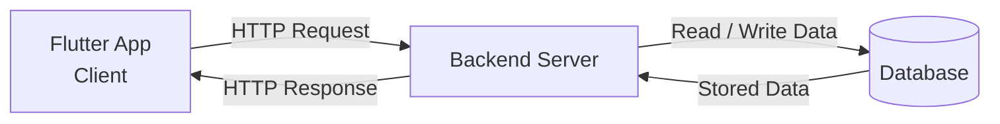
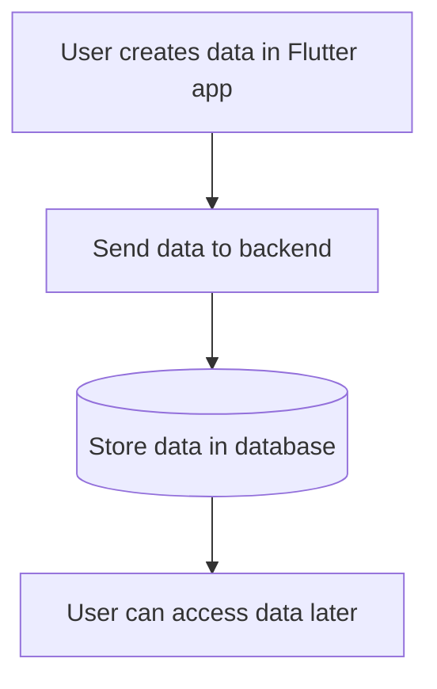
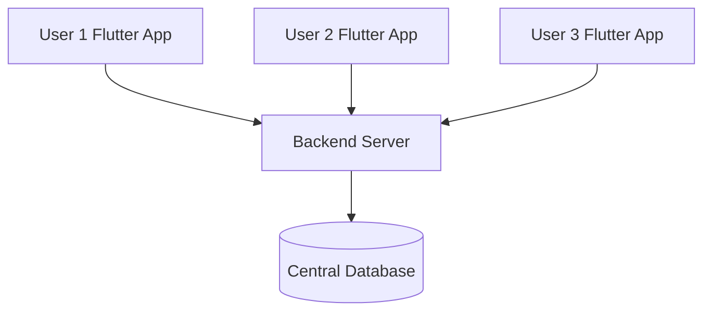
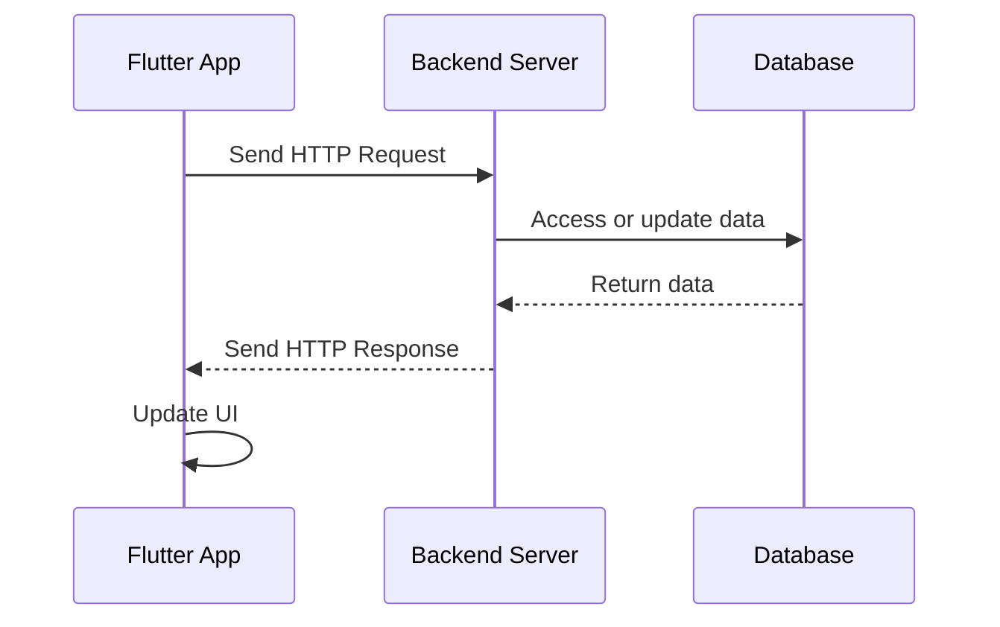
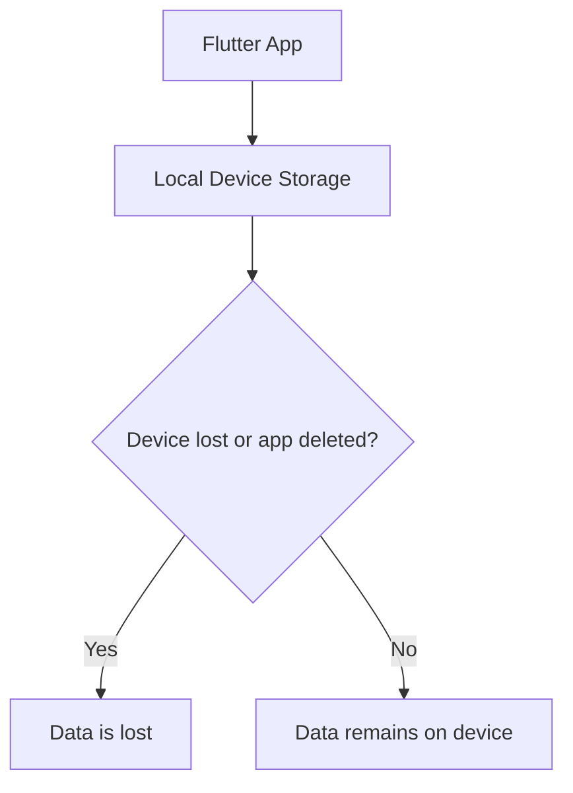
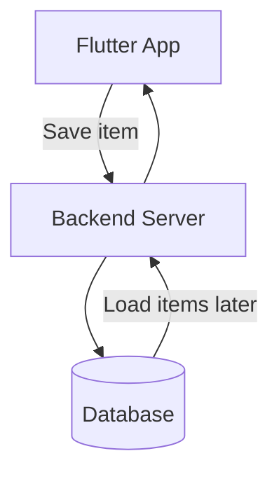

# What's a Backend and Why Would You Want One?

## Overview

This lecture explains what a backend is and why many Flutter apps need one.

So far, the apps we have built in Flutter run directly on the user's device. Any data created by those apps, such as a list of grocery items, is stored locally on that device.

That can work for small or simple apps. However, real-world apps often need data that is persistent, shared, synchronized, and available across multiple devices or users. This is where a backend becomes important.

---

## What Is a Backend?

A **backend** is the server-side part of an application.

It usually runs on computers or servers somewhere on the internet. These servers can store data, process requests, run business logic, authenticate users, and provide services that the Flutter app can use.

In this setup:

* The **Flutter app** is the client.
* The **backend server** provides data and services.
* The **database** stores the app's data centrally.



---

## Local Data vs Backend Data

When an app stores data only on the user's device, that data is local.

This means the data may be lost if:

* The user deletes the app
* The phone is lost
* The device is reset
* The user switches to a new device
* The app data is cleared

For a simple shopping list, this might not be a big problem. But for many apps, losing data would be unacceptable.

Examples include:

* Banking apps
* Social media apps
* E-commerce apps
* Ride-sharing apps
* Messaging apps
* Cloud note-taking apps
* Fitness tracking apps

---

## Why Do You Need a Backend?

A backend is useful when your app needs to work with data that should not live only on one device.

### 1. Data Persistence

A backend allows data to be stored permanently on a remote server.

This means users can still access their data even if they change devices or reinstall the app.



---

### 2. Data Sharing Between Users

Some apps need multiple users to interact with the same data.

For example, a ride-sharing app like Uber would not be useful if only one user could access it. The passenger app must communicate with drivers, and drivers must send information back to passengers.

The same idea applies to apps like:

* Uber
* Amazon
* Instagram
* WhatsApp
* Google Docs
* Online games

These apps depend on shared data stored on backend servers.

---

### 3. Centralized Data Storage

Instead of storing data separately on every user's phone, a backend stores data in one central place.

This allows users from different locations and devices to interact with the same data.



---

### 4. Business Logic and Processing

A backend can also do more than just store data.

It can handle logic that should not be placed directly inside the Flutter app, such as:

* Authentication
* Payment processing
* User permissions
* Push notifications
* Data validation
* Recommendation systems
* Order processing
* Security-sensitive operations

This keeps the Flutter app lighter, safer, and easier to maintain.

---

## Backend Examples

A backend can be built in many different ways.

You might:

* Build your own custom backend
* Use a third-party backend service
* Use a Backend-as-a-Service platform
* Connect to an existing REST API
* Connect to a GraphQL API

Common backend options include:

| Backend Type   | Description                                                                          |
| -------------- | ------------------------------------------------------------------------------------ |
| Custom Backend | A server you build yourself using languages like Node.js, Python, Java, Go, etc.     |
| REST API       | A common API style where the app sends HTTP requests to specific endpoints           |
| GraphQL API    | An API style where the app requests exactly the data it needs                        |
| Firebase       | A Backend-as-a-Service platform often used for authentication, database, and storage |
| Supabase       | An open-source Firebase alternative with database and authentication features        |

---

## Flutter App as the Client

In this architecture, the Flutter app acts as the **client**.

The client sends requests to the backend and receives responses.

For example, a Flutter app may ask the backend:

* "Give me all grocery items"
* "Save this new item"
* "Delete this item"
* "Log this user in"
* "Fetch this product list"

The backend processes the request and sends back a response.

---

## Communication Through HTTP Requests

Flutter apps usually communicate with backends using **HTTP requests**.

HTTP allows the app to send requests over the internet and receive responses from the server.



---

## Common HTTP Operations

| HTTP Method     | Purpose              | Example                |
| --------------- | -------------------- | ---------------------- |
| `GET`           | Retrieve data        | Load grocery items     |
| `POST`          | Create new data      | Add a new grocery item |
| `PUT` / `PATCH` | Update existing data | Edit an item           |
| `DELETE`        | Remove data          | Delete an item         |

---

## Example: App Without a Backend

If a shopping list app has no backend, the data only exists on the user's phone.



This may be acceptable for a small demo app, but it is not ideal for real-world apps.

---

## Example: App With a Backend

If the same app uses a backend, grocery items can be stored remotely.



Now the data can be restored even if the user changes devices.

---

## Why This Course Uses a Dummy Backend

In this course section, we will not build a custom backend from scratch.

The focus is not backend development. Instead, the goal is to learn how a Flutter app communicates with a backend.

Therefore, we will use a simple third-party backend service as a dummy backend. This allows us to practice:

* Sending HTTP requests
* Storing data remotely
* Retrieving data from a backend
* Deleting data from a backend
* Handling loading states
* Handling request errors

The same concepts can later be applied to other backend systems.

---

## Key Concepts

### Backend

A remote server that provides data, storage, processing, and services to an app.

### Client

The app or device that sends requests to the backend. In this case, the Flutter app is the client.

### Server

A computer running somewhere on the internet that receives requests and sends responses.

### Database

A system used by the backend to store and manage data.

### HTTP Request

A message sent by the Flutter app to the backend.

### HTTP Response

A message sent back by the backend after processing the request.

### API

A defined interface that allows the Flutter app to communicate with the backend.

---

## Practical Example

Imagine a grocery app.

Without a backend:

```text
The grocery list exists only on the phone.
If the phone is lost, the list is lost.
```

With a backend:

```text
The grocery list is stored on a server.
The user can access it from another device.
Multiple users could also share the same list.
```

---

## Tips

* Not every app needs a backend.
* Use a backend when data must be stored permanently or shared between users.
* Firebase or Supabase can be useful when you do not want to build a custom backend.
* REST APIs are one of the most common ways for Flutter apps to communicate with backends.
* Keep sensitive logic on the backend instead of placing everything inside the Flutter app.

---

## Summary

A backend is a remote server that stores, processes, and provides data for an application.

Flutter apps run on the user's device, so data stored only inside the app can be lost or isolated. A backend solves this problem by storing data centrally and making it accessible across devices and users.

Most real-world apps use a backend because they need persistent storage, shared data, authentication, business logic, or communication with other users and services.

In Flutter, communication with a backend usually happens through HTTP requests. This is the main topic we will explore throughout this module.
