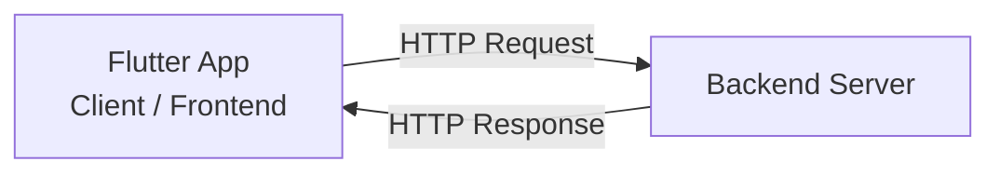
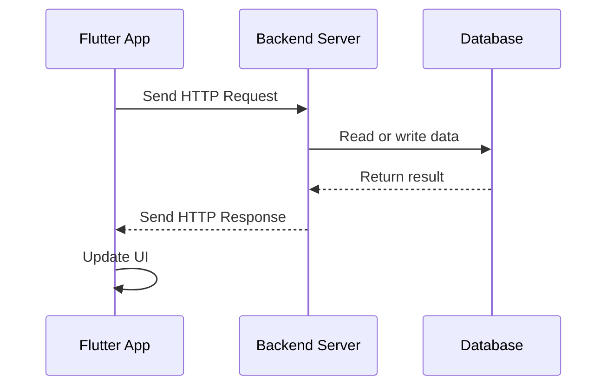
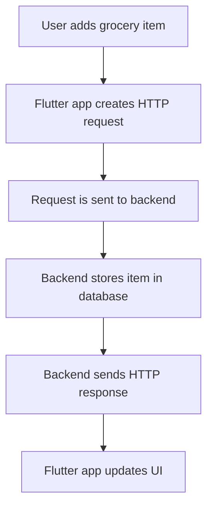
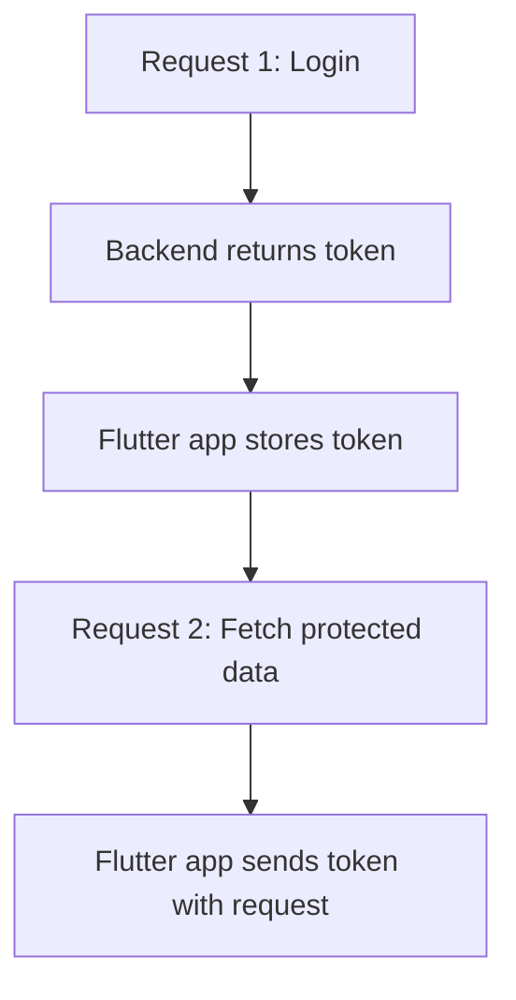

# What Is HTTP and How Does It Work?

## Overview

This lecture introduces **HTTP**, which stands for **HyperText Transfer Protocol**.

HTTP is the main communication protocol used by apps and websites to exchange data with backend servers. In Flutter apps, HTTP is commonly used when the app needs to fetch, send, update, or delete data from a backend.

Before writing networking code in Flutter, it is important to understand how HTTP requests and responses work.

---

## What Is HTTP?

**HTTP** is a standardized protocol that allows a frontend client and a backend server to communicate with each other.

In a Flutter application:

* The **Flutter app** acts as the client or frontend.
* The **backend server** receives requests and processes them.
* The backend sends a response back to the Flutter app.



HTTP is the bridge between your Flutter app and the backend.

---

## Why HTTP Matters in Flutter Apps

Some Flutter apps only store data locally on the user's device.

However, many real-world apps need to communicate with a backend to:

* Store data remotely
* Load data from a database
* Share data between users
* Authenticate users
* Fetch product lists, messages, posts, or user profiles
* Save newly created data
* Delete or update existing data

For this kind of communication, Flutter apps usually send **HTTP requests**.

---

## The HTTP Request-Response Cycle

HTTP communication follows a simple request-response pattern.

The frontend sends a request, the backend processes it, and then the backend sends back a response.



The Flutter app cannot directly access the backend's database. Instead, it sends a request to the backend, and the backend decides what to do.

---

## Example Scenario: Shopping List App

Imagine a shopping list app.

When the user adds a new grocery item, the app may need to save that item in a remote database.

The flow could look like this:



For example, the app might send data like this:

```json
{
  "name": "Milk",
  "quantity": 2
}
```

The backend receives this data, stores it, and sends a response back to the app.

---

## What Does an HTTP Request Contain?

An HTTP request is a structured message sent from the client to the server.

A typical HTTP request contains:

| Part    | Description                             |
| ------- | --------------------------------------- |
| URL     | The address of the backend endpoint     |
| Method  | The action the request wants to perform |
| Headers | Metadata about the request              |
| Body    | Optional data sent with the request     |

---

## Request URL

The **URL** tells the app where the request should be sent.

Example:

```text
https://example.com/grocery-items
```

This URL points to a specific backend endpoint.

---

## HTTP Methods

The **HTTP method** tells the backend what kind of action the client wants to perform.

Common HTTP methods include:

| Method   | Purpose               | Example                  |
| -------- | --------------------- | ------------------------ |
| `GET`    | Fetch data            | Load all grocery items   |
| `POST`   | Send or create data   | Add a new grocery item   |
| `PUT`    | Replace existing data | Replace an entire item   |
| `PATCH`  | Partially update data | Update only the quantity |
| `DELETE` | Remove data           | Delete a grocery item    |

---

## Request Headers

Headers contain metadata about the request.

They can describe things such as:

* The type of data being sent
* Authentication information
* Accepted response format
* App or client information

Example:

```text
Content-Type: application/json
Authorization: Bearer <token>
```

Headers help the backend understand how to handle the request.

---

## Request Body

The **body** contains data attached to the request.

Not every request has a body.

For example, a `GET` request usually does not need a body because it only fetches data.

A `POST` request often includes a body because it sends new data to the backend.

Example request body:

```json
{
  "name": "Apples",
  "quantity": 5
}
```

---

## What Does an HTTP Response Contain?

After the backend handles the request, it sends back an HTTP response.

A typical HTTP response contains:

| Part        | Description                                       |
| ----------- | ------------------------------------------------- |
| Status Code | Indicates whether the request succeeded or failed |
| Headers     | Metadata about the response                       |
| Body        | Optional data returned by the backend             |

---

## HTTP Status Codes

The **status code** tells the client what happened with the request.

Common status code groups:

| Status Code Range | Meaning      |
| ----------------- | ------------ |
| `2xx`             | Success      |
| `3xx`             | Redirection  |
| `4xx`             | Client error |
| `5xx`             | Server error |

Common examples:

| Status Code                 | Meaning                                          |
| --------------------------- | ------------------------------------------------ |
| `200 OK`                    | Request succeeded                                |
| `201 Created`               | New data was successfully created                |
| `400 Bad Request`           | The request was invalid                          |
| `401 Unauthorized`          | Authentication is required or invalid            |
| `403 Forbidden`             | The client is not allowed to access the resource |
| `404 Not Found`             | The requested resource does not exist            |
| `500 Internal Server Error` | Something went wrong on the server               |

---

## Response Body

The response body contains data sent back from the backend.

For example, after fetching grocery items, the backend might return:

```json
[
  {
    "id": "item1",
    "name": "Milk",
    "quantity": 2
  },
  {
    "id": "item2",
    "name": "Bread",
    "quantity": 1
  }
]
```

The Flutter app can then decode this JSON and use it to update the UI.

---

## JSON and HTTP

Data is commonly exchanged between Flutter apps and backends using **JSON**.

JSON stands for **JavaScript Object Notation**. It is a lightweight format for storing and transferring structured data.

Example JSON object:

```json
{
  "title": "Flutter Course",
  "completed": false
}
```

Dart can convert JSON data into Dart maps and lists using built-in tools.

Example:

```dart
import 'dart:convert';

final data = jsonDecode(response.body);
```

And Dart objects can be converted into JSON using:

```dart
final jsonData = jsonEncode({
  'name': 'Milk',
  'quantity': 2,
});
```

---

## HTTP Is Stateless

HTTP is a **stateless** protocol.

This means each request is independent. The server does not automatically remember previous requests.

For example, if a user logs in, the app usually needs to send some form of authentication information, such as a token, with later requests.



This is why headers are often used to send authentication data.

---

## HTTP vs HTTPS

You will often see both `HTTP` and `HTTPS`.

| Protocol | Description                          |
| -------- | ------------------------------------ |
| `HTTP`   | Sends data without encryption        |
| `HTTPS`  | Sends data securely using encryption |

For real-world apps, you should use **HTTPS** whenever possible.

HTTPS protects data while it travels between the Flutter app and the backend.

From a Flutter coding perspective, sending requests to HTTP and HTTPS URLs works almost the same way. The main difference is that HTTPS is secure.

---

## Backend Support Matters

A Flutter app cannot send just any request and expect it to work.

The backend must be programmed to support the request.

For example, if the backend supports this endpoint:

```text
POST /grocery-items
```

Then the Flutter app can send a `POST` request to create a new grocery item.

But if the backend does not support that endpoint or method, the request will fail.

The backend code defines:

* Which URLs are available
* Which HTTP methods are accepted
* What data format is required
* What response is returned
* What errors can happen

---

## Using a Dummy Backend in This Course

In this course section, we will not build a custom backend.

Instead, we will use a simple third-party backend service.

The goal is to focus on Flutter networking concepts, such as:

* Sending HTTP requests
* Receiving HTTP responses
* Encoding data as JSON
* Decoding JSON responses
* Handling loading states
* Handling errors
* Updating the UI after a request completes

The same concepts can later be applied to real REST APIs, Firebase, Supabase, or custom backends.

---

## Example HTTP Flow in Flutter

A simplified Flutter HTTP request may look like this:

```dart
final response = await http.get(
  Uri.parse('https://example.com/items.json'),
);

if (response.statusCode == 200) {
  final data = jsonDecode(response.body);
  // Use the data to update the app
} else {
  // Handle error
}
```

This example shows three important steps:

1. Send the request.
2. Check the status code.
3. Decode and use the response body.

---

## Important Development Tips

* Always check the status code before using the response body.
* Use `try-catch` to handle request errors.
* Show a loading indicator while waiting for the response.
* Show an error message if the request fails.
* Use JSON for structured data exchange.
* Use HTTPS for real-world apps.
* Test requests with tools like Postman, Insomnia, or browser developer tools.
* Keep networking code separate from UI code when possible.

---

## Key Concepts

### HTTP

A protocol used for communication between a client and a server.

### Client

The app that sends the request. In this course, the Flutter app is the client.

### Backend Server

The server that receives requests, processes them, and sends responses.

### Request

A message sent from the client to the server.

### Response

A message sent from the server back to the client.

### URL

The address of the backend endpoint.

### Method

The HTTP action, such as `GET`, `POST`, `PUT`, `PATCH`, or `DELETE`.

### Headers

Metadata attached to a request or response.

### Body

The actual data sent with a request or response.

### Status Code

A number that indicates whether the request succeeded or failed.

### JSON

A common data format used to exchange structured data between apps and backends.

---

## Summary

HTTP is the protocol that allows Flutter apps to communicate with backend servers.

The Flutter app sends an HTTP request to the backend. The backend processes the request, may interact with a database, and then sends back an HTTP response.

Requests usually contain a URL, method, headers, and sometimes a body. Responses usually contain a status code, headers, and sometimes a body.

Understanding HTTP methods, status codes, headers, and JSON is essential before building Flutter apps that connect to real backends.
