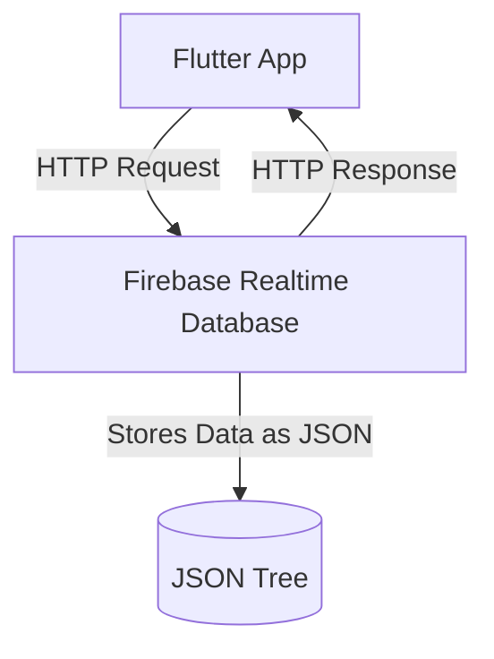
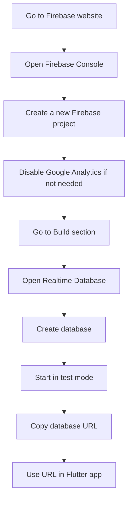
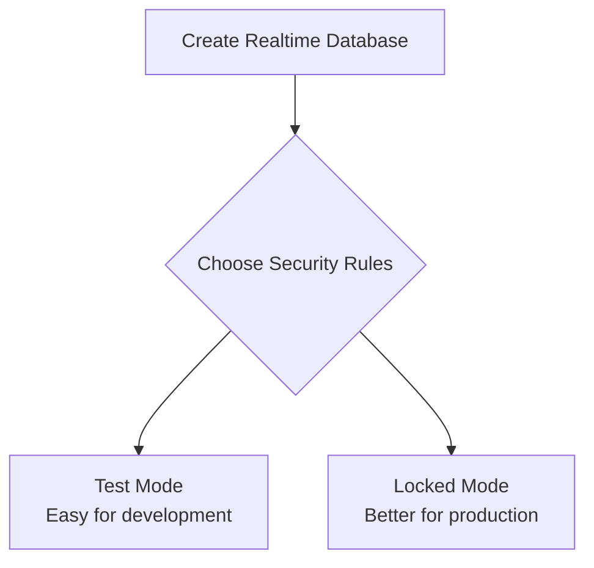
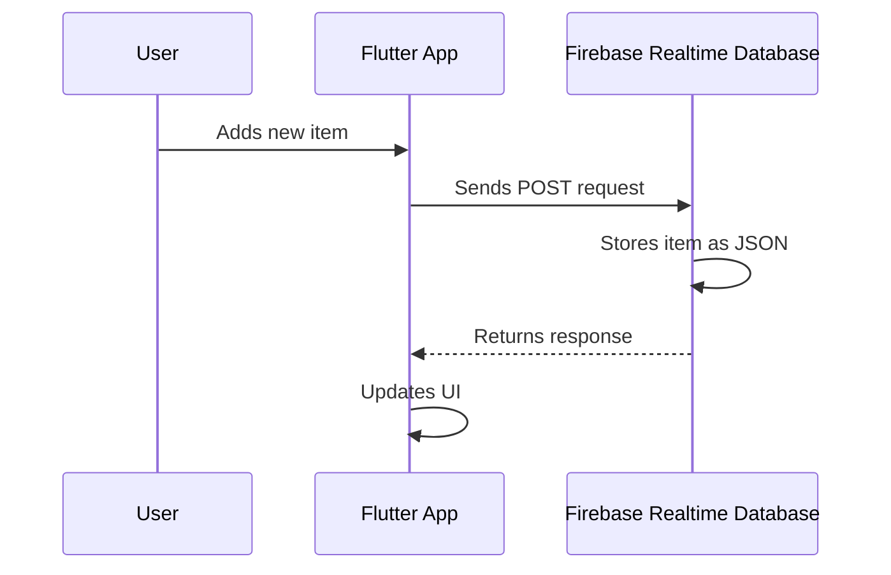

# Setting Up a Dummy Backend with Firebase

## Overview

This lecture explains how to set up **Firebase Realtime Database** as a dummy backend for the Flutter project.

In this course section, we will not build a custom backend from scratch. Instead, we will use Firebase, a backend service provided by Google, to practice sending real HTTP requests from a Flutter app.

Firebase makes it easy to store and retrieve data through HTTP without writing any server-side code.

---

## Why Use Firebase as a Dummy Backend?

Firebase is useful for this module because it provides ready-made backend services.

With Firebase, we can quickly create a database and send HTTP requests to it from our Flutter app.

This allows us to focus on the Flutter side of backend communication, including:

* Sending HTTP requests
* Storing data remotely
* Fetching data from a backend
* Working with JSON data
* Handling loading states
* Handling request errors

Firebase is only one example. The same HTTP concepts can also be used with other backends, REST APIs, or custom servers.

---

## What Is Firebase?

**Firebase** is a platform provided by Google that offers backend services for web and mobile applications.

Firebase includes many services, such as:

* Realtime Database
* Cloud Firestore
* Authentication
* Cloud Storage
* Hosting
* Cloud Functions
* Analytics
* Push notifications

In this course section, we will only use **Firebase Realtime Database** as a simple dummy backend.

---

## What Is Firebase Realtime Database?

**Firebase Realtime Database** is a cloud-hosted NoSQL database.

It stores data as a large JSON tree.

This makes it simple to store structured data without setting up tables, schemas, or a custom server.



---

## Why This Is Useful for Learning

Normally, if you want a backend, you may need to:

* Choose a backend language
* Write server-side code
* Set up routes or endpoints
* Connect to a database
* Deploy the server
* Manage hosting

Firebase removes most of this setup.

Instead, Firebase automatically gives us a database URL that we can send HTTP requests to.

This makes it ideal for learning HTTP communication in Flutter.

---

## Basic Firebase Setup Flow

The setup process looks like this:



---

## Step 1: Open Firebase Console

To get started, search for Firebase and open the Firebase website.

Then sign in using a Google account.

After logging in, open the Firebase Console.

```text id="4i0ynv"
Firebase Console:
console.firebase.google.com
```

The Firebase Console is where you create and manage Firebase projects.

---

## Step 2: Create a New Firebase Project

Inside the Firebase Console, create a new project.

You can give the project any name you want.

For this course section, the project name does not matter much because we are only using it as a practice backend.

During project setup, Firebase may ask whether you want to enable Google Analytics.

For this module, Google Analytics is not required.

You can disable it to keep the setup simple.

---

## Step 3: Open Realtime Database

After creating the Firebase project, go to the left sidebar.

Choose:

```text id="hckkki"
Build > Realtime Database
```

This is the Firebase service we will use as our backend database.

---

## Step 4: Create the Database

Click the button to create a new Realtime Database.

Firebase may ask you to choose a database region.

For this learning project, the selected region is not very important.

In a real production app, you should choose a region close to your users for better performance.

---

## Step 5: Choose Test Mode

When creating the database, Firebase will ask you to choose security rules.

For this course section, choose **test mode**.

Test mode allows open read and write access, which makes it easier to practice HTTP requests.



---

## Important Warning About Test Mode

Test mode is only for learning and development.

It allows requests to read and write data without authentication.

That is convenient for practice, but unsafe for real apps.

Before deploying a real app, you should replace test mode rules with secure rules.

```text id="lb48ly"
Use test mode for learning.
Use secure rules for production.
```

---

## Step 6: Copy the Database URL

After the Realtime Database is created, Firebase gives you a database URL.

It usually looks like this:

```text id="uh1e0c"
https://<project-id>-default-rtdb.firebaseio.com/
```

This URL is the base address of your Firebase Realtime Database.

Your Flutter app will send HTTP requests to this URL.

---

## Firebase REST API URL Format

Firebase Realtime Database exposes a REST API automatically.

To access a specific data node, you add a path to the database URL.

You must also append `.json` to the end of the URL.

Example:

```text id="8ze7li"
https://<project-id>-default-rtdb.firebaseio.com/shopping-list.json
```

Or:

```text id="oauiw6"
https://<project-id>-default-rtdb.firebaseio.com/meals.json
```

The `.json` suffix is required when using Firebase Realtime Database through its REST API.

---

## How Firebase Stores Data

Firebase Realtime Database stores data as JSON.

For example, if you store shopping list items, the database may look like this:

```json id="kkx0lm"
{
  "shopping-list": {
    "item1": {
      "name": "Milk",
      "quantity": 2
    },
    "item2": {
      "name": "Bread",
      "quantity": 1
    }
  }
}
```

This structure is similar to a nested Dart map.

---

## Example: Targeting a Specific Node

If your database URL is:

```text id="haehzb"
https://my-flutter-app-default-rtdb.firebaseio.com/
```

And you want to store grocery items under a `shopping-list` node, your request URL would be:

```text id="5vf1g8"
https://my-flutter-app-default-rtdb.firebaseio.com/shopping-list.json
```

The path after the base URL controls where the data is stored.

```mermaid id="7x7xhm"
flowchart TD
    A[Base Firebase URL] --> B[/shopping-list.json]
    B --> C[shopping-list node in database]
```

---

## Firebase REST API Documentation

Firebase provides official documentation for its Realtime Database REST API.

This documentation explains:

* Which URLs to use
* Which HTTP methods are supported
* How to store data
* How to retrieve data
* How to update data
* How to delete data

In this course, we will not study the full documentation in detail. However, it is useful to know where this information comes from.

---

## How Flutter Will Use Firebase

Once the Firebase database is ready, the Flutter app can send HTTP requests to it.

For example:

| Action       | HTTP Method | Firebase Purpose             |
| ------------ | ----------- | ---------------------------- |
| Load data    | `GET`       | Fetch stored data            |
| Add data     | `POST`      | Create a new entry           |
| Replace data | `PUT`       | Replace existing data        |
| Update data  | `PATCH`     | Change part of existing data |
| Delete data  | `DELETE`    | Remove data                  |

---

## Example Request Flow

When the user adds an item in the Flutter app, the flow may look like this:



---

## Why We Are Not Building a Custom Backend

This course section focuses on Flutter, not backend development.

Building a custom backend would require additional topics such as:

* Backend programming languages
* Server frameworks
* Databases
* Authentication systems
* Deployment
* Hosting
* Security configuration

Instead, Firebase gives us a ready-made backend so we can focus on HTTP requests from Flutter.

---

## Key Concepts

### Firebase

A Google platform that provides backend services for mobile and web apps.

### Firebase Realtime Database

A cloud-hosted NoSQL database that stores data as JSON.

### Dummy Backend

A backend used for learning, testing, or prototyping instead of production.

### REST API

An API that can be accessed through HTTP requests.

### Database URL

The base URL used to send requests to a Firebase Realtime Database.

### Test Mode

A development mode that allows open read and write access.

### `.json` Suffix

A required part of Firebase Realtime Database REST API URLs.

---

## Important Tips

* Use Firebase test mode only for development and learning.
* Never deploy a production app with open read/write rules.
* Always append `.json` when using the Firebase Realtime Database REST API.
* Store your Firebase URL somewhere easy to access during development.
* Firebase is only one backend option; the HTTP knowledge applies to many APIs.
* Keep your Flutter networking code organized so it can be changed later if you switch backends.

---

## Summary

In this lecture, we set up Firebase Realtime Database as a dummy backend.

Firebase allows us to create a hosted database quickly without writing backend code. It automatically provides REST API endpoints that our Flutter app can access through HTTP requests.

This gives us a practical backend for learning how to send, receive, store, and delete data from a Flutter app.

In the next steps, we can return to the Flutter project and start sending HTTP requests to this Firebase backend.
