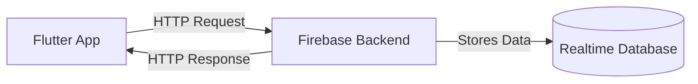
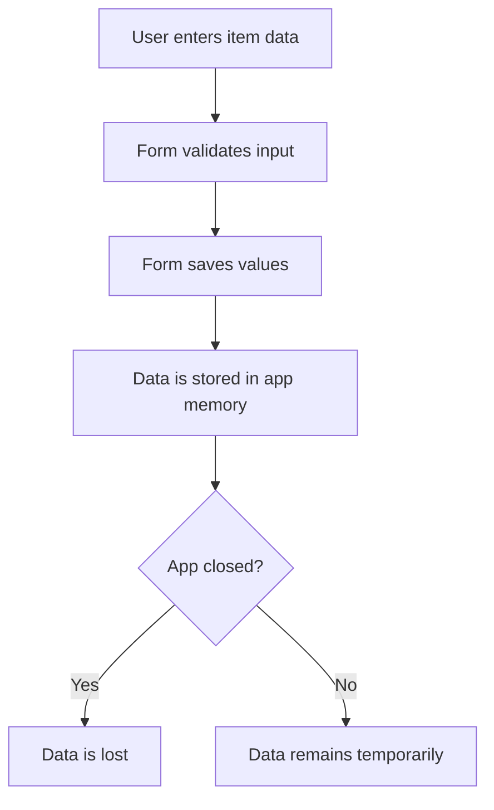
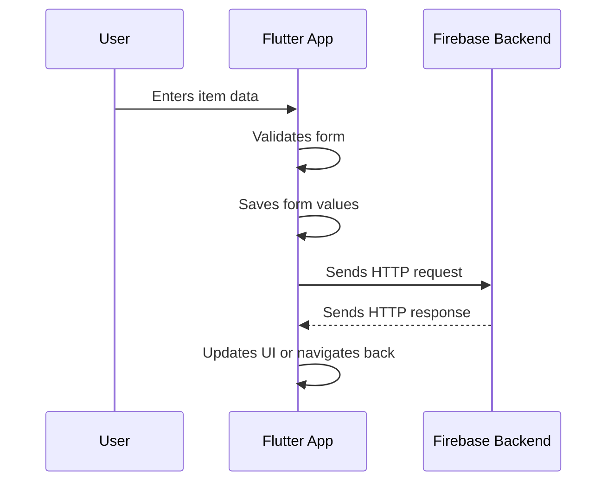

# Adding the `http` Package

## Overview

This lecture explains how to add the official `http` package to a Flutter project.

To communicate with a backend, a Flutter app must be able to send HTTP requests. Flutter does not automatically provide a high-level HTTP API for REST requests, so we commonly add the `http` package.

The `http` package allows us to send requests such as `GET`, `POST`, and `DELETE` from our Flutter app to a backend like Firebase Realtime Database.

---

## Why Do We Need the `http` Package?

In the previous lectures, we set up Firebase Realtime Database as a dummy backend.

Now we need a way to send data from our Flutter app to that backend.

For example, in a shopping list app, when the user adds a new item, we do not want to store it only in memory. Instead, we want to send that item to Firebase so it can be stored remotely.



Without the `http` package, our Flutter app cannot easily send these requests.

---

## Current App Situation

Inside the `new_item.dart` file, there is a `saveItem` method.

This method currently:

1. Validates the form.
2. Saves the entered form values.
3. Navigates back to the previous screen.
4. Passes the newly created item data back.

This works locally, but the data is not stored in a backend yet.

At the moment, the data only exists in memory while the app is running.



To store the data remotely, we need to send it to Firebase using HTTP.

---

## Installing the `http` Package

The `http` package is available on `pub.dev`.

You can install it by running this command in the terminal:

```bash id="aod8qn"
flutter pub add http
```

This automatically adds the package to your `pubspec.yaml` file.

Alternatively, you can manually add it:

```yaml id="o3zgxm"
dependencies:
  flutter:
    sdk: flutter
  http: ^1.2.0
```

After editing `pubspec.yaml`, run:

```bash id="p7s1fb"
flutter pub get
```

This downloads and installs the package for your Flutter project.

---

## Importing the Package

After installing the package, import it in the Dart file where you want to send HTTP requests.

For example, in `new_item.dart`:

```dart id="omjmf0"
import 'package:http/http.dart' as http;
```

The `as http` part creates an alias for the package.

This means all functions from the package can be accessed through the `http` prefix.

For example:

```dart id="fp3xj8"
http.get(...);
http.post(...);
http.delete(...);
```

---

## Why Use `as http`?

Using `as http` is a common Flutter convention.

It helps avoid naming conflicts and makes the code easier to understand.

Without the alias, imported classes or functions could conflict with other names in your project.

With the alias, it is always clear that a method comes from the `http` package.

```dart id="sxmo2h"
import 'package:http/http.dart' as http;
```

This makes your code more readable:

```dart id="eozm89"
final response = await http.get(url);
```

Instead of looking like a normal local function call, `http.get()` clearly shows that the request is coming from the HTTP package.

---

## Basic HTTP Request Example

To send a request, first create a `Uri`.

The `http` package expects a `Uri` object, not just a plain string.

```dart id="b2iasg"
final url = Uri.parse(
  'https://my-project-default-rtdb.firebaseio.com/meals.json',
);
```

Then send a request:

```dart id="qku46q"
final response = await http.get(url);
```

The response contains information returned by the backend.

For example:

```dart id="7gmfh8"
print(response.body);
```

This prints the raw response body, usually as a JSON string.

---

## Full Basic Example

```dart id="ae7xk7"
import 'package:http/http.dart' as http;

void fetchData() async {
  final url = Uri.parse(
    'https://my-project-default-rtdb.firebaseio.com/meals.json',
  );

  final response = await http.get(url);

  print(response.body);
}
```

In this example:

1. The `http` package is imported.
2. A Firebase URL is converted into a `Uri`.
3. A `GET` request is sent.
4. The response body is printed.

---

## Common HTTP Functions

The `http` package provides several useful functions.

| Function        | Purpose                      |
| --------------- | ---------------------------- |
| `http.get()`    | Fetch data from a backend    |
| `http.post()`   | Send new data to a backend   |
| `http.put()`    | Replace existing data        |
| `http.patch()`  | Update part of existing data |
| `http.delete()` | Delete data from a backend   |

These functions are asynchronous and return a `Future`.

That means they should usually be used with `await`.

---

## HTTP Requests Are Asynchronous

Sending an HTTP request takes time because the app must communicate over the internet.

Therefore, HTTP methods return a `Future`.

For example:

```dart id="gdrlw8"
final response = await http.get(url);
```

The `await` keyword pauses the function until the response is received.

Because `await` is used, the surrounding function must be marked as `async`.

```dart id="t798pb"
void fetchData() async {
  final response = await http.get(url);
}
```

---

## Request Flow in the App

After adding the `http` package, the app can send data to Firebase.



This allows the app to store data outside the user's device.

---

## Important Notes

The `http` package is only responsible for sending and receiving HTTP requests.

It does not automatically:

* Convert Dart objects to JSON
* Decode JSON into Dart models
* Handle loading indicators
* Handle errors for you
* Manage app state

You still need to write code for these tasks yourself.

For JSON conversion, you will usually use Dart's built-in `dart:convert` library.

Example:

```dart id="oe02o6"
import 'dart:convert';

final jsonData = jsonEncode({
  'name': 'Milk',
  'quantity': 2,
});
```

---

## Key Concepts

### `http` Package

A Dart package used to send HTTP requests from Flutter apps.

### `pubspec.yaml`

The file where Flutter project dependencies are listed.

### `flutter pub add`

A command used to add a new package to a Flutter project.

### `flutter pub get`

A command used to download and install project dependencies.

### `Uri.parse()`

A method used to convert a URL string into a `Uri` object.

### `as http`

An import alias that groups the package functionality under the `http` name.

### `Future<http.Response>`

The result type returned by HTTP request functions.

---

## Tips

* Use `flutter pub add http` to install the package quickly.
* Import the package with `as http` for cleaner and safer code.
* Always convert URL strings with `Uri.parse()`.
* Use `await` when sending HTTP requests.
* Remember that HTTP requests can fail, so error handling will be important later.
* Keep backend request code organized and separate from complex UI logic when possible.

---

## Summary

To send HTTP requests from Flutter, we add the official `http` package to the project.

The package is installed through `pubspec.yaml` or by running `flutter pub add http`.

After installing it, we import it with:

```dart id="etw0pn"
import 'package:http/http.dart' as http;
```

This gives us access to methods such as `http.get()`, `http.post()`, and `http.delete()`.

These methods allow the Flutter app to communicate with a backend like Firebase by sending asynchronous HTTP requests and receiving responses.
