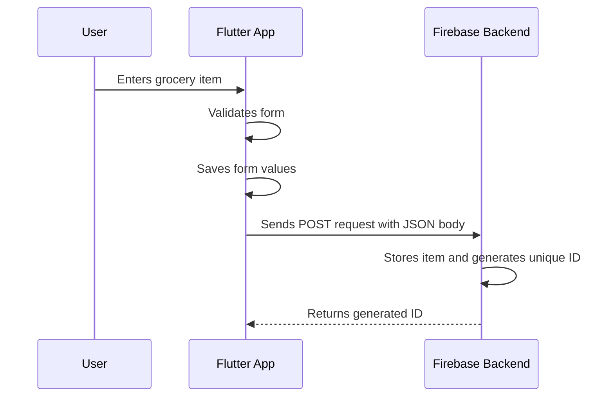
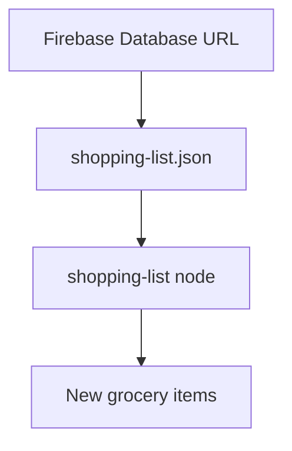

# Sending a POST Request to the Backend

## Overview

This lecture explains how to send a **POST request** from a Flutter app to a backend.

In this project, we use Firebase Realtime Database as a dummy backend. When the user adds a new grocery item, we want to send that data to Firebase so it can be stored remotely instead of only existing in app memory.

A `POST` request is commonly used to create or store new data on a backend.

---

## Why Use a POST Request?

Different HTTP methods are used for different backend actions.

For Firebase Realtime Database:

| HTTP Method | Purpose                      |
| ----------- | ---------------------------- |
| `GET`       | Load data from Firebase      |
| `POST`      | Add new data to Firebase     |
| `PUT`       | Replace existing data        |
| `PATCH`     | Update part of existing data |
| `DELETE`    | Remove data from Firebase    |

Since we want to store a new grocery item, we use:

```dart
http.post()
```

---

## Request Flow

When the user submits the form, the app sends the entered data to Firebase.



---

## Preparing the URL

The first thing needed for the request is the backend URL.

The `http.post()` method expects a `Uri`, not a plain string.

There are two common ways to create the URL.

### Option 1: Using `Uri.parse()`

```dart
final url = Uri.parse(
  'https://my-project-default-rtdb.firebaseio.com/shopping-list.json',
);
```

### Option 2: Using `Uri.https()`

```dart
final url = Uri.https(
  'my-project-default-rtdb.firebaseio.com',
  'shopping-list.json',
);
```

For Firebase Realtime Database, the URL must end with:

```text
.json
```

This is required by Firebase's REST API.

---

## Firebase URL Structure

A Firebase Realtime Database REST URL usually looks like this:

```text
https://<project-id>-default-rtdb.firebaseio.com/<path>.json
```

Example:

```text
https://my-flutter-app-default-rtdb.firebaseio.com/shopping-list.json
```

The `shopping-list` part is the database node where the data will be stored.



You can choose this path yourself. Firebase will create the node automatically when data is added.

---

## Adding Headers

The request should include headers.

Headers are metadata sent with the request.

For this request, we add:

```dart
headers: {
  'Content-Type': 'application/json',
},
```

This tells Firebase that the request body contains JSON data.

---

## Encoding Data as JSON

The body of the request contains the data we want to send.

However, HTTP request bodies are usually sent as text. Therefore, we must convert our Dart map into JSON.

To do that, import Dart's built-in convert library:

```dart
import 'dart:convert';
```

Then use:

```dart
json.encode(...)
```

Example:

```dart
body: json.encode({
  'name': _enteredName,
  'quantity': _enteredQuantity,
  'category': _selectedCategory.title,
}),
```

---

## Why Store the Category Title?

The selected category may be a full Dart object.

Sending a full Dart object directly to Firebase may fail because JSON encoding only works with simple encodable values, such as:

* String
* Number
* Boolean
* List
* Map
* Null

So instead of sending the whole category object, we store only the category title.

```dart
'category': _selectedCategory.title,
```

Later, when loading the data back from Firebase, we can use that title to map the item back to the correct category object.

---

## Full POST Request Example

```dart
import 'dart:convert';

import 'package:http/http.dart' as http;

Future<void> _saveItem() async {
  if (_formKey.currentState!.validate()) {
    _formKey.currentState!.save();

    final url = Uri.https(
      'my-project-default-rtdb.firebaseio.com',
      'shopping-list.json',
    );

    final response = await http.post(
      url,
      headers: {
        'Content-Type': 'application/json',
      },
      body: json.encode({
        'name': _enteredName,
        'quantity': _enteredQuantity,
        'category': _selectedCategory.title,
      }),
    );

    print(response.body);
  }
}
```

---

## What Firebase Returns

When you send a `POST` request to Firebase, Firebase stores the data and automatically generates a unique ID.

The response body usually looks like this:

```json
{
  "name": "-NxT8abc123"
}
```

The `name` value is the generated Firebase ID.

This ID can later be used to identify, update, or delete the item.

---

## Example Firebase Data Structure

After sending a POST request, Firebase may store the data like this:

```json
{
  "shopping-list": {
    "-NxT8abc123": {
      "name": "Milk",
      "quantity": 2,
      "category": "Dairy"
    }
  }
}
```

Firebase automatically creates the unique key:

```text
-NxT8abc123
```

You do not need to generate this ID manually.

---

## Important: Use Your Own Firebase URL

When writing the URL, make sure you use your own Firebase Realtime Database URL.

Do not copy another project's URL.

You can find your URL in:

```text
Firebase Console > Build > Realtime Database
```

Example structure:

```text
https://your-project-id-default-rtdb.firebaseio.com/
```

Then add your path and `.json`:

```text
https://your-project-id-default-rtdb.firebaseio.com/shopping-list.json
```

---

## Firebase Rules for This Demo

If the request fails, check your Firebase Realtime Database rules.

For this learning project, the database should allow read and write access.

Example test rules:

```json
{
  "rules": {
    ".read": true,
    ".write": true
  }
}
```

This is useful for development, but it is not secure for production.

For real apps, you should use secure rules and authentication.

---

## Common Mistakes

### Missing `.json`

Firebase REST API URLs must end with `.json`.

Incorrect:

```text
https://my-project-default-rtdb.firebaseio.com/shopping-list
```

Correct:

```text
https://my-project-default-rtdb.firebaseio.com/shopping-list.json
```

---

### Using the Wrong Firebase URL

Make sure you copy the Realtime Database URL, not another Firebase service URL.

---

### Forgetting `await`

HTTP requests are asynchronous.

Incorrect:

```dart
final response = http.post(url);
```

Correct:

```dart
final response = await http.post(url);
```

---

### Forgetting to Encode the Body

The body must be a JSON string.

Incorrect:

```dart
body: {
  'name': _enteredName,
}
```

Correct:

```dart
body: json.encode({
  'name': _enteredName,
});
```

---

## Key Concepts

### `http.post()`

Sends a POST request to a backend.

### POST Request

An HTTP request commonly used to create new data.

### Request Body

The data attached to the outgoing request.

### JSON Encoding

The process of converting Dart data into JSON text.

### Headers

Metadata attached to the request.

### `Content-Type`

A header that tells the backend what kind of data is being sent.

### Firebase Generated ID

A unique key automatically created by Firebase when new data is added using `POST`.

---

## Tips

* Use `http.post()` when creating new data on a backend.
* Always encode Dart maps with `json.encode()` before sending them as a request body.
* Add the `Content-Type: application/json` header when sending JSON.
* Do not send complex Dart objects directly; convert them to simple values first.
* Always use your own Firebase Realtime Database URL.
* Check Firebase rules if requests fail during development.
* Remember that test mode is not safe for production.

---

## Summary

In this lecture, we sent a `POST` request from Flutter to Firebase.

The app validates and saves the form data, builds a Firebase URL, encodes the item data as JSON, and sends it using `http.post()`.

Firebase stores the data under the selected database path and automatically generates a unique ID for the new item.

This allows the Flutter app to store user-created data remotely instead of keeping it only in memory.
