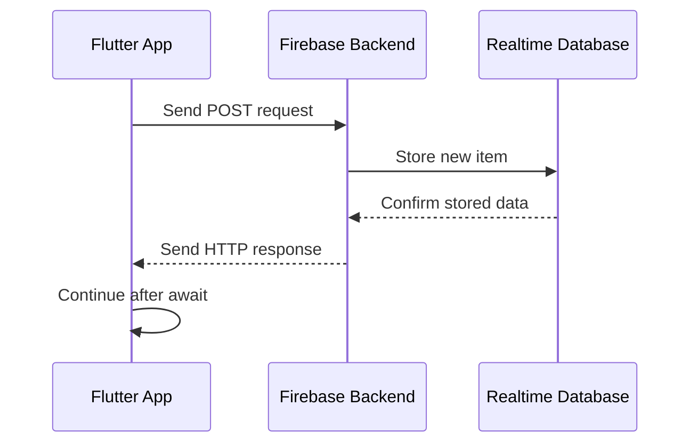
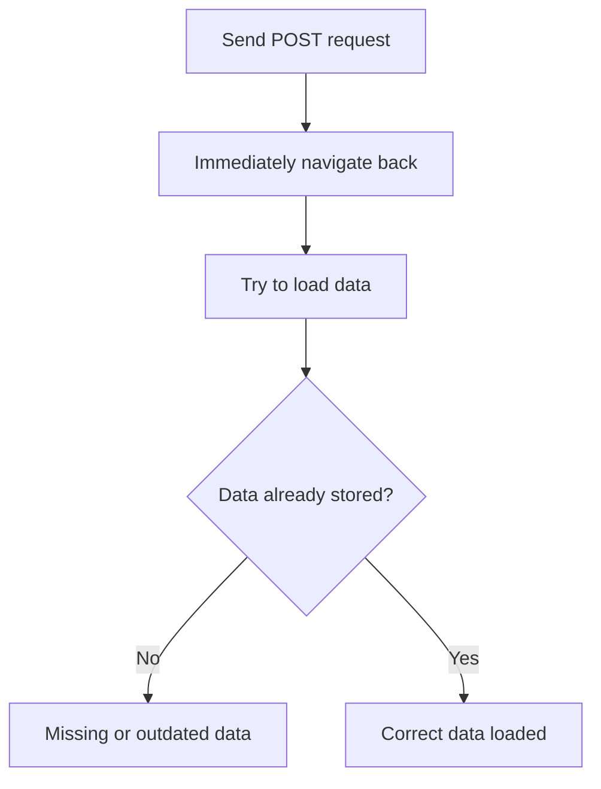
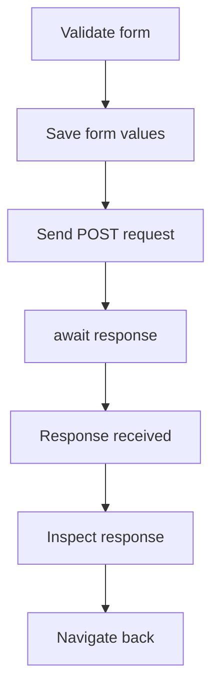
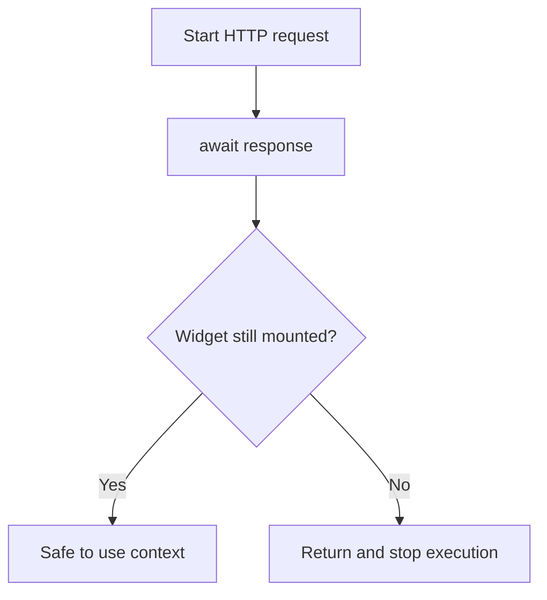

# Working with the Request and Waiting for the Response

## Overview

This lecture explains how to properly work with HTTP requests and responses in Flutter.

When sending data to a backend, the request does not complete instantly. The app must wait for the backend to receive the request, process it, store the data, and send a response back.

In Flutter, this waiting process is handled with **Futures**, `async`, and `await`.

---

## Why Do We Need to Wait for the Response?

HTTP requests take time because they involve communication over the internet.

When the app sends a request, several things happen:

1. The Flutter app creates the HTTP request.
2. The request is sent to the backend.
3. The backend processes the request.
4. The backend may store or load data from a database.
5. The backend creates a response.
6. The response is sent back to the Flutter app.



If we do not wait for the response, the app may continue too early.

For example, the app might navigate back before the data has actually been stored in Firebase.

---

## The Problem Without Waiting

If the app sends a request and immediately continues, the next screen might try to load data before Firebase has finished storing it.



This can create timing issues, also known as **race conditions**.

To avoid this, we should wait for the backend response before continuing.

---

## HTTP Requests Return Futures

The `http.post()` method does not immediately return a response.

Instead, it returns a `Future`.

A `Future` represents a value that will be available later.

```dart id="l6it2r"
final responseFuture = http.post(url);
```

At this point, the request has started, but the actual response is not available yet.

To access the response, we need to wait for the `Future` to complete.

---

## Using `async` and `await`

The most common way to wait for an HTTP response is to use `async` and `await`.

First, mark the function as `async`:

```dart id="jzfglc"
Future<void> _saveItem() async {
  // async code here
}
```

Then use `await` before the HTTP request:

```dart id="22v56u"
final response = await http.post(
  url,
  headers: {
    'Content-Type': 'application/json',
  },
  body: json.encode({
    'name': _enteredName,
    'quantity': _enteredQuantity,
    'category': _selectedCategory.title,
  }),
);
```

The `await` keyword pauses the function until the response arrives.

Only after the response is available will Dart continue with the next line of code.

---

## Request Flow with `await`



This ensures that the app only continues after Firebase has responded.

---

## The `http.Response` Object

When the request completes, `http.post()` gives us an `http.Response` object.

This object contains useful information about the backend response.

Important properties include:

| Property                | Description                                      |
| ----------------------- | ------------------------------------------------ |
| `response.statusCode`   | The HTTP status code returned by the server      |
| `response.body`         | The response body as a raw string                |
| `response.headers`      | Metadata returned by the server                  |
| `response.reasonPhrase` | Optional text description of the response status |

---

## Checking the Status Code

The status code tells us whether the request succeeded or failed.

Common status code groups:

| Status Code Range | Meaning      |
| ----------------- | ------------ |
| `2xx`             | Success      |
| `4xx`             | Client error |
| `5xx`             | Server error |

Examples:

| Status Code                 | Meaning                  |
| --------------------------- | ------------------------ |
| `200 OK`                    | Request succeeded        |
| `201 Created`               | New resource was created |
| `400 Bad Request`           | Invalid request          |
| `401 Unauthorized`          | Authentication problem   |
| `404 Not Found`             | Resource not found       |
| `500 Internal Server Error` | Server-side problem      |

For now, we may simply print the status code:

```dart id="rs9jw5"
print(response.statusCode);
```

Later, we can use it for proper error handling.

---

## Reading the Response Body

The response body contains data returned by the backend.

For Firebase Realtime Database, after a successful `POST` request, the response body contains the generated ID.

Example response:

```json id="ak8taw"
{
  "name": "-NxT8abc123"
}
```

This `name` value is the unique key generated by Firebase for the newly stored item.

In Dart, we can print the raw response body:

```dart id="r8mfcu"
print(response.body);
```

---

## Decoding the Response Body

The response body is a raw JSON string.

To use it as a Dart object, decode it with `json.decode()`.

```dart id="zzfqjk"
final responseData = json.decode(response.body);
print(responseData['name']);
```

This converts the JSON string into a Dart map.

Example:

```dart id="bd0iks"
final Map<String, dynamic> responseData = json.decode(response.body);

final generatedId = responseData['name'];
```

The generated ID can later be used to identify, update, or delete the item.

---

## Full Example

```dart id="fhbd1p"
import 'dart:convert';

import 'package:http/http.dart' as http;

Future<void> _saveItem() async {
  if (_formKey.currentState!.validate()) {
    _formKey.currentState!.save();

    final url = Uri.https(
      'my-project-default-rtdb.firebaseio.com',
      'shopping-list.json',
    );

    final response = await http.post(
      url,
      headers: {
        'Content-Type': 'application/json',
      },
      body: json.encode({
        'name': _enteredName,
        'quantity': _enteredQuantity,
        'category': _selectedCategory.title,
      }),
    );

    print(response.statusCode);
    print(response.body);

    final responseData = json.decode(response.body);
    print(responseData['name']);
  }
}
```

---

## Navigating Back After the Request

After the request finishes, we may want to return to the previous screen.

For example:

```dart id="s41xvk"
Navigator.of(context).pop();
```

However, there is an important Flutter warning to consider.

If we use `context` after an `await`, Flutter may warn us about using a build context across an async gap.

---

## Understanding the Async Gap Warning

This warning happens because the widget may no longer be visible after the asynchronous operation finishes.

For example:

1. The request starts.
2. The app waits for the response.
3. During that waiting time, the user leaves the screen.
4. The response arrives.
5. The code tries to use `context`, but the widget may no longer be mounted.



To avoid this problem, check whether the context is still mounted.

---

## Checking `context.mounted`

After `await`, use:

```dart id="wgj86v"
if (!context.mounted) {
  return;
}
```

Then it is safer to use `context`:

```dart id="tklz8e"
Navigator.of(context).pop();
```

Full example:

```dart id="ksr5va"
final response = await http.post(
  url,
  headers: {
    'Content-Type': 'application/json',
  },
  body: json.encode({
    'name': _enteredName,
    'quantity': _enteredQuantity,
    'category': _selectedCategory.title,
  }),
);

print(response.statusCode);
print(response.body);

if (!context.mounted) {
  return;
}

Navigator.of(context).pop();
```

---

## Final Improved Example

```dart id="q60s6i"
import 'dart:convert';

import 'package:http/http.dart' as http;

Future<void> _saveItem() async {
  if (_formKey.currentState!.validate()) {
    _formKey.currentState!.save();

    final url = Uri.https(
      'my-project-default-rtdb.firebaseio.com',
      'shopping-list.json',
    );

    final response = await http.post(
      url,
      headers: {
        'Content-Type': 'application/json',
      },
      body: json.encode({
        'name': _enteredName,
        'quantity': _enteredQuantity,
        'category': _selectedCategory.title,
      }),
    );

    print('Status code: ${response.statusCode}');
    print('Response body: ${response.body}');

    if (!context.mounted) {
      return;
    }

    Navigator.of(context).pop();
  }
}
```

---

## `await` vs `.then()`

There are two common ways to handle a `Future`.

### Option 1: Using `.then()`

```dart id="sq8tkr"
http.post(url).then((response) {
  print(response.body);
});
```

### Option 2: Using `async` / `await`

```dart id="zon6fq"
final response = await http.post(url);
print(response.body);
```

Both approaches work, but `async` / `await` is usually easier to read, especially when you have multiple asynchronous steps.

---

## Key Concepts

### Future

An object that represents a value that will become available later.

### `async`

Marks a function as asynchronous and allows the use of `await`.

### `await`

Pauses execution until a `Future` completes.

### `http.Response`

The object returned after an HTTP request completes.

### `statusCode`

The HTTP status code returned by the backend.

### `body`

The raw response data returned by the backend.

### `json.decode()`

Converts a JSON string into a Dart object.

### `context.mounted`

Checks whether the widget connected to the current context is still part of the widget tree.

---

## Important Tips

* Always wait for important backend requests before continuing.
* Use `await` to get the completed response.
* Use `response.statusCode` to check whether the request succeeded.
* Use `response.body` to inspect the data returned by the backend.
* Decode JSON responses with `json.decode()`.
* Check `context.mounted` before using `context` after an `await`.
* Do not assume the request succeeded just because no error appeared immediately.

---

## Summary

HTTP requests are asynchronous, so the app must wait for the backend response before continuing.

The `http.post()` method returns a `Future` that eventually provides an `http.Response` object. By using `async` and `await`, we can pause the function until the response arrives.

The response contains useful information such as the status code and response body. In Firebase, a successful POST request returns a JSON object containing the generated item ID.

Waiting for the response ensures that the app only navigates back or loads data after the backend has finished processing the request.
