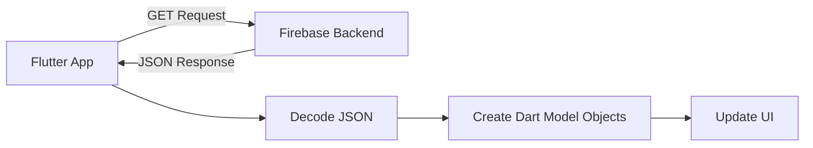
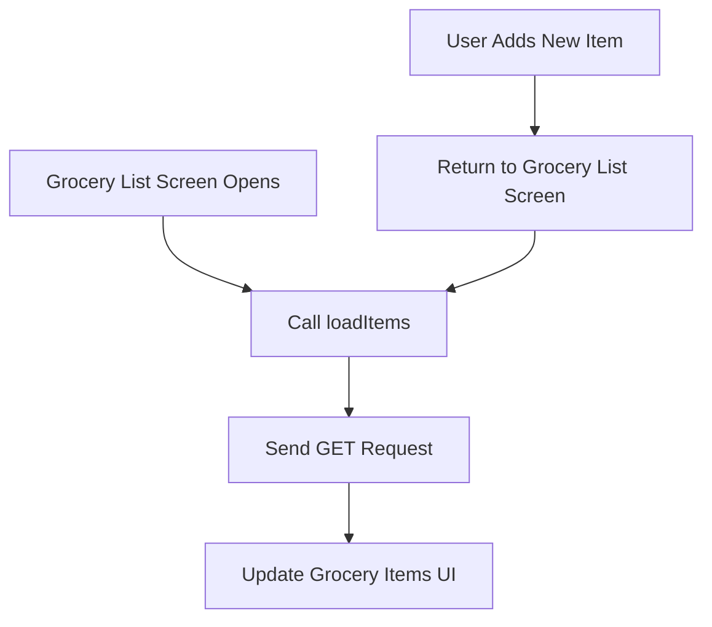
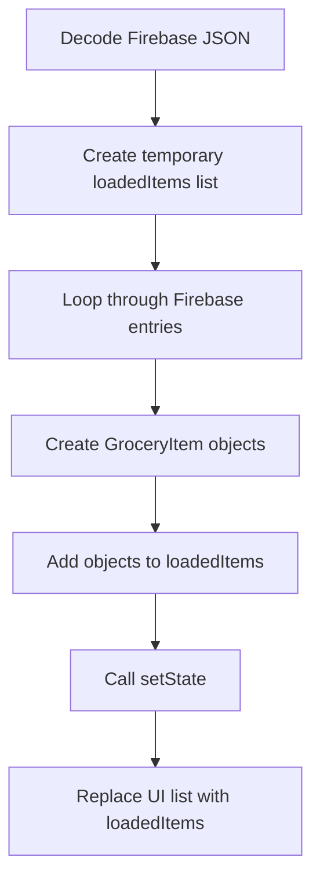

# Fetching and Transforming Data

## Overview

This lecture explains how to fetch data from a Firebase backend and transform the returned JSON data into usable Dart model objects.

After storing data in Firebase with a `POST` request, the next step is to load that data back into the Flutter app. To do that, we send a `GET` request, decode the JSON response, convert the raw data into `GroceryItem` objects, and update the UI.

---

## Why Fetch Data from the Backend?

Previously, newly added grocery items were only stored in the app temporarily or sent to Firebase.

Now we want the app to load items from Firebase so that the UI reflects the data stored in the backend.

This is important because backend data should be the source of truth.



---

## Using a GET Request

To fetch data from Firebase, we use:

```dart id="xlj1un"
http.get()
```

A `GET` request is used to retrieve data from a backend.

Unlike a `POST` request, a `GET` request usually does not send a body.

Example:

```dart id="uq3ril"
final response = await http.get(url);
```

The response contains the data returned by Firebase.

---

## Creating the Request URL

The URL is created in the same way as before.

For Firebase Realtime Database, the URL must end with `.json`.

```dart id="pi2dhk"
final url = Uri.https(
  'my-project-default-rtdb.firebaseio.com',
  'shopping-list.json',
);
```

The full URL points to the database node where the shopping list data is stored.

Example Firebase structure:

```text id="w1v9y7"
https://my-project-default-rtdb.firebaseio.com/shopping-list.json
```

---

## Where Should We Fetch the Data?

We want to fetch data in two situations:

1. When the grocery list screen opens for the first time.
2. After the user returns from the new item screen.

This ensures that the displayed list is always based on the latest backend data.



---

## Creating a `loadItems` Method

Instead of writing the GET request directly inside another method, we create a separate method called `loadItems`.

```dart id="ym9rdf"
Future<void> _loadItems() async {
  final url = Uri.https(
    'my-project-default-rtdb.firebaseio.com',
    'shopping-list.json',
  );

  final response = await http.get(url);

  print(response.body);
}
```

This method sends a request to Firebase and prints the returned data.

---

## Calling `loadItems` in `initState`

To load data when the screen first appears, call `_loadItems()` inside `initState`.

```dart id="invdyt"
@override
void initState() {
  super.initState();
  _loadItems();
}
```

`initState` runs once when the state object is created.

This makes it a good place for initialization work, such as loading data from a backend.

---

## Calling `loadItems` After Adding an Item

When the user navigates to the new item screen, we can wait until they return.

After they return, we call `_loadItems()` again.

```dart id="fvjq8q"
void _addItem() async {
  await Navigator.of(context).push(
    MaterialPageRoute(
      builder: (ctx) => const NewItem(),
    ),
  );

  _loadItems();
}
```

In this version, we no longer expect the new item to be passed back with `Navigator.pop()`.

Instead, the new item is stored in Firebase, and the list screen reloads data from the backend.

---

## Firebase Response Structure

Firebase does not return a simple list.

Instead, Firebase returns a JSON object where:

* Each key is a generated Firebase ID.
* Each value is the stored item data.

Example response:

```json id="te7dq2"
{
  "-NxT8abc123": {
    "name": "Milk",
    "quantity": 2,
    "category": "Dairy"
  },
  "-NxT9def456": {
    "name": "Bananas",
    "quantity": 12,
    "category": "Fruit"
  }
}
```

This means we must iterate through the map and convert every entry into a `GroceryItem`.

---

## Decoding the JSON Response

The response body is a raw JSON string.

To work with it in Dart, decode it using `json.decode()`.

First, import `dart:convert`:

```dart id="l728pq"
import 'dart:convert';
```

Then decode the response body:

```dart id="bx9b31"
final Map<String, dynamic> listData = json.decode(response.body);
```

Now `listData` contains the Firebase data as a Dart map.

---

## Transforming Firebase Data into Dart Objects

After decoding the response, we create a temporary list.

```dart id="e8l6su"
final List<GroceryItem> loadedItems = [];
```

Then we loop through the Firebase map.

```dart id="dgn12j"
for (final item in listData.entries) {
  loadedItems.add(
    GroceryItem(
      id: item.key,
      name: item.value['name'],
      quantity: item.value['quantity'],
      category: item.value['category'],
    ),
  );
}
```

However, in this project, the category stored in Firebase is only the category title. The actual app expects a full `Category` object.

So we need one extra transformation step.

---

## Mapping Category Titles Back to Category Objects

When saving data to Firebase, we stored only the category title.

Example:

```json id="kwtvae"
{
  "name": "Milk",
  "quantity": 2,
  "category": "Dairy"
}
```

But the `GroceryItem` model expects a `Category` object.

So we search through the predefined `categories` map and find the category with the matching title.

```dart id="m3p0r8"
final category = categories.entries
    .firstWhere(
      (catItem) => catItem.value.title == item.value['category'],
    )
    .value;
```

Then we use that category when creating the `GroceryItem`.

---

## Full Data Transformation Example

```dart id="t74e9g"
Future<void> _loadItems() async {
  final url = Uri.https(
    'my-project-default-rtdb.firebaseio.com',
    'shopping-list.json',
  );

  final response = await http.get(url);

  final Map<String, dynamic> listData = json.decode(response.body);
  final List<GroceryItem> loadedItems = [];

  for (final item in listData.entries) {
    final category = categories.entries
        .firstWhere(
          (catItem) => catItem.value.title == item.value['category'],
        )
        .value;

    loadedItems.add(
      GroceryItem(
        id: item.key,
        name: item.value['name'],
        quantity: item.value['quantity'],
        category: category,
      ),
    );
  }

  setState(() {
    _groceryItems = loadedItems;
  });
}
```

---

## Why Use a Temporary List?

We use a temporary list called `loadedItems` instead of directly modifying the UI list.

This keeps the transformation process clean.

The flow is:



Only after all items are transformed do we update the state.

---

## Updating the UI with `setState`

After the data has been transformed, we update the state.

```dart id="lfwsxg"
setState(() {
  _groceryItems = loadedItems;
});
```

This tells Flutter to rebuild the widget and display the loaded items.

Because the list is reassigned, `_groceryItems` should not be `final`.

Example:

```dart id="btr0e1"
List<GroceryItem> _groceryItems = [];
```

---

## Complete Example

```dart id="mx295g"
import 'dart:convert';

import 'package:flutter/material.dart';
import 'package:http/http.dart' as http;

class GroceryList extends StatefulWidget {
  const GroceryList({super.key});

  @override
  State<GroceryList> createState() => _GroceryListState();
}

class _GroceryListState extends State<GroceryList> {
  List<GroceryItem> _groceryItems = [];

  @override
  void initState() {
    super.initState();
    _loadItems();
  }

  Future<void> _loadItems() async {
    final url = Uri.https(
      'my-project-default-rtdb.firebaseio.com',
      'shopping-list.json',
    );

    final response = await http.get(url);

    final Map<String, dynamic> listData = json.decode(response.body);
    final List<GroceryItem> loadedItems = [];

    for (final item in listData.entries) {
      final category = categories.entries
          .firstWhere(
            (catItem) => catItem.value.title == item.value['category'],
          )
          .value;

      loadedItems.add(
        GroceryItem(
          id: item.key,
          name: item.value['name'],
          quantity: item.value['quantity'],
          category: category,
        ),
      );
    }

    setState(() {
      _groceryItems = loadedItems;
    });
  }

  void _addItem() async {
    await Navigator.of(context).push(
      MaterialPageRoute(
        builder: (ctx) => const NewItem(),
      ),
    );

    _loadItems();
  }
}
```

---

## Handling Type Issues

Sometimes Dart may complain about the decoded JSON type.

For example, this may be too specific in some cases:

```dart id="f5fqwx"
final Map<String, Map<String, dynamic>> listData =
    json.decode(response.body);
```

A safer version is:

```dart id="ttd0y0"
final Map<String, dynamic> listData = json.decode(response.body);
```

This gives Dart more flexibility when working with Firebase's dynamic JSON response.

---

## Handling Empty Firebase Data

If the Firebase node has no data, Firebase may return:

```json id="e9mqn0"
null
```

If you try to treat `null` as a map, the app will crash.

A later improvement is to check for this case:

```dart id="yts8rs"
if (response.body == 'null') {
  setState(() {
    _groceryItems = [];
  });
  return;
}
```

This prevents errors when the backend has no stored items.

---

## GET Request vs POST Request

| Request Type | Purpose                      | Has Body?   |
| ------------ | ---------------------------- | ----------- |
| `GET`        | Fetch data from the backend  | Usually no  |
| `POST`       | Send new data to the backend | Usually yes |

For loading items, we use `GET`.

For adding items, we use `POST`.

---

## Key Concepts

### `http.get()`

Sends a GET request to fetch data from a backend.

### `response.body`

The raw JSON string returned by the backend.

### `json.decode()`

Converts a JSON string into Dart data structures.

### `Map<String, dynamic>`

A common Dart type for decoded JSON objects.

### Firebase Generated ID

The unique key Firebase creates for each item.

### Data Transformation

The process of converting raw backend data into strongly typed Dart model objects.

### `initState`

A lifecycle method that runs once when a state object is created.

### `setState`

Tells Flutter that state has changed and the UI should rebuild.

---

## Important Tips

* Use `http.get()` to fetch data from Firebase.
* A GET request usually does not need a request body.
* Decode `response.body` with `json.decode()`.
* Firebase returns a map of generated IDs, not a simple list.
* Use the Firebase key as the local model object's ID.
* Convert raw JSON data into strongly typed Dart objects before using it in the UI.
* Use `setState()` after loading data to update the screen.
* Handle the case where Firebase returns `null` if no data exists.

---

## Summary

In this lecture, we fetched data from Firebase using a `GET` request.

The raw Firebase response was returned as JSON. We decoded that JSON into a Dart map, looped through each Firebase entry, and converted every item into a `GroceryItem` object.

Because Firebase stores each item under a generated ID, we used each map key as the local item ID.

Finally, we stored the transformed list in state with `setState()`, allowing the Flutter UI to display the loaded backend data.
