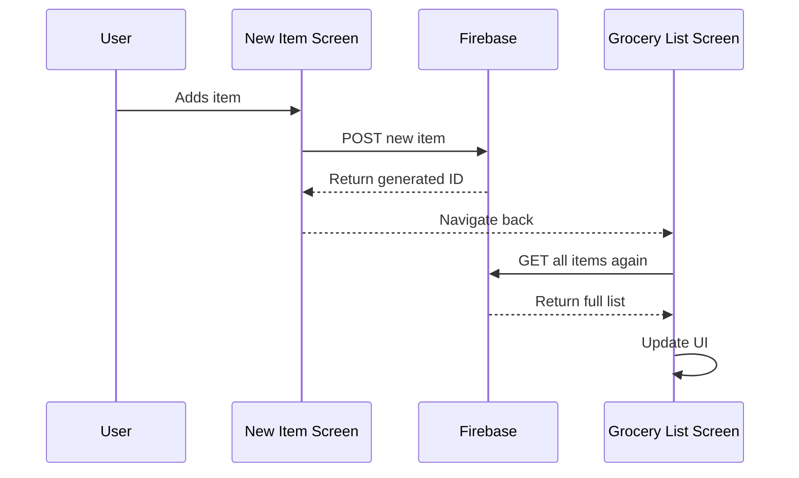
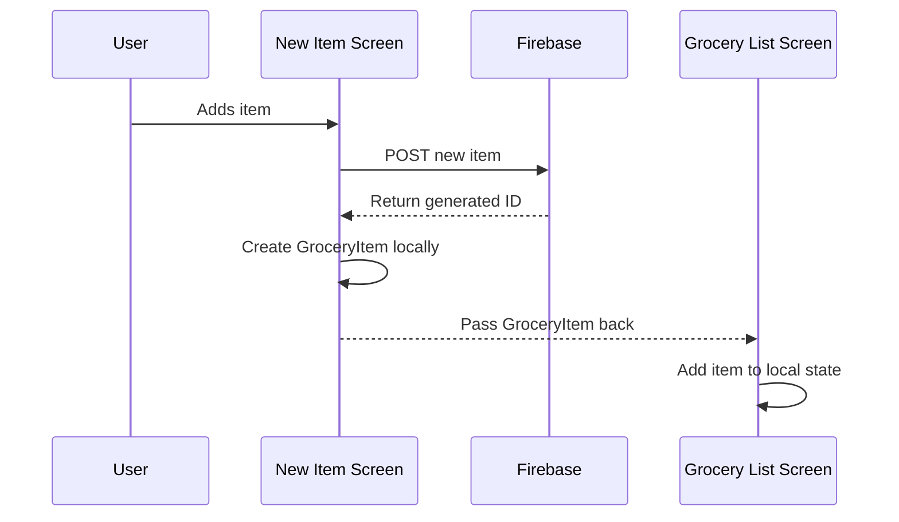
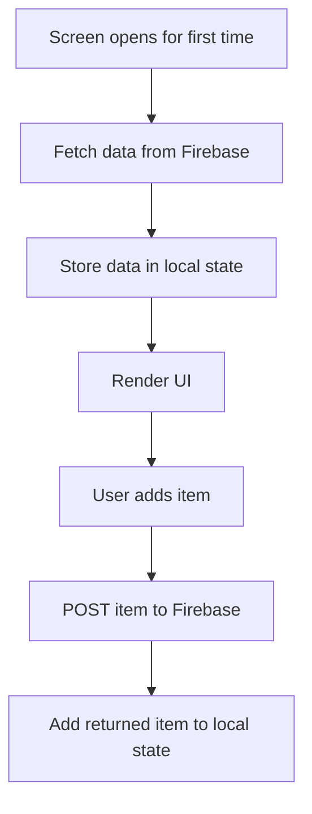
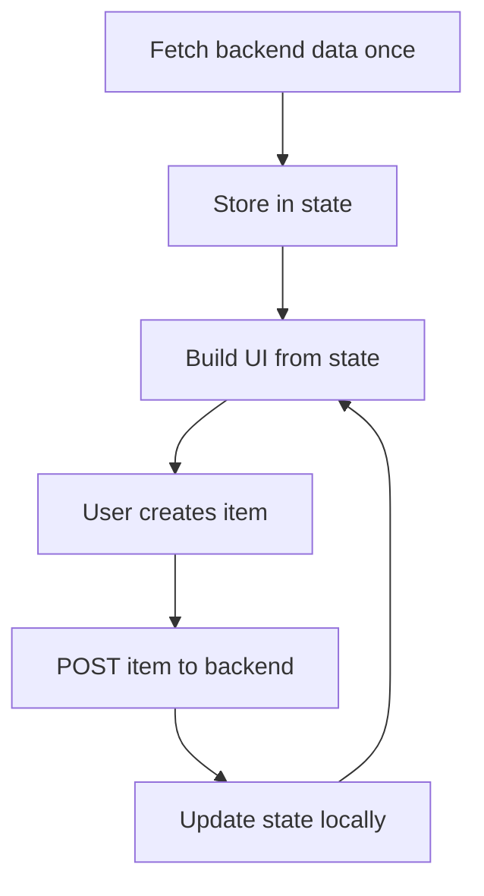

# Avoiding Unnecessary Requests

## Overview

This lecture explains how to avoid sending unnecessary HTTP requests in a Flutter app.

In the previous lecture, we loaded data from Firebase by sending a `GET` request. That works, but there is one optimization we can make.

After adding a new item, we do not always need to fetch the full list again. Since Firebase returns the generated ID after a successful `POST` request, we can create the final `GroceryItem` locally and pass it back to the grocery list screen.

This avoids an extra backend request and makes the app more efficient.

---

## Why Avoid Unnecessary Requests?

HTTP requests are useful, but they are not free.

Each request takes time and uses resources.

Too many unnecessary requests can cause:

* Slower app performance
* Extra loading delays
* More backend traffic
* Higher backend costs
* Poor user experience
* More complicated debugging

A well-built Flutter app should only send requests when they are actually needed.

---

## The Previous Approach

Previously, after adding a new item, the app did this:



This works, but it sends an extra `GET` request after the item has already been created.

---

## Why This Is Redundant

When we send a `POST` request to Firebase, we already have most of the item data locally:

* Name
* Quantity
* Category

The only missing value is the Firebase-generated ID.

But Firebase returns that ID in the response body.

Example Firebase response:

```json id="u98pzp"
{
  "name": "-NxT8abc123"
}
```

So instead of fetching the full list again, we can use this ID and create the final `GroceryItem` immediately.

---

## Optimized Flow

The improved flow looks like this:



Now the app avoids the extra `GET` request.

---

## Decoding the POST Response

After sending the `POST` request, we decode the response body.

```dart id="uahz0t"
final Map<String, dynamic> resData = json.decode(response.body);
```

Firebase stores the generated ID under the `name` key.

```dart id="luotbr"
final generatedId = resData['name'];
```

This ID can now be used when creating the new `GroceryItem`.

---

## Creating the New Item Locally

After the request succeeds, create a new `GroceryItem` using:

* The generated Firebase ID
* The entered name
* The entered quantity
* The selected category object

```dart id="d0tf1g"
final newItem = GroceryItem(
  id: resData['name'],
  name: _enteredName,
  quantity: _enteredQuantity,
  category: _selectedCategory,
);
```

This gives us a complete item object without needing to fetch all items again.

---

## Passing the Item Back with `Navigator.pop()`

Once the item is created, pass it back to the previous screen.

```dart id="tb6cth"
Navigator.of(context).pop(newItem);
```

This is the same navigation pattern used earlier in the course.

The difference is that the item now includes the Firebase-generated ID.

---

## Updated `new_item.dart` Example

```dart id="o9b71e"
import 'dart:convert';

import 'package:flutter/material.dart';
import 'package:http/http.dart' as http;

Future<void> _saveItem() async {
  if (_formKey.currentState!.validate()) {
    _formKey.currentState!.save();

    final url = Uri.https(
      'my-project-default-rtdb.firebaseio.com',
      'shopping-list.json',
    );

    final response = await http.post(
      url,
      headers: {
        'Content-Type': 'application/json',
      },
      body: json.encode({
        'name': _enteredName,
        'quantity': _enteredQuantity,
        'category': _selectedCategory.title,
      }),
    );

    final Map<String, dynamic> resData = json.decode(response.body);

    if (!context.mounted) {
      return;
    }

    Navigator.of(context).pop(
      GroceryItem(
        id: resData['name'],
        name: _enteredName,
        quantity: _enteredQuantity,
        category: _selectedCategory,
      ),
    );
  }
}
```

---

## Receiving the Item in the Grocery List Screen

In the grocery list screen, we can now wait for the new item to come back from the new item screen.

```dart id="wx9kjy"
void _addItem() async {
  final newItem = await Navigator.of(context).push<GroceryItem>(
    MaterialPageRoute(
      builder: (ctx) => const NewItem(),
    ),
  );
}
```

The returned value might be `null`.

This can happen if the user leaves the screen without adding an item, for example by pressing the back button.

So we should check for that.

```dart id="p7uvzn"
if (newItem == null) {
  return;
}
```

---

## Updating Local State

If a new item was returned, add it directly to the local list.

```dart id="ml6d6i"
setState(() {
  _groceryItems.add(newItem);
});
```

This updates the UI without sending another `GET` request.

---

## Updated Grocery List Example

```dart id="i47esr"
void _addItem() async {
  final newItem = await Navigator.of(context).push<GroceryItem>(
    MaterialPageRoute(
      builder: (ctx) => const NewItem(),
    ),
  );

  if (newItem == null) {
    return;
  }

  setState(() {
    _groceryItems.add(newItem);
  });
}
```

---

## When Should We Still Fetch Data?

Avoiding unnecessary requests does not mean avoiding all requests.

We still fetch data when the screen first loads.

That happens in `initState()`:

```dart id="foewjp"
@override
void initState() {
  super.initState();
  _loadItems();
}
```

This initial request is necessary because the app needs to load existing backend data.



---

## Important Rule: Do Not Fetch Data in `build()`

A common beginner mistake is placing HTTP requests inside the `build()` method.

This is dangerous because `build()` can run many times.

For example, `build()` can run when:

* `setState()` is called
* The parent widget rebuilds
* Screen size changes
* Theme changes
* Flutter decides the widget tree needs updating

If you send a request inside `build()`, the app may send the same request repeatedly.

Incorrect:

```dart id="hx7bs6"
@override
Widget build(BuildContext context) {
  _loadItems(); // Do not do this

  return ListView.builder(
    itemCount: _groceryItems.length,
    itemBuilder: (ctx, index) {
      return Text(_groceryItems[index].name);
    },
  );
}
```

Correct:

```dart id="qcanb7"
@override
void initState() {
  super.initState();
  _loadItems();
}
```

---

## Fetch Once, Then Reuse State

A better strategy is:

1. Fetch data once when the screen loads.
2. Store the result in local state.
3. Reuse that local state to build the UI.
4. Update local state manually after adding or deleting items.



This avoids repeatedly asking the backend for data that the app already has.

---

## GET Request vs Local State Update

| Situation                               | Recommended Action                     |
| --------------------------------------- | -------------------------------------- |
| Screen opens for the first time         | Send `GET` request                     |
| User adds a new item                    | Send `POST`, then update local state   |
| User cancels adding an item             | Do nothing                             |
| User deletes an item                    | Send `DELETE`, then update local state |
| Backend data may have changed elsewhere | Send `GET` request again               |
| App needs a manual refresh              | Send `GET` request again               |

---

## Why This Optimization Works

This optimization works because the app already knows the new item data.

The only part generated by Firebase is the ID, and Firebase sends that ID back in the `POST` response.

Therefore, after the response arrives, the app has everything it needs:

```text id="re4nsc"
Local form data + Firebase generated ID = Complete GroceryItem
```

No additional fetch is needed.

---

## Key Concepts

### Redundant Request

A request that is not necessary because the app already has the required data.

### Local State

Data stored inside the widget state and used to build the UI.

### `initState`

The correct place to trigger one-time loading when a stateful widget is first created.

### `Navigator.pop(data)`

Returns data from one screen back to the previous screen.

### `setState`

Updates local state and rebuilds the UI.

### Firebase Generated ID

The unique ID returned by Firebase after a successful `POST` request.

---

## Important Tips

* Do not send HTTP requests inside `build()`.
* Use `initState()` for initial data loading.
* After adding an item, use the Firebase response instead of fetching the entire list again.
* Decode the POST response to get the generated ID.
* Pass the completed item back with `Navigator.pop(newItem)`.
* Always check whether the returned item is `null`.
* Update local state with `setState()` so the UI refreshes.
* Re-fetch data only when the backend state may have changed outside the current app flow.

---

## Summary

In this lecture, we improved the app by avoiding an unnecessary `GET` request.

Instead of reloading the entire list after adding a new item, we use the response from the `POST` request. Firebase returns the generated ID, and we combine that ID with the locally entered form data to create a complete `GroceryItem`.

Then we pass that item back to the grocery list screen with `Navigator.pop()` and add it to the local state using `setState()`.

This makes the app more efficient because it only fetches data when needed, instead of sending redundant backend requests.
