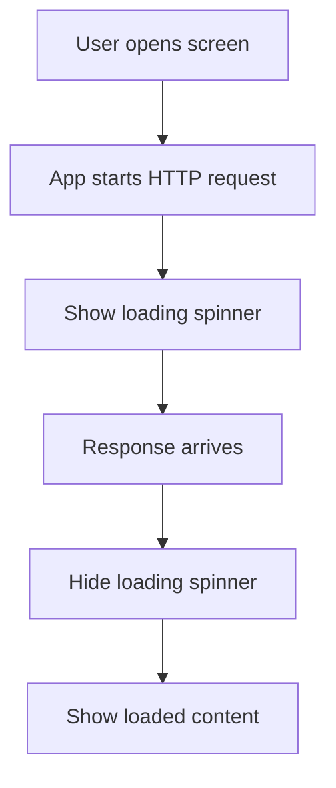
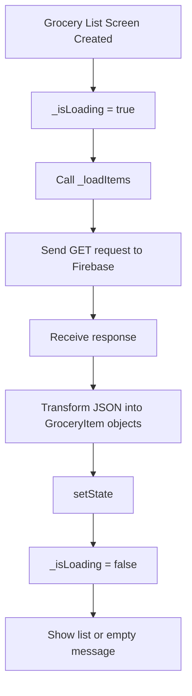
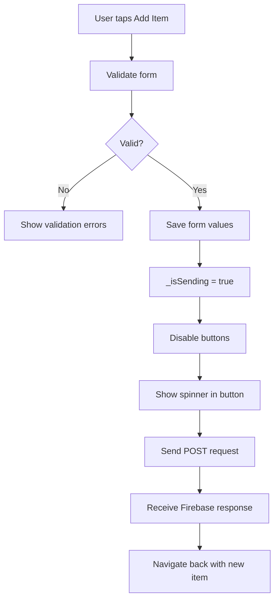

# Managing the Loading State

## Overview

This lecture explains how to manage loading states in a Flutter app while HTTP requests are running.

When an app sends a request to a backend, the response does not arrive instantly. Even if the delay is short, the UI should clearly show that something is happening.

Instead of showing incorrect fallback text like “No items added yet,” we can show a loading spinner while data is being fetched or submitted.

---

## Why Loading States Matter

HTTP requests take time.

During that time, the user should not be confused about what is happening. If the app does not show any feedback, the user may think the app is frozen or broken.

Good loading states help users understand that:

* The app is working
* Data is being loaded
* A form is being submitted
* They should wait before interacting again



---

## The Problem Without a Loading State

In the grocery list screen, data is fetched from Firebase when the app starts.

Before the response arrives, the app may briefly show:

```text
No items added yet.
```

But this message is misleading.

The app does not yet know whether there are items or not. It is still waiting for the backend response.

A better experience is to show a loading indicator until the request finishes.

---

## Adding an `_isLoading` Variable

To track whether data is currently being loaded, add a boolean state variable.

```dart
bool _isLoading = true;
```

It starts as `true` because the app begins loading items as soon as the screen is created.

Later, when the request finishes, we set it to `false`.

---

## Updating `_isLoading` After Data Loads

Inside the method that loads items from Firebase, update `_isLoading` after the data is received and transformed.

```dart
setState(() {
  _groceryItems = loadedItems;
  _isLoading = false;
});
```

This tells Flutter:

1. The loaded items are now available.
2. The loading process is finished.
3. The UI should rebuild.

---

## Showing a Loading Spinner

Flutter provides a built-in widget called `CircularProgressIndicator`.

It displays a circular loading spinner.

```dart
const Center(
  child: CircularProgressIndicator(),
)
```

To show it only while loading, use a conditional check in the `build()` method.

---

## Conditional UI Based on Loading State

The screen can decide what content to show based on `_isLoading`.

```dart
Widget content = const Center(
  child: Text('No items added yet.'),
);

if (_isLoading) {
  content = const Center(
    child: CircularProgressIndicator(),
  );
} else if (_groceryItems.isNotEmpty) {
  content = ListView.builder(
    itemCount: _groceryItems.length,
    itemBuilder: (ctx, index) => ListTile(
      title: Text(_groceryItems[index].name),
    ),
  );
}
```

This gives us three possible UI states:

| State                | UI Shown                     |
| -------------------- | ---------------------------- |
| Loading              | Spinner                      |
| Loaded with items    | Grocery item list            |
| Loaded with no items | “No items added yet” message |

---

## Grocery List Loading Flow



---

## Example: Loading Items with `_isLoading`

```dart
class _GroceryListState extends State<GroceryList> {
  List<GroceryItem> _groceryItems = [];
  bool _isLoading = true;

  @override
  void initState() {
    super.initState();
    _loadItems();
  }

  Future<void> _loadItems() async {
    final url = Uri.https(
      'my-project-default-rtdb.firebaseio.com',
      'shopping-list.json',
    );

    final response = await http.get(url);
    final Map<String, dynamic> listData = json.decode(response.body);

    final List<GroceryItem> loadedItems = [];

    for (final item in listData.entries) {
      final category = categories.entries
          .firstWhere(
            (catItem) => catItem.value.title == item.value['category'],
          )
          .value;

      loadedItems.add(
        GroceryItem(
          id: item.key,
          name: item.value['name'],
          quantity: item.value['quantity'],
          category: category,
        ),
      );
    }

    setState(() {
      _groceryItems = loadedItems;
      _isLoading = false;
    });
  }
}
```

---

## Managing the Sending State

Loading data is not the only situation where visual feedback matters.

When the user adds a new item, the app sends a `POST` request to Firebase.

During this request, the user is still on the new item screen for a short time.

If there is no feedback, the user may press the button again and accidentally send the same item multiple times.

To prevent this, we add a sending state.

```dart
bool _isSending = false;
```

Unlike `_isLoading`, this starts as `false` because the form is not submitting immediately when the screen opens.

---

## Setting `_isSending` to `true`

After the form is validated and saved, we set `_isSending` to `true`.

```dart
setState(() {
  _isSending = true;
});
```

This should happen before sending the `POST` request.

```dart
if (_formKey.currentState!.validate()) {
  _formKey.currentState!.save();

  setState(() {
    _isSending = true;
  });

  // Send POST request here
}
```

---

## Disabling Buttons While Sending

In Flutter, a button can be disabled by setting `onPressed` to `null`.

So, if `_isSending` is `true`, we disable the button.

```dart
onPressed: _isSending ? null : _saveItem,
```

This prevents the user from submitting the same request multiple times.

The same idea can be applied to the reset button.

```dart
onPressed: _isSending ? null : _formKey.currentState!.reset,
```

---

## Showing a Spinner Inside the Button

Instead of always showing the text `Add Item`, we can show a small spinner while the item is being saved.

```dart
child: _isSending
    ? const SizedBox(
        height: 16,
        width: 16,
        child: CircularProgressIndicator(),
      )
    : const Text('Add Item'),
```

The `SizedBox` keeps the spinner small enough to fit inside the button nicely.

---

## New Item Sending Flow



---

## Example: Managing `_isSending`

```dart
class _NewItemState extends State<NewItem> {
  bool _isSending = false;

  Future<void> _saveItem() async {
    if (_formKey.currentState!.validate()) {
      _formKey.currentState!.save();

      setState(() {
        _isSending = true;
      });

      final url = Uri.https(
        'my-project-default-rtdb.firebaseio.com',
        'shopping-list.json',
      );

      final response = await http.post(
        url,
        headers: {
          'Content-Type': 'application/json',
        },
        body: json.encode({
          'name': _enteredName,
          'quantity': _enteredQuantity,
          'category': _selectedCategory.title,
        }),
      );

      final Map<String, dynamic> resData = json.decode(response.body);

      if (!context.mounted) {
        return;
      }

      Navigator.of(context).pop(
        GroceryItem(
          id: resData['name'],
          name: _enteredName,
          quantity: _enteredQuantity,
          category: _selectedCategory,
        ),
      );
    }
  }
}
```

---

## Example: Disabling Buttons While Sending

```dart
Row(
  mainAxisAlignment: MainAxisAlignment.end,
  children: [
    TextButton(
      onPressed: _isSending
          ? null
          : () {
              _formKey.currentState!.reset();
            },
      child: const Text('Reset'),
    ),
    ElevatedButton(
      onPressed: _isSending ? null : _saveItem,
      child: _isSending
          ? const SizedBox(
              height: 16,
              width: 16,
              child: CircularProgressIndicator(),
            )
          : const Text('Add Item'),
    ),
  ],
)
```

---

## Loading State vs Sending State

| State Variable | Used For                                | Initial Value |
| -------------- | --------------------------------------- | ------------- |
| `_isLoading`   | Fetching existing data from the backend | `true`        |
| `_isSending`   | Submitting new data to the backend      | `false`       |

Both variables improve user experience, but they describe different operations.

`_isLoading` is used when the app is waiting for existing data.

`_isSending` is used when the app is sending new data.

---

## Why Use `setState()`?

Changing `_isLoading` or `_isSending` alone is not enough.

Flutter must be told that the UI should rebuild.

That is why the value changes must happen inside `setState()`.

```dart
setState(() {
  _isLoading = false;
});
```

Or:

```dart
setState(() {
  _isSending = true;
});
```

Without `setState()`, the value changes internally, but the UI may not update.

---

## Key Concepts

### Loading State

A state that indicates the app is currently fetching data.

### Sending State

A state that indicates the app is currently submitting data.

### `_isLoading`

A boolean used to control whether the list screen should show a loading spinner.

### `_isSending`

A boolean used to control whether the form screen should disable buttons and show a spinner.

### `CircularProgressIndicator`

A built-in Flutter widget that displays a loading spinner.

### Disabled Button

A button with `onPressed: null`.

### Conditional Rendering

Showing different widgets depending on the current state.

---

## Important Tips

* Show a loading indicator while fetching backend data.
* Do not show an empty-state message before the request has finished.
* Use `_isLoading` for loading existing data.
* Use `_isSending` for submitting new data.
* Disable buttons while a request is in progress.
* Use `CircularProgressIndicator` to show visual feedback.
* Wrap state changes in `setState()` so the UI rebuilds.
* Make sure loading or sending states are reset when needed, especially when adding error handling later.

---

## Summary

In this lecture, we improved the user experience by managing loading and sending states.

On the grocery list screen, we added `_isLoading` to show a `CircularProgressIndicator` while the app fetches data from Firebase.

On the new item screen, we added `_isSending` to disable the buttons and show a small spinner while the app sends a `POST` request.

These small changes make the app feel more responsive and prevent users from accidentally sending duplicate requests.
