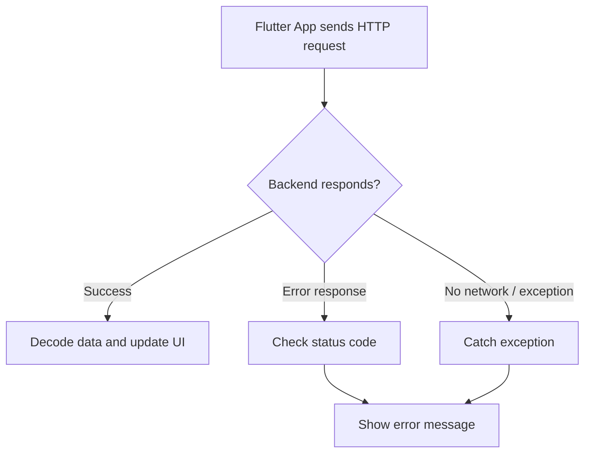
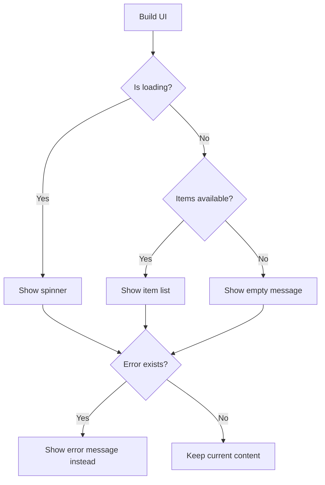

# Error Response Handling

## Overview

This lecture explains how to handle error responses when sending HTTP requests from a Flutter app.

When working with a backend, requests can fail for many reasons. The backend URL might be wrong, the server might be unavailable, the user may have no internet connection, or the request may be rejected.

Instead of leaving the user stuck on a loading screen, the app should detect the error and show a helpful message.

---

## Why Error Handling Matters

HTTP requests do not always succeed.

Even if your code is correct, things can still go wrong because backend communication depends on external systems.

Possible problems include:

* Wrong backend URL
* Invalid Firebase project ID
* Missing database path
* Backend server temporarily offline
* Network connection issues
* Permission or authentication problems
* Firebase security rules blocking the request



---

## The Problem Without Error Handling

In the previous version of the app, if the request failed, the app could stay stuck on the loading spinner.

For example, if the Firebase URL is wrong, the app cannot fetch the data.

Without proper error handling, the user may only see:

```text id="fd7p7r"
Loading...
```

forever.

That is not a good user experience because the user does not know what went wrong.

---

## Simulating an Error

To test error handling, you can temporarily use an invalid Firebase project ID.

Example:

```dart id="urqpvn"
final url = Uri.https(
  'abc-default-rtdb.firebaseio.com',
  'shopping-list.json',
);
```

This causes the request to fail because the backend URL does not point to the correct Firebase database.

In the debug console, you may see an error or an HTTP status code such as:

```text id="d7m91d"
404
```

A `404` status code means that the requested resource was not found.

---

## HTTP Status Codes and Errors

The response status code tells us whether the request succeeded or failed.

| Status Code Range | Meaning           |
| ----------------- | ----------------- |
| `2xx`             | Success           |
| `3xx`             | Redirection       |
| `4xx`             | Client-side error |
| `5xx`             | Server-side error |

Common error status codes:

| Status Code | Meaning               |
| ----------- | --------------------- |
| `400`       | Bad request           |
| `401`       | Unauthorized          |
| `403`       | Forbidden             |
| `404`       | Not found             |
| `500`       | Internal server error |

A simple general rule is:

```dart id="p4xkyi"
if (response.statusCode >= 400) {
  // Something went wrong
}
```

This catches both `4xx` and `5xx` errors.

---

## Checking the Response Status Code

After sending a request, inspect the response.

```dart id="y7u7fr"
final response = await http.get(url);

print(response.statusCode);
```

Then check whether the status code indicates an error.

```dart id="kwys3y"
if (response.statusCode >= 400) {
  // Handle error
}
```

This prevents the app from trying to decode or use invalid response data.

---

## Adding an Error State

To show an error message in the UI, add a nullable string state variable.

```dart id="set4u0"
String? _error;
```

This means:

* `_error == null` → no error
* `_error != null` → an error message should be shown

Example:

```dart id="mtj8ws"
String? _error = null;
```

Or simply:

```dart id="qwcynz"
String? _error;
```

---

## Setting the Error Message

Inside the loading method, check the response status code.

If the status code is `400` or higher, update the error state.

```dart id="nh0aoe"
if (response.statusCode >= 400) {
  setState(() {
    _error = 'Failed to fetch data. Please try again later.';
    _isLoading = false;
  });
  return;
}
```

It is important to also set `_isLoading` to `false`.

Otherwise, the loading spinner may continue forever.

---

## Example: Handling Error Responses

```dart id="q27qsg"
Future<void> _loadItems() async {
  final url = Uri.https(
    'my-project-default-rtdb.firebaseio.com',
    'shopping-list.json',
  );

  final response = await http.get(url);

  if (response.statusCode >= 400) {
    setState(() {
      _error = 'Failed to fetch data. Please try again later.';
      _isLoading = false;
    });
    return;
  }

  final Map<String, dynamic> listData = json.decode(response.body);
  final List<GroceryItem> loadedItems = [];

  for (final item in listData.entries) {
    final category = categories.entries
        .firstWhere(
          (catItem) => catItem.value.title == item.value['category'],
        )
        .value;

    loadedItems.add(
      GroceryItem(
        id: item.key,
        name: item.value['name'],
        quantity: item.value['quantity'],
        category: category,
      ),
    );
  }

  setState(() {
    _groceryItems = loadedItems;
    _isLoading = false;
  });
}
```

---

## Displaying the Error in the UI

Inside the `build()` method, we can show different content depending on the current state.

The app may show:

1. A loading spinner
2. A list of grocery items
3. An empty-state message
4. An error message

```dart id="a7oj2z"
Widget content = const Center(
  child: Text('No items added yet.'),
);

if (_isLoading) {
  content = const Center(
    child: CircularProgressIndicator(),
  );
} else if (_groceryItems.isNotEmpty) {
  content = ListView.builder(
    itemCount: _groceryItems.length,
    itemBuilder: (ctx, index) => ListTile(
      title: Text(_groceryItems[index].name),
    ),
  );
}

if (_error != null) {
  content = Center(
    child: Text(_error!),
  );
}
```

The exclamation mark in `_error!` tells Dart that we know `_error` is not null because we already checked it.

---

## UI State Priority

The UI should prioritize error messages over normal content.



In practice, if `_error` is not null, the error message should replace the other content.

---

## Improved UI Logic Example

```dart id="l4tzm5"
@override
Widget build(BuildContext context) {
  Widget content = const Center(
    child: Text('No items added yet.'),
  );

  if (_isLoading) {
    content = const Center(
      child: CircularProgressIndicator(),
    );
  } else if (_groceryItems.isNotEmpty) {
    content = ListView.builder(
      itemCount: _groceryItems.length,
      itemBuilder: (ctx, index) => ListTile(
        title: Text(_groceryItems[index].name),
        leading: Container(
          width: 24,
          height: 24,
          color: _groceryItems[index].category.color,
        ),
        trailing: Text(
          _groceryItems[index].quantity.toString(),
        ),
      ),
    );
  }

  if (_error != null) {
    content = Center(
      child: Text(_error!),
    );
  }

  return Scaffold(
    appBar: AppBar(
      title: const Text('Your Groceries'),
    ),
    body: content,
  );
}
```

---

## Using `try` / `catch`

Checking status codes is useful for backend error responses.

However, some errors happen before a response is even received.

For example:

* No internet connection
* DNS failure
* Timeout
* The request cannot reach the server

For these cases, use `try` / `catch`.

```dart id="anjm3o"
try {
  final response = await http.get(url);

  if (response.statusCode >= 400) {
    throw Exception('Failed to fetch data.');
  }

  // Decode and use response data
} catch (error) {
  setState(() {
    _error = 'Something went wrong. Please try again later.';
    _isLoading = false;
  });
}
```

This catches both manually thrown exceptions and network-related exceptions.

---

## More Complete Example

```dart id="jd3qfj"
Future<void> _loadItems() async {
  final url = Uri.https(
    'my-project-default-rtdb.firebaseio.com',
    'shopping-list.json',
  );

  try {
    final response = await http.get(url);

    if (response.statusCode >= 400) {
      throw Exception('Failed to fetch data.');
    }

    if (response.body == 'null') {
      setState(() {
        _groceryItems = [];
        _isLoading = false;
      });
      return;
    }

    final Map<String, dynamic> listData = json.decode(response.body);
    final List<GroceryItem> loadedItems = [];

    for (final item in listData.entries) {
      final category = categories.entries
          .firstWhere(
            (catItem) => catItem.value.title == item.value['category'],
          )
          .value;

      loadedItems.add(
        GroceryItem(
          id: item.key,
          name: item.value['name'],
          quantity: item.value['quantity'],
          category: category,
        ),
      );
    }

    setState(() {
      _groceryItems = loadedItems;
      _isLoading = false;
    });
  } catch (error) {
    setState(() {
      _error = 'Something went wrong. Please try again later.';
      _isLoading = false;
    });
  }
}
```

---

## Why Not Show Raw Error Messages?

Raw error messages are useful for developers, but they are usually not helpful for users.

For example, this message is not user-friendly:

```text id="btfhdj"
SocketException: Failed host lookup
```

A better user-facing message is:

```text id="gr6fsk"
Something went wrong. Please try again later.
```

You can still print the real error in the debug console during development:

```dart id="wqqxl1"
print(error);
```

But the UI should show a clean, understandable message.

---

## Handling Errors When Sending Data

The same concept applies when sending a `POST` request.

After sending data, check the response status code.

```dart id="xcwd1u"
final response = await http.post(
  url,
  headers: {
    'Content-Type': 'application/json',
  },
  body: json.encode({
    'name': _enteredName,
    'quantity': _enteredQuantity,
    'category': _selectedCategory.title,
  }),
);

if (response.statusCode >= 400) {
  throw Exception('Failed to save item.');
}
```

If the request fails, the app should stop the sending state and show an error message or dialog.

---

## Important: Restore the Correct URL

When testing error handling, you may temporarily break the Firebase URL.

After testing, remember to restore the correct Firebase Realtime Database URL.

Example:

```dart id="rbkzve"
final url = Uri.https(
  'your-project-id-default-rtdb.firebaseio.com',
  'shopping-list.json',
);
```

Do not include:

```text id="vlp7lt"
https://
```

inside the first argument of `Uri.https()`.

Correct:

```dart id="g0ktbu"
Uri.https('your-project-id-default-rtdb.firebaseio.com', 'shopping-list.json')
```

Incorrect:

```dart id="jwz9g9"
Uri.https('https://your-project-id-default-rtdb.firebaseio.com/', 'shopping-list.json')
```

---

## Key Concepts

### Error Response

A backend response that indicates the request failed.

### Status Code

A number included in the HTTP response that describes the result of the request.

### `response.statusCode`

The property used to inspect the HTTP status code in Flutter.

### `4xx` Errors

Client-side errors, such as bad requests, unauthorized access, or missing resources.

### `5xx` Errors

Server-side errors.

### Nullable Error State

A state variable like `String? _error` used to store an error message.

### `try` / `catch`

Dart syntax used to handle exceptions.

### User-Friendly Error Message

A clean message shown to the user instead of raw technical error details.

---

## Important Tips

* Always check `response.statusCode` after backend requests.
* Treat status codes `>= 400` as errors.
* Store user-friendly error messages in state.
* Show the error message in the UI.
* Always stop the loading spinner when an error occurs.
* Use `try` / `catch` for network errors and exceptions.
* Do not expose raw technical errors to users.
* Restore the correct backend URL after testing error handling.

---

## Summary

In this lecture, we improved the app by handling error responses from the backend.

We simulated a failed request by using an invalid Firebase URL and checked the returned status code. When the status code was `400` or higher, we stored an error message in state and displayed it in the UI.

This prevents the app from staying stuck on the loading screen and gives users clear feedback when something goes wrong.

Proper error response handling is an essential part of building reliable Flutter apps that communicate with backends.
