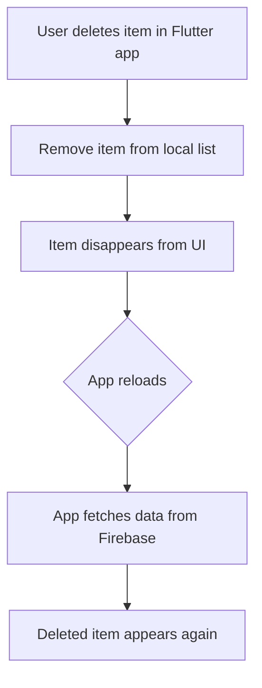
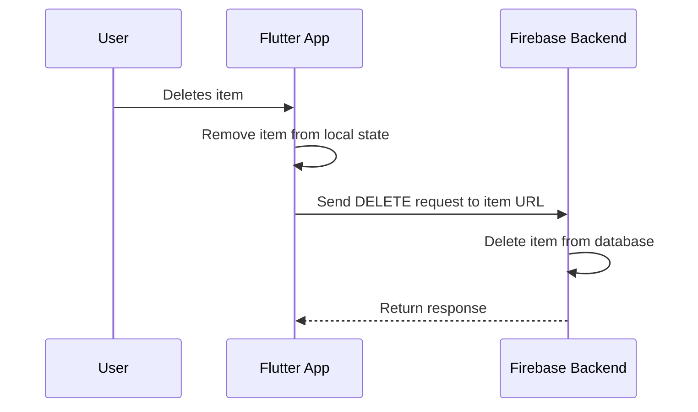
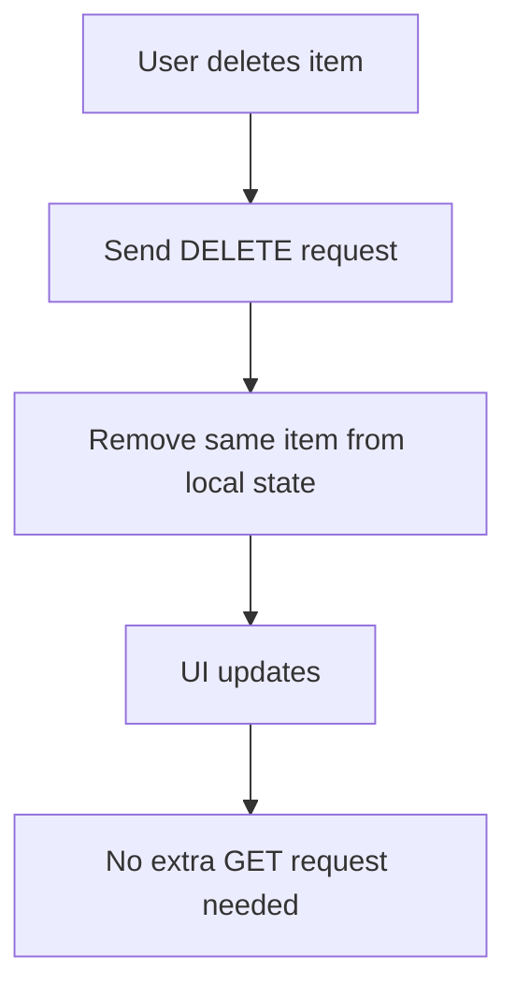
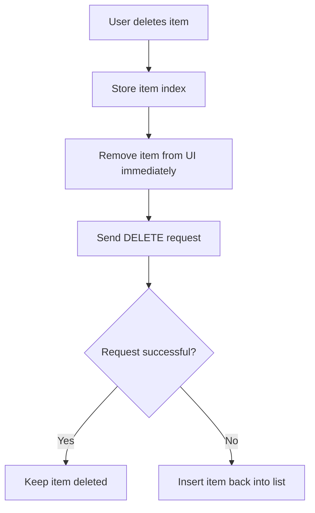

# Sending DELETE Requests

## Overview

This lecture explains how to send a **DELETE request** from a Flutter app to a Firebase backend.

So far, the app can load grocery items from Firebase and add new items to Firebase. However, deleting an item only from the local list is not enough. If the item is not also deleted from Firebase, it will appear again the next time the app reloads.

To solve this, we send a DELETE request to Firebase and target the specific item that should be removed.

---

## Why Do We Need a DELETE Request?

When an item is removed only from local state, it disappears from the UI temporarily.

But the item still exists in the backend database.



To permanently delete the item, the app must also remove it from Firebase.

---

## DELETE Request Concept

A `DELETE` request is used to remove data from a backend.

In Firebase Realtime Database, we must send the DELETE request to the exact URL of the item we want to delete.

That means the item's ID must be included in the URL.

---

## Firebase DELETE URL Structure

Previously, we used this URL to load the entire shopping list:

```text id="k7bmln"
https://my-project-default-rtdb.firebaseio.com/shopping-list.json
```

To delete one specific item, we must include the item's ID before `.json`.

```text id="j8hihg"
https://my-project-default-rtdb.firebaseio.com/shopping-list/<item-id>.json
```

Example:

```text id="kx0z41"
https://my-project-default-rtdb.firebaseio.com/shopping-list/-NxT8abc123.json
```

This tells Firebase:

```text id="bo86pu"
Delete the item with this specific ID inside the shopping-list node.
```

---

## Request Flow



---

## Creating the DELETE URL

Inside the remove method, create a Firebase URL that targets the selected item.

```dart id="she19z"
final url = Uri.https(
  'my-project-default-rtdb.firebaseio.com',
  'shopping-list/${item.id}.json',
);
```

The important part is:

```dart id="x6tbie"
'shopping-list/${item.id}.json'
```

This uses string interpolation to insert the selected item's ID into the URL.

---

## Sending the DELETE Request

The `http` package provides a `delete()` method.

```dart id="cu1gwy"
await http.delete(url);
```

A DELETE request usually does not need a request body.

For this Firebase example, we only need the correct URL.

---

## Basic DELETE Example

```dart id="u0tzw1"
Future<void> _removeItem(GroceryItem item) async {
  final url = Uri.https(
    'my-project-default-rtdb.firebaseio.com',
    'shopping-list/${item.id}.json',
  );

  await http.delete(url);

  setState(() {
    _groceryItems.remove(item);
  });
}
```

This sends a DELETE request to Firebase and removes the item from local state.

However, this version can still be improved because it does not handle errors.

---

## Updating Local State

After deleting the item from Firebase, we should also remove it from the local list.

```dart id="x3b35a"
setState(() {
  _groceryItems.remove(item);
});
```

This updates the UI immediately.

We do not need to fetch the full list again because we already know which item was deleted.

---

## Avoiding a Full Re-fetch

After deleting one item, we could send another `GET` request to reload all items.

But that is unnecessary.

Instead, we can directly remove the item from local state.



This keeps the app faster and avoids redundant backend traffic.

---

## Optimistic Deletion

A common pattern is called **optimistic deletion**.

This means we remove the item from the UI immediately before waiting for the backend response.

The app assumes the request will succeed.

If the request fails, we restore the item.



This makes the app feel faster.

---

## Why Store the Item Index?

If the delete request fails, we may want to insert the item back into the exact same position.

To do that, store the item's index before removing it.

```dart id="zf3ub7"
final itemIndex = _groceryItems.indexOf(item);
```

Then remove the item:

```dart id="fyipcy"
setState(() {
  _groceryItems.remove(item);
});
```

If the request fails, restore it:

```dart id="px7w0p"
setState(() {
  _groceryItems.insert(itemIndex, item);
});
```

---

## Checking the DELETE Response

Even DELETE requests can fail.

For example:

* The Firebase URL may be wrong
* The database rules may block the request
* The item may not exist
* The server may be unavailable
* The user may lose internet connection

So we should check the response status code.

```dart id="ins7he"
final response = await http.delete(url);

if (response.statusCode >= 400) {
  // Something went wrong
}
```

Status codes `400` and above usually indicate an error.

---

## Improved DELETE Example

```dart id="zqsa94"
Future<void> _removeItem(GroceryItem item) async {
  final itemIndex = _groceryItems.indexOf(item);

  setState(() {
    _groceryItems.remove(item);
  });

  final url = Uri.https(
    'my-project-default-rtdb.firebaseio.com',
    'shopping-list/${item.id}.json',
  );

  final response = await http.delete(url);

  if (response.statusCode >= 400) {
    setState(() {
      _groceryItems.insert(itemIndex, item);
    });
  }
}
```

This version:

1. Stores the original item index.
2. Removes the item locally.
3. Sends a DELETE request.
4. Restores the item if the request fails.

---

## Adding Error Feedback

Restoring the item is useful, but the user should also know that something went wrong.

You can show a `SnackBar` if the delete request fails.

```dart id="lzmt5t"
if (response.statusCode >= 400) {
  setState(() {
    _groceryItems.insert(itemIndex, item);
  });

  if (!context.mounted) {
    return;
  }

  ScaffoldMessenger.of(context).showSnackBar(
    const SnackBar(
      content: Text('Could not delete item. Please try again.'),
    ),
  );
}
```

This gives the user clear feedback.

---

## More Complete DELETE Example

```dart id="q68g8e"
Future<void> _removeItem(GroceryItem item) async {
  final itemIndex = _groceryItems.indexOf(item);

  setState(() {
    _groceryItems.remove(item);
  });

  final url = Uri.https(
    'my-project-default-rtdb.firebaseio.com',
    'shopping-list/${item.id}.json',
  );

  final response = await http.delete(url);

  if (response.statusCode >= 400) {
    setState(() {
      _groceryItems.insert(itemIndex, item);
    });

    if (!context.mounted) {
      return;
    }

    ScaffoldMessenger.of(context).showSnackBar(
      const SnackBar(
        content: Text('Could not delete item. Please try again.'),
      ),
    );
  }
}
```

---

## Handling Network Exceptions

Checking the status code only works if the backend sends a response.

If the request fails before a response is received, Dart may throw an exception.

For example, this can happen when the user has no internet connection.

A more defensive version uses `try` / `catch`.

```dart id="v4dxqo"
Future<void> _removeItem(GroceryItem item) async {
  final itemIndex = _groceryItems.indexOf(item);

  setState(() {
    _groceryItems.remove(item);
  });

  final url = Uri.https(
    'my-project-default-rtdb.firebaseio.com',
    'shopping-list/${item.id}.json',
  );

  try {
    final response = await http.delete(url);

    if (response.statusCode >= 400) {
      throw Exception('Failed to delete item.');
    }
  } catch (error) {
    setState(() {
      _groceryItems.insert(itemIndex, item);
    });

    if (!context.mounted) {
      return;
    }

    ScaffoldMessenger.of(context).showSnackBar(
      const SnackBar(
        content: Text('Could not delete item. Please try again.'),
      ),
    );
  }
}
```

This version handles both:

* Error status codes
* Network exceptions

---

## Firebase DELETE Response

When Firebase successfully deletes data, it usually returns a successful response with a `null` body.

That is expected.

Example response body:

```json id="d0zm8j"
null
```

The important thing is the status code.

If the status code is successful, the item was deleted.

---

## DELETE Compared to Other HTTP Methods

| HTTP Method | Purpose         | Firebase URL Example            |
| ----------- | --------------- | ------------------------------- |
| `GET`       | Fetch all items | `/shopping-list.json`           |
| `POST`      | Add a new item  | `/shopping-list.json`           |
| `DELETE`    | Remove one item | `/shopping-list/<item-id>.json` |

For DELETE, the URL must point to a specific item.

---

## Common Mistakes

### Deleting the Whole List by Accident

Incorrect:

```dart id="kvrkwj"
final url = Uri.https(
  'my-project-default-rtdb.firebaseio.com',
  'shopping-list.json',
);
```

Sending DELETE to this URL would target the entire shopping list node.

Correct:

```dart id="l4ht11"
final url = Uri.https(
  'my-project-default-rtdb.firebaseio.com',
  'shopping-list/${item.id}.json',
);
```

---

### Forgetting `.json`

Firebase REST API URLs must end with `.json`.

Incorrect:

```dart id="ccmhfe"
'shopping-list/${item.id}'
```

Correct:

```dart id="c36to5"
'shopping-list/${item.id}.json'
```

---

### Not Handling Failed Deletions

If you remove the item locally but the DELETE request fails, the item will come back the next time the app reloads.

That is why you should restore the item if the request fails.

---

## Key Concepts

### DELETE Request

An HTTP request used to remove data from a backend.

### `http.delete()`

The method from the `http` package used to send a DELETE request.

### Resource URL

The specific URL of the item that should be deleted.

### Firebase Item ID

The unique ID generated by Firebase and used to target a specific item.

### Optimistic Update

Updating the UI immediately before the backend request finishes.

### Rollback

Undoing a local UI change if the backend request fails.

### `insert()`

A Dart list method used to add an item back at a specific index.

---

## Important Tips

* Use `http.delete()` to remove data from the backend.
* Include the item's ID in the Firebase URL.
* Do not send DELETE to the whole list URL unless you want to delete everything.
* Remove the item from local state to update the UI.
* Avoid fetching the full list again after deleting one item.
* Store the item index before removing it.
* Restore the item if the DELETE request fails.
* Check `response.statusCode` to detect backend errors.
* Use a `SnackBar` to show a user-friendly error message.
* Keep the correct Firebase URL after testing error cases.

---

## Summary

In this lecture, we added backend deletion to the Flutter grocery list app.

Previously, deleting an item only removed it from the local UI. After reloading the app, the item returned because it still existed in Firebase.

To fix this, we send a DELETE request to a Firebase URL that includes the item's unique ID.

We also update local state so the UI changes immediately. To make the app more reliable, we store the item's original index and restore it if the backend request fails.

With DELETE requests added, the app now supports the main CRUD operations: creating, reading, and deleting backend data.
