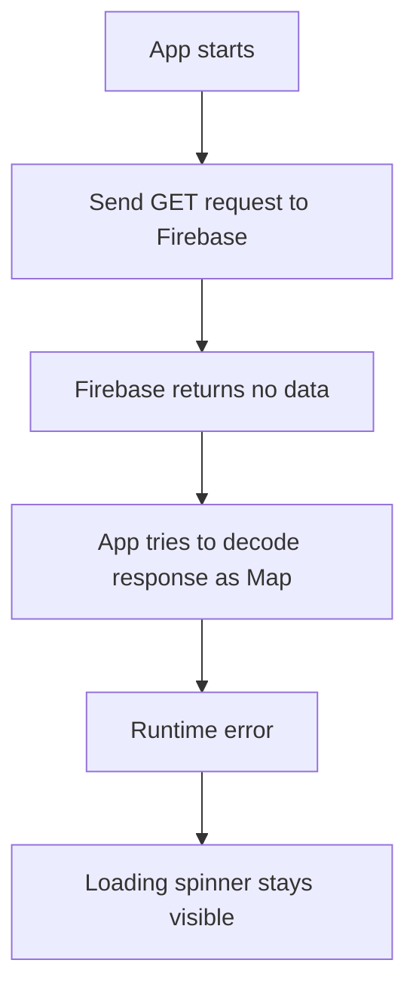
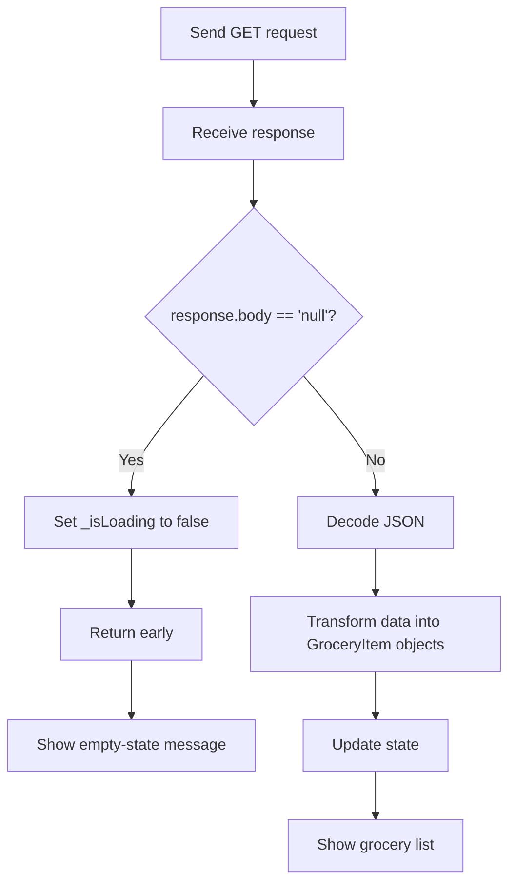

# Handling the No Data Case

## Overview

This lecture explains how to handle the case where the backend returns no data.

In the grocery list app, this happens when all items have been deleted from Firebase. When the app reloads, Firebase no longer has any data under the `shopping-list` node.

If this case is not handled correctly, the app may crash or stay stuck on the loading spinner.

The no-data case is not an error. It simply means the backend responded successfully, but there are currently no items to display.

---

## The Problem

After deleting all grocery items from Firebase, the app may get stuck showing the loading spinner.



This happens because the app expects Firebase to return a map of items.

But when there are no items, Firebase returns:

```text
null
```

More specifically, Firebase returns the text value:

```dart
'null'
```

as the response body.

---

## Why the Error Happens

Previously, the app decoded the response body like this:

```dart
final Map<String, dynamic> listData = json.decode(response.body);
```

This works when Firebase returns data like this:

```json
{
  "-NxT8abc123": {
    "name": "Milk",
    "quantity": 2,
    "category": "Dairy"
  }
}
```

But if the database node is empty, Firebase returns:

```json
null
```

After decoding, Dart gets `null`, not a `Map`.

So this code fails because `null` cannot be treated as a `Map<String, dynamic>`.

---

## No Data Is Not an Error

It is important to separate these states:

| State       | Meaning                               | UI Response           |
| ----------- | ------------------------------------- | --------------------- |
| Loading     | Request is still running              | Show spinner          |
| Error       | Request failed                        | Show error message    |
| No data     | Request succeeded, but no items exist | Show empty-state text |
| Data loaded | Items were fetched successfully       | Show item list        |

The no-data case is valid and expected.

For example, a user may simply have an empty shopping list.

---

## Firebase No Data Response

When a Firebase Realtime Database node has no data, the response body is:

```dart
'null'
```

This is a string response body containing the word `null`.

That means this check is not correct:

```dart
if (response.body == null) {
  // This will not work
}
```

`response.body` is always a string, so it cannot be `null`.

The correct Firebase-specific check is:

```dart
if (response.body == 'null') {
  // No data was returned
}
```

---

## Handling the No Data Case

Inside the `_loadItems()` method, check whether the response body equals `'null'`.

If it does, stop loading and return early.

```dart
if (response.body == 'null') {
  setState(() {
    _isLoading = false;
  });
  return;
}
```

This prevents the app from trying to decode `null` as a map.

---

## Updated Loading Flow



---

## Example Code

```dart
Future<void> _loadItems() async {
  final url = Uri.https(
    'my-project-default-rtdb.firebaseio.com',
    'shopping-list.json',
  );

  final response = await http.get(url);

  if (response.statusCode >= 400) {
    setState(() {
      _error = 'Failed to fetch data. Please try again later.';
      _isLoading = false;
    });
    return;
  }

  if (response.body == 'null') {
    setState(() {
      _isLoading = false;
    });
    return;
  }

  final Map<String, dynamic> listData = json.decode(response.body);
  final List<GroceryItem> loadedItems = [];

  for (final item in listData.entries) {
    final category = categories.entries
        .firstWhere(
          (catItem) => catItem.value.title == item.value['category'],
        )
        .value;

    loadedItems.add(
      GroceryItem(
        id: item.key,
        name: item.value['name'],
        quantity: item.value['quantity'],
        category: category,
      ),
    );
  }

  setState(() {
    _groceryItems = loadedItems;
    _isLoading = false;
  });
}
```

---

## Displaying the Empty State

Once `_isLoading` is set to `false`, the UI can show the fallback message.

Example:

```dart
Widget content = const Center(
  child: Text('No items added yet.'),
);

if (_isLoading) {
  content = const Center(
    child: CircularProgressIndicator(),
  );
} else if (_groceryItems.isNotEmpty) {
  content = ListView.builder(
    itemCount: _groceryItems.length,
    itemBuilder: (ctx, index) => ListTile(
      title: Text(_groceryItems[index].name),
    ),
  );
}

if (_error != null) {
  content = Center(
    child: Text(_error!),
  );
}
```

With this logic:

* If the app is loading, it shows a spinner.
* If items exist, it shows the list.
* If no items exist, it shows the empty-state text.
* If an error occurs, it shows the error message.

---

## Better Empty-State Message

Instead of only showing:

```text
No items added yet.
```

You can make the message more helpful:

```dart
const Center(
  child: Text('No items added yet. Start adding some!'),
)
```

A good empty-state message should tell the user what happened and what they can do next.

---

## Backend-Specific Behavior

The no-data response depends on the backend.

Firebase returns:

```dart
'null'
```

Other backends may return:

```json
[]
```

or:

```json
{}
```

or even a status code such as:

```text
404 Not Found
```

So the exact no-data handling logic depends on the backend API you are using.

For Firebase Realtime Database, checking `response.body == 'null'` is the correct approach.

---

## Common Mistakes

### Mistake 1: Checking for Real `null`

Incorrect:

```dart
if (response.body == null) {
  return;
}
```

`response.body` is a string, so this check will not work.

Correct:

```dart
if (response.body == 'null') {
  return;
}
```

---

### Mistake 2: Decoding Before Checking

Incorrect:

```dart
final Map<String, dynamic> listData = json.decode(response.body);

if (response.body == 'null') {
  return;
}
```

This is too late because the app may already crash while decoding or casting.

Correct:

```dart
if (response.body == 'null') {
  setState(() {
    _isLoading = false;
  });
  return;
}

final Map<String, dynamic> listData = json.decode(response.body);
```

---

### Mistake 3: Forgetting to Stop Loading

Incorrect:

```dart
if (response.body == 'null') {
  return;
}
```

This avoids the crash, but the spinner may remain visible.

Correct:

```dart
if (response.body == 'null') {
  setState(() {
    _isLoading = false;
  });
  return;
}
```

---

## Key Concepts

### No Data Case

A valid state where the backend request succeeds, but no records exist.

### Empty State

The UI shown when there is no data to display.

### Firebase `null` Response

Firebase Realtime Database returns `'null'` when a requested node has no data.

### Early Return

Stopping the function before running code that depends on data existing.

### Loading State Reset

Setting `_isLoading` to `false` once the request has completed, even if no data was returned.

---

## Important Tips

* Always handle the no-data case when fetching from a backend.
* Firebase returns `'null'` as a string response body when a node is empty.
* Check for `'null'` before decoding and transforming the response.
* No data is not the same as an error.
* Show an empty-state message instead of a spinner or crash.
* Always set `_isLoading` to `false` when the request finishes.
* Make empty-state messages helpful and actionable.

---

## Summary

In this lecture, we fixed the issue that occurs when Firebase returns no data.

When all items are deleted, Firebase returns `'null'` instead of a map of items. If the app tries to decode and iterate over that response as a map, it will crash or stay stuck on the loading spinner.

To solve this, we check whether `response.body == 'null'`. If it is, we set `_isLoading` to `false` and return early.

This allows the app to show the normal empty-state message, such as “No items added yet,” instead of crashing or loading forever.
