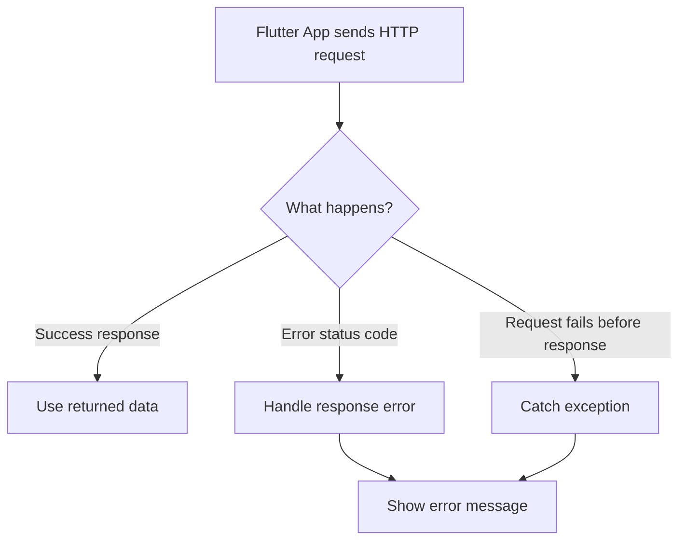
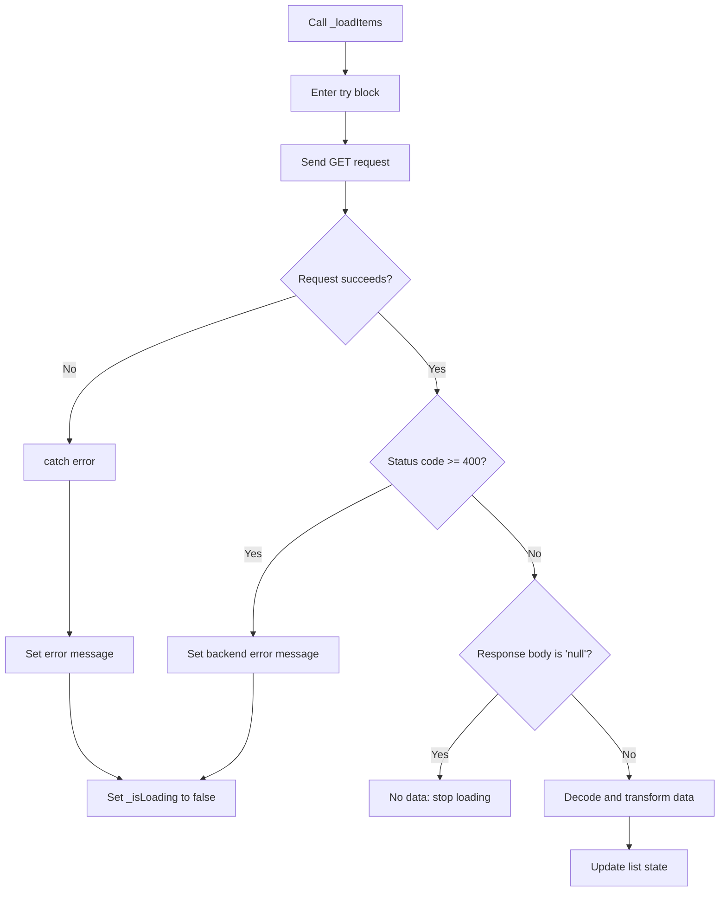

# Better Error Handling

## Overview

This lecture explains how to improve error handling when working with HTTP requests in Flutter.

In the previous lecture, we handled backend error responses by checking the HTTP status code. That is important, but it only covers one type of problem.

Sometimes, the request itself can fail before the backend sends any response. For example, the user may have no internet connection, or the app may try to contact an invalid domain.

To handle these cases, we use Dart's `try` and `catch` keywords.

---

## Why Better Error Handling Is Needed

When sending HTTP requests, different kinds of problems can happen.

Some errors come from the backend as a response.

Other errors happen while the request is being sent.



A reliable app should handle both situations.

---

## Two Types of HTTP Problems

### 1. Backend Error Responses

These happen when the backend sends a response, but the status code indicates failure.

Example:

```text id="ch4o5y"
404 Not Found
500 Internal Server Error
```

These can be handled by checking:

```dart id="fsgvp8"
if (response.statusCode >= 400) {
  // Handle backend error response
}
```

---

### 2. Request Exceptions

These happen when the request itself fails.

For example:

* The user has no internet connection
* The domain is invalid
* The server cannot be reached
* DNS lookup fails
* The request times out

In these cases, there may be no response object at all.

Instead, Dart throws an exception.

---

## What Does Throwing an Error Mean?

Dart allows code to throw an exception using the `throw` keyword.

Example:

```dart id="ob1yvp"
throw Exception('An error occurred.');
```

When an exception is thrown, the remaining code after it will not execute unless the exception is caught.

```dart id="s6s3q6"
throw Exception('Something went wrong');

// This code will not run
print('This line is skipped');
```

Throwing an exception is useful when something serious happens and the normal code flow should stop.

---

## Why HTTP Requests Can Throw Errors

The `http.get()`, `http.post()`, and `http.delete()` methods can throw exceptions if the request cannot be completed.

For example, this may fail because the domain is invalid:

```dart id="x1mldi"
final url = Uri.https(
  'my-project-default-rtdb.firebaseiocom',
  'shopping-list.json',
);
```

If the request fails before the backend returns a response, checking `response.statusCode` is not enough because there may be no `response`.

That is why we need `try` / `catch`.

---

## Using `try` and `catch`

The `try` block contains code that might fail.

The `catch` block handles the error if something goes wrong.

```dart id="wrt6dc"
try {
  // Code that might fail
} catch (error) {
  // Code that runs if an error occurs
}
```

If no error occurs, the `catch` block is skipped.

If an error occurs inside the `try` block, Dart jumps to the `catch` block.

---

## Basic Example

```dart id="h7qtee"
try {
  final response = await http.get(url);
  print(response.body);
} catch (error) {
  print('Something went wrong.');
}
```

This prevents the app from crashing when the request fails.

---

## Applying `try` / `catch` to Loading Data

The `_loadItems()` method should wrap the request and data transformation logic in a `try` block.

If anything fails, we update the error state and stop the loading spinner.

```dart id="owzox7"
Future<void> _loadItems() async {
  final url = Uri.https(
    'my-project-default-rtdb.firebaseio.com',
    'shopping-list.json',
  );

  try {
    final response = await http.get(url);

    if (response.statusCode >= 400) {
      setState(() {
        _error = 'Failed to fetch data. Please try again later.';
        _isLoading = false;
      });
      return;
    }

    if (response.body == 'null') {
      setState(() {
        _isLoading = false;
      });
      return;
    }

    final Map<String, dynamic> listData = json.decode(response.body);
    final List<GroceryItem> loadedItems = [];

    for (final item in listData.entries) {
      final category = categories.entries
          .firstWhere(
            (catItem) => catItem.value.title == item.value['category'],
          )
          .value;

      loadedItems.add(
        GroceryItem(
          id: item.key,
          name: item.value['name'],
          quantity: item.value['quantity'],
          category: category,
        ),
      );
    }

    setState(() {
      _groceryItems = loadedItems;
      _isLoading = false;
    });
  } catch (error) {
    setState(() {
      _error = 'Something went wrong. Please try again later.';
      _isLoading = false;
    });
  }
}
```

---

## Why Set `_isLoading` to `false` in `catch`?

If an error occurs while loading data, the app should not keep showing the loading spinner forever.

So inside the `catch` block, we must stop the loading state.

```dart id="qqz1gw"
setState(() {
  _error = 'Something went wrong. Please try again later.';
  _isLoading = false;
});
```

This allows the UI to show an error message instead of staying stuck.

---

## Error Handling Flow



---

## Showing the Error in the UI

The UI can display the error message if `_error` is not `null`.

```dart id="sp2r4o"
Widget content = const Center(
  child: Text('No items added yet.'),
);

if (_isLoading) {
  content = const Center(
    child: CircularProgressIndicator(),
  );
} else if (_groceryItems.isNotEmpty) {
  content = ListView.builder(
    itemCount: _groceryItems.length,
    itemBuilder: (ctx, index) => ListTile(
      title: Text(_groceryItems[index].name),
    ),
  );
}

if (_error != null) {
  content = Center(
    child: Text(_error!),
  );
}
```

This gives the app clear UI states:

| State       | UI                 |
| ----------- | ------------------ |
| Loading     | Show spinner       |
| Data loaded | Show item list     |
| No data     | Show empty message |
| Error       | Show error message |

---

## Backend Error vs Request Error

| Error Type             | Example                     | How to Handle               |
| ---------------------- | --------------------------- | --------------------------- |
| Backend error response | `404`, `500`, `403`         | Check `response.statusCode` |
| Request exception      | No internet, invalid domain | Use `try` / `catch`         |

Both are important.

Checking the status code handles responses from the backend.

Using `try` / `catch` handles failures that happen while trying to send the request.

---

## Optional: Throwing Your Own Exception

Instead of directly setting the error message inside the status code check, you can throw an exception.

```dart id="p7bdbk"
if (response.statusCode >= 400) {
  throw Exception('Failed to fetch data.');
}
```

Then the `catch` block can handle it.

```dart id="cb5uvj"
try {
  final response = await http.get(url);

  if (response.statusCode >= 400) {
    throw Exception('Failed to fetch data.');
  }

  // Continue if successful
} catch (error) {
  setState(() {
    _error = 'Something went wrong. Please try again later.';
    _isLoading = false;
  });
}
```

This is useful because it sends all error cases into one shared error-handling path.

---

## Using a Custom Exception Class

For larger apps, you can create a custom exception class.

```dart id="bh1ypu"
class HttpException implements Exception {
  final String message;

  HttpException(this.message);

  @override
  String toString() {
    return message;
  }
}
```

Then throw it when a request fails.

```dart id="e3mfwr"
if (response.statusCode >= 400) {
  throw HttpException('Failed to fetch data.');
}
```

This makes error handling more descriptive and easier to organize.

---

## Using Snack Bars for Action Errors

Some errors affect the entire screen, such as failing to load the initial data.

In that case, showing an error message in the body makes sense.

Other errors happen after user actions, such as failing to delete one item.

For those cases, a `SnackBar` is often better.

```dart id="r2la5p"
ScaffoldMessenger.of(context).showSnackBar(
  const SnackBar(
    content: Text('Could not complete the action. Please try again.'),
  ),
);
```

Use:

* Full-page error message for critical loading failures
* Snack bars for temporary action failures

---

## Full-Page Error vs Snack Bar

| Situation                     | Recommended UI          |
| ----------------------------- | ----------------------- |
| Initial data cannot be loaded | Full-page error message |
| Add item fails                | Snack bar or dialog     |
| Delete item fails             | Snack bar and rollback  |
| Empty backend data            | Empty-state message     |
| Request is still running      | Loading spinner         |

---

## Important Development Tip

When testing error handling, you may intentionally break the URL.

For example, you might remove part of the domain.

After testing, always restore the correct Firebase URL.

Correct:

```dart id="om4g3u"
final url = Uri.https(
  'my-project-default-rtdb.firebaseio.com',
  'shopping-list.json',
);
```

Incorrect:

```dart id="p7yu4u"
final url = Uri.https(
  'my-project-default-rtdb.firebaseio',
  'shopping-list.json',
);
```

---

## Key Concepts

### Exception

An object that represents an error in Dart.

### `throw`

A keyword used to manually generate an exception.

### `try`

A block used to wrap code that may fail.

### `catch`

A block used to handle errors thrown inside a `try` block.

### Error State

A state variable, such as `_error`, used to store a user-facing error message.

### Request Error

An error that happens while sending the request, before a response is received.

### Error Response

A backend response with an error status code.

### Snack Bar

A temporary message shown at the bottom of the screen.

---

## Important Tips

* Do not rely only on status code checks.
* Use `try` / `catch` for network errors and request failures.
* Always stop the loading spinner when an error occurs.
* Show user-friendly error messages instead of raw technical errors.
* Use full-page error messages when the screen cannot load.
* Use snack bars for temporary action failures.
* Consider custom exception classes in larger apps.
* Restore the correct backend URL after testing error handling.

---

## Summary

In this lecture, we improved error handling by adding `try` / `catch`.

Checking `response.statusCode` is useful for backend error responses, but it does not handle cases where the request itself fails, such as when the user has no internet connection or the domain is invalid.

By wrapping the request and data transformation code in a `try` block, we can catch exceptions and update the UI gracefully.

This prevents the app from crashing or getting stuck in a loading state and gives the user a clear error message when something goes wrong.
