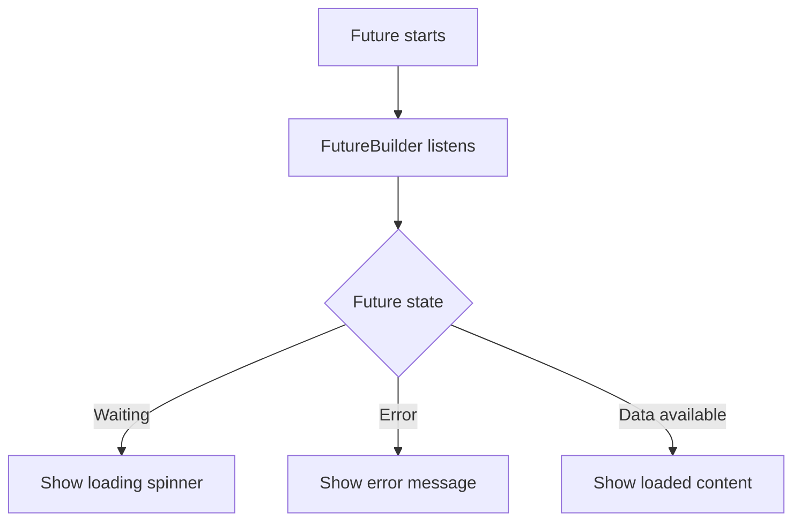
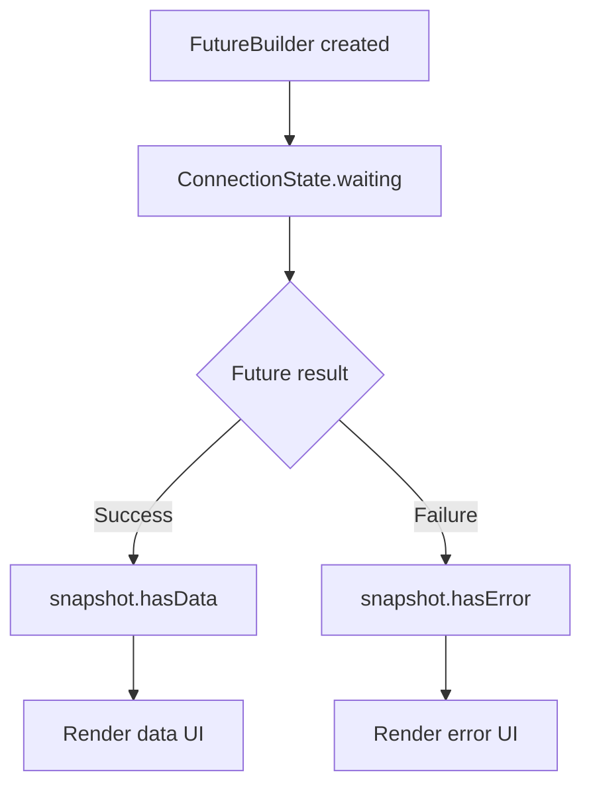
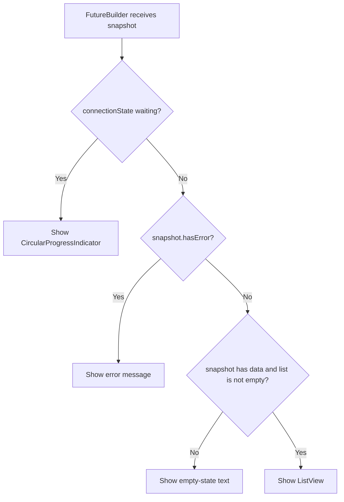
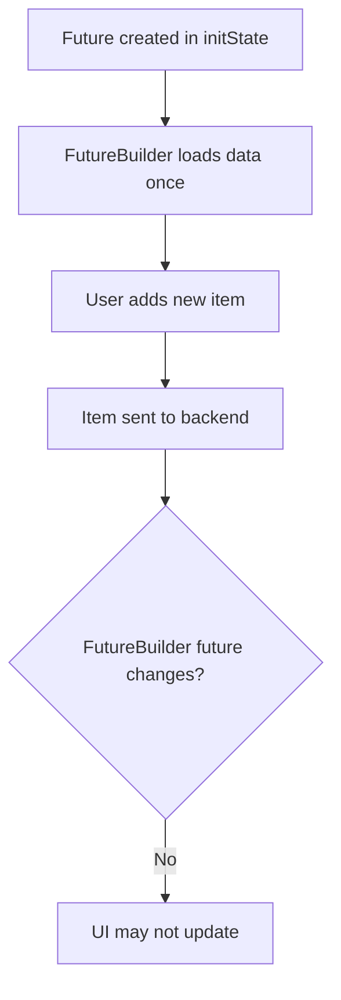

# Using the `FutureBuilder` Widget

## Overview

This lecture introduces the `FutureBuilder` widget in Flutter.

`FutureBuilder` is a useful widget for working with asynchronous operations, including HTTP requests. Instead of manually managing loading, error, and success states with variables like `_isLoading` and `_error`, `FutureBuilder` listens to a `Future` and rebuilds the UI based on the current state of that future.

This can make async UI code cleaner and more declarative.

---

## Why Use `FutureBuilder`?

When sending an HTTP request, methods like `http.get()` return a `Future`.

A `Future` represents data that will be available later.

For example:

```dart
final response = await http.get(url);
```

Normally, we manually manage the different states:

* Loading
* Error
* Data loaded
* No data

`FutureBuilder` can help handle these states automatically.



---

## What Is `FutureBuilder`?

`FutureBuilder` is a Flutter widget that builds different UI based on the state of a `Future`.

It takes two main arguments:

| Argument  | Purpose                                                             |
| --------- | ------------------------------------------------------------------- |
| `future`  | The `Future` that should be observed                                |
| `builder` | A function that returns different widgets based on the future state |

Basic structure:

```dart
FutureBuilder(
  future: someFuture,
  builder: (context, snapshot) {
    // Return UI based on snapshot
  },
)
```

---

## The `AsyncSnapshot`

The `builder` function receives a `snapshot`.

```dart
builder: (context, snapshot) {
  // use snapshot here
}
```

The snapshot contains information about the current state of the future.

Important snapshot properties:

| Property                   | Description                                  |
| -------------------------- | -------------------------------------------- |
| `snapshot.connectionState` | Tells whether the future is waiting or done  |
| `snapshot.hasError`        | `true` if the future completed with an error |
| `snapshot.error`           | The error object                             |
| `snapshot.hasData`         | `true` if the future completed with data     |
| `snapshot.data`            | The data returned by the future              |

---

## Common Future States



---

## Changing `loadItems` to Return Data

Before using `FutureBuilder`, the `_loadItems()` method manually updated state with `setState()`.

With `FutureBuilder`, we can instead make `_loadItems()` return the loaded list.

Because the method is `async`, it automatically returns a `Future`.

```dart
Future<List<GroceryItem>> _loadItems() async {
  final url = Uri.https(
    'my-project-default-rtdb.firebaseio.com',
    'shopping-list.json',
  );

  final response = await http.get(url);

  if (response.statusCode >= 400) {
    throw Exception(
      'Failed to fetch grocery items. Please try again later.',
    );
  }

  if (response.body == 'null') {
    return [];
  }

  final Map<String, dynamic> listData = json.decode(response.body);
  final List<GroceryItem> loadedItems = [];

  for (final item in listData.entries) {
    final category = categories.entries
        .firstWhere(
          (catItem) => catItem.value.title == item.value['category'],
        )
        .value;

    loadedItems.add(
      GroceryItem(
        id: item.key,
        name: item.value['name'],
        quantity: item.value['quantity'],
        category: category,
      ),
    );
  }

  return loadedItems;
}
```

---

## Why Throw an Exception?

With `FutureBuilder`, errors are handled through the `snapshot`.

If `_loadItems()` throws an exception, the future is completed with an error.

Then inside `FutureBuilder`, this becomes true:

```dart
snapshot.hasError
```

Example:

```dart
if (response.statusCode >= 400) {
  throw Exception('Failed to fetch grocery items.');
}
```

This allows the UI to show an error widget automatically.

---

## Important: Do Not Call the Future Directly in `build()`

A common mistake is this:

```dart
FutureBuilder(
  future: _loadItems(),
  builder: (context, snapshot) {
    // ...
  },
)
```

This is discouraged because `build()` can run many times.

If `_loadItems()` is called directly inside `build()`, a new HTTP request may be sent every time the widget rebuilds.

That can cause repeated or unnecessary backend requests.

---

## Correct Approach: Store the Future

Instead, create the future once in `initState()` and store it in a state variable.

```dart
late Future<List<GroceryItem>> _loadedItems;
```

The `late` keyword tells Dart that the variable will be initialized before it is used.

Then assign it in `initState()`:

```dart
@override
void initState() {
  super.initState();
  _loadedItems = _loadItems();
}
```

Now the future is created only once when the screen is first loaded.

---

## Why Use `late`?

The variable cannot be initialized immediately because `_loadItems()` should run during initialization.

So we use:

```dart
late Future<List<GroceryItem>> _loadedItems;
```

This tells Dart:

```text
This variable does not have a value right now,
but it will be assigned before it is used.
```

Since `initState()` runs before `build()`, this is safe.

---

## Using `FutureBuilder` in the UI

Inside the `build()` method, use `FutureBuilder` as the body content.

```dart
FutureBuilder<List<GroceryItem>>(
  future: _loadedItems,
  builder: (context, snapshot) {
    if (snapshot.connectionState == ConnectionState.waiting) {
      return const Center(
        child: CircularProgressIndicator(),
      );
    }

    if (snapshot.hasError) {
      return Center(
        child: Text(snapshot.error.toString()),
      );
    }

    if (!snapshot.hasData || snapshot.data!.isEmpty) {
      return const Center(
        child: Text('No items added yet.'),
      );
    }

    final loadedItems = snapshot.data!;

    return ListView.builder(
      itemCount: loadedItems.length,
      itemBuilder: (ctx, index) {
        return ListTile(
          title: Text(loadedItems[index].name),
          leading: Container(
            width: 24,
            height: 24,
            color: loadedItems[index].category.color,
          ),
          trailing: Text(
            loadedItems[index].quantity.toString(),
          ),
        );
      },
    );
  },
)
```

---

## Full Example

```dart
class GroceryList extends StatefulWidget {
  const GroceryList({super.key});

  @override
  State<GroceryList> createState() => _GroceryListState();
}

class _GroceryListState extends State<GroceryList> {
  late Future<List<GroceryItem>> _loadedItems;

  @override
  void initState() {
    super.initState();
    _loadedItems = _loadItems();
  }

  Future<List<GroceryItem>> _loadItems() async {
    final url = Uri.https(
      'my-project-default-rtdb.firebaseio.com',
      'shopping-list.json',
    );

    final response = await http.get(url);

    if (response.statusCode >= 400) {
      throw Exception(
        'Failed to fetch grocery items. Please try again later.',
      );
    }

    if (response.body == 'null') {
      return [];
    }

    final Map<String, dynamic> listData = json.decode(response.body);
    final List<GroceryItem> loadedItems = [];

    for (final item in listData.entries) {
      final category = categories.entries
          .firstWhere(
            (catItem) => catItem.value.title == item.value['category'],
          )
          .value;

      loadedItems.add(
        GroceryItem(
          id: item.key,
          name: item.value['name'],
          quantity: item.value['quantity'],
          category: category,
        ),
      );
    }

    return loadedItems;
  }

  @override
  Widget build(BuildContext context) {
    return Scaffold(
      appBar: AppBar(
        title: const Text('Your Groceries'),
      ),
      body: FutureBuilder<List<GroceryItem>>(
        future: _loadedItems,
        builder: (context, snapshot) {
          if (snapshot.connectionState == ConnectionState.waiting) {
            return const Center(
              child: CircularProgressIndicator(),
            );
          }

          if (snapshot.hasError) {
            return Center(
              child: Text(snapshot.error.toString()),
            );
          }

          if (!snapshot.hasData || snapshot.data!.isEmpty) {
            return const Center(
              child: Text('No items added yet.'),
            );
          }

          final loadedItems = snapshot.data!;

          return ListView.builder(
            itemCount: loadedItems.length,
            itemBuilder: (ctx, index) {
              return ListTile(
                title: Text(loadedItems[index].name),
                leading: Container(
                  width: 24,
                  height: 24,
                  color: loadedItems[index].category.color,
                ),
                trailing: Text(
                  loadedItems[index].quantity.toString(),
                ),
              );
            },
          );
        },
      ),
    );
  }
}
```

---

## FutureBuilder UI Logic

The UI logic becomes centralized inside the `builder`.



---

## Advantages of `FutureBuilder`

`FutureBuilder` can reduce boilerplate code.

Instead of manually creating variables like:

```dart
bool _isLoading = true;
String? _error;
```

You can let `FutureBuilder` handle the future state through `snapshot`.

Benefits include:

* Cleaner async UI code
* Built-in loading, error, and data state handling
* Less manual `setState()` logic
* Declarative UI structure
* Useful for one-time data loading

---

## Important Limitation in This App

`FutureBuilder` is useful, but it may not be ideal for every screen.

In this grocery list app, the loaded data is also modified from inside the same screen.

For example:

* Adding a new item
* Deleting an item
* Updating the local list after a backend request

This creates a problem.

The `FutureBuilder` listens to the future created in `initState()`.

That future runs once. After it completes, the `FutureBuilder` does not automatically refetch or rebuild with new backend data unless a new future is provided.

---

## Problem with Add and Delete

If we add a new item after the future has already completed, the UI may not update automatically.



The same issue can happen when deleting items.

Because of this, the manual state approach may be better for this specific app.

---

## When FutureBuilder Is a Good Choice

`FutureBuilder` is best when:

* You need to load data once
* The data is mostly read-only on that screen
* You want simple loading/error/success UI states
* You do not need to frequently mutate the loaded list locally

Good examples:

* Loading a user profile
* Fetching product details
* Loading app settings
* Fetching a read-only article
* Loading a one-time configuration

---

## When Manual State May Be Better

Manual state management may be better when:

* The user can add items
* The user can delete items
* The list changes often
* You need optimistic updates
* You need rollback behavior after failed actions
* You want full control over local state

For this grocery list app, manually managing state may be simpler and more reliable.

---

## FutureBuilder vs Manual State

| Approach                             | Best For                      | Trade-off                         |
| ------------------------------------ | ----------------------------- | --------------------------------- |
| `FutureBuilder`                      | One-time data loading         | Less control over later mutations |
| Manual `_isLoading` / `_error` state | Interactive, changing data    | More boilerplate                  |
| State management tools               | Larger apps with shared state | More setup and structure          |

---

## Key Concepts

### `FutureBuilder`

A Flutter widget that builds UI based on the state of a `Future`.

### `Future<T>`

An asynchronous value that will complete later with data of type `T`.

### `AsyncSnapshot<T>`

The object passed to the `FutureBuilder` builder, containing future state, data, and error information.

### `snapshot.connectionState`

Indicates whether the future is still waiting or completed.

### `snapshot.hasError`

Indicates whether the future completed with an error.

### `snapshot.data`

The data returned by the future after it completes successfully.

### `late`

A Dart keyword used when a non-nullable variable will be assigned before it is used.

---

## Important Tips

* Use `FutureBuilder` for one-shot async data loading.
* Store the future in a variable instead of calling the async function directly in `build()`.
* Initialize the future in `initState()`.
* Use `snapshot.connectionState` to show loading UI.
* Use `snapshot.hasError` to show error UI.
* Use `snapshot.data` to display loaded data.
* Throw exceptions inside the future-producing function if you want `snapshot.hasError` to become true.
* Avoid `FutureBuilder` when the data is frequently modified from the same screen, unless you carefully recreate the future or manage state separately.

---

## Summary

`FutureBuilder` is a useful Flutter widget for building UI around a `Future`.

It can automatically show different UI for loading, error, empty, and success states by using the `AsyncSnapshot` provided to its builder function.

However, it is not always the best solution. In this grocery list app, the data is loaded and then modified by adding or deleting items, so manual state management may be more practical.

Still, `FutureBuilder` is an important widget to know because it can greatly simplify screens that only need to load data once and display the result.
