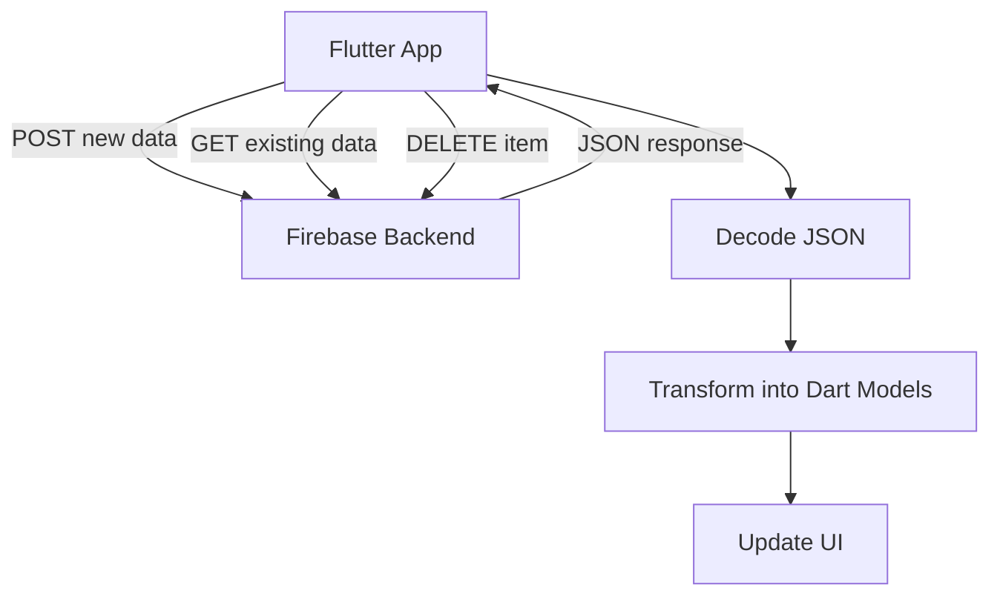
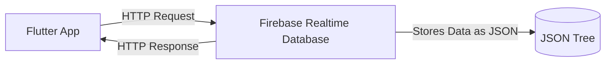
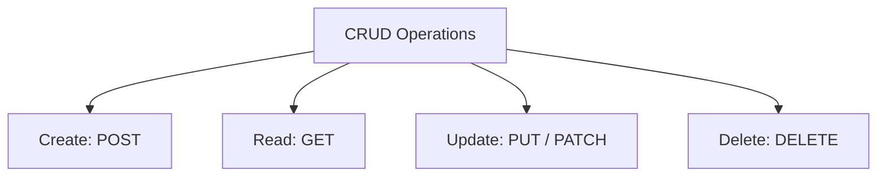
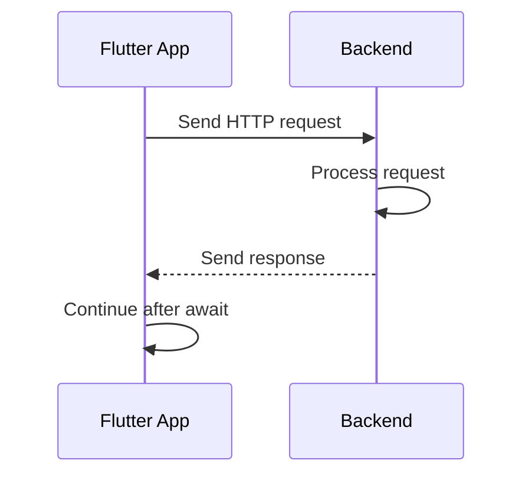
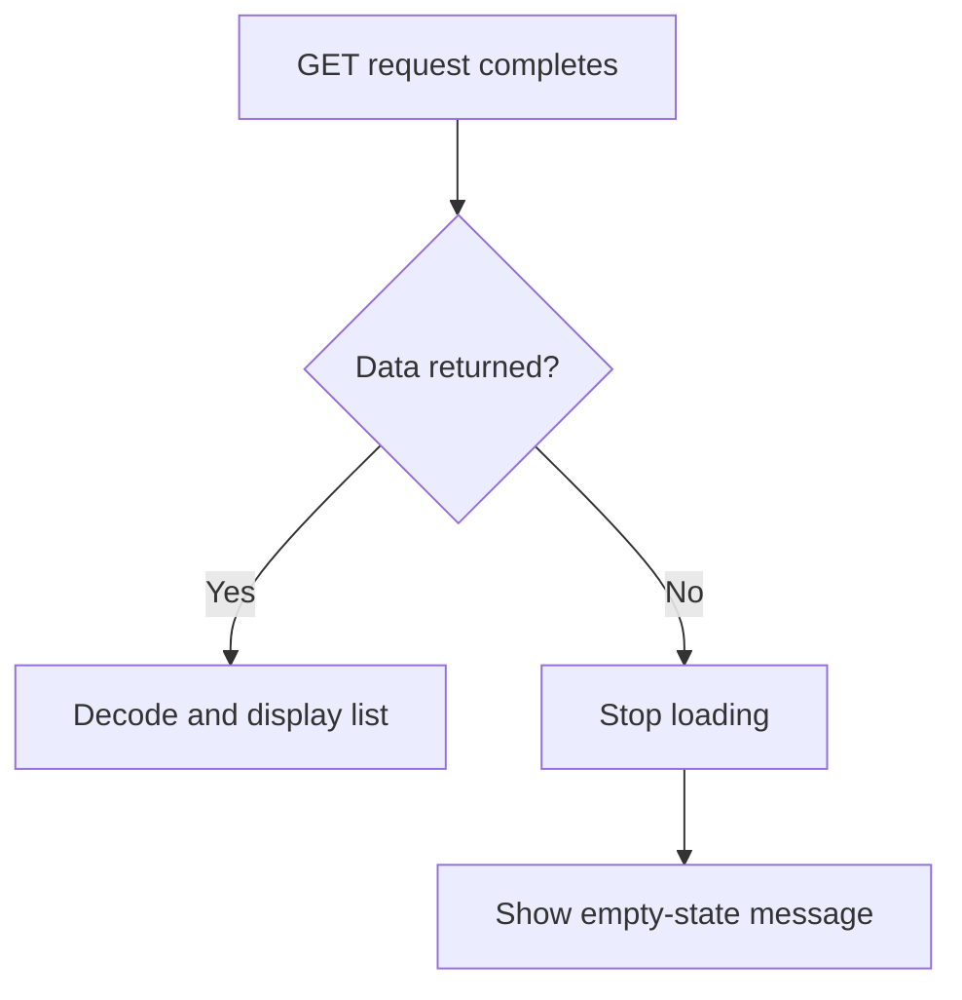
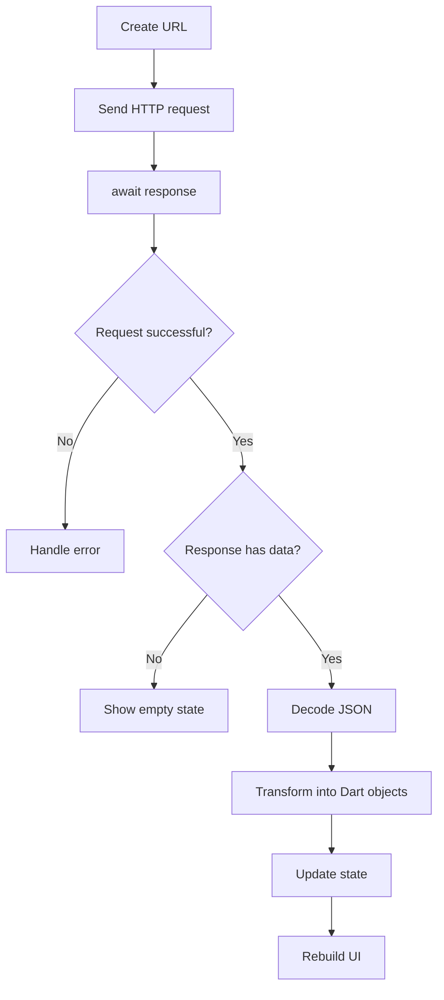

# Module Summary: HTTP, Networking, and Backend Communication

## Overview

This lecture summarizes the key concepts covered in the HTTP, Networking, and Backend Communication module.

In this module, you learned how to connect a Flutter app to a backend server, send HTTP requests, handle responses, transform backend data, manage loading and error states, and store data remotely instead of only keeping it locally on the user's device.

These skills are essential for building real-world Flutter apps that communicate with online services and databases.

---

## What This Module Covered

Throughout this module, we connected a Flutter grocery list app to a Firebase Realtime Database backend.

The app learned how to:

* Store new items on a backend
* Fetch existing items from the backend
* Delete items from the backend
* Decode JSON responses
* Transform backend data into Dart objects
* Show loading indicators
* Display empty-state messages
* Handle error responses
* Handle request failures
* Use `FutureBuilder` as an alternative async UI tool



---

## Backend Communication Recap

A backend is a remote server or service that stores and processes data outside the user's device.

Without a backend, app data is usually stored only locally. That means the data may be lost if:

* The app is deleted
* The device is reset
* The user changes devices
* The local storage is cleared

By using a backend, data can be stored remotely and accessed again later.

---

## Firebase as a Dummy Backend

In this module, Firebase Realtime Database was used as a simple backend.

Firebase was useful because it provides:

* A hosted database
* A REST API
* Automatic unique IDs
* JSON-based data storage
* Simple setup without writing custom backend code

For learning purposes, Firebase allowed us to focus on Flutter networking instead of backend development.



---

## HTTP Request Basics

Flutter apps communicate with backends using HTTP requests.

Each HTTP request usually includes:

| Part    | Purpose                             |
| ------- | ----------------------------------- |
| URL     | Where the request is sent           |
| Method  | What action should be performed     |
| Headers | Metadata about the request          |
| Body    | Optional data sent with the request |

The backend processes the request and sends back an HTTP response.

---

## Common HTTP Methods

This module focused mainly on `GET`, `POST`, and `DELETE`.

| HTTP Method | Purpose               | Example in App         |
| ----------- | --------------------- | ---------------------- |
| `GET`       | Fetch data            | Load grocery items     |
| `POST`      | Create new data       | Add a new grocery item |
| `DELETE`    | Remove data           | Delete a grocery item  |
| `PUT`       | Replace data          | Replace an entire item |
| `PATCH`     | Update data partially | Change only one field  |

Together, these operations form the foundation of CRUD apps.

---

## CRUD Pattern

CRUD stands for:

| CRUD Operation | HTTP Method     | Meaning              |
| -------------- | --------------- | -------------------- |
| Create         | `POST`          | Add new data         |
| Read           | `GET`           | Load existing data   |
| Update         | `PUT` / `PATCH` | Modify existing data |
| Delete         | `DELETE`        | Remove data          |



In this module, we implemented create, read, and delete.

---

## Adding the `http` Package

To send HTTP requests from Flutter, we added the `http` package.

```bash id="e6dz12"
flutter pub add http
```

Then we imported it with an alias:

```dart id="m5y281"
import 'package:http/http.dart' as http;
```

Using `as http` makes the code clearer:

```dart id="ra3ryw"
http.get(url);
http.post(url);
http.delete(url);
```

---

## Sending Data with POST

To store new data on Firebase, we used `http.post()`.

```dart id="jpcp68"
final response = await http.post(
  url,
  headers: {
    'Content-Type': 'application/json',
  },
  body: json.encode({
    'name': _enteredName,
    'quantity': _enteredQuantity,
    'category': _selectedCategory.title,
  }),
);
```

A `POST` request sends data to the backend.

The data must be JSON-encoded before being sent.

Firebase then stores the item and returns a generated ID.

Example response:

```json id="nq6w8s"
{
  "name": "-NxT8abc123"
}
```

---

## Waiting for the Response

HTTP requests are asynchronous.

That means the app must wait for the response before continuing.

```dart id="u7fs3c"
final response = await http.post(...);
```

The `await` keyword pauses the function until the request completes.

This is important because the app should only continue once it knows whether the request succeeded or failed.



---

## Fetching Data with GET

To load data from Firebase, we used `http.get()`.

```dart id="i0ncgx"
final response = await http.get(url);
```

Firebase returns data as JSON.

For example:

```json id="c1mpf0"
{
  "-NxT8abc123": {
    "name": "Milk",
    "quantity": 2,
    "category": "Dairy"
  }
}
```

This response must be decoded and transformed before it can be used in the Flutter UI.

---

## Decoding JSON

Dart's `dart:convert` library provides JSON utilities.

```dart id="v0qt8d"
import 'dart:convert';
```

To decode JSON:

```dart id="d0r9qa"
final Map<String, dynamic> listData = json.decode(response.body);
```

To encode Dart data as JSON:

```dart id="rs8ywf"
final jsonData = json.encode({
  'name': 'Milk',
  'quantity': 2,
});
```

---

## Transforming Backend Data

Backend data is usually not immediately ready for the UI.

In this app, Firebase returned a map where each key was a generated ID.

We converted that data into a list of `GroceryItem` objects.

```dart id="zy805h"
final List<GroceryItem> loadedItems = [];

for (final item in listData.entries) {
  final category = categories.entries
      .firstWhere(
        (catItem) => catItem.value.title == item.value['category'],
      )
      .value;

  loadedItems.add(
    GroceryItem(
      id: item.key,
      name: item.value['name'],
      quantity: item.value['quantity'],
      category: category,
    ),
  );
}
```

This transformation step keeps the rest of the app clean because the UI can work with proper Dart model objects.

---

## Avoiding Unnecessary Requests

After adding a new item, we avoided sending an extra `GET` request.

Instead, we used the Firebase-generated ID from the `POST` response and created the new `GroceryItem` locally.

```dart id="n0gq2d"
final Map<String, dynamic> resData = json.decode(response.body);

Navigator.of(context).pop(
  GroceryItem(
    id: resData['name'],
    name: _enteredName,
    quantity: _enteredQuantity,
    category: _selectedCategory,
  ),
);
```

Then the grocery list screen added the item directly to local state.

```dart id="h135rw"
setState(() {
  _groceryItems.add(newItem);
});
```

This made the app more efficient.

---

## Managing Loading State

When the app is waiting for data, the UI should show a loading indicator.

We used a boolean variable:

```dart id="y2uhkw"
bool _isLoading = true;
```

Then we displayed a spinner while loading.

```dart id="olj3sr"
if (_isLoading) {
  content = const Center(
    child: CircularProgressIndicator(),
  );
}
```

This prevents the app from showing misleading text like “No items added yet” before the request has finished.

---

## Managing Sending State

When the user submits a new item, the app sends a `POST` request.

During that time, we used another boolean:

```dart id="a9am43"
bool _isSending = false;
```

When sending starts:

```dart id="sfo1pd"
setState(() {
  _isSending = true;
});
```

Then we disabled the buttons:

```dart id="lpt2do"
onPressed: _isSending ? null : _saveItem,
```

This prevents duplicate submissions and gives the user clear feedback.

---

## Handling Empty Data

Firebase returns `'null'` when a database node has no data.

If we try to decode that as a map, the app may crash.

So we check for the no-data case:

```dart id="c8ey3e"
if (response.body == 'null') {
  setState(() {
    _isLoading = false;
  });
  return;
}
```

The no-data case is not an error.

It simply means there are no items yet.



---

## Handling Error Responses

Backend requests can fail.

One way to detect failure is by checking the HTTP status code.

```dart id="fqt77h"
if (response.statusCode >= 400) {
  setState(() {
    _error = 'Failed to fetch data. Please try again later.';
    _isLoading = false;
  });
  return;
}
```

Status codes in the `400` and `500` ranges usually indicate errors.

| Status Code Range | Meaning           |
| ----------------- | ----------------- |
| `2xx`             | Success           |
| `4xx`             | Client-side error |
| `5xx`             | Server-side error |

---

## Handling Request Exceptions

Some errors happen before a backend response is received.

For example:

* No internet connection
* Invalid domain
* Server cannot be reached

To handle these errors, we used `try` and `catch`.

```dart id="i5ta26"
try {
  final response = await http.get(url);

  if (response.statusCode >= 400) {
    throw Exception('Failed to fetch data.');
  }

  // Decode and transform data
} catch (error) {
  setState(() {
    _error = 'Something went wrong. Please try again later.';
    _isLoading = false;
  });
}
```

This prevents the app from crashing or staying stuck in a loading state.

---

## Sending DELETE Requests

To delete data from Firebase, we used `http.delete()`.

The URL must include the specific item ID.

```dart id="dghn4m"
final url = Uri.https(
  'my-project-default-rtdb.firebaseio.com',
  'shopping-list/${item.id}.json',
);

final response = await http.delete(url);
```

This targets one item inside the `shopping-list` node.

---

## Optimistic Deletion

We used an optimistic update pattern for deletion.

That means the item is removed from the UI immediately.

If the backend request fails, the item is restored.

```dart id="myj1au"
final itemIndex = _groceryItems.indexOf(item);

setState(() {
  _groceryItems.remove(item);
});

final response = await http.delete(url);

if (response.statusCode >= 400) {
  setState(() {
    _groceryItems.insert(itemIndex, item);
  });
}
```

This makes the UI feel faster while still allowing rollback if something goes wrong.

---

## FutureBuilder

At the end of the module, we explored `FutureBuilder`.

`FutureBuilder` is a widget that listens to a `Future` and rebuilds the UI based on the future's state.

It can handle:

* Loading
* Error
* Empty data
* Loaded data

```dart id="x9xplf"
FutureBuilder<List<GroceryItem>>(
  future: _loadedItems,
  builder: (context, snapshot) {
    if (snapshot.connectionState == ConnectionState.waiting) {
      return const Center(child: CircularProgressIndicator());
    }

    if (snapshot.hasError) {
      return Center(child: Text(snapshot.error.toString()));
    }

    if (!snapshot.hasData || snapshot.data!.isEmpty) {
      return const Center(child: Text('No items added yet.'));
    }

    final items = snapshot.data!;

    return ListView.builder(
      itemCount: items.length,
      itemBuilder: (ctx, index) => Text(items[index].name),
    );
  },
);
```

`FutureBuilder` is useful for one-time data loading.

However, for this grocery list app, manual state management was more practical because the list is also modified through adding and deleting items.

---

## FutureBuilder vs Manual State

| Approach                       | Best For                                | Notes                            |
| ------------------------------ | --------------------------------------- | -------------------------------- |
| Manual state with `setState()` | Interactive lists with add/delete logic | More control                     |
| `FutureBuilder`                | One-time data loading                   | Less boilerplate                 |
| State management tools         | Larger apps                             | Better structure and scalability |

---

## Complete Request Lifecycle

A typical HTTP flow in Flutter looks like this:



---

## Important UI States

Every backend-connected screen should usually handle these states:

| State   | Meaning                                | UI            |
| ------- | -------------------------------------- | ------------- |
| Loading | Request is in progress                 | Spinner       |
| Empty   | Request succeeded but returned no data | Empty message |
| Error   | Request failed                         | Error message |
| Success | Data loaded successfully               | Main content  |

Handling all four states makes the app feel much more complete and reliable.

---

## Key Concepts

### Backend

A remote server or service that stores and processes data.

### HTTP Request

A message sent from the Flutter app to the backend.

### HTTP Response

The backend's answer to the request.

### `http` Package

The package used to send HTTP requests from Flutter.

### JSON

A common text-based format for exchanging structured data.

### `async` / `await`

Dart syntax for working with asynchronous operations.

### `setState`

Used to update state and rebuild the UI.

### Loading State

A UI state shown while waiting for data.

### Empty State

A UI state shown when no data exists.

### Error State

A UI state shown when something goes wrong.

### `FutureBuilder`

A widget that builds UI based on the state of a `Future`.

---

## Best Practices

* Always use `await` for important backend requests.
* Always check `response.statusCode`.
* Handle loading, empty, error, and success states separately.
* Use `json.encode()` when sending data.
* Use `json.decode()` when reading JSON responses.
* Avoid making HTTP requests inside `build()`.
* Use `initState()` for one-time loading.
* Do not expose raw technical errors to users.
* Use user-friendly error messages.
* Avoid unnecessary requests when local state can be updated directly.
* Use HTTPS in real apps.
* Secure Firebase rules before deploying a production app.
* Consider state management tools for larger apps.

---

## What You Can Build Now

After completing this module, you can build Flutter apps that:

* Fetch data from a backend
* Send user input to a backend
* Store data remotely
* Delete backend records
* Decode JSON responses
* Transform raw backend data into Dart models
* Show loading indicators
* Display error messages
* Handle empty backend responses
* Keep local UI state in sync with backend data

---

## Next Steps

To continue improving, you can practice by building apps that connect to public REST APIs.

Good practice projects include:

* Weather app
* Todo app with Firebase
* Movie search app
* Recipe app
* Notes app with remote storage
* Product catalog app
* News reader app

As your apps grow, you should also explore:

* Repository pattern
* Service classes
* Riverpod or BLoC
* Authentication
* Secure Firebase rules
* JSON serialization tools
* More advanced HTTP clients like Dio

---

## Summary

This module introduced backend communication in Flutter using HTTP.

You learned how to set up Firebase as a dummy backend, add the `http` package, send `POST`, `GET`, and `DELETE` requests, wait for responses, decode JSON, transform backend data into Dart objects, and update the UI.

You also learned how to handle loading states, no-data states, error responses, request exceptions, and how `FutureBuilder` can simplify some async UI scenarios.

These concepts form the foundation for building real-world Flutter apps that store and retrieve data from remote backends instead of relying only on local device memory.
