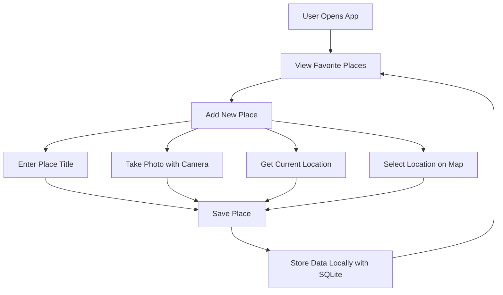
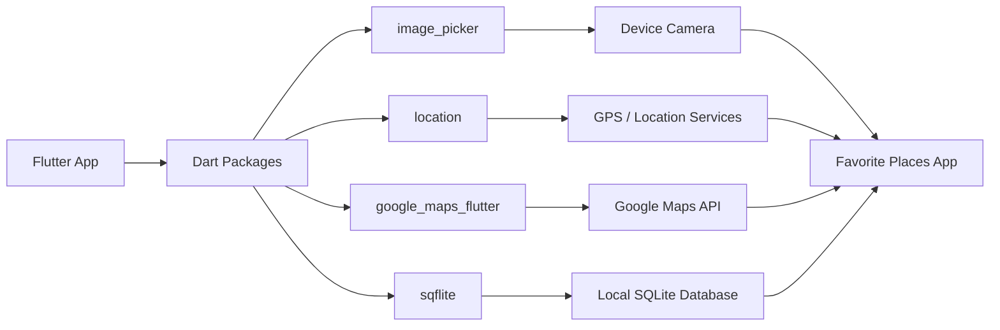
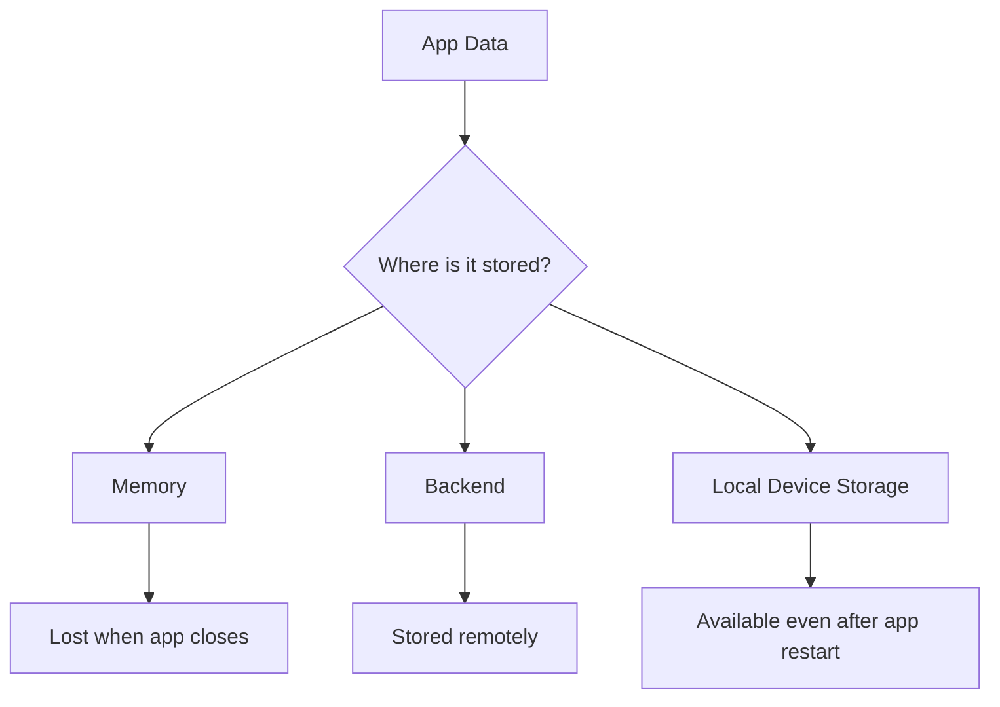

# Module Introduction: Native Device Features in Flutter

## Overview

This module introduces advanced Flutter features that interact directly with native device hardware and services. You will learn how to access the camera, retrieve the user's GPS location, display maps with Google Maps, and store data locally using SQLite.

Throughout the module, you will build a complete **Favorite Places** app. This app allows users to save places they like, attach photos, select or detect locations, and persist all data on the device.

---

## Learning Goals

By the end of this module, you will be able to:

* Access native device features from a Flutter app
* Use the device camera to take photos
* Get the user's current location
* Display locations on Google Maps
* Let users select a location from a map
* Store app data locally using SQLite
* Configure platform-level permissions for Android and iOS
* Combine native features with Flutter state management

---

## Key Topics

### 1. Camera Access

You will learn how to use the device camera so users can take photos directly inside the app.

The app will use the `image_picker` package to capture images and display them in the UI.

```dart
image_picker
```

### 2. Location Services

You will learn how to get the user's current GPS location.

This allows the app to automatically detect where a favorite place is located.

```dart
location
```

### 3. Google Maps Integration

You will learn how to display a location on a map using Google Maps.

Users will also be able to manually select a location from the map.

```dart
google_maps_flutter
```

### 4. Local Data Storage

You will learn how to store data directly on the user's device.

Instead of keeping data only in memory or sending it to a backend, the app will save favorite places locally using SQLite.

```dart
sqflite
```

---

## Project: Favorite Places App

The main project in this module is a **Favorite Places** app.

The app allows users to:

* Add a new favorite place
* Take a photo of the place
* Detect their current location
* Select a location on a map
* Save the place locally on the device
* View saved favorite places later

---

## App Feature Flow



---

## Native Feature Architecture



---

## Important Packages

| Package               | Purpose                                      |
| --------------------- | -------------------------------------------- |
| `image_picker`        | Allows users to take photos or pick images   |
| `location`            | Retrieves the user's current GPS location    |
| `google_maps_flutter` | Displays Google Maps inside the Flutter app  |
| `sqflite`             | Stores structured data locally using SQLite  |
| `path_provider`       | Helps locate device storage paths            |
| `path`                | Helps build safe file paths across platforms |

---

## Platform Permissions

Native device features require permission configuration outside normal Dart code.

You must configure permissions for:

### Android

Examples include:

* Camera permission
* Location permission
* Internet permission
* Google Maps API key

These are usually configured in:

```text
android/app/src/main/AndroidManifest.xml
```

### iOS

Examples include:

* Camera usage description
* Location usage description
* Google Maps API key

These are usually configured in:

```text
ios/Runner/Info.plist
```

---

## Why Local Storage Matters

So far, app data may have been stored in memory or on a backend.

However, memory-based data disappears when:

* The app is closed
* The app is killed by the operating system
* The device runs low on memory
* The app stays in the background for too long

Local storage solves this problem by saving data directly on the user's device.



---

## Tips

* Use a real device when testing camera and GPS features.
* Some emulators may not fully support camera or location features.
* Review Riverpod before starting this module because state management patterns are reused.
* Google Maps API requires a Google Cloud project.
* Google Maps API usually requires billing to be enabled, even when using free-tier limits.
* Always test permissions on both Android and iOS.
* Handle permission denial gracefully in the UI.

---

## Notes

This module bridges the gap between pure Flutter UI development and real-world mobile app development.

Accessing native device features requires two layers of work:

1. **Dart-level integration** using Flutter packages
2. **Platform-level setup** using Android and iOS configuration files

For example, using the camera is not only about calling a Dart method. The app must also request permission from the operating system and handle the case where the user denies access.

The same applies to location services, maps, and local storage.

---

## Summary

This module teaches you how to integrate native device features into a Flutter app.

You will build a complete **Favorite Places** app that uses:

* Camera access
* GPS location
* Google Maps
* Map-based location selection
* Local SQLite storage

By the end of the module, you will understand how Flutter apps can interact with real device hardware and services, making your apps more practical and production-ready.
