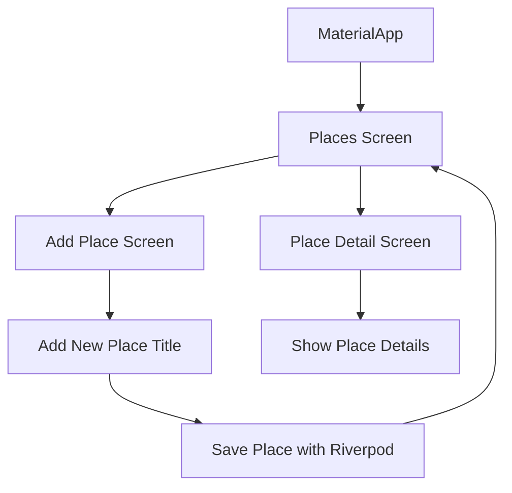
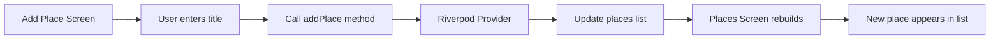
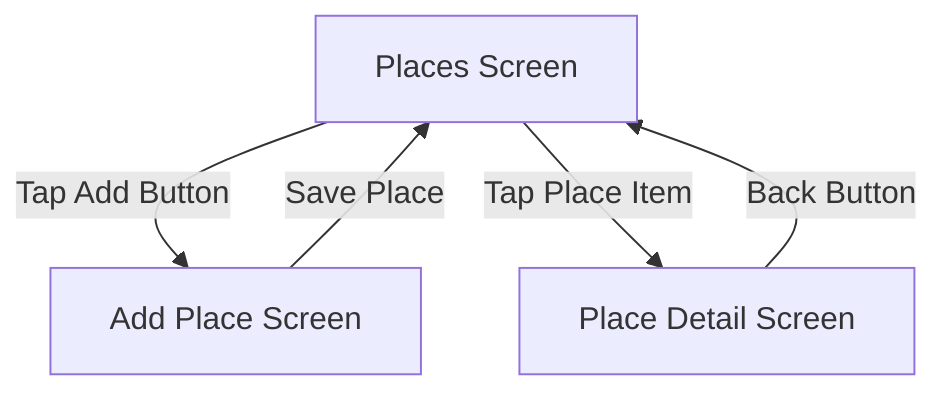
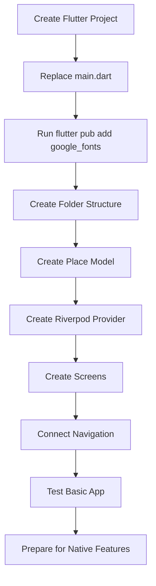

# Setup and a Challenge For You

## Overview

This lecture introduces the initial setup for the **Favorite Places** app and presents a coding challenge before the full implementation begins.

A new starter `main.dart` file is provided for this project. You should create a new Flutter project, replace the default `main.dart` file with the provided one, and install the required package dependencies.

Before using native device features such as the camera, GPS location, maps, and local storage, this challenge focuses on building the basic app structure using Flutter navigation and Riverpod state management.

---

## Learning Goals

By the end of this lecture and challenge, you should be able to:

* Set up a new Flutter project using a provided `main.dart` file
* Add external packages with Flutter CLI commands
* Understand the starter theme configuration
* Create a clean folder structure for a Flutter app
* Define a basic data model
* Manage app data with Riverpod
* Build multiple screens
* Navigate between screens
* Prepare the app structure for future native device features

---

## Starter Project Setup

The course provides a new starter `main.dart` file for the **Favorite Places** app.

You should:

1. Create a new Flutter project.
2. Replace the default `main.dart` file with the provided file.
3. Install the required package.
4. Run the app to confirm that the starter project works.

---

## Installing Google Fonts

The starter file uses the `google_fonts` package to configure the app text theme.

Run the following command:

```bash
flutter pub add google_fonts
```

After running this command, your `pubspec.yaml` file should include:

```yaml
dependencies:
  google_fonts: ^latest_version
```

The exact version may be different depending on when you install the package.

---

## Starter `main.dart`

The provided `main.dart` sets up the base theme for the app.

```dart
import 'package:flutter/material.dart';

import 'package:google_fonts/google_fonts.dart';

final colorScheme = ColorScheme.fromSeed(
  brightness: Brightness.dark,
  seedColor: const Color.fromARGB(255, 102, 6, 247),
  background: const Color.fromARGB(255, 56, 49, 66),
);

final theme = ThemeData().copyWith(
  useMaterial3: true,
  scaffoldBackgroundColor: colorScheme.background,
  colorScheme: colorScheme,
  textTheme: GoogleFonts.ubuntuCondensedTextTheme().copyWith(
    titleSmall: GoogleFonts.ubuntuCondensed(
      fontWeight: FontWeight.bold,
    ),
    titleMedium: GoogleFonts.ubuntuCondensed(
      fontWeight: FontWeight.bold,
    ),
    titleLarge: GoogleFonts.ubuntuCondensed(
      fontWeight: FontWeight.bold,
    ),
  ),
);

void main() {
  runApp(
    const MyApp(),
  );
}

class MyApp extends StatelessWidget {
  const MyApp({Key? key}) : super(key: key);

  @override
  Widget build(BuildContext context) {
    return MaterialApp(
      title: 'Great Places',
      theme: theme,
      home: ...,
    );
  }
}
```

At this point, the `home` property is still incomplete. You will fill it later with the main screen of the app.

---

## What the Starter Code Does

### 1. Imports Flutter

```dart
import 'package:flutter/material.dart';
```

This imports Flutter's Material Design widgets and tools.

### 2. Imports Google Fonts

```dart
import 'package:google_fonts/google_fonts.dart';
```

This package allows the app to use fonts from Google Fonts.

### 3. Creates a Color Scheme

```dart
final colorScheme = ColorScheme.fromSeed(
  brightness: Brightness.dark,
  seedColor: const Color.fromARGB(255, 102, 6, 247),
  background: const Color.fromARGB(255, 56, 49, 66),
);
```

The app uses a dark theme generated from a purple seed color.

### 4. Creates the App Theme

```dart
final theme = ThemeData().copyWith(
  useMaterial3: true,
  scaffoldBackgroundColor: colorScheme.background,
  colorScheme: colorScheme,
);
```

This configures the global visual style of the app.

### 5. Starts the App

```dart
void main() {
  runApp(
    const MyApp(),
  );
}
```

This is the entry point of the Flutter app.

---

## Challenge Overview

Before the instructor implements the full solution, you are challenged to build the first basic version of the app yourself.

This first version does **not** use native device features yet.

That means you will not add:

* Camera access
* Location access
* Google Maps
* SQLite storage

Instead, the challenge focuses on:

* App structure
* Screens
* Navigation
* Riverpod state management
* Basic data modeling

---

## Challenge Requirements

You need to build a basic version of the **Favorite Places** app.

In this first version, a favorite place only needs:

* A unique ID
* A title

Later in the module, images and location data will be added.

---

## Basic Place Model

Create a model that represents a favorite place.

Example:

```dart
class Place {
  const Place({
    required this.id,
    required this.title,
  });

  final String id;
  final String title;
}
```

A `Place` object should store the basic data for one saved favorite place.

---

## Recommended Folder Structure

You should organize the project using a clean Flutter folder structure.

```text
lib/
├── main.dart
├── models/
│   └── place.dart
├── providers/
│   └── user_places.dart
├── screens/
│   ├── places.dart
│   ├── add_place.dart
│   └── place_detail.dart
└── widgets/
    └── places_list.dart
```

---

## Folder Responsibility

| Folder       | Purpose                                   |
| ------------ | ----------------------------------------- |
| `models/`    | Stores data classes such as `Place`       |
| `providers/` | Stores Riverpod providers and state logic |
| `screens/`   | Stores full-page app screens              |
| `widgets/`   | Stores reusable UI components             |

---

## App Screen Structure

The basic version of the app should include multiple screens.



---

## Main Screens

### 1. Places Screen

The `PlacesScreen` should display the list of saved favorite places.

It should also include a button that navigates to the `AddPlaceScreen`.

Main responsibilities:

* Watch the list of places from Riverpod
* Display existing places
* Show an empty state if no places exist
* Navigate to the add place screen
* Navigate to the detail screen when a place is selected

---

### 2. Add Place Screen

The `AddPlaceScreen` should allow the user to add a new favorite place.

Main responsibilities:

* Provide a text input for the place title
* Validate or check the entered title
* Save the new place using Riverpod
* Return to the places screen after saving

---

### 3. Place Detail Screen

The `PlaceDetailScreen` should show the details of one selected place.

In this first version, it only needs to display the place title.

Later, this screen can also display:

* The saved image
* The selected location
* A map preview

---

## Riverpod State Management

The list of favorite places should be managed with Riverpod.

The provider should be responsible for:

* Holding the list of places
* Adding a new place
* Exposing the current list to the UI

Example structure:

```dart
import 'package:flutter_riverpod/flutter_riverpod.dart';

import '../models/place.dart';

class UserPlacesNotifier extends StateNotifier<List<Place>> {
  UserPlacesNotifier() : super([]);

  void addPlace(String title) {
    final newPlace = Place(
      id: DateTime.now().toString(),
      title: title,
    );

    state = [newPlace, ...state];
  }
}

final userPlacesProvider =
    StateNotifierProvider<UserPlacesNotifier, List<Place>>(
  (ref) => UserPlacesNotifier(),
);
```

---

## Data Flow



---

## Navigation Flow



---

## Challenge Parts

The challenge is divided into multiple steps. Each step will be solved in a later lecture.

### Part 1: Create the Project Structure

Create the basic folders:

```text
models/
screens/
widgets/
providers/
```

---

### Part 2: Create the Place Model

Create a `Place` class with:

* `id`
* `title`

---

### Part 3: Create the Places Provider

Use Riverpod to manage the list of favorite places.

The provider should support adding new places.

---

### Part 4: Create the Places Screen

Build the main screen that displays all saved places.

It should use Riverpod to read the current list.

---

### Part 5: Create the Add Place Screen

Build a form or input screen where users can enter a place title.

When the user saves, the new place should be added through Riverpod.

---

### Part 6: Add Navigation

Connect the screens together:

* Navigate from the places list to the add place screen
* Navigate from the places list to the detail screen
* Return to the places list after adding a place

---

## What This Version Does Not Include Yet

This first challenge version does not include native device features.

You do not need to implement:

* Taking photos
* Picking images
* Getting the user's location
* Showing Google Maps
* Selecting a map location
* Saving data with SQLite

These features will be added later in the module.

---

## Why This Challenge Matters

This challenge helps you practice important Flutter concepts before the app becomes more complex.

You will review:

* Widget composition
* Folder organization
* Navigation
* State management
* Data models
* Riverpod providers
* Passing data between screens

Once this foundation is complete, it will be easier to add camera, location, maps, and local storage features later.

---

## Development Workflow



---

## Tips

* Try the challenge before watching the solution lectures.
* Keep the first version simple.
* Start with the `Place` model before building the UI.
* Use previous apps, such as the Shopping List app or Meals app, as references.
* Focus on clean structure before adding advanced features.
* Use Riverpod for managing the list of places.
* Do not worry about images, maps, or databases yet.

---

## Notes

Starter projects in this course often include only partial setup code.

The provided `main.dart` already configures:

* The app theme
* Google Fonts
* Material 3
* Base colors
* The root `MyApp` widget

However, the actual app screens and logic are still missing.

You must complete the missing app structure by creating the model, screens, widgets, provider, and navigation logic yourself.

This setup style is similar to real-world development, where a project may start with dependencies and configuration before feature implementation begins.

---

## Summary

This lecture sets up the **Favorite Places** app and introduces a six-part challenge.

The goal is to build a basic version of the app before adding native device features.

In this first version, users should be able to:

* View a list of favorite places
* Add a new favorite place
* Open a place detail screen
* Manage the places list with Riverpod

This foundation prepares the app for later features such as camera access, location services, Google Maps, and local SQLite storage.
