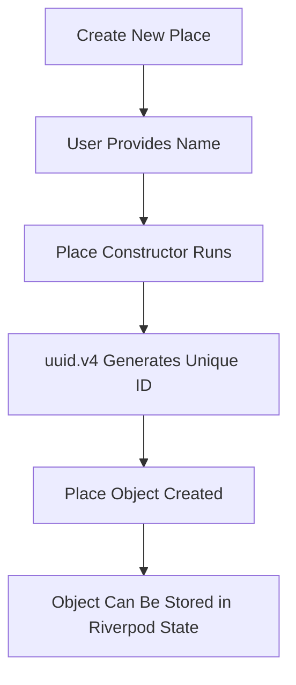
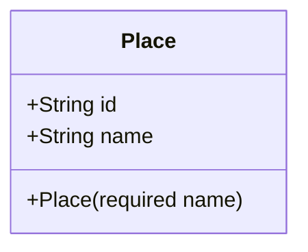
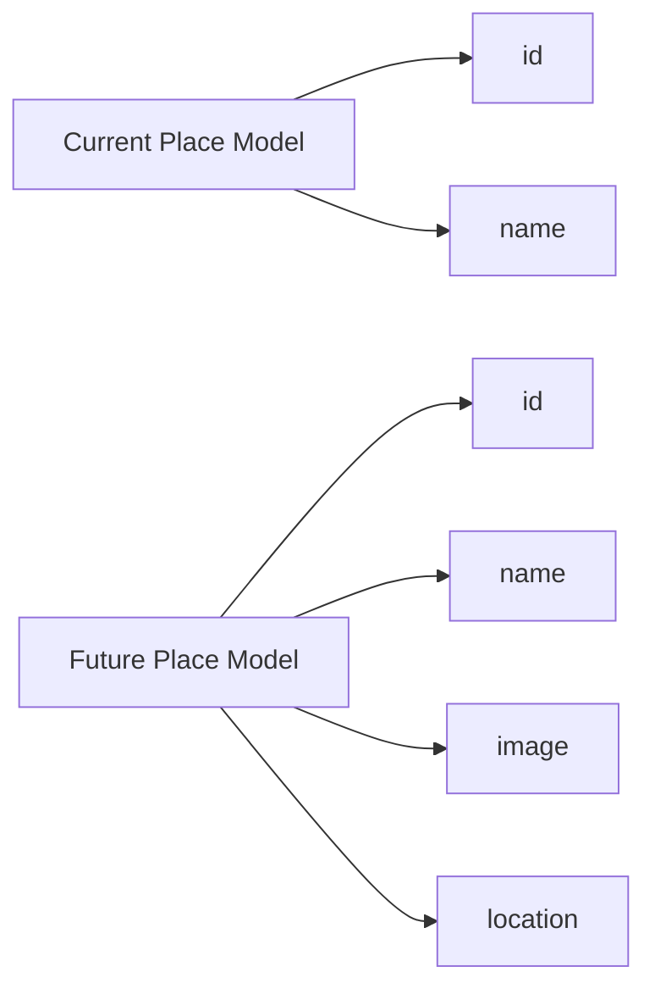

# Adding a Place Model

## Challenge Solution 1 of 6

## Overview

This lecture presents the solution to the first part of the Favorite Places app challenge: creating the `Place` data model.

The `Place` model is the basic blueprint for every saved favorite place in the app. At this stage, each place only stores a unique `id` and a `name`. Later in the module, this model will be extended with additional data such as an image and location.

A well-defined model is important because it becomes the foundation for the app's data flow, state management, and UI rendering.

---

## Learning Goals

By the end of this lecture, you should be able to:

* Create a model folder in a Flutter project
* Define a Dart data model class
* Use named constructor parameters
* Generate unique IDs automatically
* Use the `uuid` package
* Understand why immutable model classes are useful
* Prepare the model for later expansion with images and locations

---

## Project Folder Update

Create a new folder called `models` inside the `lib` folder.

Inside that folder, create a new file:

```text
lib/
└── models/
    └── place.dart
```

The `place.dart` file will contain the `Place` model class.

---

## Installing the UUID Package

To generate unique IDs automatically, this lecture uses the `uuid` package.

Run this command in the terminal:

```bash
flutter pub add uuid
```

After running the command, your `pubspec.yaml` file should include the package under dependencies:

```yaml
dependencies:
  uuid: ^latest_version
```

The exact version may be different depending on when you install it.

---

## Final `Place` Model

```dart
import 'package:uuid/uuid.dart';

const uuid = Uuid();

class Place {
  Place({required this.name}) : id = uuid.v4();

  final String id;
  final String name;
}
```

---

## Code Explanation

### 1. Importing the UUID Package

```dart
import 'package:uuid/uuid.dart';
```

This imports the `uuid` package so the app can generate unique IDs.

---

### 2. Creating a UUID Generator

```dart
const uuid = Uuid();
```

This creates a reusable UUID generator object.

Because `Uuid()` can be created as a constant object, we use `const` here.

---

### 3. Defining the `Place` Class

```dart
class Place {
  Place({required this.name}) : id = uuid.v4();

  final String id;
  final String name;
}
```

The `Place` class represents one favorite place.

Each `Place` has:

| Field  | Type     | Purpose                           |
| ------ | -------- | --------------------------------- |
| `id`   | `String` | A unique identifier for the place |
| `name` | `String` | The name or title of the place    |

---

## Constructor Logic

The constructor only requires the `name`.

```dart
Place({required this.name}) : id = uuid.v4();
```

The `id` is not passed manually. Instead, it is generated automatically with:

```dart
uuid.v4()
```

This creates a random UUID value.

Example UUID:

```text
9b1deb4d-3b7d-4bad-9bdd-2b0d7b3dcb6d
```

---

## Why Use an Initializer List?

The `id` is assigned using a Dart initializer list:

```dart
: id = uuid.v4();
```

This means the `id` is created before the constructor body runs.

This is useful because:

* `id` can remain `final`
* The value is assigned once
* The object stays immutable after creation
* The caller does not need to manually provide an ID

---

## Why the Constructor Is Not `const`

The constructor cannot be marked as `const`:

```dart
Place({required this.name}) : id = uuid.v4();
```

This is because `uuid.v4()` generates a dynamic value at runtime.

A `const` constructor requires all values to be known at compile time, but a randomly generated UUID is only created when the app runs.

---

## Data Model Flow



---

## Place Object Structure



---

## Example Usage

```dart
final place = Place(name: 'Tokyo Tower');

print(place.id);
print(place.name);
```

Example output:

```text
7f8a6e44-9c1d-4b3a-b98f-89f7a2c3d901
Tokyo Tower
```

The `name` comes from the user, while the `id` is generated automatically.

---

## Why Immutability Matters

The `Place` model uses `final` fields:

```dart
final String id;
final String name;
```

This means once a `Place` object is created, its values cannot be changed directly.

This is a good practice because:

* It prevents accidental data changes
* It works well with Riverpod
* It makes state updates predictable
* It keeps the app easier to debug
* It encourages replacing state instead of mutating it directly

---

## Current Model vs Future Model

At this stage, the model is simple.



Later, the model will likely be expanded to include:

* An image file
* A latitude and longitude
* A formatted address
* A map location

---

## Challenge Solution Summary

The first challenge solution creates the core data structure for the Favorite Places app.

You created:

* A `models` folder
* A `place.dart` file
* A `Place` class
* A unique auto-generated `id`
* A required `name` field
* An immutable model object

---

## Key Points

* The `Place` class is defined in `lib/models/place.dart`
* Each place has a unique `id`
* The ID is generated automatically using the `uuid` package
* The place name is passed through the constructor
* The fields are marked as `final`
* The model is immutable after creation
* This model will be extended later with image and location support

---

## Notes

The `uuid` package is used to create unique identifiers.

In this lecture, the app uses `uuid.v4()`, which creates a random UUID. This is suitable for local app data because it is extremely unlikely that two places will receive the same ID.

The model is intentionally simple for now. The main goal is to establish a clean data structure before adding screens, providers, and native device features.

---

## Summary

This lecture solves the first part of the challenge by creating an immutable `Place` model.

The model currently stores:

* A generated unique `id`
* A required `name`

This model forms the foundation for the Favorite Places app and will later be expanded with image and location data.
