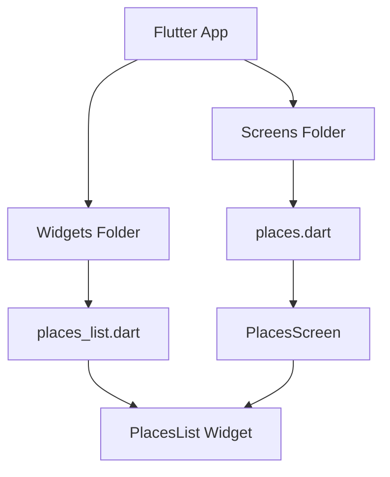
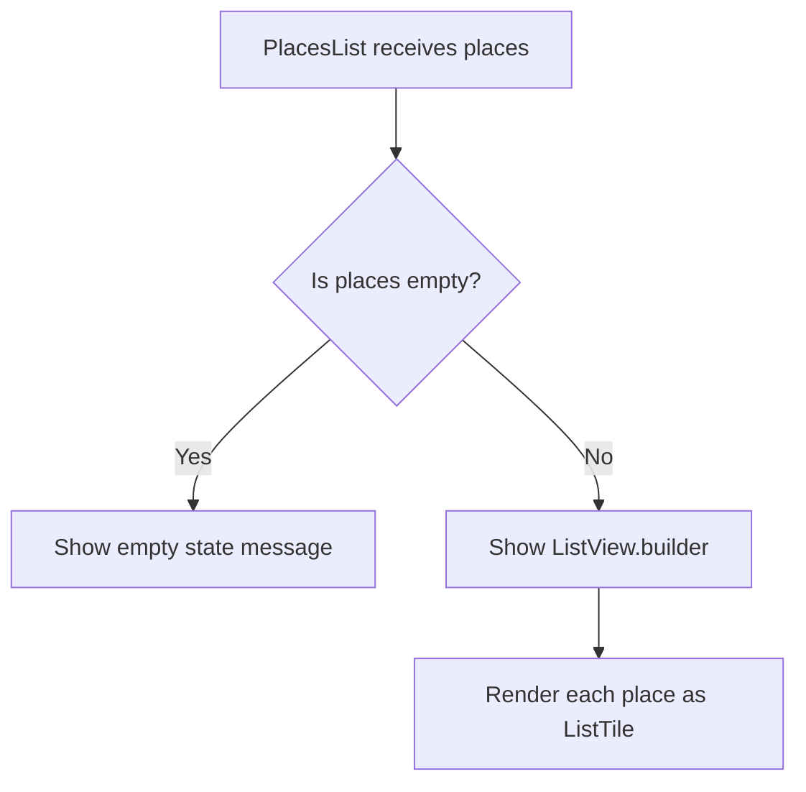
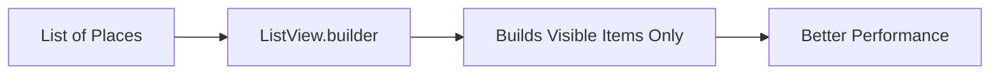
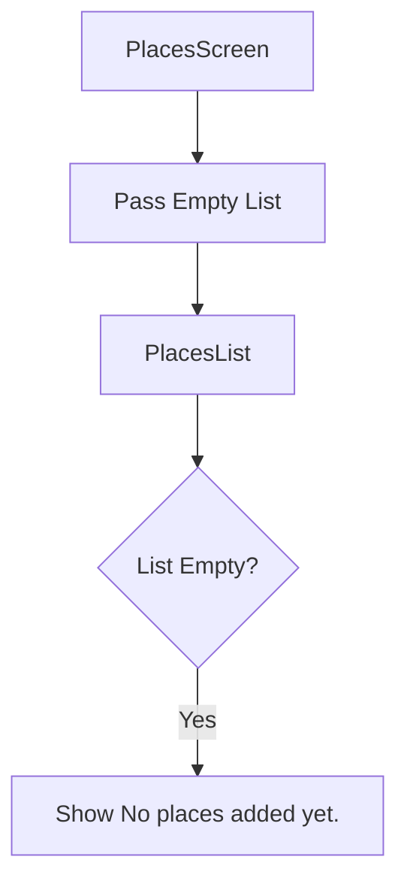
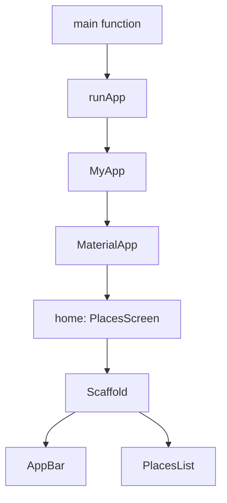
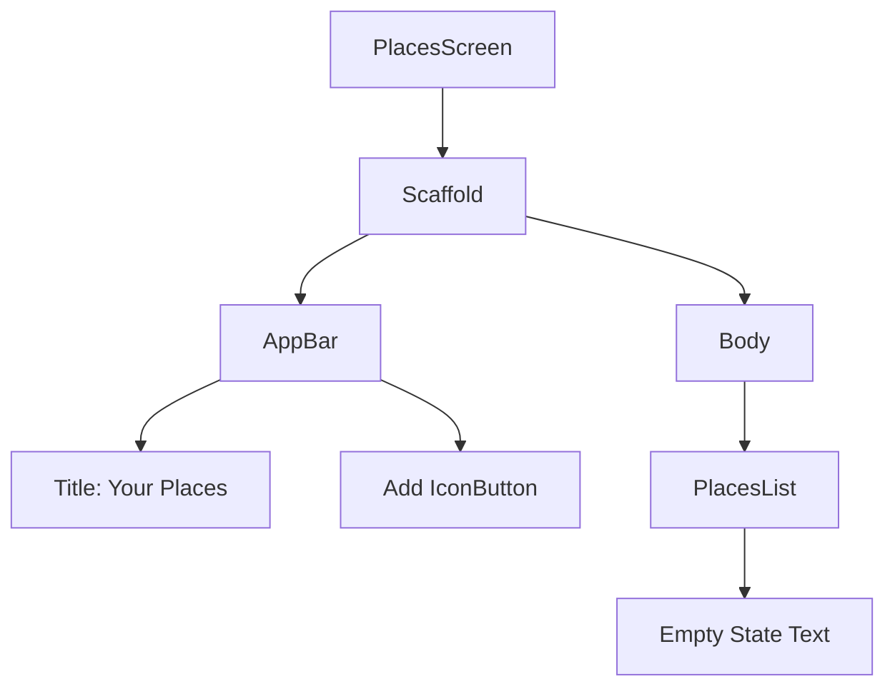

# Adding a Places Screen

## Challenge Solution 2 of 6

## Overview

This lecture presents the solution to the second part of the Favorite Places app challenge: creating the main **Places Screen** and a reusable **Places List** widget.

The Places Screen acts as the home screen of the app. It displays the user's saved favorite places and provides an add button in the app bar. At this stage, the app does not manage real place data yet. The list is temporarily empty, so the screen shows a fallback message.

Later, this screen will be connected to Riverpod so that it can display real user-created places.

---

## Learning Goals

By the end of this lecture, you should be able to:

* Create a screen widget in Flutter
* Create a reusable list widget
* Organize screens and widgets into separate folders
* Use `Scaffold` and `AppBar`
* Add an `IconButton` to an app bar
* Render an empty state when there is no data
* Use `ListView.builder` for efficient list rendering
* Use `ListTile` to display list items
* Connect the screen to `main.dart` as the app home screen

---

## Project Folder Update

In this lecture, two main folders are introduced:

```text
lib/
├── screens/
│   └── places.dart
└── widgets/
    └── places_list.dart
```

The `screens/` folder is used for full-page widgets.

The `widgets/` folder is used for reusable UI components that are not standalone screens.

---

## Screen vs Widget



---

## File Responsibilities

| File                       | Responsibility                              |
| -------------------------- | ------------------------------------------- |
| `screens/places.dart`      | Defines the main Places screen              |
| `widgets/places_list.dart` | Defines the reusable list widget            |
| `models/place.dart`        | Defines the `Place` data model              |
| `main.dart`                | Loads `PlacesScreen` as the app home screen |

---

# 1. Creating the Places Screen

Create a new file:

```text
lib/screens/places.dart
```

This file contains the `PlacesScreen` widget.

---

## `PlacesScreen` Code

```dart
import 'package:flutter/material.dart';

import '../widgets/places_list.dart';

class PlacesScreen extends StatelessWidget {
  const PlacesScreen({super.key});

  @override
  Widget build(BuildContext context) {
    return Scaffold(
      appBar: AppBar(
        title: const Text('Your Places'),
        actions: [
          IconButton(
            onPressed: () {},
            icon: const Icon(Icons.add),
          ),
        ],
      ),
      body: const PlacesList(
        places: [],
      ),
    );
  }
}
```

---

## Code Explanation

### 1. Importing Material Widgets

```dart
import 'package:flutter/material.dart';
```

This gives access to Flutter widgets such as:

* `Scaffold`
* `AppBar`
* `Text`
* `IconButton`
* `Icon`

---

### 2. Creating the Screen Class

```dart
class PlacesScreen extends StatelessWidget {
  const PlacesScreen({super.key});
}
```

`PlacesScreen` is a full-page widget, so it belongs in the `screens/` folder.

At this stage, it is a `StatelessWidget` because it does not manage changing state directly.

---

### 3. Returning a Scaffold

```dart
return Scaffold(
  appBar: AppBar(...),
  body: ...,
);
```

`Scaffold` provides the basic page structure for a Material Design screen.

It gives the screen:

* An app bar
* A body area
* Space for floating buttons, drawers, snack bars, and more

---

### 4. Adding the App Bar

```dart
appBar: AppBar(
  title: const Text('Your Places'),
),
```

The app bar displays the title of the screen.

In this app, the title is:

```text
Your Places
```

---

### 5. Adding the Add Button

```dart
actions: [
  IconButton(
    onPressed: () {},
    icon: const Icon(Icons.add),
  ),
],
```

The `actions` property adds buttons to the right side of the app bar.

The add button will later navigate to the **Add Place Screen**.

For now, the `onPressed` function is empty.

---

# 2. Creating the Places List Widget

Create another file:

```text
lib/widgets/places_list.dart
```

This file contains a reusable widget called `PlacesList`.

This widget receives a list of places and decides what to display.

---

## `PlacesList` Code

```dart
import 'package:flutter/material.dart';

import '../models/place.dart';

class PlacesList extends StatelessWidget {
  const PlacesList({
    super.key,
    required this.places,
  });

  final List<Place> places;

  @override
  Widget build(BuildContext context) {
    if (places.isEmpty) {
      return Center(
        child: Text(
          'No places added yet.',
          style: Theme.of(context).textTheme.bodyLarge!.copyWith(
                color: Theme.of(context).colorScheme.onBackground,
              ),
        ),
      );
    }

    return ListView.builder(
      itemCount: places.length,
      itemBuilder: (ctx, index) {
        return ListTile(
          title: Text(
            places[index].title,
            style: Theme.of(context).textTheme.titleMedium!.copyWith(
                  color: Theme.of(context).colorScheme.onBackground,
                ),
          ),
        );
      },
    );
  }
}
```

> Note: If your `Place` model uses `name` instead of `title`, replace `places[index].title` with `places[index].name`.

---

## Places List Logic

The `PlacesList` widget has two possible UI states:



---

## Empty State

If the list is empty, the widget returns a centered message:

```dart
if (places.isEmpty) {
  return Center(
    child: Text(
      'No places added yet.',
      style: Theme.of(context).textTheme.bodyLarge!.copyWith(
            color: Theme.of(context).colorScheme.onBackground,
          ),
    ),
  );
}
```

This prevents the screen from looking blank.

Instead of showing nothing, the app tells the user that no places have been added yet.

---

## Why Empty State Matters

An empty state improves user experience because it explains what is happening.

Without it, the user might think:

* The app is broken
* Data failed to load
* The UI is missing
* The list is not working

With an empty state, the app clearly communicates:

```text
No places added yet.
```

---

## Rendering the List

If the list is not empty, the widget returns a `ListView.builder`.

```dart
return ListView.builder(
  itemCount: places.length,
  itemBuilder: (ctx, index) {
    return ListTile(
      title: Text(places[index].title),
    );
  },
);
```

`ListView.builder` is useful because it builds list items lazily.

That means Flutter only builds the items that are currently visible on the screen.

This is better for performance when the list becomes long.

---

## Why Use `ListView.builder`?



Use `ListView.builder` when:

* The list can grow over time
* The number of items is dynamic
* You want efficient rendering
* You do not want to manually create every list item

---

## Using `ListTile`

Each place is displayed with a `ListTile`.

```dart
return ListTile(
  title: Text(
    places[index].title,
  ),
);
```

`ListTile` is a convenient widget for displaying items in a list.

It can support:

* A title
* A subtitle
* A leading widget
* A trailing widget
* Tap handling

Later, this list item can be expanded to show:

* A place image thumbnail
* A place title
* A location subtitle
* Tap navigation to the detail screen

---

## Styling the Text

The list item text uses the app theme:

```dart
style: Theme.of(context).textTheme.titleMedium!.copyWith(
      color: Theme.of(context).colorScheme.onBackground,
    ),
```

This uses the existing `titleMedium` text style and overrides only the text color.

The empty state text uses:

```dart
style: Theme.of(context).textTheme.bodyLarge!.copyWith(
      color: Theme.of(context).colorScheme.onBackground,
    ),
```

This keeps the UI consistent with the global theme.

---

# 3. Using the Places List in the Places Screen

Inside `places.dart`, the `PlacesList` widget is used as the body of the screen.

```dart
body: const PlacesList(
  places: [],
),
```

For now, an empty list is passed manually.

This is temporary.

Later, the list will come from Riverpod-managed state.

---

## Temporary Data Flow



---

# 4. Connecting the Screen to `main.dart`

After creating `PlacesScreen`, update `main.dart` so that it becomes the home screen.

```dart
import 'package:flutter/material.dart';
import 'package:google_fonts/google_fonts.dart';

import 'screens/places.dart';

final colorScheme = ColorScheme.fromSeed(
  brightness: Brightness.dark,
  seedColor: const Color.fromARGB(255, 102, 6, 247),
  background: const Color.fromARGB(255, 56, 49, 66),
);

final theme = ThemeData().copyWith(
  useMaterial3: true,
  scaffoldBackgroundColor: colorScheme.background,
  colorScheme: colorScheme,
  textTheme: GoogleFonts.ubuntuCondensedTextTheme().copyWith(
    titleSmall: GoogleFonts.ubuntuCondensed(
      fontWeight: FontWeight.bold,
    ),
    titleMedium: GoogleFonts.ubuntuCondensed(
      fontWeight: FontWeight.bold,
    ),
    titleLarge: GoogleFonts.ubuntuCondensed(
      fontWeight: FontWeight.bold,
    ),
  ),
);

void main() {
  runApp(
    const MyApp(),
  );
}

class MyApp extends StatelessWidget {
  const MyApp({super.key});

  @override
  Widget build(BuildContext context) {
    return MaterialApp(
      title: 'Great Places',
      theme: theme,
      home: const PlacesScreen(),
    );
  }
}
```

---

## App Startup Flow



---

# 5. Current App Result

At the end of this lecture, the app should show:

* A dark-themed screen
* An app bar with the title **Your Places**
* An add icon button in the app bar
* A centered fallback message saying **No places added yet.**

The add button does not navigate anywhere yet.

The places list does not use Riverpod yet.

Those features will be added in later challenge solutions.

---

## Current UI Structure



---

## Important Note About Riverpod

Although the final version of the app will use Riverpod, this lecture focuses only on setting up the screen and list widget.

At this point:

* The places list is hardcoded as an empty list
* No provider is connected yet
* The add button does not navigate yet
* No place can be added yet

Riverpod will be introduced later to manage the list of places.

---

## Key Points

* `PlacesScreen` is the main home screen of the app.
* `PlacesScreen` uses a `Scaffold` with an `AppBar`.
* The app bar title is **Your Places**.
* An add icon button is added to the app bar.
* `PlacesList` is created as a reusable widget.
* `PlacesList` receives a list of `Place` objects.
* If the list is empty, an empty state message is shown.
* If the list has items, they are rendered using `ListView.builder`.
* Each place is displayed with a `ListTile`.
* `main.dart` now loads `PlacesScreen` as the home screen.

---

## Notes

Separating the screen and list widget keeps the code cleaner.

The `PlacesScreen` is responsible for the page layout, app bar, and future navigation logic.

The `PlacesList` widget is responsible only for displaying the list of places or the fallback empty state.

This separation makes the app easier to maintain and extend later, especially when images, locations, navigation, and Riverpod state management are added.

---

## Summary

This lecture solves the second part of the challenge by creating the main Places screen and a reusable Places List widget.

The app now has:

* A home screen
* An app bar
* An add button placeholder
* A reusable list widget
* Empty-state handling
* Basic list rendering logic

This prepares the project for the next steps, where navigation, adding places, and Riverpod state management will be implemented.
