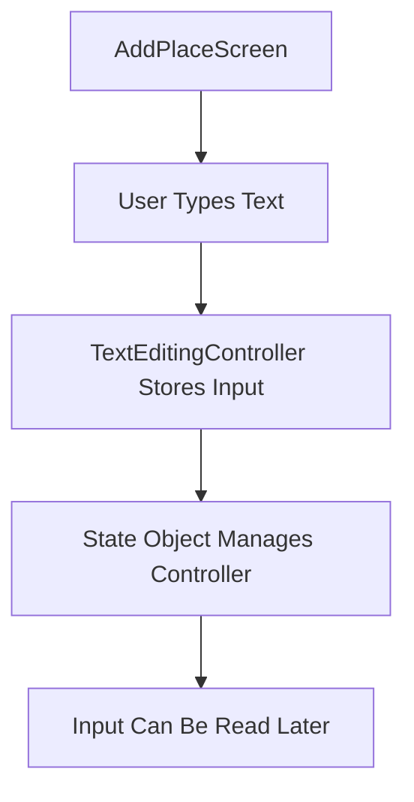
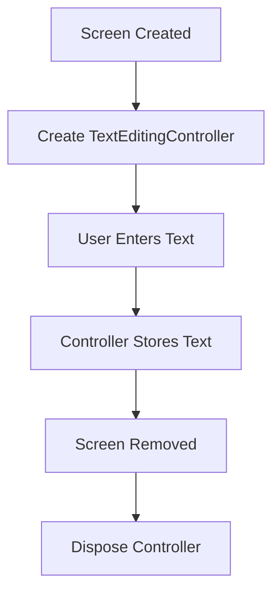
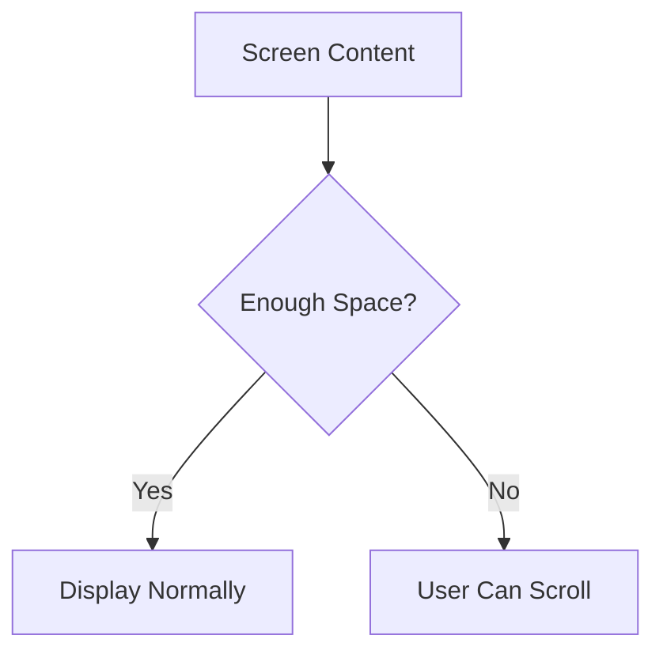
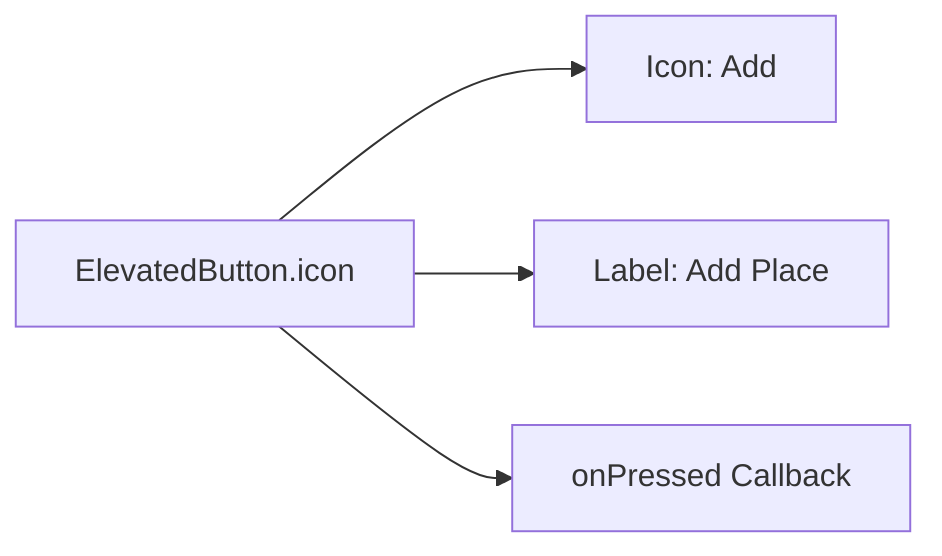
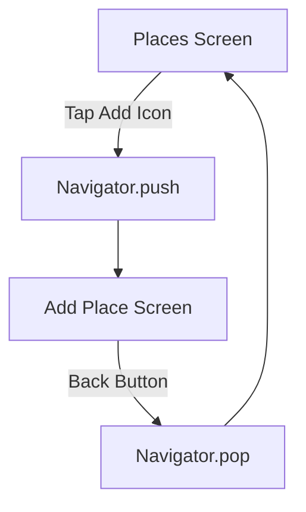
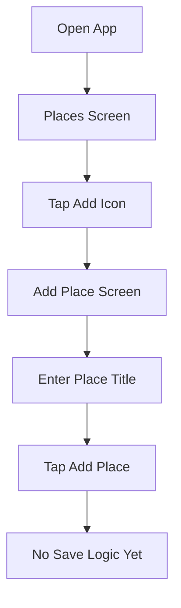
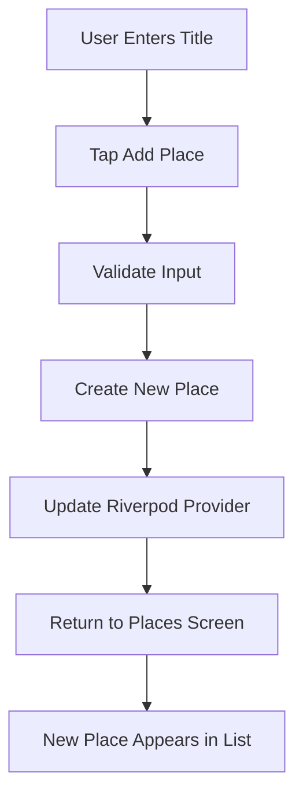

# Adding an Add Place Screen

## Challenge Solution 3 of 6

## Overview

This lecture presents the solution to the third part of the Favorite Places app challenge: creating the **Add Place Screen**.

The Add Place Screen is a standalone screen where users can enter the title of a new favorite place. At this stage, the screen only contains a text input and an add button. Later, this screen will be expanded with image picking, location selection, and Riverpod-powered saving logic.

This lecture also connects the add button in the Places Screen app bar to the new Add Place Screen using Flutter navigation.

---

## Learning Goals

By the end of this lecture, you should be able to:

* Create a new screen widget in Flutter
* Use `StatefulWidget` for managing user input
* Use a `TextEditingController`
* Dispose of a controller correctly
* Build a basic input UI with `TextField`
* Use `SingleChildScrollView` for scrollable layouts
* Add spacing and padding to a screen
* Create an `ElevatedButton.icon`
* Navigate from one screen to another with `Navigator.push`

---

## Project Folder Update

This lecture works inside the `screens/` folder.

```text id="4skc5q"
lib/
├── screens/
│   ├── places.dart
│   └── add_place.dart
└── widgets/
    └── places_list.dart
```

The new file is:

```text id="slk3y2"
lib/screens/add_place.dart
```

---

# 1. Creating the Add Place Screen

Create a new file called:

```text id="9ct3fa"
add_place.dart
```

Inside this file, define a new screen widget named `AddPlaceScreen`.

---

## Add Place Screen Code

```dart id="bs7iot"
import 'package:flutter/material.dart';

class AddPlaceScreen extends StatefulWidget {
  const AddPlaceScreen({super.key});

  @override
  State<AddPlaceScreen> createState() {
    return _AddPlaceScreenState();
  }
}

class _AddPlaceScreenState extends State<AddPlaceScreen> {
  final _titleController = TextEditingController();

  @override
  void dispose() {
    _titleController.dispose();
    super.dispose();
  }

  @override
  Widget build(BuildContext context) {
    return Scaffold(
      appBar: AppBar(
        title: const Text('Add new Place'),
      ),
      body: SingleChildScrollView(
        padding: const EdgeInsets.all(12),
        child: Column(
          children: [
            TextField(
              controller: _titleController,
              style: TextStyle(
                color: Theme.of(context).colorScheme.onBackground,
              ),
              decoration: const InputDecoration(
                labelText: 'Title',
              ),
            ),
            const SizedBox(height: 16),
            ElevatedButton.icon(
              onPressed: () {},
              icon: const Icon(Icons.add),
              label: const Text('Add Place'),
            ),
          ],
        ),
      ),
    );
  }
}
```

---

## Code Explanation

### 1. Importing Material

```dart id="e6b4i1"
import 'package:flutter/material.dart';
```

This import gives access to Flutter UI widgets such as:

* `Scaffold`
* `AppBar`
* `TextField`
* `Column`
* `ElevatedButton`
* `Icon`

---

### 2. Creating a Stateful Screen

```dart id="haz8lk"
class AddPlaceScreen extends StatefulWidget {
  const AddPlaceScreen({super.key});

  @override
  State<AddPlaceScreen> createState() {
    return _AddPlaceScreenState();
  }
}
```

`AddPlaceScreen` is a `StatefulWidget` because it manages user input through a controller.

A stateless widget would be enough for a static screen, but this screen needs to track what the user types.

---

## Why Use `StatefulWidget`?



---

# 2. Managing User Input

The screen uses a `TextEditingController`.

```dart id="dh72vg"
final _titleController = TextEditingController();
```

The controller allows the app to read the text entered by the user.

For example, later you will be able to access the input with:

```dart id="vvy4jl"
_titleController.text
```

---

## Disposing the Controller

Whenever a controller is created inside a state object, it should be disposed when the widget is removed.

```dart id="bz6y36"
@override
void dispose() {
  _titleController.dispose();
  super.dispose();
}
```

This avoids unnecessary memory usage.

---

## Controller Lifecycle



---

# 3. Building the Screen Layout

The screen returns a `Scaffold`.

```dart id="cwxs0a"
return Scaffold(
  appBar: AppBar(...),
  body: ...,
);
```

Since this is a full screen, `Scaffold` is used to provide the basic page structure.

---

## App Bar

```dart id="f4h74a"
appBar: AppBar(
  title: const Text('Add new Place'),
),
```

The app bar title tells the user what this screen is for.

---

## Scrollable Body

The body is wrapped with `SingleChildScrollView`.

```dart id="3tseeg"
body: SingleChildScrollView(
  padding: const EdgeInsets.all(12),
  child: Column(
    children: [...],
  ),
),
```

This makes sure the content remains scrollable on smaller screens or in landscape orientation.

---

## Why Use `SingleChildScrollView`?



This is useful because input forms can easily become hidden when:

* The screen is small
* The keyboard is open
* The device is in landscape mode
* More inputs are added later

---

# 4. Adding the Text Input

The first input is a `TextField`.

```dart id="qwy79u"
TextField(
  controller: _titleController,
  style: TextStyle(
    color: Theme.of(context).colorScheme.onBackground,
  ),
  decoration: const InputDecoration(
    labelText: 'Title',
  ),
),
```

This field allows the user to enter the title of a favorite place.

---

## TextField Parts

| Property     | Purpose                                |
| ------------ | -------------------------------------- |
| `controller` | Stores and manages the entered text    |
| `style`      | Controls the style of the input text   |
| `decoration` | Adds visual decoration such as a label |
| `labelText`  | Shows the label `"Title"`              |

---

## Why Set the Text Style?

The app uses a dark theme. Without manually setting the input text color, the text can be difficult to read.

```dart id="ssgpp5"
style: TextStyle(
  color: Theme.of(context).colorScheme.onBackground,
),
```

This makes the typed text use a readable color from the app theme.

---

# 5. Adding the Button

Below the text field, a button is added.

```dart id="ql0zbf"
ElevatedButton.icon(
  onPressed: () {},
  icon: const Icon(Icons.add),
  label: const Text('Add Place'),
),
```

This button will later be used to submit the entered title and create a new place.

At this point, the `onPressed` function is still empty.

---

## Button Structure



---

# 6. Adding Spacing

A `SizedBox` is used to create vertical space between the input field and the button.

```dart id="jkxyb6"
const SizedBox(height: 16),
```

This improves the layout by preventing the widgets from being too close together.

---

# 7. Connecting Navigation from the Places Screen

The Add Place Screen should be opened when the user taps the add icon in the Places Screen app bar.

Update the `IconButton` in `places.dart`.

---

## Updated `places.dart`

```dart id="5v4ei6"
import 'package:flutter/material.dart';

import '../widgets/places_list.dart';
import 'add_place.dart';

class PlacesScreen extends StatelessWidget {
  const PlacesScreen({super.key});

  @override
  Widget build(BuildContext context) {
    return Scaffold(
      appBar: AppBar(
        title: const Text('Your Places'),
        actions: [
          IconButton(
            onPressed: () {
              Navigator.of(context).push(
                MaterialPageRoute(
                  builder: (ctx) => const AddPlaceScreen(),
                ),
              );
            },
            icon: const Icon(Icons.add),
          ),
        ],
      ),
      body: const PlacesList(
        places: [],
      ),
    );
  }
}
```

---

## Navigation Code

```dart id="53l2wd"
Navigator.of(context).push(
  MaterialPageRoute(
    builder: (ctx) => const AddPlaceScreen(),
  ),
);
```

This pushes the Add Place Screen onto the navigation stack.

The user can then return to the Places Screen by pressing the back button.

---

## Navigation Flow



---

# 8. Current App Behavior

After this lecture, the app can:

* Show the Places Screen
* Display an add icon in the app bar
* Navigate to the Add Place Screen
* Display a text input for the place title
* Display an Add Place button
* Navigate back to the Places Screen

However, the app still cannot save a place yet.

That functionality will be added later with Riverpod.

---

## Current UI Flow



---

## Important Note About Riverpod

This lecture does not yet connect the Add Place Screen to Riverpod.

At this stage:

* The user can type a place title
* The user can press the Add Place button
* The input is not saved yet
* The places list does not update yet

Riverpod state management will be added in the next step.

---

## Future Add Place Flow

Later, the button will trigger a save method.



---

## Key Points

* `AddPlaceScreen` is created in `lib/screens/add_place.dart`.
* It is a `StatefulWidget` because it manages a `TextEditingController`.
* The controller stores the user's title input.
* The controller is disposed in `dispose()`.
* The screen uses `Scaffold` and `AppBar`.
* The body is wrapped in `SingleChildScrollView`.
* `TextField` is used for title input.
* `ElevatedButton.icon` is used for the submit button.
* The Places Screen add icon now navigates to the Add Place Screen.
* The save logic is not implemented yet.

---

## Notes

This screen will become the main data-entry interface for the Favorite Places app.

Right now, it only collects a title. Later, it will be extended with:

* Image picking
* Camera access
* Location detection
* Map selection
* Local database persistence

Using a controller now prepares the screen for reading and validating user input when save logic is added.

---

## Summary

This lecture solves the third part of the challenge by creating the Add Place Screen and connecting it to the Places Screen.

The app now supports basic navigation between:

* The Places Screen
* The Add Place Screen

The Add Place Screen contains:

* A title input field
* An Add Place button
* A scrollable layout
* Proper controller cleanup

The next step is to add state management so that entered places can be saved and displayed in the list.
