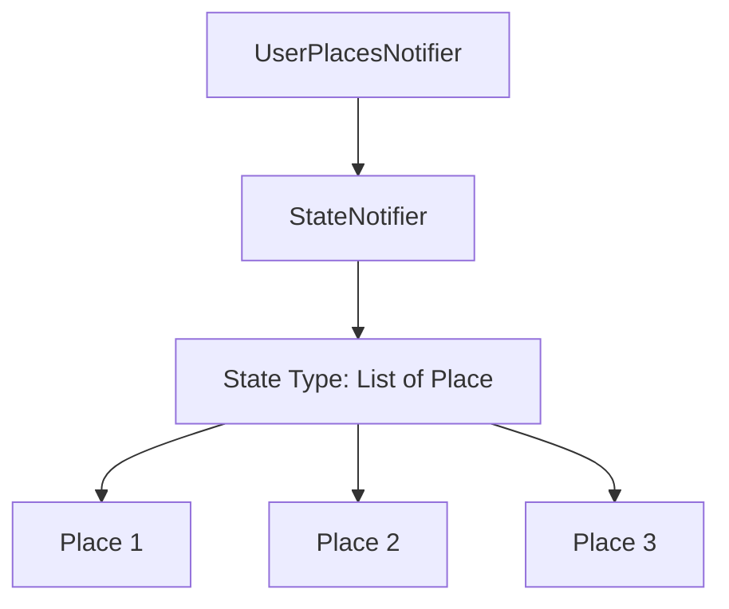
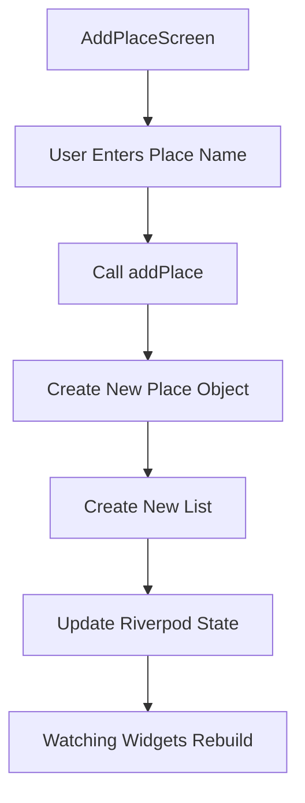
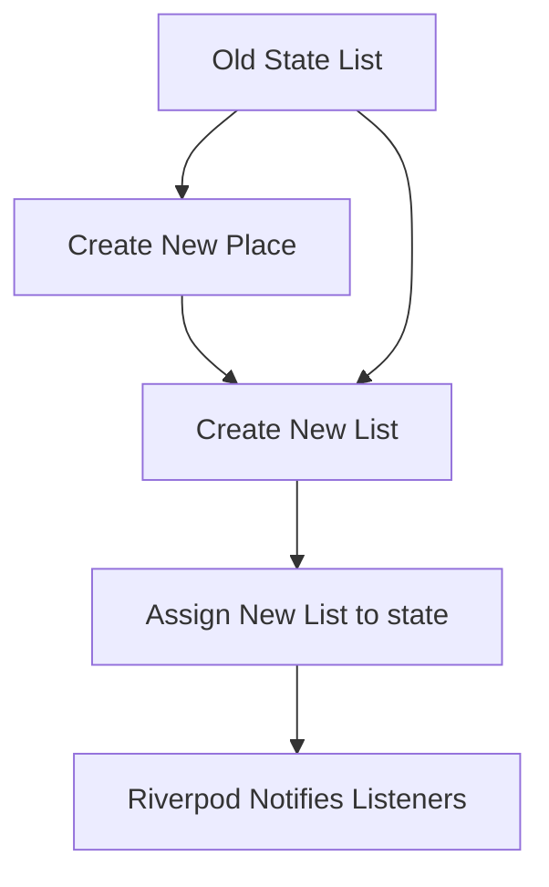
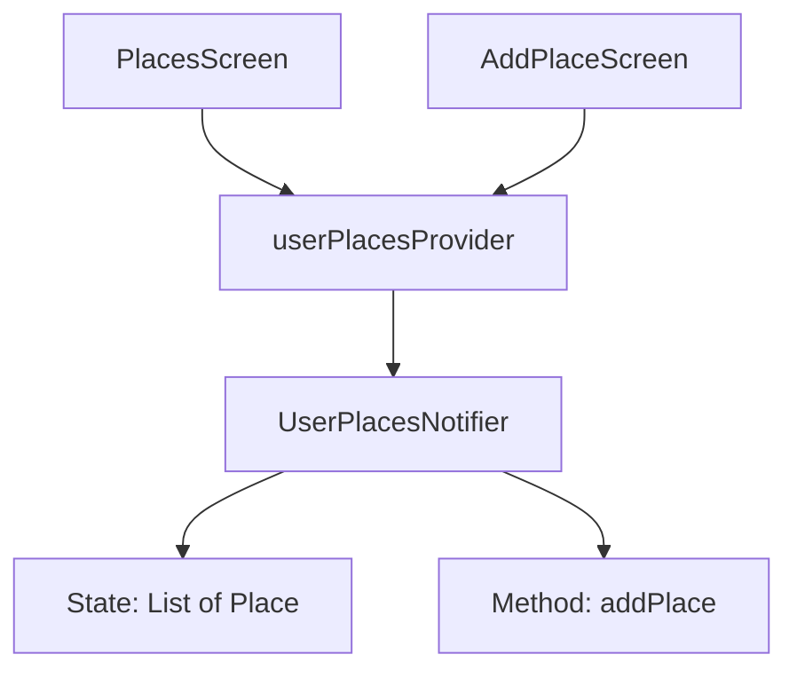
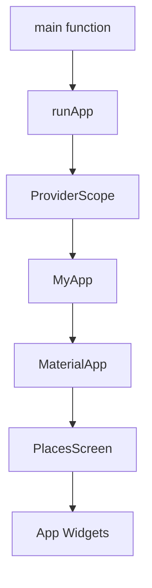
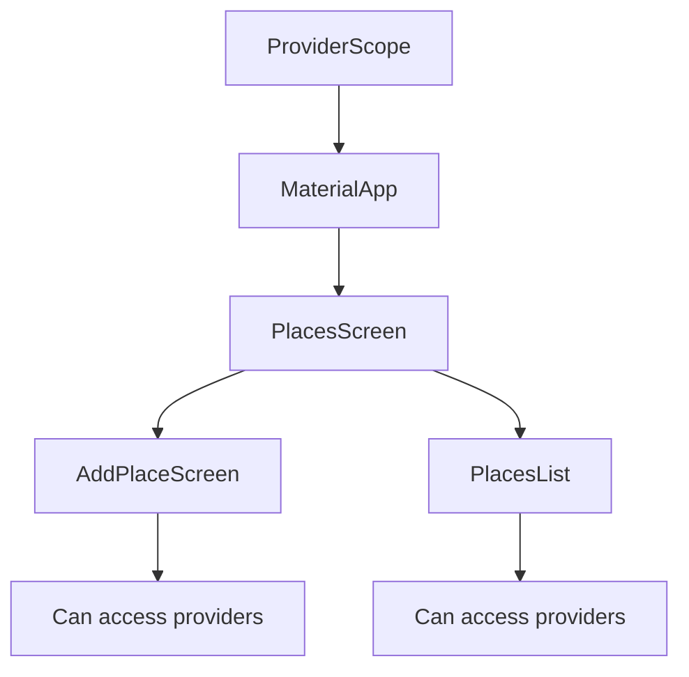
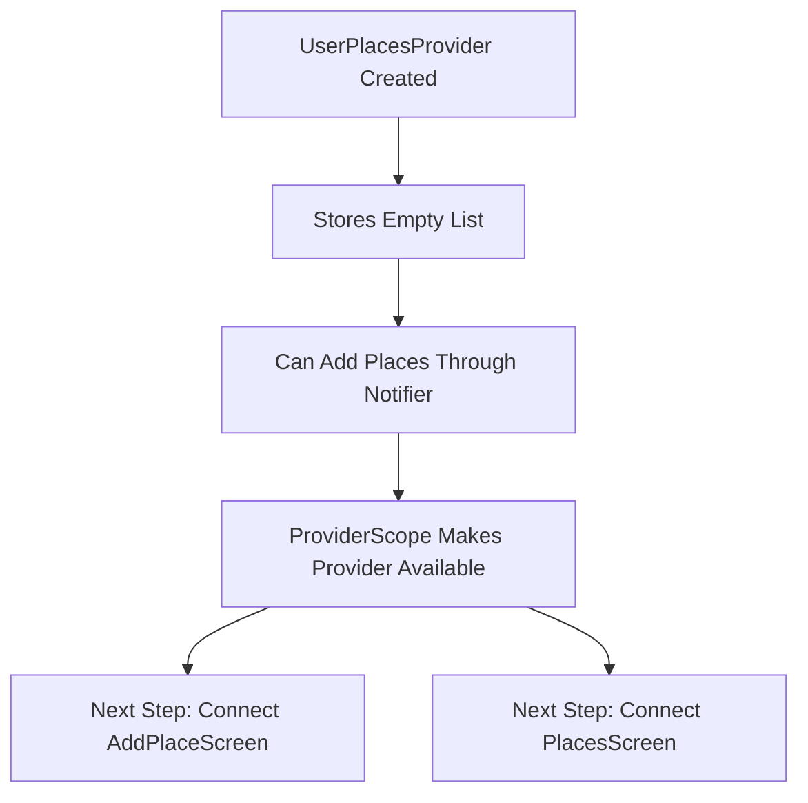
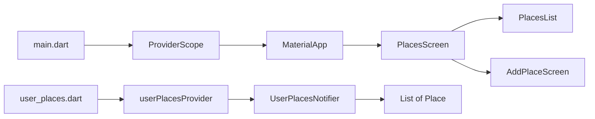

# Adding Riverpod and a Provider

## Challenge Solution 4 of 6

## Overview

This lecture presents the solution to the fourth part of the Favorite Places app challenge: adding **Riverpod** and creating a provider to manage the list of saved places.

Until now, the app has a `Place` model, a Places Screen, and an Add Place Screen. However, the app still does not have shared state. The places list is not stored anywhere globally, and the Add Place Screen cannot yet update the Places Screen.

To solve this, the app now introduces Riverpod state management. A `StateNotifier` is created to hold and update the list of places, and a `StateNotifierProvider` exposes that state to the rest of the app.

---

## Learning Goals

By the end of this lecture, you should be able to:

* Install `flutter_riverpod`
* Create a `providers/` folder
* Define a `StateNotifier`
* Manage a list of custom model objects with Riverpod
* Add methods that update provider state
* Use immutable state updates
* Create a `StateNotifierProvider`
* Wrap the app with `ProviderScope`
* Prepare the app so screens can read and update shared state

---

## Installing Riverpod

To use Riverpod in a Flutter project, install the package:

```bash id="7q83la"
flutter pub add flutter_riverpod
```

After running the command, your `pubspec.yaml` should include:

```yaml id="c4jpdr"
dependencies:
  flutter_riverpod: ^latest_version
```

The exact version may be different depending on when you install it.

---

## Project Folder Update

Create a new folder inside `lib` called `providers`.

Inside that folder, create a new file:

```text id="lx8m9f"
lib/
├── models/
│   └── place.dart
├── providers/
│   └── user_places.dart
├── screens/
│   ├── places.dart
│   └── add_place.dart
└── widgets/
    └── places_list.dart
```

The new provider file is:

```text id="wu0mth"
lib/providers/user_places.dart
```

This file will manage all user-created places.

---

# 1. Creating the User Places Provider

## Final Provider Code

```dart id="fq7fxm"
import 'package:flutter_riverpod/flutter_riverpod.dart';

import '../models/place.dart';

class UserPlacesNotifier extends StateNotifier<List<Place>> {
  UserPlacesNotifier() : super(const []);

  void addPlace(String name) {
    final newPlace = Place(name: name);

    state = [newPlace, ...state];
  }
}

final userPlacesProvider =
    StateNotifierProvider<UserPlacesNotifier, List<Place>>(
  (ref) => UserPlacesNotifier(),
);
```

> Note: If your `Place` model uses `title` instead of `name`, change the method parameter and constructor call like this:
>
> ```dart id="f2uyvv"
> void addPlace(String title) {
>   final newPlace = Place(title: title);
>   state = [newPlace, ...state];
> }
> ```

---

## Code Explanation

### 1. Importing Riverpod

```dart id="xmoyyf"
import 'package:flutter_riverpod/flutter_riverpod.dart';
```

This import gives access to Riverpod classes such as:

* `StateNotifier`
* `StateNotifierProvider`
* `ProviderScope`
* `ConsumerWidget`
* `ConsumerStatefulWidget`

---

### 2. Importing the Place Model

```dart id="itkt87"
import '../models/place.dart';
```

The provider needs the `Place` model because it manages a list of `Place` objects.

---

# 2. Creating the Notifier Class

```dart id="b725yl"
class UserPlacesNotifier extends StateNotifier<List<Place>> {
  UserPlacesNotifier() : super(const []);
}
```

`UserPlacesNotifier` is responsible for managing the list of saved places.

It extends:

```dart id="xmw82o"
StateNotifier<List<Place>>
```

This means the state managed by this notifier is a list of `Place` objects.

---

## State Type Diagram



---

## Initial State

```dart id="zxg0m8"
UserPlacesNotifier() : super(const []);
```

The initial state is an empty list.

```dart id="gkdayk"
const []
```

This means that when the app starts, there are no saved places yet.

Using `const []` also helps prevent accidental mutation of the initial list.

---

# 3. Adding a New Place

The notifier includes an `addPlace` method.

```dart id="d67y6j"
void addPlace(String name) {
  final newPlace = Place(name: name);

  state = [newPlace, ...state];
}
```

This method does three things:

1. Receives the place name.
2. Creates a new `Place` object.
3. Updates the Riverpod state with a new list.

---

## Add Place Flow



---

## Creating the New Place

```dart id="jjujf3"
final newPlace = Place(name: name);
```

This creates a new `Place` object from the entered input.

The `Place` model automatically generates the ID, so the provider only needs to pass the name or title.

---

## Immutable State Update

```dart id="smbi4r"
state = [newPlace, ...state];
```

This line is very important.

Instead of modifying the existing list directly, it creates a brand-new list.

The new list contains:

1. The newly created place
2. All previous places from the old state

---

## Why Not Use `state.add()`?

You should not do this:

```dart id="qy09aj"
state.add(newPlace); // Do not do this
```

This mutates the existing list directly.

Riverpod may not properly detect the change because the list object itself has not been replaced.

Instead, use:

```dart id="ulq3u3"
state = [newPlace, ...state];
```

This replaces the old state with a new list object, which tells Riverpod that the state changed.

---

## Immutable Update Diagram



---

## Spread Operator

The spread operator copies all existing items from the old list into the new list.

```dart id="p8kgzr"
...state
```

Example:

```dart id="y0xoj6"
state = [newPlace, ...state];
```

If the old state contains:

```text id="hr8vbu"
[Place A, Place B]
```

The new state becomes:

```text id="9cv5yd"
[New Place, Place A, Place B]
```

This places the newest item at the beginning of the list.

---

# 4. Creating the Provider

After creating the notifier, create the provider.

```dart id="z79lqz"
final userPlacesProvider =
    StateNotifierProvider<UserPlacesNotifier, List<Place>>(
  (ref) => UserPlacesNotifier(),
);
```

This provider exposes both:

* The list of places
* The notifier methods, such as `addPlace`

---

## Provider Structure



---

## What the Provider Gives the App

The provider allows widgets to:

### Read the current state

```dart id="ronbd7"
final places = ref.watch(userPlacesProvider);
```

This is used by widgets that need to rebuild when the places list changes.

### Access notifier methods

```dart id="q69xy3"
ref.read(userPlacesProvider.notifier).addPlace(name);
```

This is used when a widget needs to update the places list.

---

# 5. Wrapping the App with ProviderScope

Riverpod providers only work if the app is wrapped with `ProviderScope`.

Update `main.dart`.

---

## Updated `main.dart`

```dart id="xp4whg"
import 'package:flutter/material.dart';
import 'package:flutter_riverpod/flutter_riverpod.dart';
import 'package:google_fonts/google_fonts.dart';

import 'screens/places.dart';

final colorScheme = ColorScheme.fromSeed(
  brightness: Brightness.dark,
  seedColor: const Color.fromARGB(255, 102, 6, 247),
  background: const Color.fromARGB(255, 56, 49, 66),
);

final theme = ThemeData().copyWith(
  useMaterial3: true,
  scaffoldBackgroundColor: colorScheme.background,
  colorScheme: colorScheme,
  textTheme: GoogleFonts.ubuntuCondensedTextTheme().copyWith(
    titleSmall: GoogleFonts.ubuntuCondensed(
      fontWeight: FontWeight.bold,
    ),
    titleMedium: GoogleFonts.ubuntuCondensed(
      fontWeight: FontWeight.bold,
    ),
    titleLarge: GoogleFonts.ubuntuCondensed(
      fontWeight: FontWeight.bold,
    ),
  ),
);

void main() {
  runApp(
    const ProviderScope(
      child: MyApp(),
    ),
  );
}

class MyApp extends StatelessWidget {
  const MyApp({super.key});

  @override
  Widget build(BuildContext context) {
    return MaterialApp(
      title: 'Great Places',
      theme: theme,
      home: const PlacesScreen(),
    );
  }
}
```

---

## ProviderScope

```dart id="dc66km"
const ProviderScope(
  child: MyApp(),
)
```

`ProviderScope` makes Riverpod available to the widget tree.

Without `ProviderScope`, widgets cannot access Riverpod providers.

---

## App Root Structure



---

# 6. Why ProviderScope Is Required

Riverpod stores and manages provider state inside `ProviderScope`.

If you forget to add it, Riverpod will not work correctly.

The correct structure is:



---

# 7. Current Data Flow

At this stage, the provider exists, but not all screens are connected to it yet.



---

## What Has Been Added So Far

The app now has:

* `Place` model
* `PlacesScreen`
* `PlacesList` widget
* `AddPlaceScreen`
* `UserPlacesNotifier`
* `userPlacesProvider`
* `ProviderScope`

However, the UI still needs to be connected to the provider.

---

## Current App Architecture



---

# 8. Key Points

* Riverpod is installed with `flutter pub add flutter_riverpod`.
* A `providers/` folder is created inside `lib`.
* The provider file is named `user_places.dart`.
* `UserPlacesNotifier` extends `StateNotifier<List<Place>>`.
* The initial state is an empty list.
* The `addPlace` method creates a new `Place`.
* State is updated immutably using a new list.
* `StateNotifierProvider` exposes the notifier and the state.
* `ProviderScope` must wrap the root app in `main.dart`.
* The provider will become the single source of truth for saved places.

---

## Notes

Riverpod encourages immutable state updates.

That means you should not modify the existing state object directly. Instead, create and assign a new state object.

For a list, this means avoiding direct mutation methods like:

```dart id="b51aq7"
state.add(newPlace);
```

and using a replacement update like:

```dart id="gi8zt0"
state = [newPlace, ...state];
```

This ensures that Riverpod can detect the change and notify all widgets that are watching the provider.

---

## Summary

This lecture solves the fourth part of the challenge by adding Riverpod state management to the Favorite Places app.

A new `UserPlacesNotifier` manages the list of saved places, and a `StateNotifierProvider` exposes that data to the app.

The app is also wrapped with `ProviderScope`, which makes Riverpod available throughout the widget tree.

This prepares the app for the next step: connecting the Add Place Screen and Places Screen to the provider so that users can actually add and view places.
