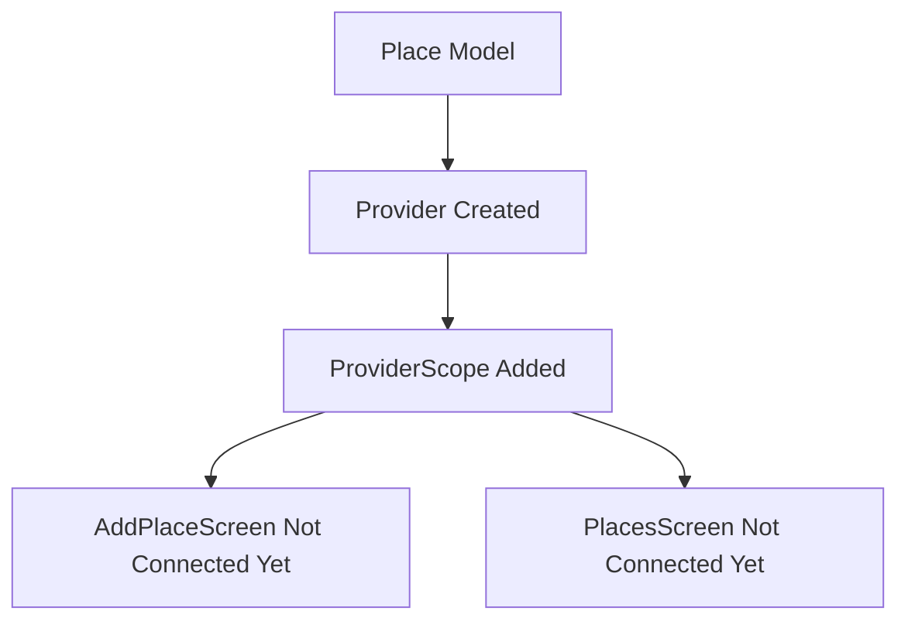
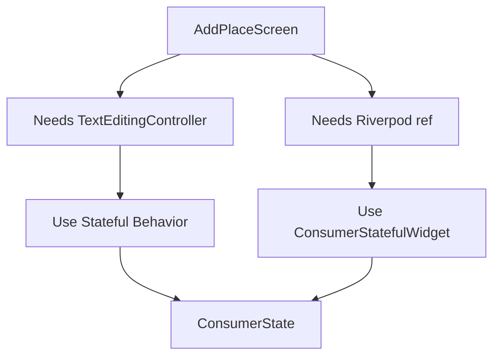
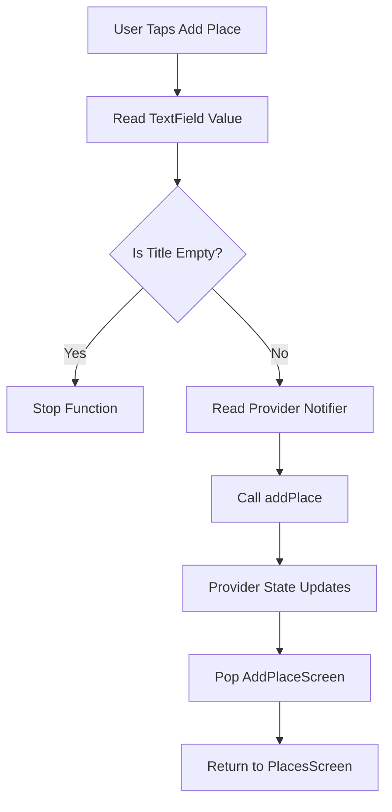
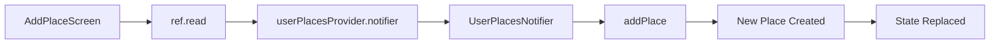
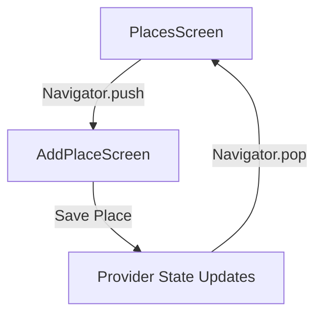
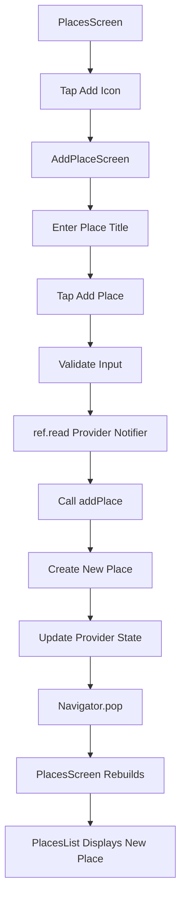
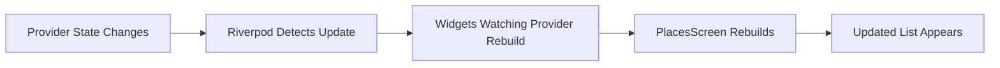
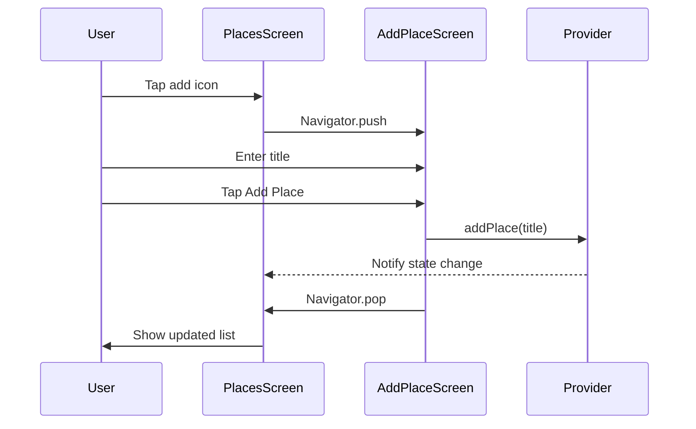
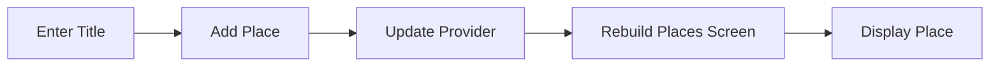

# Adding Places with Provider and Displaying Places

## Challenge Solution 5 of 6

## Overview

This lecture presents the solution to the fifth part of the Favorite Places app challenge: connecting the **Add Place Screen** and the **Places Screen** through the Riverpod provider.

In the previous lecture, the app gained a `UserPlacesNotifier` and a `userPlacesProvider`, but the screens were not using them yet. In this lecture, the Add Place Screen uses the provider to add new places, and the Places Screen watches the provider to display the latest list of saved places.

This completes the basic add-and-display flow.

---

## Learning Goals

By the end of this lecture, you should be able to:

* Use `ConsumerStatefulWidget` for screens that need both local state and Riverpod access
* Use `ref.read()` to call provider notifier methods
* Use `ref.watch()` to listen to provider state changes
* Add a new `Place` through a provider
* Display provider-managed data in the UI
* Understand the difference between reading and watching a provider
* Trigger automatic UI rebuilds with Riverpod state updates
* Navigate back after saving data

---

## Current App Status

Before this lecture, the app already had:

* A `Place` model
* A `PlacesScreen`
* A `PlacesList` widget
* An `AddPlaceScreen`
* A `UserPlacesNotifier`
* A `userPlacesProvider`
* `ProviderScope` in `main.dart`

However, the UI was not connected to the provider yet.



After this lecture, both screens are connected to Riverpod.

---

# 1. Updating the Add Place Screen

The Add Place Screen needs to:

1. Read the entered title from the `TextEditingController`
2. Validate the input
3. Call the provider's `addPlace` method
4. Return to the Places Screen

---

## Why Use `ConsumerStatefulWidget`?

Previously, `AddPlaceScreen` was a normal `StatefulWidget`.

Now it needs access to Riverpod through `ref`, so it should extend `ConsumerStatefulWidget`.

```dart
class AddPlaceScreen extends ConsumerStatefulWidget {
  const AddPlaceScreen({super.key});

  @override
  ConsumerState<AddPlaceScreen> createState() {
    return _AddPlaceScreenState();
  }
}
```

The state class should extend `ConsumerState` instead of `State`.

```dart
class _AddPlaceScreenState extends ConsumerState<AddPlaceScreen> {
  // ...
}
```

---

## ConsumerStatefulWidget Flow



---

## Updated `add_place.dart`

```dart
import 'package:flutter/material.dart';
import 'package:flutter_riverpod/flutter_riverpod.dart';

import '../providers/user_places.dart';

class AddPlaceScreen extends ConsumerStatefulWidget {
  const AddPlaceScreen({super.key});

  @override
  ConsumerState<AddPlaceScreen> createState() {
    return _AddPlaceScreenState();
  }
}

class _AddPlaceScreenState extends ConsumerState<AddPlaceScreen> {
  final _titleController = TextEditingController();

  void _savePlace() {
    final enteredTitle = _titleController.text;

    if (enteredTitle.isEmpty) {
      return;
    }

    ref.read(userPlacesProvider.notifier).addPlace(enteredTitle);

    Navigator.of(context).pop();
  }

  @override
  void dispose() {
    _titleController.dispose();
    super.dispose();
  }

  @override
  Widget build(BuildContext context) {
    return Scaffold(
      appBar: AppBar(
        title: const Text('Add new Place'),
      ),
      body: SingleChildScrollView(
        padding: const EdgeInsets.all(12),
        child: Column(
          children: [
            TextField(
              controller: _titleController,
              style: TextStyle(
                color: Theme.of(context).colorScheme.onBackground,
              ),
              decoration: const InputDecoration(
                labelText: 'Title',
              ),
            ),
            const SizedBox(height: 16),
            ElevatedButton.icon(
              onPressed: _savePlace,
              icon: const Icon(Icons.add),
              label: const Text('Add Place'),
            ),
          ],
        ),
      ),
    );
  }
}
```

---

# 2. Creating the Save Method

The `_savePlace` method handles the submission logic.

```dart
void _savePlace() {
  final enteredTitle = _titleController.text;

  if (enteredTitle.isEmpty) {
    return;
  }

  ref.read(userPlacesProvider.notifier).addPlace(enteredTitle);

  Navigator.of(context).pop();
}
```

---

## Save Method Flow



---

## Reading the Entered Title

```dart
final enteredTitle = _titleController.text;
```

The controller stores the current value of the text field.

When the button is pressed, the app reads the entered text from the controller.

---

## Basic Validation

```dart
if (enteredTitle.isEmpty) {
  return;
}
```

If the input is empty, the method stops immediately.

This prevents empty places from being added to the list.

A stricter version can remove whitespace before checking:

```dart
if (enteredTitle.trim().isEmpty) {
  return;
}
```

This prevents inputs like `"   "` from being saved.

---

# 3. Adding the Place with Riverpod

The new place is added through the provider notifier.

```dart
ref.read(userPlacesProvider.notifier).addPlace(enteredTitle);
```

This line does two important things:

| Part             | Meaning                                 |
| ---------------- | --------------------------------------- |
| `ref.read(...)`  | Reads the provider once                 |
| `.notifier`      | Gives access to the notifier class      |
| `.addPlace(...)` | Calls the method that updates the state |

---

## Why Use `ref.read()` Here?

The button callback only needs to perform one action.

It does not need to rebuild the widget when the provider changes.

Therefore, use:

```dart
ref.read(userPlacesProvider.notifier)
```

Do not use `ref.watch()` inside this callback.

---

## `ref.read` vs `ref.watch`

| Method        | Use Case                                    | Rebuilds Widget? |
| ------------- | ------------------------------------------- | ---------------- |
| `ref.read()`  | One-time access, usually inside callbacks   | No               |
| `ref.watch()` | Listening to provider data inside `build()` | Yes              |

---

## Provider Mutation Flow



---

# 4. Returning to the Places Screen

After saving, the app leaves the Add Place Screen.

```dart
Navigator.of(context).pop();
```

This removes the current screen from the navigation stack and returns to the previous screen.



---

# 5. Updating the Provider Type Annotation

The provider should clearly define both the notifier type and the state type.

```dart
final userPlacesProvider =
    StateNotifierProvider<UserPlacesNotifier, List<Place>>(
  (ref) => UserPlacesNotifier(),
);
```

This tells Dart that:

* The notifier is `UserPlacesNotifier`
* The state is `List<Place>`

Without this generic type annotation, Dart may not infer the exact type clearly enough.

---

## Provider File

```dart
import 'package:flutter_riverpod/flutter_riverpod.dart';

import '../models/place.dart';

class UserPlacesNotifier extends StateNotifier<List<Place>> {
  UserPlacesNotifier() : super(const []);

  void addPlace(String title) {
    final newPlace = Place(title: title);

    state = [newPlace, ...state];
  }
}

final userPlacesProvider =
    StateNotifierProvider<UserPlacesNotifier, List<Place>>(
  (ref) => UserPlacesNotifier(),
);
```

> Note: If your model uses `name` instead of `title`, write:
>
> ```dart
> final newPlace = Place(name: name);
> ```

---

# 6. Updating the Places Screen

The Places Screen needs to listen to the provider and pass the places list into the `PlacesList` widget.

To do that, it should become a `ConsumerWidget`.

---

## Why Use `ConsumerWidget`?

`ConsumerWidget` is Riverpod's version of `StatelessWidget`.

It gives the `build` method access to a `WidgetRef`.

```dart
class PlacesScreen extends ConsumerWidget {
  const PlacesScreen({super.key});

  @override
  Widget build(BuildContext context, WidgetRef ref) {
    // access providers here
  }
}
```

---

## Watching the Places Provider

Inside `build`, watch the provider:

```dart
final userPlaces = ref.watch(userPlacesProvider);
```

This means the screen listens to the provider.

Whenever the places list changes, this screen rebuilds automatically.

---

## Updated `places.dart`

```dart
import 'package:flutter/material.dart';
import 'package:flutter_riverpod/flutter_riverpod.dart';

import '../providers/user_places.dart';
import '../widgets/places_list.dart';
import 'add_place.dart';

class PlacesScreen extends ConsumerWidget {
  const PlacesScreen({super.key});

  @override
  Widget build(BuildContext context, WidgetRef ref) {
    final userPlaces = ref.watch(userPlacesProvider);

    return Scaffold(
      appBar: AppBar(
        title: const Text('Your Places'),
        actions: [
          IconButton(
            onPressed: () {
              Navigator.of(context).push(
                MaterialPageRoute(
                  builder: (ctx) => const AddPlaceScreen(),
                ),
              );
            },
            icon: const Icon(Icons.add),
          ),
        ],
      ),
      body: PlacesList(
        places: userPlaces,
      ),
    );
  }
}
```

---

# 7. Updating the Places List Widget

The `PlacesList` widget already receives a list of places.

Now it will receive real provider data instead of an empty list.

```dart
body: PlacesList(
  places: userPlaces,
),
```

The `PlacesList` widget can then display either:

* An empty state message
* A scrollable list of places

---

## `places_list.dart`

```dart
import 'package:flutter/material.dart';

import '../models/place.dart';

class PlacesList extends StatelessWidget {
  const PlacesList({
    super.key,
    required this.places,
  });

  final List<Place> places;

  @override
  Widget build(BuildContext context) {
    if (places.isEmpty) {
      return Center(
        child: Text(
          'No places added yet.',
          style: Theme.of(context).textTheme.bodyLarge!.copyWith(
                color: Theme.of(context).colorScheme.onBackground,
              ),
        ),
      );
    }

    return ListView.builder(
      itemCount: places.length,
      itemBuilder: (ctx, index) {
        return ListTile(
          title: Text(
            places[index].title,
            style: Theme.of(context).textTheme.titleMedium!.copyWith(
                  color: Theme.of(context).colorScheme.onBackground,
                ),
          ),
        );
      },
    );
  }
}
```

> Note: If your `Place` model uses `name`, replace `places[index].title` with `places[index].name`.

---

# 8. Complete Add-and-Display Flow

After these changes, the app now has a complete data flow.



---

## Reactive UI Update

The Places Screen does not call `setState()`.

Instead, this happens automatically:



This is one of the main benefits of Riverpod.

---

# 9. Why No `setState()` Is Needed

In a normal `StatefulWidget`, you might call `setState()` to rebuild the UI.

With Riverpod, the provider manages state externally.

When this line runs:

```dart
state = [newPlace, ...state];
```

Riverpod notifies all widgets that are watching the provider.

Because the Places Screen uses:

```dart
final userPlaces = ref.watch(userPlacesProvider);
```

it rebuilds automatically.

---

# 10. Current App Behavior

The app can now:

* Open the Places Screen
* Show an empty message when no places exist
* Navigate to the Add Place Screen
* Let the user type a place title
* Save the place through Riverpod
* Return to the Places Screen
* Display the newly added place
* Add multiple places
* Show newest places first

---

## Example User Flow



---

# 11. Key Points

* `AddPlaceScreen` is changed from `StatefulWidget` to `ConsumerStatefulWidget`.
* `_AddPlaceScreenState` is changed from `State` to `ConsumerState`.
* `ConsumerState` gives access to `ref`.
* `_savePlace()` reads the entered title from `_titleController`.
* Empty input is ignored.
* `ref.read(userPlacesProvider.notifier).addPlace(...)` adds the new place.
* `Navigator.of(context).pop()` returns to the Places Screen after saving.
* `PlacesScreen` is changed from `StatelessWidget` to `ConsumerWidget`.
* `PlacesScreen` uses `ref.watch(userPlacesProvider)` to listen to the places list.
* `PlacesList` receives the provider-managed list.
* The UI updates automatically when the provider state changes.

---

## Notes

The difference between `ref.read()` and `ref.watch()` is important.

Use `ref.read()` when you want to trigger an action, especially inside event handlers like button callbacks.

Use `ref.watch()` when you want the widget to rebuild whenever the provider's state changes.

In this lecture:

```dart
ref.read(userPlacesProvider.notifier).addPlace(enteredTitle);
```

is used in the Add Place Screen because it only needs to perform a one-time action.

```dart
final userPlaces = ref.watch(userPlacesProvider);
```

is used in the Places Screen because the UI must update whenever the places list changes.

---

## Summary

This lecture solves the fifth part of the challenge by connecting the app screens to the Riverpod provider.

The Add Place Screen can now save new places by calling the provider notifier, and the Places Screen can display the current provider state by watching the provider.

The app now has a working add-and-display flow:



The only remaining challenge step is to make each place item tappable and show a detail screen for the selected place.
