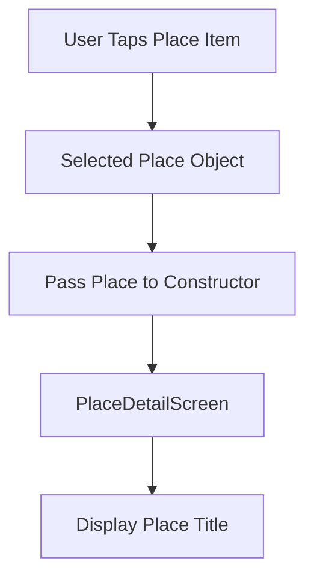
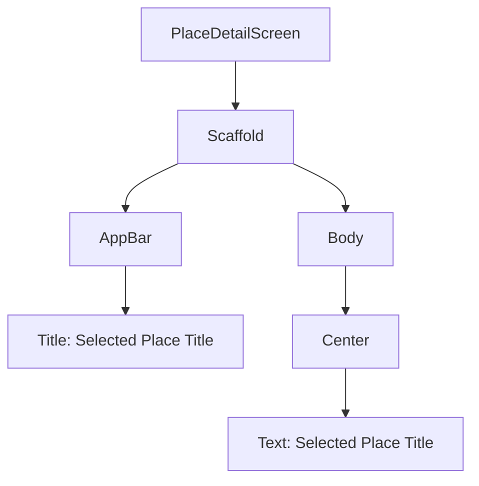
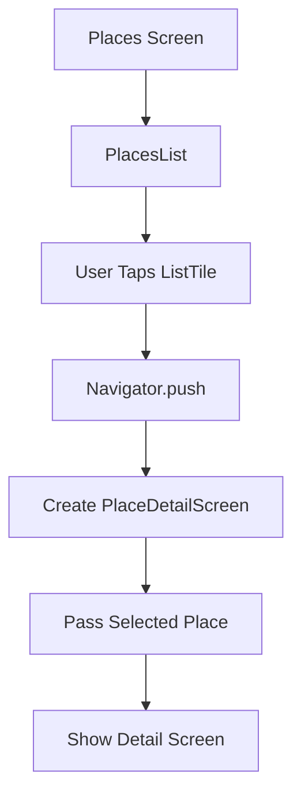
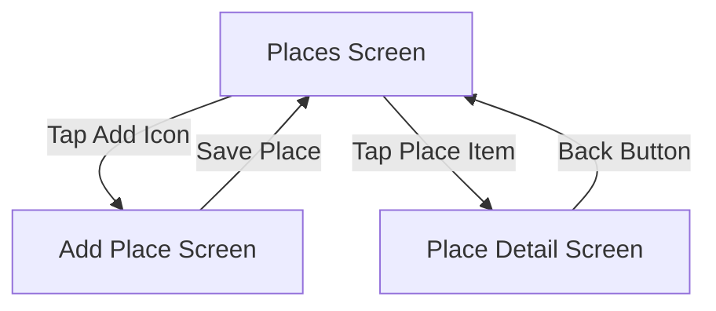
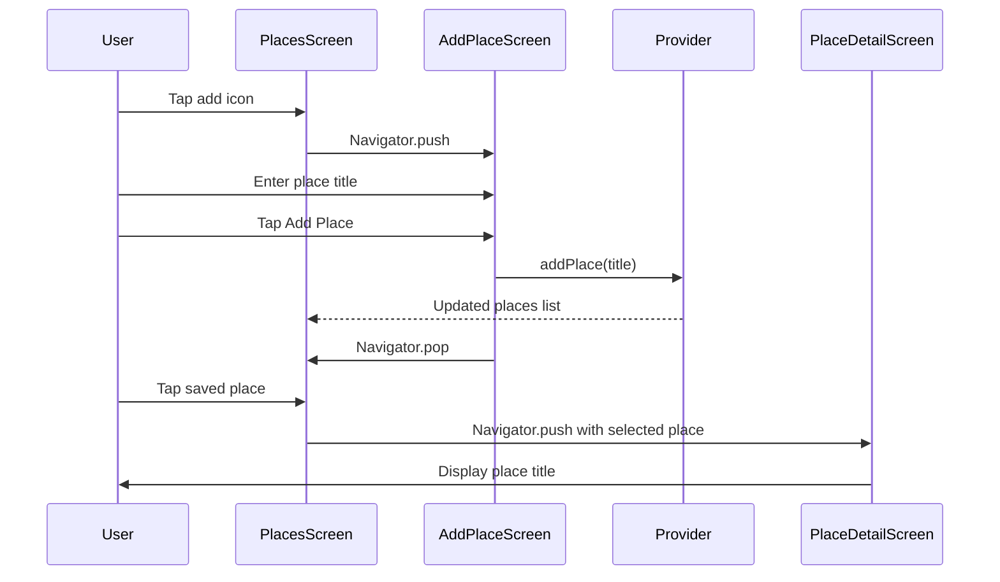
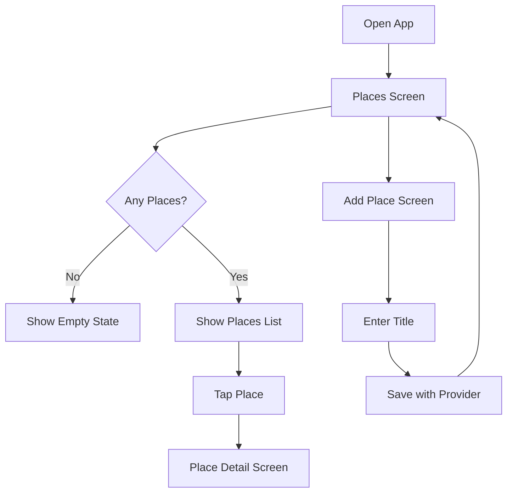
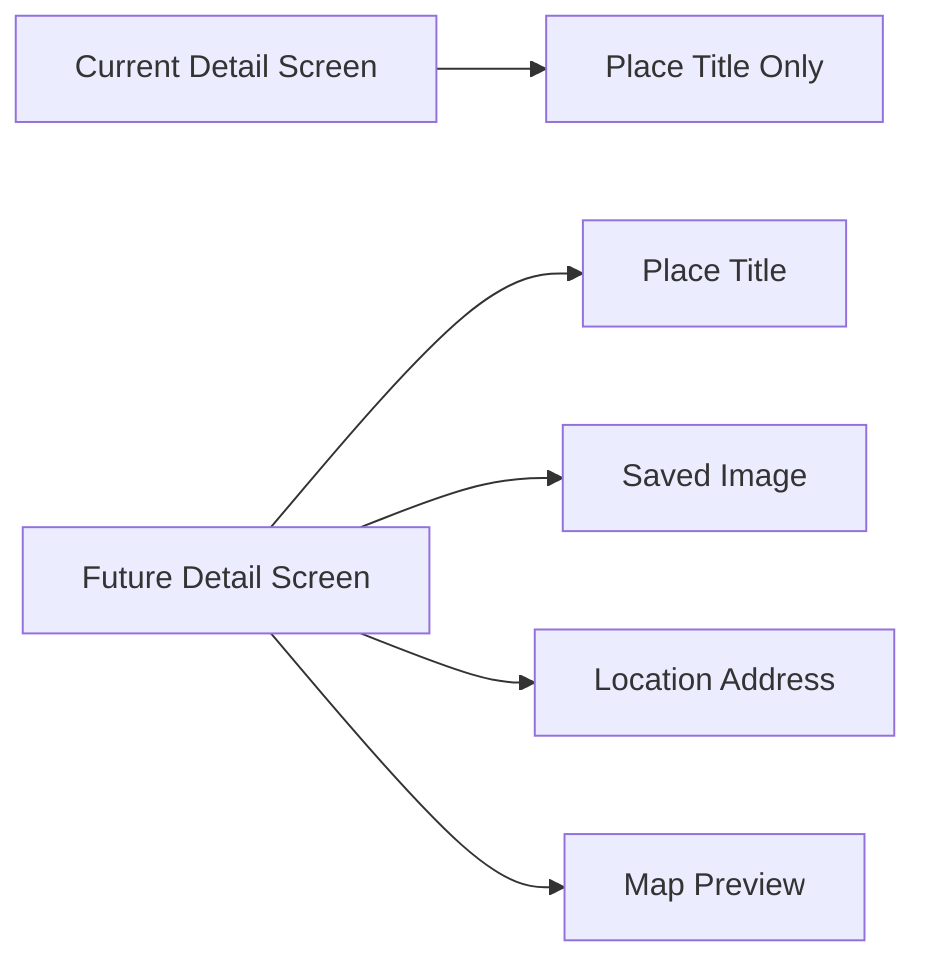

# Adding a Place Details Screen

## Challenge Solution 6 of 6

## Overview

This lecture presents the final part of the Favorite Places app challenge: creating the **Place Detail Screen**.

The Place Detail Screen is opened when the user taps a place in the list. It receives the selected `Place` object and displays basic information about it. At this stage, the screen only shows the place title, but later it will be expanded to display the saved image and location information.

This completes the basic navigation structure of the app.

---

## Learning Goals

By the end of this lecture, you should be able to:

* Create a detail screen for a selected item
* Pass a model object to another screen through a constructor
* Use `Navigator.push()` to open a detail screen
* Use `MaterialPageRoute` for screen navigation
* Handle taps on a `ListTile`
* Display selected data in an `AppBar` and screen body
* Complete the basic Favorite Places app flow

---

## Project Folder Update

The detail screen is created inside the `screens/` folder.

```text id="pj6v1z"
lib/
├── models/
│   └── place.dart
├── providers/
│   └── user_places.dart
├── screens/
│   ├── places.dart
│   ├── add_place.dart
│   └── place_detail.dart
└── widgets/
    └── places_list.dart
```

The new file is:

```text id="m7ay41"
lib/screens/place_detail.dart
```

The file name uses `place_detail` because this screen shows the details of one single place.

---

# 1. Creating the Place Detail Screen

Create a new file:

```text id="5s4p62"
lib/screens/place_detail.dart
```

Inside this file, define a new widget called `PlaceDetailScreen`.

---

## `place_detail.dart`

```dart id="52tnvl"
import 'package:flutter/material.dart';

import '../models/place.dart';

class PlaceDetailScreen extends StatelessWidget {
  const PlaceDetailScreen({
    super.key,
    required this.place,
  });

  final Place place;

  @override
  Widget build(BuildContext context) {
    return Scaffold(
      appBar: AppBar(
        title: Text(place.title),
      ),
      body: Center(
        child: Text(
          place.title,
          style: Theme.of(context).textTheme.bodyLarge!.copyWith(
                color: Theme.of(context).colorScheme.onBackground,
              ),
        ),
      ),
    );
  }
}
```

> Note: If your `Place` model uses `name` instead of `title`, replace `place.title` with `place.name`.

---

## Code Explanation

### 1. Importing Material

```dart id="hak10w"
import 'package:flutter/material.dart';
```

This gives access to widgets such as:

* `Scaffold`
* `AppBar`
* `Text`
* `Center`

---

### 2. Importing the Place Model

```dart id="y19qcr"
import '../models/place.dart';
```

The detail screen needs the `Place` model because it receives a selected place as input.

---

### 3. Creating the Detail Screen Class

```dart id="bp2m81"
class PlaceDetailScreen extends StatelessWidget {
  const PlaceDetailScreen({
    super.key,
    required this.place,
  });

  final Place place;
}
```

`PlaceDetailScreen` is a `StatelessWidget` because it does not manage any internal state.

It only receives a `Place` object and displays its data.

---

## Constructor Parameter

The selected place is passed through the constructor:

```dart id="vuwbkl"
const PlaceDetailScreen({
  super.key,
  required this.place,
});
```

The `required` keyword ensures that a place must be provided when this screen is created.

---

## Detail Screen Data Flow



---

# 2. Building the Detail Screen UI

The detail screen uses a `Scaffold`.

```dart id="ifpb86"
return Scaffold(
  appBar: AppBar(...),
  body: ...,
);
```

This gives the screen a standard Material page structure.

---

## App Bar Title

```dart id="c6nwil"
appBar: AppBar(
  title: Text(place.title),
),
```

The app bar displays the title of the selected place.

This helps the user clearly see which place they are viewing.

---

## Body Content

```dart id="zqm9l7"
body: Center(
  child: Text(
    place.title,
    style: Theme.of(context).textTheme.bodyLarge!.copyWith(
          color: Theme.of(context).colorScheme.onBackground,
        ),
  ),
),
```

The body currently shows the place title in the center of the screen.

This is only a temporary basic layout. Later, this screen will display more useful information.

---

## Current Detail Screen Layout



---

# 3. Making List Items Tappable

The list items are rendered inside `places_list.dart`.

To open the detail screen, add the `onTap` parameter to each `ListTile`.

---

## Updated `places_list.dart`

```dart id="eel9n3"
import 'package:flutter/material.dart';

import '../models/place.dart';
import '../screens/place_detail.dart';

class PlacesList extends StatelessWidget {
  const PlacesList({
    super.key,
    required this.places,
  });

  final List<Place> places;

  @override
  Widget build(BuildContext context) {
    if (places.isEmpty) {
      return Center(
        child: Text(
          'No places added yet.',
          style: Theme.of(context).textTheme.bodyLarge!.copyWith(
                color: Theme.of(context).colorScheme.onBackground,
              ),
        ),
      );
    }

    return ListView.builder(
      itemCount: places.length,
      itemBuilder: (ctx, index) {
        return ListTile(
          title: Text(
            places[index].title,
            style: Theme.of(context).textTheme.titleMedium!.copyWith(
                  color: Theme.of(context).colorScheme.onBackground,
                ),
          ),
          onTap: () {
            Navigator.of(context).push(
              MaterialPageRoute(
                builder: (ctx) => PlaceDetailScreen(
                  place: places[index],
                ),
              ),
            );
          },
        );
      },
    );
  }
}
```

> Note: If your model uses `name`, replace `places[index].title` with `places[index].name`.

---

# 4. Navigation to the Detail Screen

The `onTap` callback runs when the user taps a `ListTile`.

```dart id="f7m2f8"
onTap: () {
  Navigator.of(context).push(
    MaterialPageRoute(
      builder: (ctx) => PlaceDetailScreen(
        place: places[index],
      ),
    ),
  );
},
```

This pushes a new detail screen onto the navigation stack.

---

## Navigation Flow



---

## Passing the Selected Place

The selected place comes from the list index:

```dart id="gw75es"
place: places[index],
```

Because the `ListView.builder` gives access to the current `index`, each list item can pass its own place to the detail screen.

---

## Example

If the list contains:

```text id="t5qwh0"
0: Tokyo Tower
1: Central Park
2: Eiffel Tower
```

Then tapping item `1` passes:

```text id="l08n9q"
Central Park
```

to the `PlaceDetailScreen`.

---

# 5. Complete App Navigation Structure

At this point, the app has three main screens:

1. Places Screen
2. Add Place Screen
3. Place Detail Screen



---

# 6. Complete Data and Navigation Flow

The app can now add places and view details.



---

# 7. Passing Full Object vs Passing ID

In this app, the detail screen receives the entire `Place` object.

```dart id="hulxbh"
PlaceDetailScreen(
  place: places[index],
)
```

This is simple and works well for a small app.

In a larger app, another common approach is to pass only the place ID:

```dart id="wc9kpy"
PlaceDetailScreen(
  placeId: places[index].id,
)
```

Then the detail screen can load the full place data from the provider or database.

---

## Comparison

| Approach         | How It Works                                        | Best For                          |
| ---------------- | --------------------------------------------------- | --------------------------------- |
| Pass full object | Send the entire `Place` object to the detail screen | Small apps, simple flows          |
| Pass ID only     | Send an ID and fetch the object later               | Larger apps, database-backed apps |

For this project stage, passing the full object is simple and effective.

---

# 8. Current App Behavior

The app now supports the complete basic challenge flow:

* Open the Places Screen
* Add a new place
* Save the place with Riverpod
* Return to the Places Screen
* Display the saved place
* Tap the saved place
* Open the Place Detail Screen
* Show the selected place title

---

## Current Feature Flow



---

# 9. What Will Be Added Later

The Place Detail Screen is still very simple.

Later, it will be expanded to show:

* The saved place image
* The selected location
* A map preview
* A formatted address
* More detailed place information



---

## Key Points

* `PlaceDetailScreen` is created in `lib/screens/place_detail.dart`.
* It receives a `Place` object through its constructor.
* The selected place is stored in a `final` field.
* The app bar displays the selected place title.
* The body currently displays the selected place title.
* `ListTile.onTap` is used to detect taps on each place item.
* `Navigator.of(context).push()` opens the detail screen.
* `MaterialPageRoute` creates the route.
* The selected place is passed with `place: places[index]`.

---

## Notes

Using the `onTap` property of `ListTile` is the cleanest way to make list items interactive.

You could also wrap each list item with a `GestureDetector`, but `ListTile` already provides built-in tap handling, making the code shorter and clearer.

At this stage, the detail screen is intentionally minimal. The goal is not to design the final UI yet, but to complete the core navigation structure before adding native device features.

---

## Summary

This lecture completes the sixth and final part of the challenge.

The Favorite Places app now has:

* A `Place` model
* A Riverpod provider
* A Places Screen
* An Add Place Screen
* A Places List widget
* A Place Detail Screen
* Navigation between all screens
* Basic add-and-display functionality

The app does not yet use native device features, but the foundation is complete.

Next, the module will move on to the main topic: integrating native device functionality such as camera access, user location, maps, and local storage.
