# Adding a Pick an Image Input

## Overview

This lecture begins the native device features section by adding the UI foundation for image picking.

The goal is to let users take a photo when they add a new favorite place. Since Flutter does not provide a built-in camera input widget, a custom `ImageInput` widget is created.

At this stage, the widget only displays a bordered area with a **Take Picture** button. The actual camera logic will be added in the next lecture.

---

## Learning Goals

By the end of this lecture, you should be able to:

* Create a custom image input widget
* Understand why the image input should be a `StatefulWidget`
* Add a reusable widget inside the Add Place form
* Use a `Container` to define input size and layout
* Add a border using `BoxDecoration`
* Use `TextButton.icon` for a camera action
* Prepare the UI for later camera integration

---

## Starting Point

Before starting native device features, the app already has:

* A `Place` model
* Riverpod state management
* A Places Screen
* An Add Place Screen
* A Place Detail Screen
* Basic add-and-display functionality

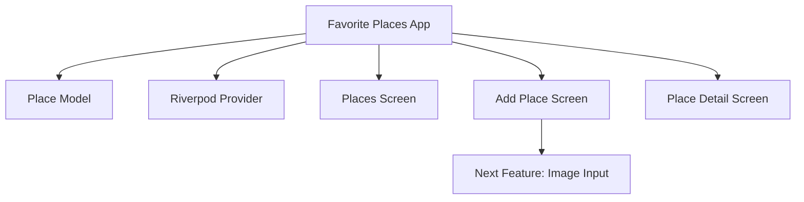

---

## Required Existing Dependencies

If you skipped the previous challenge lectures and are using the provided `lib` folder, make sure these packages are installed:

```yaml id="ary74z"
dependencies:
  google_fonts: ^latest_version
  uuid: ^latest_version
  flutter_riverpod: ^latest_version
```

You can also install them manually with:

```bash id="sn10p8"
flutter pub add google_fonts
flutter pub add uuid
flutter pub add flutter_riverpod
```

---

# 1. Why Build a Custom Image Input?

Flutter has many built-in form widgets, such as:

* `TextField`
* `TextFormField`
* `DropdownButton`
* `Checkbox`
* `Switch`

However, there is no built-in widget that directly lets the user open the camera, take a photo, preview it, and pass it back to the parent form.

Therefore, this app needs a custom widget.

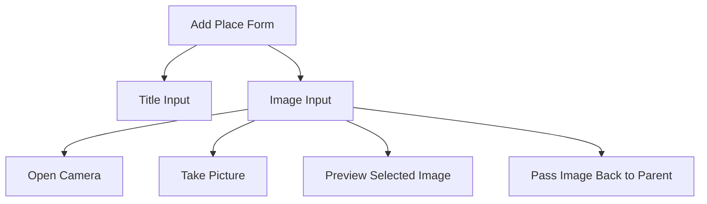

At this stage, only the UI shell is created. Camera integration comes next.

---

# 2. Creating the Image Input Widget

Create a new file inside the `widgets/` folder:

```text id="kvrbwl"
lib/
└── widgets/
    └── image_input.dart
```

This file will contain the `ImageInput` widget.

---

## Basic `ImageInput` Widget

```dart id="zo6ldi"
import 'package:flutter/material.dart';

class ImageInput extends StatefulWidget {
  const ImageInput({super.key});

  @override
  State<ImageInput> createState() {
    return _ImageInputState();
  }
}

class _ImageInputState extends State<ImageInput> {
  void _takePicture() {
    // Camera logic will be added later.
  }

  @override
  Widget build(BuildContext context) {
    return Container(
      height: 250,
      width: double.infinity,
      alignment: Alignment.center,
      decoration: BoxDecoration(
        border: Border.all(
          width: 1,
          color: Theme.of(context).colorScheme.primary.withOpacity(0.2),
        ),
      ),
      child: TextButton.icon(
        onPressed: _takePicture,
        icon: const Icon(Icons.camera),
        label: const Text('Take Picture'),
      ),
    );
  }
}
```

---

## Code Explanation

### 1. Importing Material

```dart id="zosocx"
import 'package:flutter/material.dart';
```

This gives access to Flutter UI widgets such as:

* `StatefulWidget`
* `Container`
* `TextButton`
* `Icon`
* `BoxDecoration`
* `Border`

---

### 2. Creating the `ImageInput` Widget

```dart id="vzuoza"
class ImageInput extends StatefulWidget {
  const ImageInput({super.key});

  @override
  State<ImageInput> createState() {
    return _ImageInputState();
  }
}
```

`ImageInput` is a `StatefulWidget` because it will later need to store the selected image.

Once the user takes a picture, the widget must update from:

```text id="630m9q"
Take Picture button
```

to:

```text id="k3acn9"
Image preview
```

That UI change requires local widget state.

---

## Why StatefulWidget Is Needed

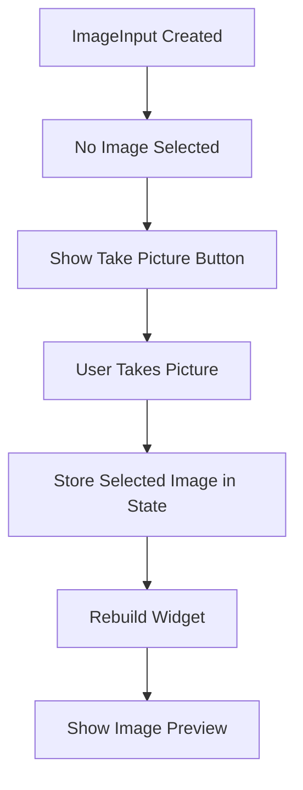

---

# 3. Adding the `_takePicture` Method

Inside `_ImageInputState`, add a method called `_takePicture`.

```dart id="7gs0u7"
void _takePicture() {
  // Camera logic will be added later.
}
```

For now, this method does nothing.

In the next lecture, it will be used to:

* Open the device camera
* Let the user take a picture
* Store the selected image
* Update the UI
* Pass the image back to the Add Place screen

---

## Future Camera Flow

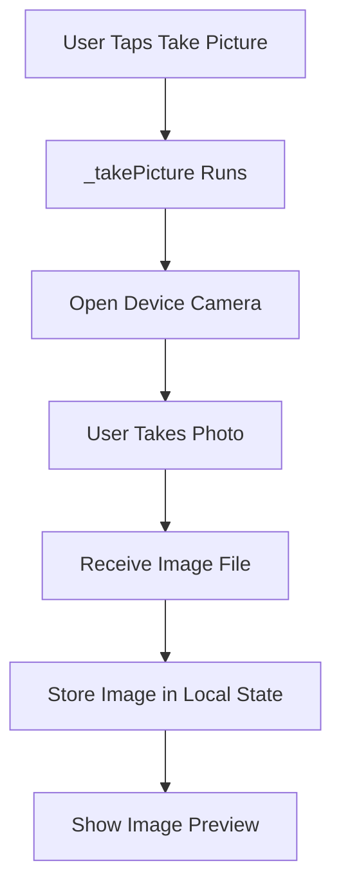

---

# 4. Building the Image Input UI

The `ImageInput` widget currently returns a `Container`.

```dart id="3qg6yd"
return Container(
  height: 250,
  width: double.infinity,
  alignment: Alignment.center,
  child: TextButton.icon(...),
);
```

The container defines the visible image input area.

---

## Container Properties

| Property                      | Purpose                                  |
| ----------------------------- | ---------------------------------------- |
| `height: 250`                 | Gives the image input a fixed height     |
| `width: double.infinity`      | Makes it as wide as possible             |
| `alignment: Alignment.center` | Centers the button inside the container  |
| `decoration`                  | Adds a border around the input area      |
| `child`                       | Displays the button for taking a picture |

---

## Image Input Layout

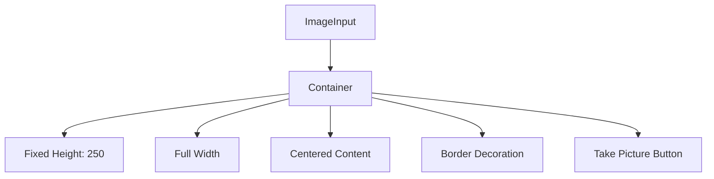

---

# 5. Adding a Border

A border is added to make the image input area visually clear.

```dart id="m6jrbi"
decoration: BoxDecoration(
  border: Border.all(
    width: 1,
    color: Theme.of(context).colorScheme.primary.withOpacity(0.2),
  ),
),
```

This creates a thin border around all sides of the container.

---

## Border Breakdown

```dart id="g7hdln"
Border.all(
  width: 1,
  color: Theme.of(context).colorScheme.primary.withOpacity(0.2),
)
```

| Part                  | Meaning                              |
| --------------------- | ------------------------------------ |
| `Border.all(...)`     | Applies the same border to all sides |
| `width: 1`            | Makes the border thin                |
| `colorScheme.primary` | Uses the theme's primary color       |
| `withOpacity(0.2)`    | Makes the border subtle              |

---

## Why Use Theme Colors?

Using theme colors keeps the widget consistent with the rest of the app.

Instead of hardcoding a color, the border uses:

```dart id="jrcztg"
Theme.of(context).colorScheme.primary
```

This means the widget automatically fits the current app theme.

---

# 6. Adding the Take Picture Button

Inside the container, a `TextButton.icon` is used.

```dart id="np3sh5"
TextButton.icon(
  onPressed: _takePicture,
  icon: const Icon(Icons.camera),
  label: const Text('Take Picture'),
)
```

This button includes:

* A camera icon
* A text label
* A callback function

---

## Button Structure

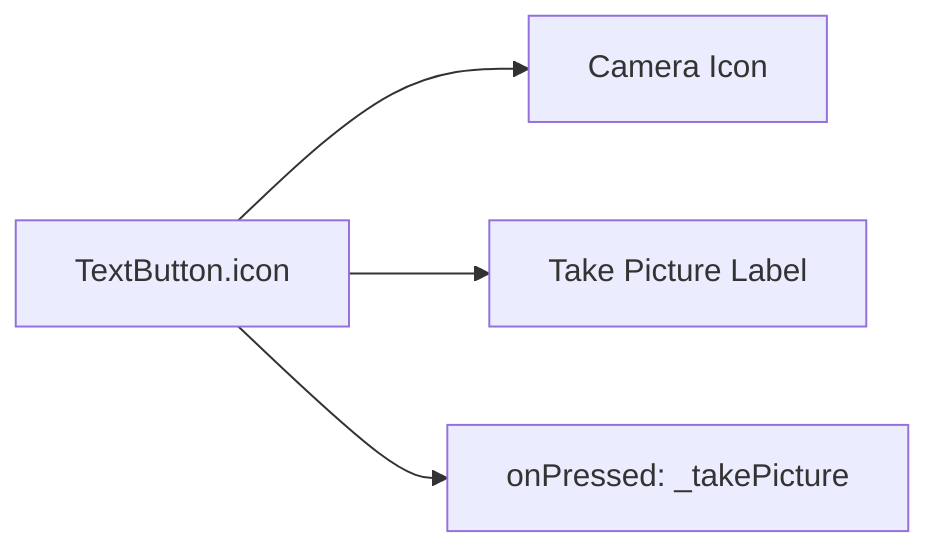

---

# 7. Adding ImageInput to the Add Place Screen

Now the custom `ImageInput` widget should be used inside the Add Place form.

Open:

```text id="53hz3b"
lib/screens/add_place.dart
```

Import the widget:

```dart id="2jeqdw"
import '../widgets/image_input.dart';
```

Then add it below the title input.

---

## Updated Add Place Form Section

```dart id="pq7asr"
TextField(
  controller: _titleController,
  style: TextStyle(
    color: Theme.of(context).colorScheme.onBackground,
  ),
  decoration: const InputDecoration(
    labelText: 'Title',
  ),
),
const SizedBox(height: 10),
const ImageInput(),
const SizedBox(height: 16),
ElevatedButton.icon(
  onPressed: _savePlace,
  icon: const Icon(Icons.add),
  label: const Text('Add Place'),
),
```

---

## Add Place Screen Layout

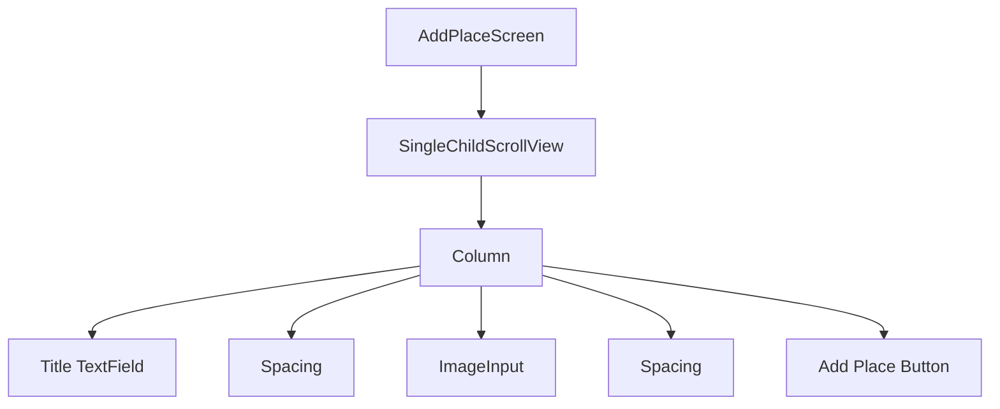

---

# 8. Why Add Spacing?

A `SizedBox` is added before the image input:

```dart id="v4i6ug"
const SizedBox(height: 10),
```

This creates space between the title field and the image input.

Without spacing, the UI would feel cramped.

---

# 9. Current UI Result

After this lecture, the Add Place Screen includes:

* A title input field
* A bordered image input area
* A **Take Picture** button
* An **Add Place** button

The **Take Picture** button is connected to `_takePicture`, but the function does not open the camera yet.

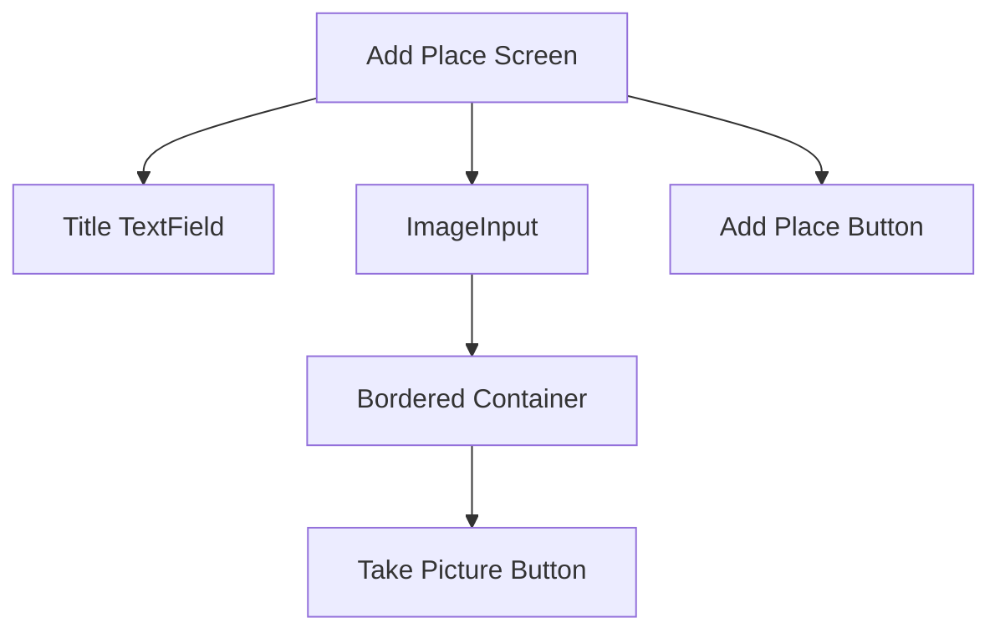

---

# 10. Current Image Input State

At this moment, the image input has only one visible state:

```text id="3fm41h"
No image selected yet → Show Take Picture button
```

In the next step, it will support two states:

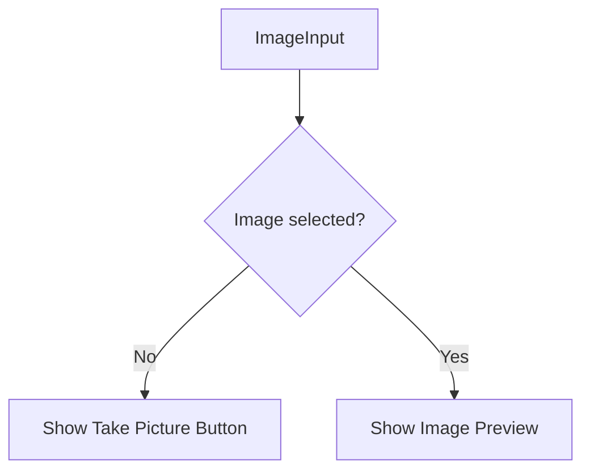

---

# 11. Future Version with Selected Image State

Later, the widget will store the selected image in local state.

A future version may include:

```dart id="uw4x8d"
File? _selectedImage;
```

This nullable field allows the widget to distinguish between:

* No image selected
* Image selected

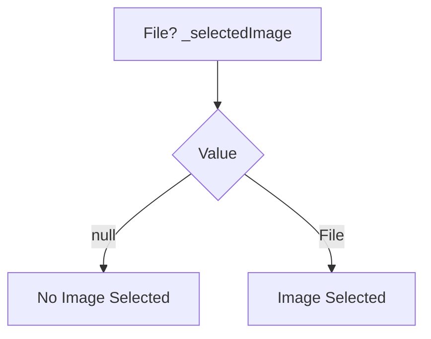

---

## Future Preview Logic

Once image picking is implemented, the widget can conditionally render either a button or an image preview.

```dart id="pa303u"
Widget content = TextButton.icon(
  onPressed: _takePicture,
  icon: const Icon(Icons.camera),
  label: const Text('Take Picture'),
);

if (_selectedImage != null) {
  content = Image.file(
    _selectedImage!,
    fit: BoxFit.cover,
    width: double.infinity,
    height: double.infinity,
  );
}
```

This logic will allow the widget to update after the user takes a photo.

---

# 12. Data Flow Planned for Later

Eventually, the selected image should be passed back to the Add Place Screen.

This will likely be done through a callback function.

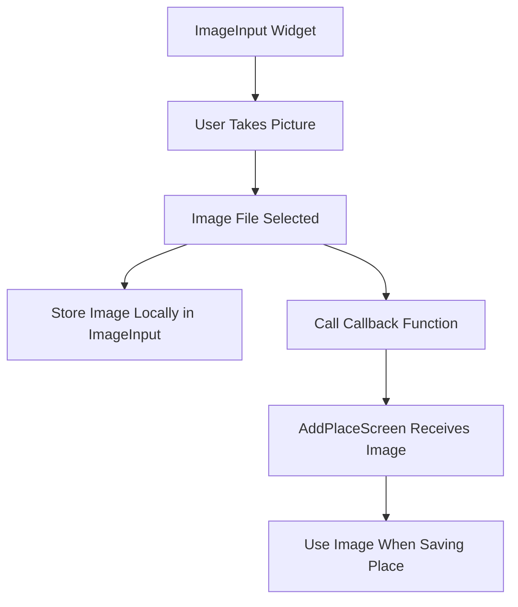

---

## Callback Pattern

A future version may accept a callback like this:

```dart id="g1y7wr"
class ImageInput extends StatefulWidget {
  const ImageInput({
    super.key,
    required this.onPickImage,
  });

  final void Function(File image) onPickImage;

  @override
  State<ImageInput> createState() => _ImageInputState();
}
```

This allows the child widget to send data up to the parent screen.

---

## Why Use a Callback?

The selected image belongs to the Add Place form because it must be saved together with the place title.

However, the image-picking UI is inside the `ImageInput` widget.

A callback allows this data to move upward cleanly:

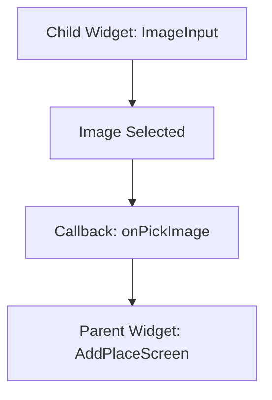

---

# 13. Key Points

* A new widget file is created: `lib/widgets/image_input.dart`.
* The widget is named `ImageInput`.
* `ImageInput` is a `StatefulWidget`.
* It will later manage the selected image as local state.
* The widget currently displays a bordered `Container`.
* The container has a fixed height of `250`.
* The container fills the available width with `double.infinity`.
* A `TextButton.icon` is centered inside the container.
* The button uses a camera icon and the label **Take Picture**.
* The button calls `_takePicture`.
* `_takePicture` is currently empty.
* `ImageInput` is added to the Add Place Screen below the title input.
* Spacing is added with `SizedBox`.

---

## Notes

This lecture focuses only on the UI foundation for taking pictures.

The actual camera integration is intentionally postponed to the next lecture. This is a clean development approach because it separates the visual structure from the native device logic.

The widget is designed as a `StatefulWidget` because it will soon need to update itself after a photo is taken.

At the moment, the widget does not use Riverpod. That is fine because the selected image is local form state, not global app-wide state.

---

## Summary

This lecture starts the native device features section by creating a reusable `ImageInput` widget.

The Add Place Screen now includes a visual placeholder for taking a picture. The user can see a bordered area with a camera button, but tapping the button does not open the camera yet.

This prepares the app for the next step: connecting the `ImageInput` widget to the actual device camera.
