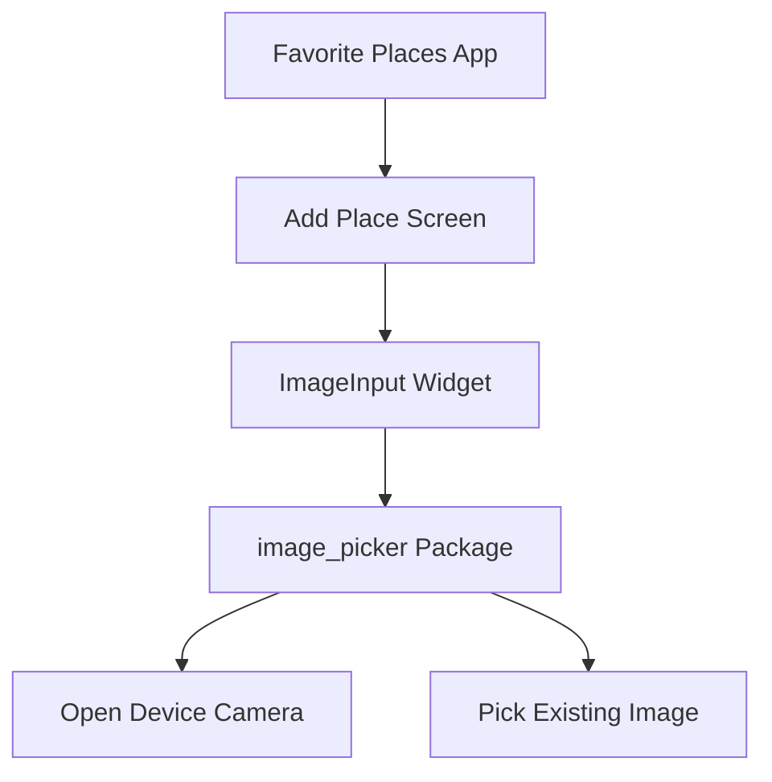
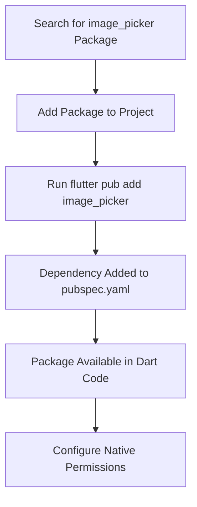
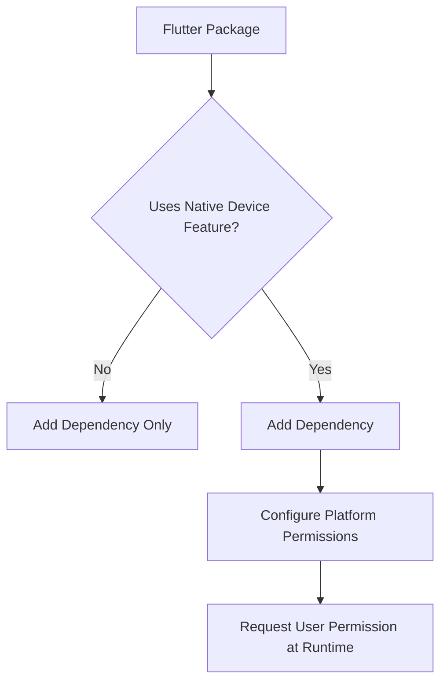
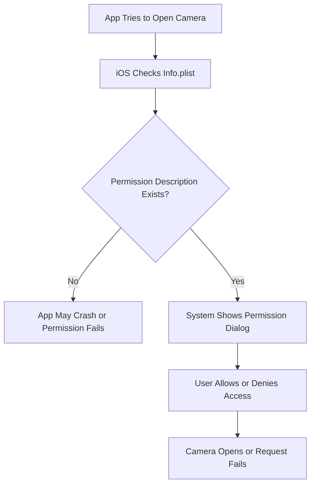
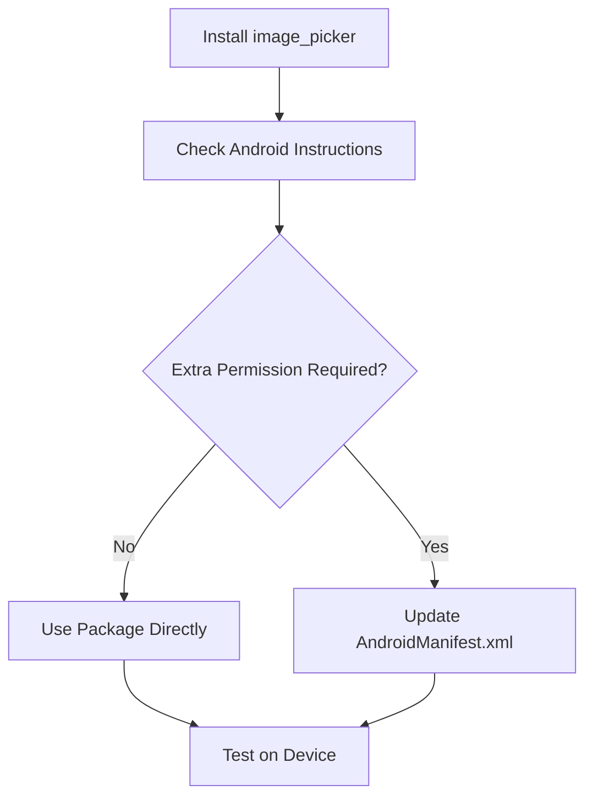
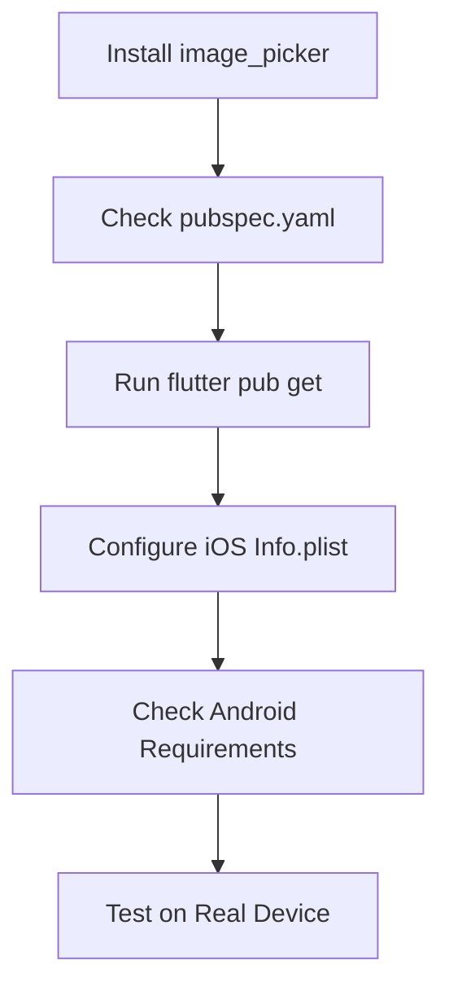
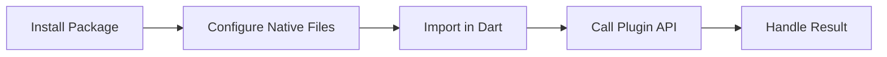

# Installing the Image Picker Package

## Overview

This lecture explains how to install and configure the `image_picker` package in a Flutter project.

The `image_picker` package allows users to pick images from the device gallery or take new photos with the camera. Since this package interacts with native device features, installation is not limited to adding a Dart dependency. Some platform-specific permission configuration is also required, especially on iOS.

After this setup, the app will be ready to use the device camera for the Favorite Places app.

---

## Learning Goals

By the end of this lecture, you should be able to:

* Install the `image_picker` package
* Understand why native plugins often require extra setup
* Configure iOS camera and photo library permissions
* Understand where iOS app permissions are declared
* Know when Android configuration is or is not required
* Prepare the app for taking pictures with the device camera

---

## Why Use the `image_picker` Package?

Flutter does not provide a built-in camera input widget.

To let users take photos or choose images, you can use the `image_picker` package.

The package supports:

* Taking a new photo with the camera
* Picking an existing image from the gallery
* Picking videos
* Recording videos

In this module, the app will mainly use it to take a photo for a favorite place.



---

# 1. Installing the Package

Run the following command in the project terminal:

```bash id="7l7tfv"
flutter pub add image_picker
```

This adds the package to your `pubspec.yaml` file.

After installation, your dependencies should include something like:

```yaml id="9w3lpo"
dependencies:
  image_picker: ^latest_version
```

The exact version may be different depending on when you install it.

---

## Alternative Installation

You can also manually add the dependency to `pubspec.yaml`.

Example:

```yaml id="w49jrm"
dependencies:
  flutter:
    sdk: flutter

  image_picker: ^1.0.0
```

Then run:

```bash id="nnz8at"
flutter pub get
```

---

## Installation Flow



---

# 2. Why Extra Configuration Is Needed

Some Flutter packages only contain Dart code.

Other packages, especially packages that access native device features, also require platform-specific setup.

The `image_picker` package needs access to native features such as:

* Camera
* Photo library
* Microphone, if recording videos

Because these features involve user privacy, operating systems require the app to declare why it needs access.



---

# 3. iOS Configuration

On iOS, you must add permission descriptions to the `Info.plist` file.

The file is located at:

```text id="jjgeuj"
ios/Runner/Info.plist
```

This file contains configuration values for the iOS app.

---

## Required iOS Permission Keys

For image picking and camera access, add the following keys inside the `<dict>` section of `Info.plist`.

```xml id="firbfo"
<key>NSPhotoLibraryUsageDescription</key>
<string>Pick your favorite place image.</string>

<key>NSCameraUsageDescription</key>
<string>Take your favorite place image.</string>

<key>NSMicrophoneUsageDescription</key>
<string>Record video for your favorite place.</string>
```

---

## What These Keys Mean

| Key                              | Purpose                                                                  |
| -------------------------------- | ------------------------------------------------------------------------ |
| `NSPhotoLibraryUsageDescription` | Explains why the app needs access to the user's photo library            |
| `NSCameraUsageDescription`       | Explains why the app needs access to the camera                          |
| `NSMicrophoneUsageDescription`   | Explains why the app needs microphone access, mainly for video recording |

---

## Why Permission Text Matters

The text inside the `<string>` tag is shown to the user in the iOS permission dialog.

For example:

```xml id="y3clyf"
<key>NSCameraUsageDescription</key>
<string>Take your favorite place image.</string>
```

This message explains why the app wants to use the camera.

The message should be clear and user-friendly because the user will see it before granting permission.

---

## iOS Permission Flow



---

# 4. Example `Info.plist` Structure

The keys must be added inside the main `<dict>` block.

Example:

```xml id="kg7qlz"
<?xml version="1.0" encoding="UTF-8"?>
<!DOCTYPE plist PUBLIC "-//Apple//DTD PLIST 1.0//EN" 
  "http://www.apple.com/DTDs/PropertyList-1.0.dtd">
<plist version="1.0">
<dict>
    <!-- Other existing app configuration keys -->

    <key>NSPhotoLibraryUsageDescription</key>
    <string>Pick your favorite place image.</string>

    <key>NSCameraUsageDescription</key>
    <string>Take your favorite place image.</string>

    <key>NSMicrophoneUsageDescription</key>
    <string>Record video for your favorite place.</string>
</dict>
</plist>
```

---

# 5. Android Configuration

In the lecture, Android does not require extra configuration for the basic use case.

The package should work out of the box on Android.

However, you should still check the official package instructions when working on your own project because Android permission rules can change depending on:

* Android version
* Target SDK version
* Package version
* Whether you use camera, gallery, or video features

---

## Android Setup Flow



---

## Possible Android File

If additional Android permissions are required, they are usually configured in:

```text id="1sgffj"
android/app/src/main/AndroidManifest.xml
```

For the lecture's current setup, no Android changes are needed.

---

# 6. Windows and iOS Note

If you are developing on Windows or Linux, you might not be able to build for iOS directly.

In that case:

* You may still see the `ios/` folder in your Flutter project
* You can edit iOS files if needed
* But you need macOS and Xcode to build and run the iOS app

If you are only testing Android, the iOS setup is not immediately required for local testing.

---

# 7. Current Package Setup Checklist

Use this checklist before using `image_picker` in code.



---

## Checklist

* Install `image_picker`
* Confirm it appears in `pubspec.yaml`
* Run `flutter pub get` if needed
* Add iOS permission descriptions to `Info.plist`
* Check Android setup instructions
* Test on a physical device if possible

---

# 8. Why Test on a Real Device?

Camera and gallery features often behave differently on emulators and simulators.

A real device is recommended because it provides:

* Real camera hardware
* Real photo library access
* Real permission dialogs
* More accurate platform behavior

Emulators can still be useful, but camera support may be limited or simulated.

---

# 9. Common Problems

## Problem: App crashes on iOS when opening camera

Possible cause:

```text id="608b0m"
Missing NSCameraUsageDescription in Info.plist
```

Solution:

```xml id="2b98r4"
<key>NSCameraUsageDescription</key>
<string>Take your favorite place image.</string>
```

---

## Problem: App crashes on iOS when opening gallery

Possible cause:

```text id="sn73pa"
Missing NSPhotoLibraryUsageDescription in Info.plist
```

Solution:

```xml id="sv9fr5"
<key>NSPhotoLibraryUsageDescription</key>
<string>Pick your favorite place image.</string>
```

---

## Problem: Package is imported but not recognized

Possible causes:

* The package was not installed
* `flutter pub get` was not run
* The IDE did not refresh dependencies

Solution:

```bash id="6521j6"
flutter pub get
```

---

# 10. Native Plugin Setup Pattern

The `image_picker` setup demonstrates a common Flutter pattern.

Many native device plugins require:

1. Installing the Dart package
2. Configuring native platform permissions
3. Importing the package in Dart code
4. Calling the plugin API
5. Handling user permission results



---

# 11. Key Points

* `image_picker` helps users pick images or take photos.
* Install it with `flutter pub add image_picker`.
* Native device packages often need extra platform setup.
* iOS requires permission descriptions in `Info.plist`.
* The permission description text is shown to the user.
* Android does not require extra setup in the lecture's current configuration.
* Always check the package README because setup requirements can change.
* Testing camera features on a real device is recommended.

---

## Notes

The `image_picker` package is a Flutter plugin that connects Dart code to native platform functionality.

Because camera and photo library access involve user privacy, iOS requires explicit usage descriptions. If those descriptions are missing, the app may crash or fail when trying to access the camera or gallery.

The Android side is simpler in this lecture, but Android permission rules can vary across versions, so the official package instructions should always be checked.

---

## Summary

This lecture installs and prepares the `image_picker` package.

The package is added to the Flutter project, and iOS permission keys are configured in `Info.plist`.

With this setup complete, the app is ready for the next step: using `image_picker` inside the `ImageInput` widget to open the device camera and take a photo.
