# Using the Device Camera for Taking Pictures

## Overview

This lecture implements the actual camera functionality inside the custom `ImageInput` widget.

In the previous lecture, the `ImageInput` widget only displayed a bordered container with a **Take Picture** button. Now, the button will open the device camera by using the `image_picker` package.

After the user takes a photo, the selected image is stored in local widget state and displayed as a preview inside the input area.

---

## Learning Goals

By the end of this lecture, you should be able to:

* Use the `image_picker` package to open the device camera
* Call `pickImage()` with `ImageSource.camera`
* Handle nullable image picker results
* Convert an `XFile` into a Dart `File`
* Store the selected image in local widget state
* Use `setState()` to update the UI
* Display a selected image with `Image.file`
* Make the image preview tappable so users can replace the photo

---

## Feature Flow

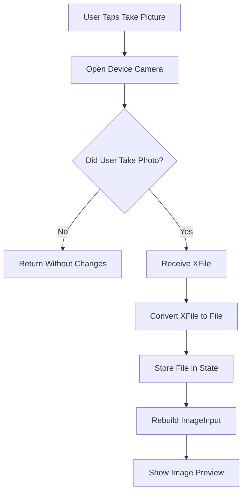

---

# 1. Importing Required Packages

To use the camera and display the selected image, the widget needs two imports.

```dart
import 'dart:io';

import 'package:flutter/material.dart';
import 'package:image_picker/image_picker.dart';
```

## Import Explanation

| Import              | Purpose                                            |
| ------------------- | -------------------------------------------------- |
| `dart:io`           | Provides the `File` class                          |
| `image_picker.dart` | Provides `ImagePicker`, `ImageSource`, and `XFile` |
| `material.dart`     | Provides Flutter UI widgets                        |

The `image_picker` package returns an `XFile`, but Flutter's `Image.file()` widget expects a `File`. That is why `dart:io` is also needed.

---

# 2. Adding Local Image State

Inside `_ImageInputState`, add a nullable `File` variable.

```dart
File? _selectedImage;
```

This stores the image selected by the user.

It is nullable because initially no image has been taken yet.

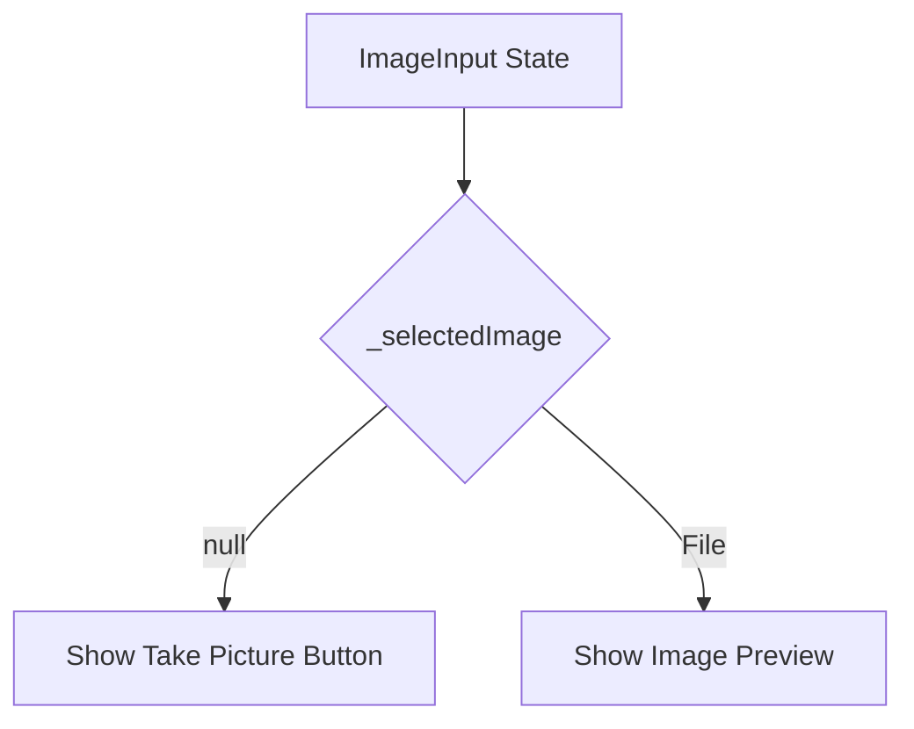

---

# 3. Implementing `_takePicture`

The `_takePicture` method opens the camera and waits for the user to take a photo.

```dart
void _takePicture() async {
  final imagePicker = ImagePicker();

  final pickedImage = await imagePicker.pickImage(
    source: ImageSource.camera,
    maxWidth: 600,
  );

  if (pickedImage == null) {
    return;
  }

  final imageFile = File(pickedImage.path);

  setState(() {
    _selectedImage = imageFile;
  });
}
```

---

## Code Explanation

### 1. Creating an Image Picker

```dart
final imagePicker = ImagePicker();
```

This creates an object that can open the camera or gallery.

---

### 2. Opening the Camera

```dart
final pickedImage = await imagePicker.pickImage(
  source: ImageSource.camera,
  maxWidth: 600,
);
```

The `pickImage()` method starts the native image-picking process.

The `source` decides where the image should come from.

```dart
source: ImageSource.camera
```

This tells the package to open the device camera.

---

## Available Image Sources

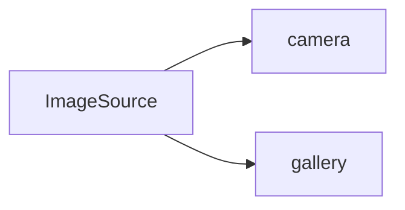

| Source                | Meaning                                                  |
| --------------------- | -------------------------------------------------------- |
| `ImageSource.camera`  | Opens the camera so the user can take a new photo        |
| `ImageSource.gallery` | Opens the gallery so the user can pick an existing image |

In this app, the camera is used because each favorite place should have a newly taken photo.

---

# 4. Why `_takePicture` Is Async

`pickImage()` returns a `Future`.

That means it takes time because the user must interact with the camera.

```dart
void _takePicture() async {
  final pickedImage = await imagePicker.pickImage(...);
}
```

The `await` keyword pauses the method until the user either:

* Takes a picture
* Cancels the camera process

---

## Async Flow

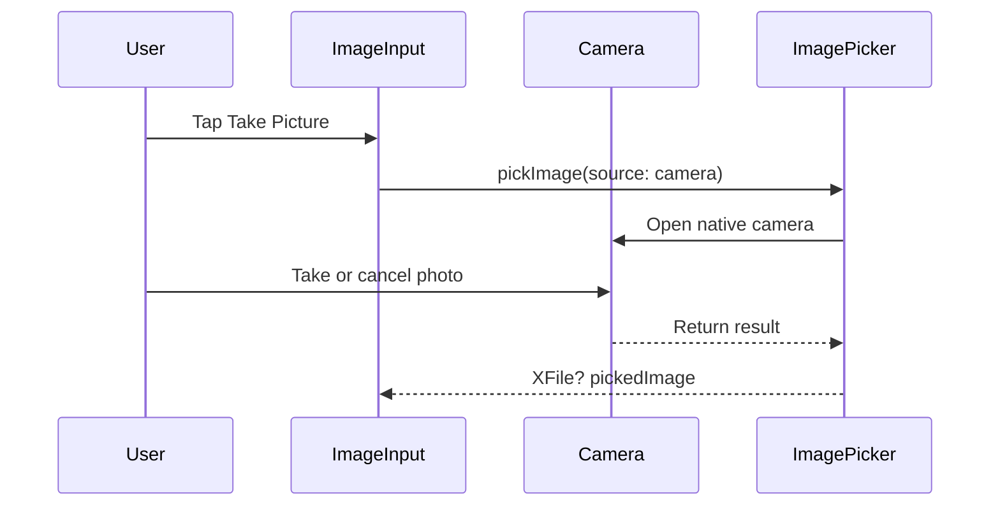

---

# 5. Handling Cancelled Image Picking

The result from `pickImage()` is nullable.

```dart
final pickedImage = await imagePicker.pickImage(...);
```

Its type is:

```dart
XFile?
```

That means the value can be `null`.

This happens when the user opens the camera but cancels without taking a picture.

```dart
if (pickedImage == null) {
  return;
}
```

This early return prevents the app from trying to use a missing image.

---

## Cancel Flow

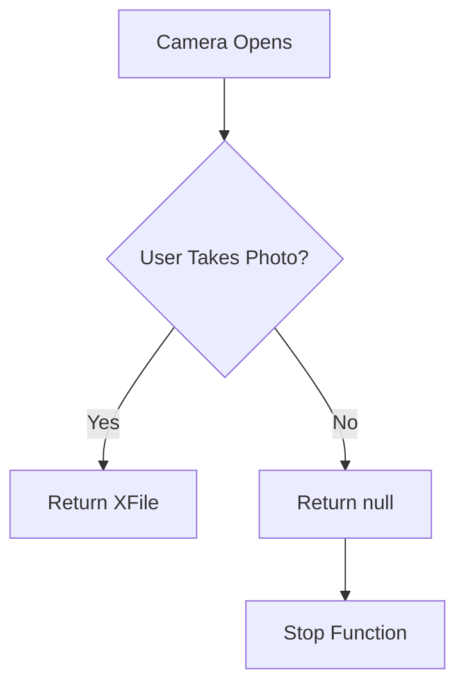

---

# 6. Converting `XFile` to `File`

The image picker returns an `XFile`.

```dart
final pickedImage = await imagePicker.pickImage(...);
```

But the app needs a normal Dart `File` to display the image with `Image.file`.

Convert it like this:

```dart
final imageFile = File(pickedImage.path);
```

The `pickedImage.path` value contains the file path of the image on the device.

---

## Conversion Flow

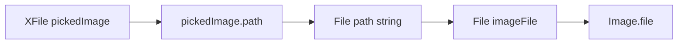

---

# 7. Updating the UI with `setState`

After converting the image, store it in `_selectedImage`.

```dart
setState(() {
  _selectedImage = imageFile;
});
```

Calling `setState()` is required because the UI depends on `_selectedImage`.

Without `setState()`, the image is stored, but Flutter does not know that the widget should rebuild.

---

## Why `setState` Is Needed

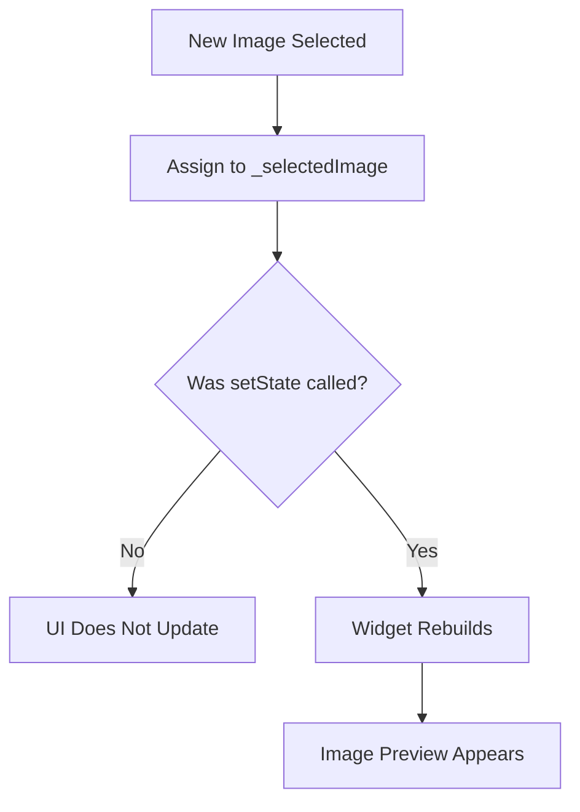

---

# 8. Displaying the Selected Image

The widget now conditionally displays either:

* A **Take Picture** button
* The selected image preview

```dart
Widget content = TextButton.icon(
  onPressed: _takePicture,
  icon: const Icon(Icons.camera),
  label: const Text('Take Picture'),
);

if (_selectedImage != null) {
  content = GestureDetector(
    onTap: _takePicture,
    child: Image.file(
      _selectedImage!,
      fit: BoxFit.cover,
      width: double.infinity,
      height: double.infinity,
    ),
  );
}
```

---

## Conditional UI Logic

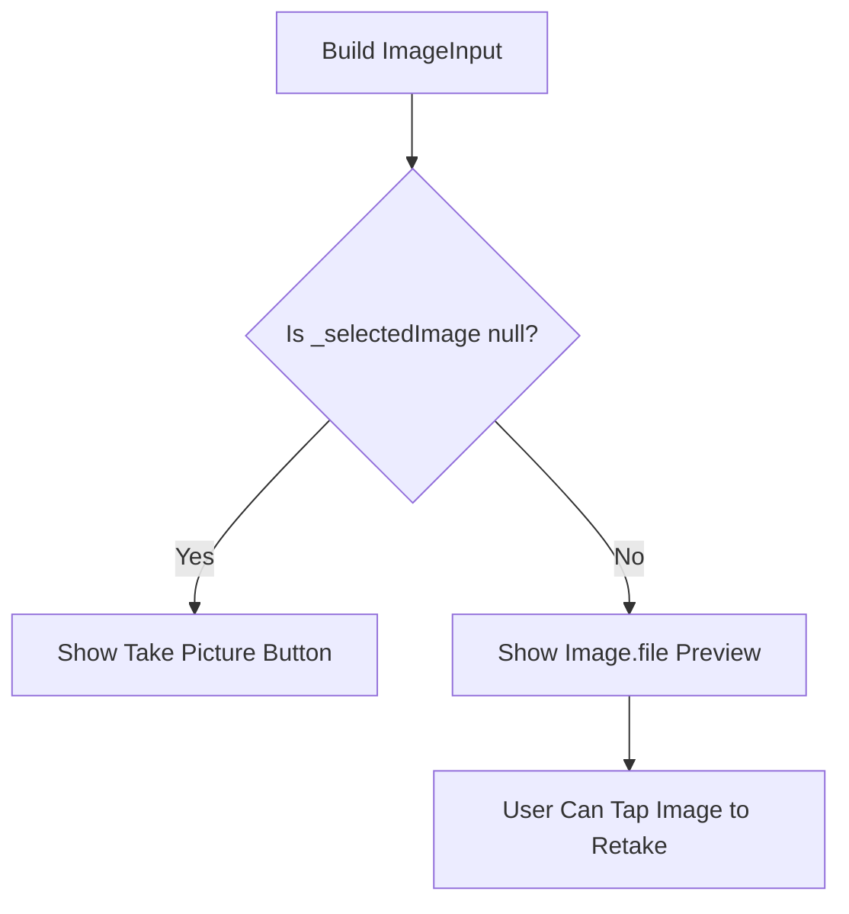

---

## Why Use `Image.file`

```dart
Image.file(
  _selectedImage!,
)
```

`Image.file()` displays an image from a local file on the device.

This is exactly what is needed because the camera photo is stored locally.

---

## Image Sizing

```dart
fit: BoxFit.cover,
width: double.infinity,
height: double.infinity,
```

| Property                  | Purpose                                                    |
| ------------------------- | ---------------------------------------------------------- |
| `fit: BoxFit.cover`       | Crops and scales the image so it fills the available space |
| `width: double.infinity`  | Makes the image fill the container width                   |
| `height: double.infinity` | Makes the image fill the container height                  |

This ensures that the preview fills the entire image input area.

---

# 9. Making the Image Preview Tappable

After a photo is selected, the preview should also be tappable so the user can replace the image.

This is done with `GestureDetector`.

```dart
content = GestureDetector(
  onTap: _takePicture,
  child: Image.file(
    _selectedImage!,
    fit: BoxFit.cover,
    width: double.infinity,
    height: double.infinity,
  ),
);
```

Now, tapping the image opens the camera again.

---

## Retake Flow

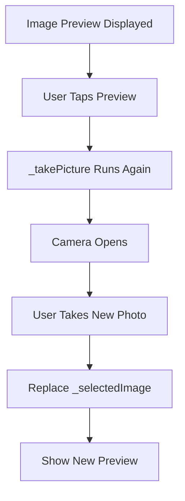

---

# 10. Final `ImageInput` Code

```dart
import 'dart:io';

import 'package:flutter/material.dart';
import 'package:image_picker/image_picker.dart';

class ImageInput extends StatefulWidget {
  const ImageInput({super.key});

  @override
  State<ImageInput> createState() {
    return _ImageInputState();
  }
}

class _ImageInputState extends State<ImageInput> {
  File? _selectedImage;

  void _takePicture() async {
    final imagePicker = ImagePicker();

    final pickedImage = await imagePicker.pickImage(
      source: ImageSource.camera,
      maxWidth: 600,
    );

    if (pickedImage == null) {
      return;
    }

    final imageFile = File(pickedImage.path);

    setState(() {
      _selectedImage = imageFile;
    });
  }

  @override
  Widget build(BuildContext context) {
    Widget content = TextButton.icon(
      onPressed: _takePicture,
      icon: const Icon(Icons.camera),
      label: const Text('Take Picture'),
    );

    if (_selectedImage != null) {
      content = GestureDetector(
        onTap: _takePicture,
        child: Image.file(
          _selectedImage!,
          fit: BoxFit.cover,
          width: double.infinity,
          height: double.infinity,
        ),
      );
    }

    return Container(
      decoration: BoxDecoration(
        border: Border.all(
          width: 1,
          color: Theme.of(context).colorScheme.primary.withOpacity(0.2),
        ),
      ),
      height: 250,
      width: double.infinity,
      alignment: Alignment.center,
      child: content,
    );
  }
}
```

---

# 11. Testing the Camera Feature

After adding a plugin that uses native device features, stop and fully restart the app.

A hot reload may not be enough.

```text
Stop the running app → Start it again
```

This is important because native plugin changes often require a full rebuild.

---

## Testing Flow

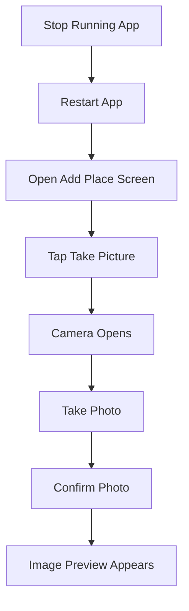

---

# 12. Platform Notes

## Android Emulator

On Android emulators, the camera can usually be simulated.

You can open the camera, take a test photo, and confirm it.

## iOS Simulator

The iOS simulator does not provide full real camera support.

For camera testing on iOS, use a physical iPhone.

## Real Devices

Testing on a real device is recommended because it gives the most accurate behavior for:

* Camera access
* Permission dialogs
* File storage
* Image quality
* Platform-specific behavior

---

# 13. Current App Behavior

After this lecture, the Add Place Screen can:

* Show the image input area
* Open the device camera
* Let the user take a picture
* Display the selected image as a preview
* Let the user tap the preview to replace the image

However, the image is not yet saved together with the place data.

That will be added in a later step.

---

## Current Image Feature Status

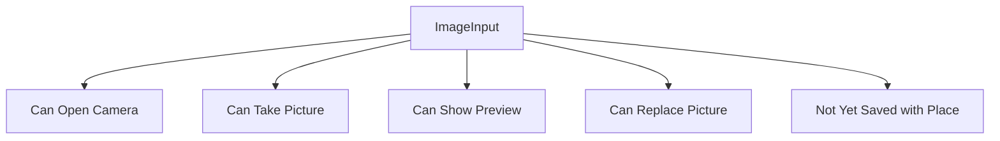

---

# 14. Key Points

* `ImagePicker()` creates an image picker instance.
* `pickImage()` starts the image picking process.
* `ImageSource.camera` opens the device camera.
* `pickImage()` returns a `Future<XFile?>`.
* The result can be `null` if the user cancels.
* `pickedImage.path` gives the local file path.
* `File(pickedImage.path)` converts the result into a Dart `File`.
* `setState()` is required to update the image preview.
* `Image.file()` displays the selected image.
* `GestureDetector` makes the preview tappable.
* A full app restart may be required after adding native plugins.

---

## Notes

The `maxWidth` option is used to reduce the image size.

```dart
maxWidth: 600
```

This helps avoid very large image files, which can take more storage space and may be slower to display.

The selected image is stored only in the `ImageInput` widget for now. Later, this image must be passed back to the Add Place Screen so it can be saved together with the place title.

---

## Summary

This lecture connects the `ImageInput` widget to the device camera using the `image_picker` package.

The user can now tap **Take Picture**, open the camera, take a photo, and see the selected image preview in the app.

The image can also be replaced by tapping the preview.

The next step is to store the selected image together with the favorite place data.
